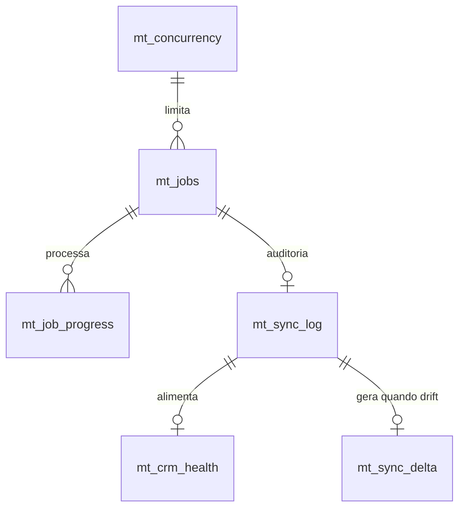
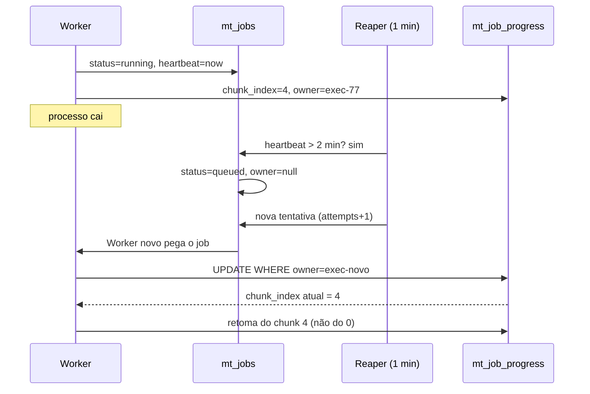

# PDI: Resiliência MarTech n8n Enterprise (PDI-MARTECH)

## 1. Contexto

A operação MarTech da V4 Company processa requisições de integração com CRMs
em workflows n8n. Três problemas estruturais:

1. **Workflows síncronos frágeis**: requisições processadas dentro do webhook;
   em picos (campanhas, importações) a instância trava e o cliente não recebe ACK.
2. **Payloads pesados sem checkpoint**: processamento de 10k+ itens roda de uma
   vez; um timeout no meio perde tudo e o job recomeça do zero.
3. **Sincronização com CRM sem observabilidade**: falha não é registrada;
   divergência entre o que devia syncar e o que syncou só é descoberta quando
   o cliente reclama.

## 2. Solução em 3 frentes

### Frente 1: Fila assíncrona + concorrência

- `[CC] MT Queue Gateway`: webhook que enfileira e responde **ACK 202 imediato**.
- `[CC] MT - Queue Worker`: consome a fila respeitando o semáforo
  `mt_concurrency` (slot por fila).
- Fila = tabela `mt_jobs` no Supabase (idempotência por `job_key`).

### Frente 2: Processamento de payloads pesados

- `[CC] MT - Heavy Payload Processor`: sub-workflow chamado pelo worker.
- Normalização em chunks (JS) + enriquecimento opcional em Python.
- Checkpoint `mt_job_progress`: se o job falhar no chunk 7 de 12, retoma do 7.

### Frente 3: Observabilidade de sincronização com CRM

- `[CC] MT - CRM Sync Observabilidade`: webhook `/mt/crm-sync`.
- Registra `mt_sync_log`, atualiza `mt_crm_health` e detecta **drift**
  (divergência entre o esperado e o confirmado) → `mt_sync_delta`.
- Detecção antes de impactar o cliente.

## 3. Arquitetura

```
Requisicao MarTech (pico)
      │
      ▼
[1] Queue Gateway ──ACK 202──▶ mt_jobs (queued)
      │
      ▼
[2] Queue Worker (15s) ──slot mt_concurrency──▶ running
      │
      ▼
[3] Heavy Payload Processor ──mt_job_progress──▶ done/failed
      │
      ▼
[4] CRM Sync Observabilidade ──mt_sync_log + health + delta──▶ drift
```

## 4. Entregas

| Pasta | Conteúdo |
|-------|----------|
| `1-standards/` | 3 padrões (filas/concorrência, payloads pesados, observabilidade CRM) |
| `2-workflows/` | 4 workflows `.workflow.ts` |
| `3-supabase/` | Schema v3.0 (6 tabelas + 5 views) + guia de migração |
| `4-retrofit/` | Como adaptar workflows MarTech existentes |
| `5-monitoring/` | Queries SQL de dashboard + regras de alerta |
| `6-automation/` | Scripts de migração e deploy |
| `7-apresentacao/` | Este deck + demo + relatório |

## 5. Esquema de dados (Supabase)

| Tabela | Uso |
|--------|-----|
| `mt_jobs` | Fila assíncrona (queued/running/done/failed, backoff, heartbeat) |
| `mt_concurrency` | Semáforo distribuído (limite por fila) |
| `mt_job_progress` | Checkpoint de chunk de payload pesado |
| `mt_sync_log` | Auditoria de cada sync de CRM |
| `mt_crm_health` | Agregado de saúde por object+direction |
| `mt_sync_delta` | Divergências abertas |

Views: `vw_mt_queue_backlog` · `vw_mt_slots` · `vw_mt_sync_summary_24h`
`vw_mt_drift_abertos` · `vw_mt_crm_health`



## 5.1 Matemática: dimensionar a fila

Lei de Little: $L = \lambda W$.

**Exemplo numérico:** chegada de 0,5 job/s (1.800 jobs/hora) com processamento
médio de 10 s dá $L = 0{,}5 \times 10 = 5$ jobs simultâneos, que é o nosso
`max_concurrency` default. Se o processamento piorar para 20 s, a exigência dobra
para 10 slots; com apenas 5 a saída cai para 0,25 job/s e o backlog cresce 0,25
job/s, ou 150 jobs em 10 minutos. Conclusão apresentável: **se o backlog cresce
com slot saturado, o problema é tempo de processamento, não quantidade de slot.**

Custo do checkpoint: 10.000 itens em lotes de 500 são 20 lotes, com duas escritas
por lote totalizam 40 `UPDATE`. A 5 ms cada, o overhead é de 200 ms por job, e o
que ele evita é reprocessar 20 lotes depois de um timeout de 10 min.

## 5.2 Matriz de tradeoffs

| Opção | Ganha | Perde | Decisão |
|-------|-------|-------|---------|
| Processar no webhook | Resposta com o resultado | Estabilidade em pico | Descartada |
| Fila em Redis | Escala horizontal | Novo sistema para operar | Adiada até 50x |
| Fila em Postgres (Supabase) | Já operada pelo time, transacional | Throughput limitado | **Escolhida** |
| Semáforo global | Simplicidade | Bloqueio cruzado entre filas | Descartada |
| Semáforo por fila | Isolamento entre fluxos | Mais linhas de configuração | **Escolhida** |
| Retry infinito | Nenhum job perdido | Fila lotada e CRM sobrecarregado | Descartada |
| 3 tentativas + DLQ | Falha visível e decidível | Exige decisão humana | **Escolhida** |

## 6. Métricas de sucesso

| Métrica | Antes | Meta |
|---------|-------|------|
| ACK de requisição MarTech | Trava no webhook | < 2s (ACK 202) |
| Job pesado retomável | Não | Sim (checkpoint) |
| Falha de sync detectada | Quando o cliente reclama | < 15 min |
| Divergência (drift) visível | Não | Dashboard em tempo real |
| Concorrência controlada | Manual/improvisada | Semáforo `mt_concurrency` |

## 6.1 Falha e recuperação (narrativa para a pergunta dura)

Cenário: o Worker morre com um job em `running` no chunk 4 de 10.



O que se responde na sala: o job não perdeu o que já foi feito, não duplicou
escrita porque o `owner` barrava o Worker antigo, e o atraso máximo é o ciclo do
Reaper (1 min) mais o backoff da retentativa. Se alguém perguntar "e se o job
nunca mais rodar?", a resposta é a query de `heartbeat` antigo mais o alerta de
`stale_queued`, que transformam silêncio em fila de trabalho visível.

## 7. Próximos passos

1. Homologar com mock (enviar job de teste no gateway).
2. Aplicar schema v3.0 no Supabase (`bash 6-automation/run-migration.sh`).
3. Publicar workflows e ajustar ID do sub-workflow no worker.
4. Retrofit do primeiro cliente real (ver `4-retrofit/`).
5. Configurar alertas do dashboard (`5-monitoring/`).

_Status: desenvolvido · aguardando homologação · NÃO publicado em produção._