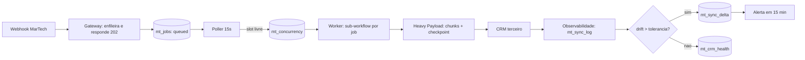

# PDI: Resiliência MarTech n8n Enterprise

> **Área:** Automação & Infraestrutura
> **Unidade:** FV Marketing / V4 Company
> **Autor:** Marcos Perettoco
> **Data:** Agosto 2026
> **Status:** **Entregue (desenvolvido) · NÃO publicado: aguardando homologação**
>
> ✅ Entregas concluídas: 1-standards (3 docs) · 2-workflows (4 workflows validados
> com n8nac) · 3-supabase (schema v3.0 + migração) · 4-retrofit · 5-monitoring ·
> 6-automation · 7-apresentacao (deck HTML + relatório HTML/DOCX/PDF)

---

## Entregas desta PDI

```
PDI-MARTECH/
├── 1-standards/          → Padrões de filas, payload pesado e observabilidade
├── 2-workflows/          → Workflows n8n prontos para deploy (.workflow.ts)
├── 3-supabase/           → Schema + migração do banco de dados
├── 4-retrofit/           → Plano de retrofit para workflows MarTech existentes
├── 5-monitoring/         → Dashboards, queries e regras de alerta
├── 6-automation/         → Scripts de deploy e automação
└── 7-apresentacao/       → Deck e script de demonstração
```

## Problema Resolvido

A operação MarTech (integrações com CRMs terceiros, sincronizações em lote e
campanhas de pico) roda workflows síncronos em linha reta no n8n. Quando o volume
sobe: black friday, lançamento de campanha, importação em massa: os workflows
travam em payloads pesados, estouram a concorrência do n8n, e falhas de
sincronização com CRMs terceiros só aparecem depois de impactar o cliente.

Três frentes de trabalho:

1. **Filas e concorrência**: sub-workflows assíncronos com gestão de fila de
   mensagens para absorver picos de requisições MarTech sem travar a instância.
2. **Payload pesado**: nós Code otimizados (JS/Python) para processar payloads
   grandes de forma incremental, sem estourar memória ou event loop.
3. **Observabilidade CRM**: trilha de auditoria de sincronização com CRMs
   terceiros, com detecção precoce de divergência antes de afetar o cliente.

## Modelo mental

O sistema não processa requisições: ele as converte em **jobs duráveis**. O
webhook de entrada nunca executa lógica de negócio, apenas grava uma linha em
`mt_jobs` e responde 202, de modo que o tempo de resposta do gateway é o tempo
de um `INSERT`, não o tempo de uma integração inteira. Depois, um poller a cada
15s lê a fila em ordem de prioridade e só despacha um job quando o semáforo
`mt_concurrency` tem slot livre, o que transforma concorrência ilimitada em
concorrência declarada. O trabalho pesado acontece em um sub-workflow que
processa o payload em lotes de 500 itens e grava checkpoint a cada lote, de modo
que falha vira retomada e não retrabalho. Por fim, toda conclusão de sync emite
um envelope com o esperado e o confirmado; se a diferença ultrapassa a
tolerância, nasce um registro de divergência em vez de um silêncio. O modelo
mental completo é: **enfileire barato, execute devagar, registre tudo, compare o
resultado com a intenção**.

## Arquitetura Resumida

```
Gateways HTTP (pico MarTech)
  → Fila assíncrona (Supabase, status: queued → running → done/failed)
    → Workers com concorrência limitada (semáforo por slot)
      → Sub-workflow assíncrono por job
        → Payload Heavy Processor (chunking + streaming + memo)
          → CRM Sync Log (auditoria completa)
            → Detector de divergência (antes de afetar o cliente)
```



**Legenda das decisões de borda:**

- **Entrada**: só enfileira, nunca calcula. O ACK é do banco, não do negócio.
- **Fila**: Postgres em vez de Redis porque o volume atual cabe em uma tabela e
  o Supabase já é operado pelo time (menos um sistema para monitorar).
- **Semáforo**: por fila, não global, porque `crm-sync` e `import` têm tolerâncias
  de latência diferentes e não podem se bloquear (head of line blocking).
- **Retomada**: checkpoint por chunk porque o custo de reprocessar 10 mil itens
  é maior que o custo de três escritas extras por lote.
- **Saída**: auditoria antes de declarar sucesso, porque HTTP 200 do CRM não
  garante que os dados foram gravados como esperado.

## Matemática da solução

A fila é dimensionada pela Lei de Little: $L = \lambda W$, em que $L$ é o número
médio de jobs no sistema, $\lambda$ a taxa de chegada e $W$ o tempo médio de
permanência (aqui, o tempo de processamento mais a espera na fila).

**Exemplo numérico:** com chegada média de 0,5 job/s (1.800 jobs/hora) e tempo
médio de processamento $W = 10\,s$, temos $L = 0{,}5 \times 10 = 5$ jobs
simultâneos, exatamente o `max_concurrency` default. Se o processamento piorar
para $W = 20\,s$ sem mudar a chegada, a exigência vira $L = 10$; com apenas 5
slots a taxa de saída cai para $5 / 20 = 0{,}25$ job/s, o déficit é
$0{,}5 - 0{,}25 = 0{,}25$ job/s e em 10 minutos o backlog acumula
$0{,}25 \times 600 = 150$ jobs. A leitura operacional é direta: backlog crescente
com `usage_pct` em 100% significa tempo de processamento, não falta de slots.

Custo de escrita do checkpoint: **Exemplo numérico:** um job de 10.000 itens em
lotes de 500 gera 20 lotes; com duas escritas por lote (`running` e `done`) o
job custa 40 `UPDATE` em `mt_job_progress`. Se cada `UPDATE` levar 5 ms, o
overhead total é $40 \times 5 = 200\,ms$ contra o risco de reprocessar os 20
lotes inteiros depois de um timeout de 10 min.

Latência de ACK: **Exemplo numérico:** `INSERT` no Supabase com round-trip de
40 ms, serialização do corpo de 2 KB em 5 ms e resposta HTTP em 10 ms somam
55 ms, folga de 2s é maior que 30x o caso típico, o que deixa margem para picos
de rede sem virar erro de timeout no cliente.

## Invariantes

| Invariante | Violação correspondente |
|------------|-------------------------|
| Um `job_key` existe no máximo uma vez por fila | Processamento duplicado do mesmo evento |
| `in_use <= max_concurrency` em qualquer instante | Estouro de concorrência e travamento da instância |
| Todo job em `running` tem `heartbeat_at` com menos de 2 min | Job zumbi segurando slot para sempre |
| `attempts <= max_attempts` em qualquer job | Retry infinito e fila que nunca esvazia |
| Todo sync concluído tem linha em `mt_sync_log` | Perda de trilha e impossibilidade de provar impacto |
| Payload acima de 64 KB nunca é carregado inteiro no webhook | OOM e degradação para os demais workflows |
| Drift acima da tolerância sempre gera `mt_sync_delta` | Divergência invisível até a reclamação do cliente |
| O schema v3.0 não altera nenhuma tabela `error_*` da atividade 1 | Migração destrutiva em ambiente homologado |

## Modos de falha

| Sintoma | Causa raiz | Como detecta | Como mitiga | Recuperação |
|---------|------------|--------------|-------------|-------------|
| Job parado em `queued` | Worker desligado ou sem slot | `vw_mt_queue_backlog` com `stale_queued > 0` | Subir/reiniciar o Worker | 1 ciclo (15s) após o Worker voltar |
| Job preso em `running` | Worker morreu sem liberar slot | `heartbeat_at` com mais de 10 min | Reaper devolve para `queued` | 1 min (ciclo do Reaper) |
| Instância degrada em pico | Payload processado no webhook | CPU/memória da instância e fila interna do n8n | Retrofit para o Gateway (202) | Imediato após o retrofit |
| Job duplicado | `job_key` ausente ou errado | Contagem por `job_key` no período | `INSERT ... ON CONFLICT DO NOTHING` | Prevenção, sem retrabalho |
| Erro 429 do CRM | Rate limit do terceiro | `error_class = rate_limit` em `mt_sync_log` | Backoff 30s, 1m, 2m e disjuntor de circuito | Até 2 min por tentativa |
| Drift não aparece | Envelope sem campo `expected` | Sync parcial com `vw_mt_drift_abertos` vazio | Envelope obrigatório no retrofit | Correção no próximo sync |
| Backlog crescente contínuo | Taxa de saída menor que a chegada | `usage_pct` em 100% junto com fila estável | Aumentar `max_concurrency` ou reduzir `W` | Dependente da causa de `W` |

## SLO e orçamento de erro

| SLI | Meta (meta) | Janela | Estouro |
|-----|-------------|--------|---------|
| Latência p95 do ACK no Gateway | < 2 s | 30 dias | Investigar rede/banco antes de mexer na fila |
| Jobs concluídos na primeira tentativa | > 95% | 7 dias | Revisar backoff e estabilidade do CRM |
| Tempo até detectar drift | < 15 min | Contínuo | Verificar cadência do alerta de 15 min |
| Jobs em `queued` sem Worker por 10 min | 0 | Contínuo | Página imediata para a equipe de automação |
| Disponibilidade do webhook do Gateway | 99,5% (meta) | 30 dias | Escalar instância n8n |

Orçamento de erro: em um mês com 100 mil jobs, o orçamento de falha na primeira
tentativa de 5% permite 5.000 retries (meta). Estourou: a prioridade é reduzir a
causa raiz, não aumentar `max_attempts`, porque cada tentativa extra multiplica a
pressão sobre o CRM e sobre a própria fila.

## Operação (runbook resumido)

1. **Checagem de rotina** (a cada 15 min no horário de pico): `vw_mt_queue_backlog`,
   `vw_mt_slots`, `vw_mt_crm_health`. As três consultas cabem em uma tela.
2. **Fila parada**: confirmar se o Workflow `[CC] MT - Queue Worker` está ativo no
   n8n e se a credencial `Command Center Supabase` não expirou. Mitigação: reativar
   o Worker; o backlog se resolve sozinho no próximo ciclo.
3. **Slot preso**: localizar o job com `heartbeat_at` antigo, confirmar que nenhum
   Worker está ativo sobre ele e deixar o Reaper devolver para `queued`.
4. **Drift aberto**: abrir a `execution_url` do `mt_sync_delta`, comparar o payload
   enviado com a resposta do CRM e decidir reprocessar ou aceitar a diferença com
   registro.
5. **Rollback**: a fila é aditiva. Para desligar com segurança, basta desativar o
   Gateway e o Worker; os jobs remanescentes ficam em `queued` e nenhum workflow
   legado é afetado.
6. **Quem aciona**: autonomia do analista para itens 2 e 3; coordenação de
   Infraestrutura para queda da instância; atendimento ao cliente para decisão de
   reprocessamento de drift.

## Checklist de domínio

- [ ] Consigo explicar por que o ACK é 202 e não o resultado final.
- [ ] Sei calcular a concorrência necessária com $L = \lambda W$.
- [ ] Entendo o que cada status de `mt_jobs` significa e quem o transiciona.
- [ ] Sei o que acontece com um job quando o Worker morre no meio.
- [ ] Sei justificar o backoff 30s, 1m, 2m com 3 tentativas.
- [ ] Entendo por que payload grande vai em lote e não no webhook.
- [ ] Sei desenhar o caminho de um evento do webhook até o dashboard.
- [ ] Sei dizer o que é medido, em qual janela e o que acontece no estouro.
- [ ] Conheço as tabelas `mt_*` e o que cada uma responde.
- [ ] Sei rodar o rollback sem perder dados nem quebrar a atividade 1.
- [ ] Sei distinguir retry (esperado), DLQ (espera revisão) e drift (negócio).
- [ ] Sei apontar onde a detecção de drift antecipa a reclamação do cliente.

## Próximos Passos (homologação)

1. Revisar `1-standards/` (3 padrões): já escritos
2. Aplicar schema v3.0 no Supabase (`bash 6-automation/run-migration.sh`)
3. Publicar workflows (`bash 6-automation/deploy-martech.sh`) e ajustar o ID do
   sub-workflow `[CC] MT - Heavy Payload Processor` no Worker
4. Executar retrofit nos workflows MarTech (`4-retrofit/`)
5. Configurar alertas (`5-monitoring/`) e validar com pico simulado

> ⚠️ NENHUM workflow foi enviado ao n8n nesta etapa: publicação apenas após homologação.

## Métricas de Sucesso

| Métrica | Atual | Meta |
|---------|-------|------|
| Pico absorvido sem travar instância | Não suportado | 5x volume nominal |
| Concorrência máxima no n8n | Ilimitada (travamento) | Limitada por slot |
| Payloads pesados processados | Travam / OOM | > 90% dos casos |
| Falha de sync CRM detectada | Após cliente reclamar | < 5 min |
| Rastreabilidade de sync | Nenhuma | 100% dos jobs logados |

## Decisões e tradeoffs

1. Gateway que só enfileira com ACK 202 em menos de 2s em vez de processar no webhook: absorve pico sem travar a instância. O tradeoff é que o cliente recebe confirmação de fila (queued) e não de conclusão, o que exige consulta a mt_jobs para o status final.
2. Worker com polling a cada 15s e semáforo em mt_concurrency em vez de concorrência ilimitada: limita a pressão sobre o n8n e os CRMs. O tradeoff é uma latência mínima de 15s por ciclo em troca de nunca estourar o limite da fila.
3. Checkpoint retomável em mt_job_progress com backoff de 30s, 1m e 2m e máximo de 3 tentativas: falha no chunk 4 de 10 retoma do chunk 4, não do zero. O tradeoff é mais escritas no Supabase por chunk em troca de eliminar o retrabalho total após timeout.
4. Schema v3.0 aditivo com 6 tabelas e 5 views convivendo com as tabelas error da atividade 1: evita migração destrutiva. O tradeoff é operar mais tabelas (mt_jobs, mt_concurrency, mt_job_progress, mt_sync_log, mt_crm_health e mt_sync_delta) em troca de deploy sem quebrar o padrão de erros já homologado.
5. Drift com tolerância default de 5% e envelope expected x confirmed: exemplo com 1000 esperados e 860 confirmados gera drift de 14% e abre mt_sync_delta antes do cliente reclamar. O tradeoff é que um limiar fixo pode gerar alerta em variação legítima, compensado pela detecção em menos de 15 min em vez da reclamação.

## Impacto no negócio

Antes, pico de campanha ou importação travava a instância no webhook, payload de 10k itens sem checkpoint perdia tudo no timeout e falha de sync com Kommo, HubSpot ou RD Station só aparecia na reclamação. Com fila, ACK em menos de 2s, processamento retomável e drift visível em dashboard, a meta sai de volume não suportado para 5x o volume nominal, de travamento por concorrência ilimitada para limite por slot e de detecção na reclamação para menos de 15 min, com mais de 90% dos payloads pesados processados. Isso reduz risco de indisponibilidade em pico e custo de retrabalho de jobs refeitos do zero.

## Referências de estudo

- Curso: Fundamentos de Filas e Sistemas Assincronos, na Alura.
- Vídeo: n8n Webhooks and Queue Pattern Explained, no YouTube, canal oficial n8n.
- Doc: n8n Docs, Webhook node and sub-workflows, na plataforma n8n Docs.
- Doc: Supabase Docs, Postgres tables and views, na plataforma Supabase Docs.
