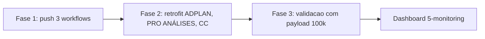
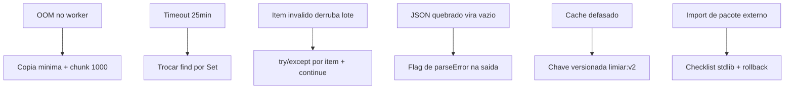

# PDI: Apresentação: Nós Customizados e Expressões Avançadas n8n

> **Formato:** 15-18 slides | **Tempo:** 20-25 min
> **Audiência:** Tech Lead + Squad de Automação

---

## Slide 1: Título

```
PDI: NÓS CUSTOMIZADOS E EXPRESSÕES AVANÇADAS
              N8N ENTERPRISE

        Marcos Perettoco: Tech Lead
        Agosto 2026 | FV Marketing / V4
```

---

## Slide 2: O Problema

**Payloads pesados travam porque os nós Code são escritos "do jeito mais fácil"**

- `JSON.parse` repetido dentro do loop → parse desnecessário por item
- `map().filter()` encadeado em 100k itens → 2+ arrays intermediários
- Busca por item (`.find`, `indexOf`) dentro do loop → O(n²)
- `{ ...item }` em cada iteração → pressão de GC / OOM
- Mesma lógica copiada entre dezenas de workflows

**Sintomas reais (atividade 1):** ADPLAN JS timeout 25min; OOM em payloads grandes.

---

## Slide 3: Diagnóstico

```
Nó Code "faz tudo":
  carrega payload inteiro em memória
  re-parseia JSON a cada etapa
  percorre com complexidade O(n²)
  repete código entre workflows
  expressões inline difíceis de manter
```

**Causa raiz:** não existe uma camada padrão de transformação: cada nó reinventa.

---

## Slide 4: A Solução: 3 Frentes

```
┌──────────────────────────────────────────────────┐
│  FRENTE 1: Nós Code JS avançados                │
│  Streaming + chunk + dedupe + memoização (O(n)) │
├──────────────────────────────────────────────────┤
│  FRENTE 2: Nós Code Python no n8n               │
│  Enriquecimento/agregação com stdlib            │
├──────────────────────────────────────────────────┤
│  FRENTE 3: Expressões avançadas + biblioteca    │
│  $('node'), JSONata, static data, 3-lib única   │
└──────────────────────────────────────────────────┘
```

---

## Slide 5: Antes vs Depois

| Antes | Depois |
|-------|--------|
| JSON.parse no loop | Parse 1x na entrada |
| O(n²) (find/indexOf) | O(n) com Set/Map |
| 2+ passadas (map/filter) | UMA passada (filtra+dedupe+transforma) |
| Cópia de objeto por item | Cópia mínima de campos |
| Código duplicado | Biblioteca `3-lib/` única |
| Memória estoura | Streaming + chunking |

**Fala:** o quadro da esquerda não é código "errado" no sentido de bug, é código
que funciona até o payload deixar de ser pequeno. O problema é que ninguém decide
quando o payload ficou grande: ele cresce sozinho e a falha chega como timeout de
produção. A coluna da direita muda a constante e a ordem de grandeza, não o
comportamento funcional: a saída é a mesma, o caminho até ela é linear.

**Evidência:** mesmos campos de entrada e saída antes e depois do retrofit; o que
muda é `durationMs`, medido pelo próprio nó `Return Metrics`.

---

## Slide 6: Frente 1: JS Payload Normalizer

```
Webhook /nos/js-normalizer
  → Parse and Chunk (streaming, chunk 1000)
    → Normalize in One Pass (O(n), dedupe Set)
      → Return Metrics (duração, itens/s)
```

- Parse 1x: nunca dentro do loop
- Filtro barato antes de transformação cara
- Dedupe por chave primitiva (`Set`), não por objeto
- Cópia mínima (só os campos necessários)

---

## Slide 7: Frente 2: Python Payload Enricher

```
Webhook /nos/python-enricher
  → Parse Payload (decode 1x)
    → Enrich Python (set + Counter/defaultdict)
      → Return Summary
```

- Só stdlib (`collections`, `itertools`): sem pip
- Dedupe O(n) com `set`
- Agregação O(n) com `Counter`/`defaultdict`
- Chunking na camada JS antes, Python enriquece lote a lote

---

## Slide 8: Frente 3: Expressões & Memo Playground

```
Manual Trigger
  → Generate Sample Data (500 leads)
    → Filter High Score (IF, expressão {{ $json.score }})
      → Memoize Reference ($getWorkflowStaticData)
        → Output Result
```

- Expressão condicional em parâmetros de nós
- `$getWorkflowStaticData('global')`: valor estável cacheador entre execuções
- Referências entre nós (`$('Node').item.json...`)

---

## Slide 9: Biblioteca 3-lib (fonte da verdade)

```
3-lib/
├── payload-lib.js   → chunk, normalizeStream, dedupe, aggregate, memoizeGlobal
└── payload-lib.py   → chunk, dedupe, aggregate, parse_payload, to_output
```

**Regra:** nunca editar um nó Code sem atualizar a lib: a lib é o padrão.

---

## Slide 10: Entregas Concretas

```
PDI/
├── 1-standards/     → 3 padrões (JS, Python, expressões)
├── 2-workflows/     → 3 workflows .workflow.ts (validados com n8nac)
├── 3-lib/           → payload-lib.js + payload-lib.py
├── 4-retrofit/      → Plano de retrofit ADPLAN, PRO ANÁLISES, CC
├── 5-monitoring/    → Queries de performance + alertas
├── 6-automation/    → deploy-custom-nodes.sh (com gate)
└── 7-apresentacao/  → Este deck
```

---

## Slide 11: Retrofit dos workflows existentes

| Workflow | Correção | Esforço |
|----------|---------|---------|
| ADPLAN | Streaming + dedupe (JS) | 30 min |
| PRO ANÁLISES | Parse 1x + validação | 10 min |
| CC Collector | Dedupe + agregação O(n) | 20 min |
| CC Metrics | Dedupe + agregação O(n) | 20 min |

Fase 1: Publicar workflows novos (1 dia)
Fase 2: Retrofit (2 dias)
Fase 3: Validação com payload simulado (1 dia)



**Fala:** a ordem importa. Publicar primeiro os workflows novos dá um ponto de
comparação limpo; retrofitar depois, workflow por workflow, com medição antes e
depois; validar por último com o mesmo arquivo de payload em todos. Retrofittar
tudo de uma vez com um payload diferente em cada rodada torna o ganho impossível
de provar.

---

## Slide 12: Métricas de Sucesso

| Métrica | Antes | Meta |
|---------|-------|------|
| Payload 100k itens | OOM / timeout | Streaming < 2 GB pico |
| Complexidade normalização | O(n²) | O(n) |
| Re-parse de JSON | Múltiplos | 1x na entrada |
| Código duplicado | Alto | `3-lib/` única |
| Expressões | Inline, não testáveis | Padronizadas |

---

## Slide 13: Próximos Passos

```
Homologação:
  Seg: Revisar 1-standards + 3-lib
  Ter: Push 3 workflows (n8nac push)
  Qua: Testar com payload 100k + medir itens/s
  Qui: Retrofit ADPLAN + PRO ANÁLISES + CC
  Sex: Dashboard de performance (5-monitoring)
```

---

## Slide 14: Perguntas?

```
"Payload pesado não trava mais:
  processa em stream, dedupe em O(n),
  código uma vez, biblioteca única."
```

---

## Slide 15: Anexo: Anti-Patterns

| Anti-pattern | Problema |
|---|---|
| `JSON.parse` no loop | Parse desnecessário por item |
| `filter().map()` encadeado | 2 passadas + arrays intermediários |
| `indexOf`/`find` no loop | O(n²) |
| `{...item}` em cada iteração | Pressão de GC / OOM |
| Lógica duplicada em nós Code | Manutenção caótica |
| Python com pandas (sem garantia) | Quebra no runtime do n8n |

---

## Slide 16: Anexo: A conta que sustenta a proposta

**Custo da busca por item vs índice**

```text
Quadratico:  n² / 2 comparações
Linear:      n · k operações, k ≈ 4
```

**Exemplo numérico:** n = 100.000 itens, 10 ns por comparação.

| Versão | Contas | Resultado |
|---|---|---|
| `.find` no loop | 100.000² / 2 = 5 × 10⁹ | ≈ 50 s por etapa |
| `Set` de chave | 100.000 × 4 = 4 × 10⁵ | ≈ 4 ms por etapa |
| Ganho | 5 × 10⁹ / 4 × 10⁵ | ≈ 12.500 vezes |
| 4 etapas do pipeline | 4 × 50 s vs 4 × 4 ms | 200 s vs 16 ms |

**Fala:** esse não é um ganho de otimização fino, é mudança de ordem de grandeza.
Com 50 s por etapa e quatro etapas, um único payload de 100k consome 200 s de CPU
só de procurar chaves. Esse é o formato exato do sintoma de timeout que apareceu
no ADPLAN. A versão linear nem chega a ser medida: 16 ms some dentro do ruído do
resto da execução.

---

## Slide 17: Anexo: Memória e a regra dos 2 GB

```text
M = n · b · c
n = itens, b = bytes por objeto, c = gerações vivas simultâneas
```

**Exemplo numérico:** n = 100.000, b = 400 B.

| Cenário | c | Pico |
|---|---|---|
| `filter().map()` encadeado | 3 | 114 MB |
| Cópia mínima em passada única | 1 | 17 MB |
| Spread completo por item | 2 | 76 MB |

**Orçamento:** meta de pico de 2 GB para a execução inteira. Com 60 execuções
residentes (Little's Law: λ = 2 exec/s, W = 30 s, L = λW = 60) e 30 MB por
execução, chega-se a 1,8 GB: no teto, sem folga para picos.

**Fala:** a mensagem é que memória não é "quanto o payload tem", é "quantas
cópias do payload vivem ao mesmo tempo". Cortar `c` de 3 para 1 é o que libera
a folga que impede o OOM.

---

## Slide 18: Anexo: Fluxo canônico de um pipeline

```mermaid
flowchart LR
    A[Webhook] --> B[Parse 1x]
    B --> C[Chunk 1000]
    C --> D[Filtro barato]
    D --> E[Set dedupe O(n)]
    E --> F[Copia minima]
    F --> G[Python Counter]
    G --> H[Metricas]
    H --> I[(mt_payload_metrics)]
```

**Fala:** repare que não existe nenhum nó de "otimização" no fluxo: performance é
propriedade de cada etapa, não de uma etapa especial no final. Se alguém inserir
um `JSON.parse` depois do `Parse 1x`, o contrato quebrou e o padrão foi violado,
mesmo que o workflow continue funcionando.

---

## Slide 19: Anexo: Matriz de tradeoff

| Alternativa | Ganho | Custo | Decisão |
|---|---|---|---|
| Custom node TypeScript compilado | Lógica centralizada de verdade | Build, release próprio, semanas de atraso | Descartado |
| `SplitInBatches` para chunking | Reúso do nó nativo | Estado de continuação, métrica de duração confusa | Descartado |
| Streams `Readable`/`Transform` | Streaming de verdade | Superfície de erro grande, ganho não comprovado | Descartado |
| Copiar funções da `3-lib/` nos nós | Entrega imediata | Exige sincronização manual | **Adotado** com regra de fonte da verdade |
| pandas no Python | Agregação expressiva | Dependência não garantida no runtime | Descartado |
| Memoizar tudo no static data | Menos recálculo | Risco de valor defasado | Adotado com chave versionada |

**Fala:** o tradeoff que assumimos é explícito: preferimos entrega rápida com
disciplina de sincronização a infraestrutura robusta com atraso. Se a trilha
envelhecer e a duplicação entre workflow e lib virar problema real, a porta de
saída é o custom node, e a matriz já está escrita para justificar essa revisão.

---

## Slide 20: Anexo: Modos de falha e recuperação



| Falha | Detecção | Recuperação |
|---|---|---|
| OOM | Worker reinicia | Minutos: reexecutar com lote menor |
| Timeout | `durationMs` > 60.000 | Imediato após o retrofit do nó |
| Item ruim | Runs em `error` | Reexecução idempotente por chave |
| JSON malformado | `totalItems = 0` suspeito | Corrigir produtor e reenviar |
| Static data defasado | `cachedAt` não muda após mudança de config | Limpar e reexecutar |
| Módulo inexistente | `ModuleNotFoundError` no primeiro teste | Reverter nó para a versão standard |

**Fala:** a regra de recuperação é simples: cada falha tem uma detecção automática
e um rollback de um workflow só. Como os workflows são independentes e não alteram
schema, o rollback nunca é "desfazer tudo".

---

## Slide 21: Anexo: SLO e orçamento de erro

| SLI | Meta | Janela |
|---|---|---|
| Execuções >= 100k com `success: true` | >= 99% (meta) | 7 dias |
| `durationMs` p95 por workflow | <= 60.000 ms (meta) | 7 dias |
| Disponibilidade dos webhooks `/nos/*` | >= 99,5% (meta) | 30 dias |

**Orçamento de erro:** 1% das execuções do período podem falhar sem gerar
postmortem (meta). Estourou: congelar push, separar regressão de nó versus pico de
volume com as queries de `5-monitoring/`, aplicar rollback seletivo e revisar o
chunk size.

**Fala:** sem esse quadro, qualquer falha vira opinião. Com ele, a pergunta
"podemos publicar?" tem resposta numérica e a decisão de rollback é do Tech Lead
com base em medição, não em sensação.

---

## Slide 22: Anexo: Fecho técnico

```text
Ordem de grandeza: 50 s  →  4 ms por etapa
Memória:           114 MB → 17 MB por payload de 100k
Contrato:          parse 1x, passada única, Set, cópia mínima
Fonte da verdade:  3-lib/ (payload-lib.js e payload-lib.py)
Prova:             n8nac validate + payload de 100k + métricas
Próximo passo:     homologação, depois push, depois retrofit
```

**Fala:** o que ficou de pé é uma camada de transformação padronizada, com três
padrões escritos, três workflows validados, uma biblioteca única, plano de retrofit
para os quatro workflows que já deram sintoma, monitoring com alerta e um runbook
com nome de responsável. O payload pesado deixou de ser exceção tratorada e virou
caso previsto.
