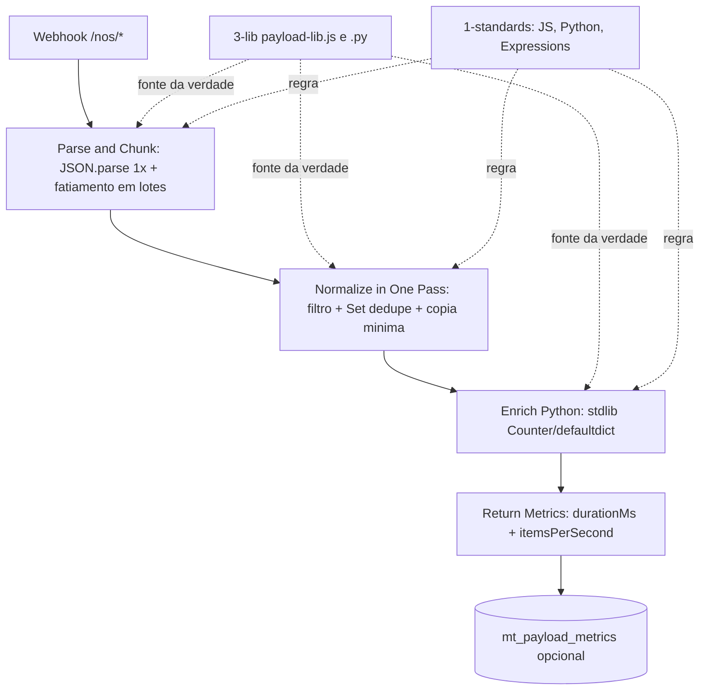

# PDI: Nós Customizados e Expressões Avançadas n8n Enterprise

> **Área:** Automação & Infraestrutura
> **Unidade:** FV Marketing / V4 Company
> **Autor:** Marcos Perettoco
> **Data:** Agosto 2026
> **Status:** **Entregue (desenvolvido) · NÃO publicado: aguardando homologação**
>
> ✅ Entregas concluídas: 1-standards (3 padrões) · 2-workflows (3 workflows validados
> com n8nac) · 3-lib (biblioteca JS/Python reutilizável) · 4-retrofit ·
> 5-monitoring · 6-automation · 7-apresentacao (deck + demo + relatório HTML/DOCX/PDF)

---

## Entregas desta PDI

```
PDI-NOS-CUSTOMIZADOS/
├── 1-standards/          → Padrões de nós Code (JS/Python) e expressões avançadas
├── 2-workflows/          → Workflows n8n prontos para deploy (.workflow.ts)
├── 3-lib/                → Biblioteca reutilizável (payload-lib.js / payload-lib.py)
├── 4-retrofit/           → Plano de retrofit para nós Code e expressões existentes
├── 5-monitoring/         → Queries de performance e diagnóstico de payload
├── 6-automation/         → Scripts de deploy e validação
└── 7-apresentacao/       → Deck e script de demonstração
```

## Problema Resolvido

Nós `Code` em workflows n8n são escritos com frequência como "um nó que faz tudo":
carregam o payload inteiro na memória, percorrem listas com complexidade O(n²),
re-parseiam JSON a cada etapa, repetem a mesma lógica em dezenas de workflows e
usam expressões inline difíceis de manter. Quando o payload é pesado (10k+, 100k+
de itens), isso vira OOM, event loop bloqueado e timeout: exatamente o sintoma da
atividade 1 (ADPLAN: JS timeout 25min) e da atividade 2 (payload pesado sem
checkpoint).

Esta atividade entrega a **camada de transformação**: nós customizados (JS e Python)
e expressões avançadas que processam payloads pesados de forma **streaming,
incremental e reutilizável**: o motor que roda DENTRO de cada etapa dos pipelines
entregues nas atividades 1 e 2.

## Modelo mental

O n8n executa um workflow como um grafo dirigido de nós. Cada nó recebe os itens
da etapa anterior **já materializados na memória do processo do worker**: não existe
streaming nativo entre nós, nem paginação automática. Se o nó anterior devolveu
100.000 objetos, o próximo nó opera sobre 100.000 objetos vivos, e o nó seguinte
sobre mais 100.000 enquanto os anteriores ainda existem no grafo da execução.
Isso explica três fatos que o sênior precisa ter no corpo:

1. **Cópia barata é cara.** `{ ...item }` dentro de um loop de 100k não custa o
   tamanho do objeto, custa o tamanho multiplicado pelo número de gerações de
   lixo que o garbage collector precisa marcar e varrer depois.
2. **Complexidade só dói no regime certo.** O(n²) com n pequeno (100 itens) é
   imperceptível; com n = 100.000 vira ordem de grandeza de minutos e é o que
   produz o sintoma de "timeout de 25 min" observado no ADPLAN.
3. **O nó Code é um programa imperativo dentro de um orquestrador declarativo.**
   O n8n não consegue otimizar o que está escrito dentro de `jsCode`: ele entrega
   o payload e espera. Portanto toda a disciplina de performance (parse único,
   passada única, dedupe indexado, cópia mínima) é responsabilidade do autor do
   nó, não da plataforma.

A consequência prática é que a unidade de reúso não é o workflow inteiro, e sim a
**função de transformação**: `chunk`, `normalizeStream`, `dedupe`, `aggregate`,
`memoizeGlobal`. Funções pequenas, puras quanto possível, testáveis fora do n8n e
copiadas para dentro do nó porque o n8n não importa módulo externo em `Code`.
Essa é a razão de existir a `3-lib/` e essa é a razão de existir esta atividade.

## Arquitetura Resumida

```
Payload pesado (10k+ itens)
  → [Nó Code JS] Stream + Chunk + Memoização      (normalização incremental)
    → [Nó Code JS] Mapeamento com reduzida cópia   (evita O(n²))
      → [Nó Code Python] Batch enriquecimento      (stdlib: collections/itertools)
        → [Expressões avançadas] $('node') + JSONata + batched references
          → Saída: itens processados + métricas de performance
```



**Legenda das decisões de borda:**

- **Webhook responde cedo** (`responseMode: 'onReceived'`): o chamador não fica
  pendurado esperando o processamento de 100k itens; a resposta confirma recebimento
  e a métrica de duração é gravada pelo próprio pipeline.
- **Parse na primeira etapa, nunca depois:** qualquer nó downstream recebe estrutura
  já decodificada. Se algum ponto do fluxo precisar de `JSON.parse` de novo, é
  sinal de que o contrato de passagem de dados foi quebrado.
- **Fatiamento explícito em `chunks`:** o nó `Parse and Chunk` devolve um array de
  lotes, não uma lista achatada. Isso preserva a fronteira de memória por lote e
  permite retomada futura ponto a ponto.
- **Métrica como nó final próprio:** performance não é "um log no meio do código",
  é um item de saída estruturado, consultável e alertável.
- **Python depois do JS:** o JS faz a redução (dedupe e filtro), o Python faz o
  cálculo agregado sobre o conjunto já menor. Inverter essa ordem multiplicaria
  o volume entregue ao interpretador Python.

## Matemática da solução

**Custo da normalização.** Seja $n$ o número de itens do payload. A abordagem com
busca por item dentro do loop (`.find`, `.indexOf`, `includes` sobre array) executa
uma varredura interna para cada elemento:

$$C_{quadrático}(n) = n \cdot \frac{n}{2} \approx \frac{n^2}{2}$$

A abordagem indexada com `Set` de chave primitiva faz uma operação amortizada de
hash por item:

$$C_{linear}(n) = n \cdot k, \quad k \approx 4 \text{ (hash, lookup, comparação, escrita)}$$

**Exemplo numérico:** com $n = 100.000$ itens e custo médio de 10 ns por
comparação simples, a versão quadrática executa $\frac{100000^2}{2} = 5 \times 10^{9}$
comparações, ou seja $5 \times 10^{9} \times 10\,\text{ns} = 50\,\text{s}$ só de
busca, e isso é feito **por etapa** do workflow. A versão linear executa
$100.000 \times 4 = 4 \times 10^{5}$ operações, ou seja $4 \times 10^{5} \times 10\,\text{ns} = 4\,\text{ms}$. Ganho da ordem de $1{,}25 \times 10^{4}$ vezes, ignorando qualquer outro gargalo.

**Custo de memória.** Cada item copiado é um objeto novo no heap. Seja $b$ o
tamanho médio do objeto em bytes:

$$M = n \cdot b \cdot c$$

onde $c$ é o número de gerações do objeto que vivem simultaneamente (original,
cada `spread` intermediário e a cópia final).

**Exemplo numérico:** $n = 100.000$, $b = 400\,\text{B}$ (id, nome, score, data),
$c = 3$ com um `filter().map()` encadeado: $100.000 \times 400 \times 3 =
120.000.000\,\text{B} \approx 114\,\text{MB}$ residentes só para essa etapa. Com
cópia mínima de três campos e $c = 1$: $100.000 \times 180 \times 1 \approx 17\,\text{MB}$.
Sobre o pico de 2 GB de meta, o orçamento de memória por etapa é a fatia que
sobra depois do runtime do n8n, do heap do V8 e dos buffers de rede.

**Capacidade com Little's Law.** Para dimensionar quantas execuções simultâneas a
instância aguenta com payload grande, use $L = \lambda \cdot W$, onde $\lambda$ é a
taxa de chegada de execuções e $W$ o tempo médio de cada uma.

**Exemplo numérico:** $\lambda = 2\,\text{exec/s}$ e $W = 30\,\text{s}$ por execução
de 100k itens resultam em $L = 60$ execuções residentes. Se cada execução ocupa
30 MB de pico, $60 \times 30\,\text{MB} = 1{,}8\,\text{GB}$, já no limite da meta de
2 GB. Conclusão operacional: para manter o pico abaixo da meta, ou $\lambda$ cai,
ou $W$ cai (que é exatamente o que o retrofit do ADPLAN ataca), ou o payload é
particionado externamente antes de entrar.

## Invariantes

| # | Invariante (nunca pode ser falso) | Violação detectada como |
|---|---|---|
| I1 | Todo `JSON.parse` do pipeline acontece no máximo 1x por execução | `JSON.parse` citado em nó que não seja `Parse and Chunk` |
| I2 | Nenhum laço de lista grande contém busca por item (`.find`, `indexOf`, `includes`) | Revisão estática: padrão em nó com `$input.all()` |
| I3 | Todo dedupe usa chave primitiva (`String`, `Number`) em `Set`/`Map` | `Set` de objetos, ou `JSON.stringify` como chave |
| I4 | Todo nó Code Python importa somente stdlib | `import pandas`, `import numpy`, `pip install` |
| I5 | A `3-lib/` contém a versão canônica de toda função de transformação | Cópia divergente dentro de um nó Code |
| I6 | Nenhuma execução de 100k itens ultrapassa o orçamento de pico de memória | OOM, restart do worker, execução em `error` |
| I7 | Todo nó de transformação final emite `durationMs` e `itemsPerSecond` | Métrica ausente = pipeline não observável |
| I8 | Nenhum workflow é publicado sem `n8nac skills validate` verde | Push sem validação prévia |
| I9 | Item inválido é descartado (`continue`), nunca lança exceção que derruba o lote | Um registro ruim derruba 100k registros bons |
| I10 | `$getWorkflowStaticData` só guarda valor estável e versionável | Cache que máscara mudança de configuração |

Cada invariante tem um dono de verificação: I1-I3 e I9 são do checklist de adesão
do standard JS; I4 é do standard Python; I5 é da governança da `3-lib/`; I6 e I7
são do monitoring; I8 é do processo de deploy.

## Modos de falha

| Sintoma | Causa raiz | Como detecta | Como mitiga | Recuperação |
|---|---|---|---|---|
| Execução estoura memória (OOM) | Cópias de objeto por item e array intermediários | Worker reinicia; pico de RSS no host | Cópia mínima, passada única, fatiamento em lotes | Minutos: re-executar com payload particionado |
| Timeout da execução (caso ADPLAN: 25 min) | Complexidade O(n²) no nó | `durationMs` > 60.000 | Trocar busca por item por `Set`/`Map` | Imediato após o retrofit do nó |
| Um item inválido derruba o lote inteiro | `throw` sem `try/except` por item | Runs em `error` com mensagem de campo | Filtro barato + `try/except` granular | Re-execução: lote já é idempotente por chave |
| JSON malformado vira `[]` silencioso | `catch` que zera a lista sem avisar | `totalItems = 0` em payload que deveria ter dados | Logar a exceção e emitir flag de parse error | Corrigir o produtor e reenviar |
| Métrica zerada ou negativa | `startedAt` ausente ou deslocado entre nós | `itemsPerSecond = 0` com `processedItems > 0` | Passar `startedAt` no mesmo objeto de contexto | Revisão do contrato do nó |
| Cache do static data fica defasado | Configuração mudou e o valor ficou memoizado | Valor servido difere do configurado | Versionar a chave do cache (ex.: `limiar:v2`) | Limpar static data e re-executar |
| Python falha com `ModuleNotFoundError` | Import de pacote externo no `Code node` | Erro de import no primeiro teste | Padronizar stdlib; checklist I4 | Reverter o nó para a versão standard |
| Webhook esgota a conexão do chamador | Resposta esperada até o fim do processamento | Cliente em timeout antes da resposta | `responseMode: 'onReceived'` | Configuração, sem reprocessamento |

## SLO e orçamento de erro

| Elemento | Definição |
|---|---|
| SLI 1 | Percentual de execuções de payload >= 100k itens que terminam com `success: true` |
| Meta SLI 1 | >= 99% das execuções (meta), janela de 7 dias |
| SLI 2 | `durationMs` p95 por workflow, comparado à baseline gravada |
| Meta SLI 2 | p95 <= 60.000 ms (meta), regressão alertada acima de 50% da média de 24 h |
| SLI 3 | Disponibilidade dos webhooks `/nos/*` |
| Meta SLI 3 | >= 99,5% em 30 dias (meta) |
| Orçamento de erro | No máximo 1% das execuções do período podem falhar sem gerar postmortem (meta) |

**Quando estoura:** (1) congelar o push de novos workflows na trilha; (2) rodar a
consulta §2 de `5-monitoring/QUERIES.md` para separar regressão de nó versus pico
de volume; (3) se for regressão, rollback do workflow culpado pela seção 7 do
`MANUAL-IMPLEMENTACAO.md`; (4) se for volume, aplicar particionamento externo e
reavaliar o valor do chunk size.

## Operação

**Runbook resumido:**

1. **Checagem diária:** consulta §3 de `5-monitoring/QUERIES.md` (tendência de
   `items_per_second` por hora) e consulta §2 (runs acima de 60 s).
2. **Checagem por incidente:** localizar o workflow pelo `workflow_name`, abrir a
   execução no n8n, conferir `totalItems`, `deduped`, `durationMs` e a mensagem de
   erro do nó.
3. **Mitigação de performance:** reduzir `chunk_size` (menor lote, menos pressão de
   heap por passada) e confirmar que não há `JSON.parse` reentrado.
4. **Mitigação de indisponibilidade:** desativar o webhook afetado pelo UI do n8n
   para parar a chegada, enquanto o produtor entra em backoff.
5. **Rollback:** `git checkout` do arquivo `.workflow.ts` anterior +
   `npx --yes n8nac push` daquele arquivo apenas.
6. **Acionamento:** Tech Lead da trilha de Automação decide rollback; coordenação
   do PDI é informada quando o SLI 1 cair abaixo da meta por duas janelas
   consecutivas de 24 h.

## Frentes de trabalho

1. **Nós Code JS avançados**: streaming com geradores, chunking lazy, memoização,
   redução de cópias de objeto e corte de complexidade O(n²) → O(n).
2. **Nós Code Python no n8n**: enriquecimento e agregação pesados com a biblioteca
   padrão (collections, itertools, functools), sem dependências externas.
3. **Expressões avançadas**: referências entre nós (`$('node').item`), JSONata,
   expressões condicionais e reutilização via `$getWorkflowStaticData`.

## Próximos Passos (homologação)

1. Revisar `1-standards/` (3 padrões): já escritos
2. Ler `3-lib/` (payload-lib.js / payload-lib.py): biblioteca compartilhada
3. Publicar workflows (`bash 6-automation/deploy-custom-nodes.sh`) e ajustar IDs
4. Executar retrofit nos nós Code existentes (`4-retrofit/`)
5. Configurar queries de performance (`5-monitoring/`) e validar com payload simulado

> ⚠️ NENHUM workflow foi enviado ao n8n nesta etapa: publicação apenas após homologação.

## Métricas de Sucesso

| Métrica | Atual | Meta |
|---------|-------|------|
| Payload 100k itens processado | OOM / timeout | Streaming, < 2 GB pico |
| Complexidade de normalização | O(n²) em vários casos | O(n) padrão |
| Re-parse de JSON por pipeline | Múltiplos por etapa | 1x na entrada |
| Código duplicado entre workflows | Alto (copiar/colar) | Biblioteca única `3-lib/` |
| Expressões de manutenção difícil | Inline, não testáveis | Padronizadas + JSONata |

## Decisões e tradeoffs

1. Parse 1x na entrada com chunk default de 1000 em vez de JSON.parse por etapa: elimina re-parse dentro de loop. O tradeoff é exigir padronizar a entrada como string ou array no Webhook /nos/js-normalizer.
2. Normalização em uma passada O(n) com Set por chave primitiva em vez de .find e indexOf em loop O(n²): payload de 100k itens sai de bilhões de operações para centenas de milhares. O tradeoff é exigir disciplina de cópia mínima de campos em vez de spread completo por item.
3. Python só com stdlib (collections, itertools, Counter e defaultdict) sem pandas e sem pip: roda no Code node sem dependência externa. O tradeoff é ter menos sintaxe pronta para dataframe em troca de deploy simples e sem quebra por versão de pacote.
4. Biblioteca única 3-lib (payload-lib.js e payload-lib.py) como fonte da verdade em vez de copiar e colar entre workflows: funções chunk, dedupe, aggregate, normalizeStream, memoizeGlobal e toOutput vivem num lugar só. O tradeoff é que os workflows embutem cópias e exigem sincronizar com a lib a cada mudança.
5. Memoização com $getWorkflowStaticData global para valores estáveis em vez de recalcular por execução: limiar e config calculados 1x e reutilizados. O tradeoff é que o dado cacheado pode ficar defasado e exige invalidação consciente.
6. Descartada a opção de escrever um custom node TypeScript compilado (pacote de nós próprios) para centralizar a lógica: exigiria build, versionamento de pacote e ciclo de release próprio do n8n, atrasando a entrega em semanas. O tradeoff aceito é a cópia de funções para dentro do nó Code, mitigada pela regra da `3-lib/` como fonte da verdade.
7. Descartado o uso de `SplitInBatches` (Loop Over Items) como mecanismo de chunking padrão: ele materializa o array de entrada de qualquer forma e introduz um estado de continuação por interação, o que complica a medição única de `durationMs`. O fatiamento explícito dentro de `Parse and Chunk` mantém a fronteira de lote visível no dado, sem nó adicional.
8. Descartado o streaming com `Readable`/`Transform` do Node dentro do nó Code: o n8n já entrega o payload como array pronto, e o custo de montar um pipeline de streams não se paga quando a fronteira real de memória é o array do próprio `$input`. A granularidade usada é o lote (chunk), que resolve o problema com muito menos superfície de erro.
9. Descartado o pandas no Python por padrão: embora torne agregação mais expressiva, o runtime do Code node não garante a instalação, e uma dependência não garantida transforma um problema de performance em problema de deploy no meio da produção.

## Impacto no negócio

O sintoma já visto na atividade 1 com JS timeout de 25 min no ADPLAN e na atividade 2 com payload sem processamento incremental travava importações e sincronizações ao escalar de 10k para 100k itens. Com streaming, dedupe O(n) e pico abaixo de 2 GB, o mesmo fluxo processa 10 ou 100k itens sem trocar de máquina, com parse único e código único na 3-lib em vez de cópia entre dezenas de workflows. Isso corta tempo de execução, elimina OOM e event loop bloqueado e reduz custo de manutenção de expressões inline não testáveis para padrão com JSONata.

O efeito de segundo ordem é o mais valioso para o time: com os três padrões escritos,
a revisão de código deixa de discutir estilo e passa a discutir contrato. Quem escreve
nó novo já sabe qual é o limite de complexidade aceitável, qual é o formato de métrica
esperado e onde a lógica reutilizável deve morar. A curva de onboarding de quem entra
no squad cai porque o "como se faz aqui" está documentado e exemplificado em três
workflows que rodam.

## Esforço e custo

| Item | Esforço estimado | Observação |
|---|---|---|
| 3 padrões em `1-standards/` | 6 h (meta) | Revisão e assinatura pelo time: 1 h |
| 3 workflows `.workflow.ts` + validação n8nac | 8 h (meta) | Já desenvolvidos nesta PDI |
| `3-lib/` (JS + Python + exemplos) | 4 h (meta) | Já desenvolvida nesta PDI |
| Retrofit de 4 workflows existentes | 1 h 30 de execução + revisão | Somatório do `4-retrofit/RETROFIT.md` |
| Monitoring e alertas | 1 h (meta) | Tabela opcional, aditiva |
| Homologação e apresentação | 2 h (meta) | Deck, demo e roteiro de domínio |

**Custo de infraestrutura:** nenhum custo novo de licença ou de máquina. A instância
n8n Enterprise já existe e os workflows novos são autônomos (só nós `Code`, sem
credencial). O custo real é o de **tempo de execução**, que diminui: quanto menor
$o$ por etapa, menor $W$ na Little's Law, e menor $L$ de execuções residentes.

**Exemplo numérico de economia de CPU:** se o pipeline antigo gastava 50 s de busca
por etapa em 4 etapas, eram 200 s de CPU por payload de 100k. Com a versão linear
(4 ms por etapa) o mesmo trabalho custa 16 ms. Para 20 execuções por dia, a
diferença é $20 \times (200 - 0{,}016)\,\text{s} \approx 4.000\,\text{s} \approx
1\,\text{h de CPU por dia}$ (Exemplo numérico: valores hipotéticos, medir com
`5-monitoring/` antes de publicar ganho como real).

## Referências de estudo

- Curso: JavaScript Performance, estruturas de dados e complexidade, na Alura.
- Vídeo: JavaScript Event Loop and Memory Explained, no YouTube, canal Fireship.
- Doc: n8n Docs, Code node JavaScript and Python, na plataforma n8n Docs.
- Doc: MDN Docs, Map, Set and Array iteration, na plataforma MDN Web Docs.

## Checklist de domínio

O sênior desta trilha diria "pronto" só depois de confirmar os 15 itens abaixo:

- [ ] Todo nó Code novo foi lido contra os três padrões de `1-standards/`.
- [ ] `grep` por `JSON.parse` dentro de nó não acusa ocorrência fora do nó de entrada.
- [ ] Nenhum `.find`, `.indexOf` ou `includes` opera sobre lista grande dentro de laço.
- [ ] Dedupe usa `Set`/`Map` com chave primitiva; nenhum `Set` de objetos.
- [ ] O nó Python importa apenas stdlib (I4) e trata item ruim com `try/except`.
- [ ] Payload de 100k itens foi executado e registrou `durationMs` sem OOM.
- [ ] `itemsPerSecond` está sendo emitido por todo pipeline de transformação.
- [ ] A `3-lib/` foi comparada com as cópias embutidas nos workflows (sem divergência).
- [ ] `npx --yes n8nac skills validate` passou nos três workflows.
- [ ] O `deploy-custom-nodes.sh` foi executado apenas em `--dry-run` até aqui.
- [ ] As queries de `5-monitoring/` rodam contra o schema proposto sem erro.
- [ ] A tabela `mt_payload_metrics`, se criada, nasceu aditiva (nenhuma alteração em schema existente).
- [ ] O runbook da seção Operação tem nome de acionador para cada mitigação.
- [ ] O roteiro de domínio (`7-apresentacao/ROTEIRO-DOMINIO.md`) foi ensaiado em voz alta.
- [ ] Rollback testado pelo menos uma vez: `git checkout` + `push` de um workflow isolado.

