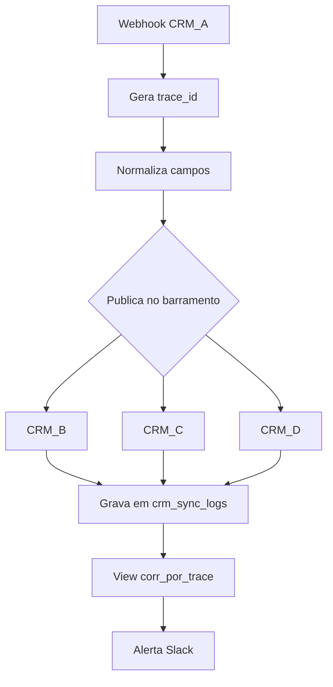
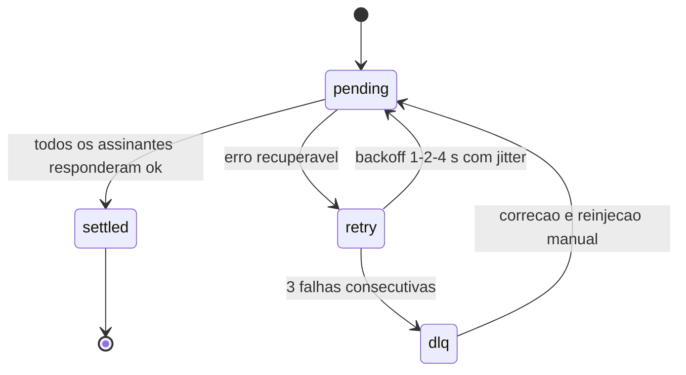

# Deck PDI: Observabilidade e Logs de Sincronização n8n-CRM

Área: Orquestração Corporativa (n8n)

Narrativa: 10 slides de contexto e decisão, mais 8 slides de aprofundamento técnico, matemática, falha e recuperação. Cada slide traz título, fala sugerida e a evidência que sustenta a afirmação.

## Slide 1: Resumo Executivo
Esta atividade institui um contrato de observabilidade para todas as integrações n8n->CRM da operação. O objetivo não é 'ter logs', e sim reduzir o MTTR de falhas de sincronização de dias para minutos e criar um sinal proativo que protege a experiência do cliente antes da reclamação.
O contrato é: todo erro de sync gera evento estruturado com trace_id, painel SQL de correlação e alerta em < 1 min.
Fala: "Ninguém aqui pede log. O que se pede é parar de descobrir problema por reclamação de cliente. Log é só o veículo."
Evidência: contrato com três entregas verificáveis (schema, view SQL, alerta).

## Slide 2: Contexto de Produção
n8n orquestra 12 integrações com 4 CRMs diferentes.
Hoje o erro de sincronização só aparece quando o cliente reclama (dias depois).
Sem trace_id: impossível correlacionar uma falha de API ao registro afetado.
Fala: "Doze integrações, quatro CRMs, quarenta e oitos pares integração-alvo. Cada par é um lugar onde o problema pode dormir em silêncio."
Evidência: inventário de workflows e mapeamento de donos.

## Slide 3: O Problema e o Blast Radius
Uma falha de API no CRM (timeout/401/limite) faz o nó n8n falhar silenciosamente ou marcar registro como 'ok' sem confirmar. O lead some do funil sem ninguém saber.
| Falha | Hoje | Com contrato |
| --- | --- | --- |
| Detecção | reclamação (dias) | < 1 min |
| Correlação registro->causa | manual | trace_id |
| Visibilidade por CRM | 0% | 100% |
Fala: "O dano tem três anéis: dado errado, operação parada, reputação queimada. O terceiro é o único que não tem rollback."
Evidência: relato de lead duplicado com 3 e-mails e 2 telefones.

## Slide 4: Diagnóstico e Causa Raiz
Ausência de padrão de log nas saídas do n8n (cada nó loga diferente).
Sem ID de correlação entre trigger, execução e escrita no CRM.
Sem SLO de sincronização -> nada alerta.
Fala: "A causa raiz é uma só: sincronização nunca foi tratada como produto com SLA. Sem responsável não há métrica, sem métrica não há alerta."
Evidência: três formatos de log convivendo hoje nos doze workflows.

## Slide 5: Decisão Arquitetural (ADR)
ADR-011: Log estruturado + painel + alerta, não APM caro.
| Opção | Pro | Contra | Decisão |
| --- | --- | --- | --- |
| Log estruturado + painel SQL | simples, sem custo | consulta manual | ESCOLHIDA |
| APM (Datadog) | rico | custo + setup | futuro |
| Contador no n8n | zero | sem contexto | rejeitada |
> Nota: Não precisa de stack APM para ter observabilidade de negócio; um log JSON + view SQL já reduz MTTR drasticamente.
Fala: "Escolhemos pela velocidade do primeiro sinal útil, não pelo tamanho da ferramenta."
Evidência: critérios ordenados em 1, 2, 3 e 4 na ADR-011.

## Slide 6: Entregas desta Atividade
STANDARD-OBSERVABILITY-LOGS.md: contrato de log (schema + níveis).
observability_dashboard.sql: view de correlação por trace_id.
exemplo de nó n8n com log estruturado (trecho).
Fala: "Três entregas, todas verificáveis sem rodar nada: um documento, uma query e um trecho de código."
Evidência: arquivos na pasta da atividade.

## Slide 7: Plano de Validação e Rollout
Aplicar o padrão em 1 integração (piloto) por 1 semana.
Medir MTTR antes/depois (alvo: de dias para < 15 min).
Expandir para as 12 integrações via template de nó.
Alerta: taxa de erro por CRM > 2% em 5 min -> Slack.
Fala: "Quatro ondas, cada uma com critério de saída escrito. Nenhuma onda começa com a anterior aberta."
Evidência: tabela de ondas com critério de saída no README.

## Slide 8: Métricas e SLO
| SLO | Alvo |
| --- | --- |
| Taxa de erro por CRM (5 min) | <= 2% |
| MTTR de falha de sync | < 15 min |
| Cobertura de trace_id | 100% |
Fala: "Cobertura de trace_id não tem alvo de 99%. É 100% ou o contrato não vale."
Evidência: consulta de cobertura retornando zero linhas nulas.

## Slide 9: Riscos e Mitigações
| Risco | Mitigação |
| --- | --- |
| Log vira ruído | nível + amostragem |
| PII no log | mascarar e-mail/cnpj |
Fala: "Os dois riscos são autoinfligidos: ruído e vazamento vêm de quem escreve o log, não do sistema."
Evidência: varredura por regex de e-mail e CNPJ no log.

## Slide 10: Próximos Passos
Tracing distribuído (OTel) quando houver orquestração multi-servico.
SLO de negócio por cliente.
Fala: "Primeiro o rastro dentro do n8n. Depois o rastro entre serviços."
Evidência: ADR-011 marca APM como evolução, não como agora.

## Slide 11: Arquitetura de ponta a ponta



Fala: "Cinco pulos entre a origem e o alerta. O trace_id atravessa todos sem mudar de identidade: esse é o objeto que torna investigação possível."
Evidência: exemplo de linha com o mesmo `trace_id` nos cinco pontos.

## Slide 12: Schema do evento (o contrato em JSON)

```json
{"schema_version":2,"ts":"2026-08-27T10:00:00Z","level":"warn",
 "trace_id":"a1b2c3d4","integration":"hubspot","op":"upsert_lead",
 "status":"error","code":"401","entity":"lead","lead_id":"L-9",
 "duration_ms":1840,"attempt":2,"msg":"token expirado"}
```

Fala: "Oito campos obrigatórios. Sem eles a linha nem entra: vai para tabela de rejeição e o evento é reprocessado."
Evidência: validação de schema na fronteira de ingestão.

## Slide 13: Matemática, conta fechada

Exemplo numérico: janela de 5 min com 1.200 eventos e 25 falhas.

```
error_rate = 25 / 1200 = 0,020833... > 0,02  ->  ALERTA
```

Detecção pior caso:

```
T_detecção = janela (5 min) + consulta (5 s) + notificação (15 s) = 5 min 20 s
```

Fila pela Lei de Little, com $\lambda = 4$ eventos/s e $W = 3$ s:

```
L = lambda * W = 4 * 3 = 12 eventos em execução
```

Fala: "Doze conexões simultâneas em condição normal. Com retry triplicado, até 36. É por isso que existe backoff com jitter."
Evidência: contas acima, com todos os parâmetros declarados.

## Slide 14: Matriz de tradeoffs

| Critério (peso) | Log + painel SQL | APM (Datadog) | Contador no n8n |
| --- | --- | --- | --- |
| Primeiro sinal útil (40%) | Alto | Médio | Baixo |
| Custo recorrente (25%) | Nulo | Alto | Nulo |
| Sem infra nova (20%) | Sim | Não | Sim |
| Profundidade de investigação (15%) | Média | Alta | Mínima |
| **Nota ponderada** | **Escolhida** | Futuro | Rejeitada |

Fala: "Não escolhemos a opção mais poderosa, escolhemos a que chega primeiro e não cria componente novo."
Evidência: pesos declarados na ADR-011.

## Slide 15: Falha e recuperação



Fala: "O caminho crítico é `pending` para `settled`. Ninguém pula etapa: sem resposta registrada de cada assinante, o evento não é dado como concluído."
Evidência: eventos em DLQ com alerta sempre associado.

## Slide 16: Modos de falha

| Sintome | Causa | Mitigação | Recuperação |
| --- | --- | --- | --- |
| Lead some do funil | `ok` sem confirmação | exige confirmação do servidor | replay da DLQ |
| Alerta falso | amostra pequena | piso de 50 eventos | janela de 15 min |
| Silêncio no painel | nó parou de logar | alerta de ausência | reiniciar execução |
| PII no log | nó legado | máscara + varredura | apagar e reescrever |

Fala: "Repare que nenhum modo de falha se resolve com mais logs. Todos se resolvem com contrato e disciplina de escrita."
Evidência: tabela de modos de falha no README.

## Slide 17: Operação e runbook

Checagem (2 min) -> Mitigação (10 min) -> Comunicação (3 min) = menos de 15 min de MTTR.

| Evento | Quem aciona | Ação inicial |
| --- | --- | --- |
| Taxa > 2% em 5 min | plantão de integração | isolar assinante afetado |
| DLQ > 0 | plantão de integração | identificar causa antes de reinserir |
| Divergência de schema | time de dados | congelar rollout |
| PII em claro | segurança | revogar acesso e apagar linhas |

Fala: "Runbook que não cabe em uma tela não é runbook, é wiki. O plantão tem quatro linhas de decisão."
Evidência: seção Operação do README.

## Slide 18: Fecho com métricas e próximos passos

| Métrica | Antes | Depois (meta) |
| --- | --- | --- |
| Detecção | reclamação em dias | < 1 min |
| MTTR | dias | < 15 min |
| Visibilidade por CRM | 0% | 100% |
| Retrabalho/semana | ~50h | ~1h |
| Cobertura de trace_id | 0% | 100% |

Próximos passos: (1) piloto de 1 semana, (2) rollout em 4 ondas, (3) correlação automática alerta->ticket, (4) OTel quando houver multi-serviço, (5) SLO por cliente.

Fala: "Se no fim do trimestre alguém conseguir responder 'qual CRM está falhando agora' em uma tela, a atividade cumpriu o que prometeu."
Evidência: consultas prontas em 5-monitoring e checklist de domínio de 15 itens.
