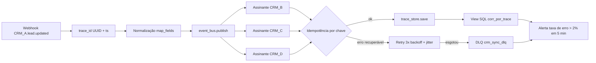

# Observabilidade e Logs de Sincronização n8n-CRM

Orquestração Corporativa (n8n)

## Resumo Executivo

Esta atividade institui um contrato de observabilidade para todas as integrações n8n->CRM da operação. O objetivo não é 'ter logs', e sim reduzir o MTTR de falhas de sincronização de dias para minutos e criar um sinal proativo que protege a experiência do cliente antes da reclamação.

O contrato é: todo erro de sync gera evento estruturado com trace_id, painel SQL de correlação e alerta em < 1 min.

Em uma frase: transformar a sincronização entre o orquestrador e os quatro CRMs de uma caixa-preta reativa em um sistema com rastro porcorrência, período de detecção medido em segundos e dono nomeado para cada alerta. A entrega não é uma ferramenta nova, é um contrato de dados: o mesmo schema, os mesmos níveis e a mesma chave de correlação em cada um dos doze fluxos. Quem opera no fim de semana consegue responder "o que quebrou, em qual registro e há quanto tempo" sem abrir chamado para quem escreveu o workflow.

## Contexto de Produção

- n8n orquestra 12 integrações com 4 CRMs diferentes.

- Hoje o erro de sincronização só aparece quando o cliente reclama (dias depois).

- Sem trace_id: impossível correlacionar uma falha de API ao registro afetado.

O detalhe operacional que costuma escapar: cada uma das doze integrações nasceu em um momento diferente, com um autor diferente, e por isso hoje convivem pelo menos três formatos de log. Uns imprimem texto livre, outros não logam nada, e um deles grava o payload inteiro, PII incluída. Contrato é justamente o fim dessa anarquia: um único formato, versionado, com campos obrigatórios e validação de schema na fronteira.

Exemplo numérico: 12 integrações × 4 CRMs = 48 pares integração-alvo. Se 10% dos pares falharem silenciosamente por semana, são cerca de 5 falhas dormindo por semana, cada uma com potencial de lead perdido e de disparo duplicado.

## Modelo mental

Pense na sincronização como um caixa de correio com confirmação de recebimento. O webhook de entrada é a abertura da caixa; o nó de normalização é o funcionário que endereça; o publish no barramento é o despacho; e cada CRM assinante é um destinatário que assina o comprovante. O trace_id é o número do aviso de recebimento: ele existe desde a abertura até a assinatura final, e é o único objeto que atravessa os cinco pulos sem mudar de identidade.

O sistema tem três estados possíveis por evento: `pending` (publicado, nem todos os assinantes aplicaram), `settled` (todos os assinantes responderam, sucesso ou falha permanente) e `poison` (falhou repetidamente e foi para a DLQ). Nenhum evento pode pular de `pending` direto para `settled` sem passar por uma resposta registrada de cada assinante. Esse é o coração do contrato.

Dois erros de modelagem mental que a equipe precisa desfazer:

1. "Log é texto". Não é: log é um evento tipado com schema. Texto livre não é consultável, e o painel SQL deste projeto só existe porque o log é estruturado.
2. "Se não deu erro, deu certo". No mundo at-least-once, ausência de erro significa apenas que nenhuma exceção foi lançada. Confirmar escrita exige ler de volta ou registrar o identificador devolvido pelo CRM.

## Arquitetura

Legenda das decisões de borda:

- **Fronteira de entrada**: o `trace_id` é gerado no webhook, nunca depois. Se o nó de normalização falhar, já existe correlação para investigar.
- **Fronteira de domínio**: normalização antes do publish. Email em minúsculo, telefone em E.164. Evento sem e-mail é descartado com log `warn`, não vira lead órfão.
- **Fronteira de escrita**: cada assinante é isolado. Um CRM fora do ar não trava os outros três caminhos.
- **Fronteira de saída**: tudo que sai vira linha em `crm_sync_logs` com o mesmo schema, sem exceção.

## O Problema e o Blast Radius

Uma falha de API no CRM (timeout/401/limite) faz o nó n8n falhar silenciosamente ou marcar registro como 'ok' sem confirmar. O lead some do funil sem ninguém saber.

| Falha | Hoje | Com contrato |
| --- | --- | --- |
| Detecção | reclamação (dias) | < 1 min |
| Correlação registro->causa | manual | trace_id |
| Visibilidade por CRM | 0% | 100% |

O blast radius se divide em três anéis:

- **Anel 1, dados**: lead duplicado com 3 e-mails e 2 telefones, divergência entre CRM de origem e destinos, last-write-wins aplicado sobre dado pior sem ninguém notar.
- **Anel 2, operação**: disparo duplo de campanha, retrabalho de conciliação manual de cerca de 50h por semana, auditoria inexistente para provar quem mudou o quê.
- **Anel 3, reputação**: cliente recebe a mesma mensagem duas vezes, marca queima, e a perda de confiança no número do analytics se espalha para as decisões de negócio.

## Diagnóstico e Causa Raiz

- Ausência de padrão de log nas saídas do n8n (cada nó loga diferente).

- Sem ID de correlação entre trigger, execução e escrita no CRM.

- Sem SLO de sincronização -> nada alerta.

Analisado em profundidade, a causa raiz é única: **a sincronização nunca foi tratada como produto com SLA, e sim como script de apoio**. Quando algo é script, ninguém contrata a responsabilidade por ele. Consequências em cadeia: sem responsável não há métrica, sem métrica não há SLO, sem SLO não há alerta, e sem alerta a única telemetria restante é o cliente reclamando.

Um quarto sintoma menos óbvio: o n8n tem estado de execução próprio, então a falha fica presa na fila de execuções e "some" da visão de quem olha o CRM. O registro no CRM está errado, mas o workflow aparece verde no painel do n8n. É o clássico falso negativo, e é o que o contrato de log corrige ao registrar o status real da escrita, não o status da execução.

## Decisão Arquitetural (ADR)

ADR-011: Log estruturado + painel + alerta, não APM caro.

| Opção | Pro | Contra | Decisão |
| --- | --- | --- | --- |
| Log estruturado + painel SQL | simples, sem custo | consulta manual | ESCOLHIDA |
| APM (Datadog) | rico | custo + setup | futuro |
| Contador no n8n | zero | sem contexto | rejeitada |

> **Nota:** Não precisa de stack APM para ter observabilidade de negócio; um log JSON + view SQL já reduz MTTR drasticamente.

Critérios usados na decisão, em ordem de peso: (1) tempo até o primeiro sinal útil, (2) custo recorrente, (3) dependência de infraestrutura nova, (4) profundidade de investigação suportada. O log estruturado vence em 1, 2 e 3; perde apenas em 4, e é justamente a dimensão em que a ADR prevê evolução para OTel.

## Entregas desta Atividade

- STANDARD-OBSERVABILITY-LOGS.md: contrato de log (schema + níveis).

- observability_dashboard.sql: view de correlação por trace_id.

- exemplo de nó n8n com log estruturado (trecho).

Complementos que acompanham o contrato: queries de monitoramento prontas em `5-monitoring/DASHBOARD-QUERIES.md`, roteiro de demonstração, deck de apresentação e roteiro de domínio para a defesa perante a coordenação.

## Plano de Validação e Rollout

1. Aplicar o padrão em 1 integração (piloto) por 1 semana.

2. Medir MTTR antes/depois (alvo: de dias para < 15 min).

3. Expandir para as 12 integrações via template de nó.

4. Alerta: taxa de erro por CRM > 2% em 5 min -> Slack.

Detalhe do rollout em quatro ondas, cada uma com critério de saída explícito:

| Onda | Escopo | Critério de saída |
| --- | --- | --- |
| 1 | 1 integração piloto | 7 dias sem PII cru no log e cobertura de trace_id em 100% |
| 2 | +3 integrações | alerta disparando 1 vez por semana no máximo |
| 3 | +8 integrações restantes | MTTR medido abaixo de 15 min |
| 4 | Padrão obrigatório em todo nó novo | checklist de adesão aprovado em code review |

Nenhuma onda começa antes da anterior fechar o critério de saída. Esse é o que impede o "rollout eterno" em que metade da operação está no padrão antigo.

## Matemática da solução

**Taxa de erro por CRM.** A janela de 5 minutos é a unidade de decisão do alerta:

$$\text{error\_rate} = \frac{\text{erros na janela}}{\text{eventos na janela}} \leq 0{,}02$$

Exemplo numérico: com 1.200 eventos em 5 min, o limiar de 2% equivale a 24 erros. Abaixo disso o alerta não toca; acima, toca imediatamente, porque 24 registros já representam leads reais fora do funil.

**Tempo de detecção.** O pior caso do contrato é a soma dos atrasos em série:

$$T_{detecção} = T_{janela} + T_{consulta} + T_{notificação} = 5\ \text{min} + 5\ \text{s} + 15\ \text{s} \approx 5{,}3\ \text{min}$$

Se a meta for alerta em menos de 1 min para falhas duras (autenticação, schema), o caminho é um alerta de latência alta ou de contagem absoluta de `error` na janela de 1 min, e não a taxa em 5 min. Por isso o contrato prevê dois sinais: taxa (estabilidade) e contagem (agudeza).

**Fila de reprocessamento (Little's Law).** Com $\lambda = 4$ eventos/s de pico e $W = 3$ s de tempo médio de escrita no CRM, a população média na fila é:

$$L = \lambda W = 4 \times 3 = 12\ \text{eventos em execução}$$

Exemplo numérico: 12 eventos simultâneos × 3 tentativas de retry com backoff de 1-2-4 s significa picos de até 36 conexões abertas contra o CRM. Se o limite da API for 30 req/s, o backoff com jitter evita a sincronização de todas as tentativas no mesmo instante.

**Custo de armazenamento.** Exemplo numérico: 12 integrações × 500 eventos/dia × 400 bytes por evento ≈ 2,4 MB/dia, cerca de 72 MB/mês. Retenção de 90 dias fica em cerca de 216 MB, montante desprezível em qualquer Postgres existente. O custo real desta solução não é armazenamento, é disciplina de schema.

## Invariantes

Nunca podem ser falsos; a violação de cada um é automaticamente um incidente:

| # | Invariante | Violação detecta |
| --- | --- | --- |
| 1 | Todo evento de sync tem `trace_id` não nulo e único por tentativa | Coluna nula em `crm_sync_logs` |
| 2 | Todo `level='error'` tem `code` e `msg` preenchidos | Filtro de integridade na view |
| 3 | Nenhum log contém e-mail ou CNPJ em claro | Varredura regular por regex de PII |
| 4 | Nenhum evento sai de `pending` sem resposta registrada de cada assinante | Contagem de assinantes divergente |
| 5 | Evento em DLQ tem sempre alerta associado | Anti-join `dlq LEFT JOIN alertas` |
| 6 | Escrita no CRM só é marcada `ok` após confirmação do servidor | Comparação de payload retornado |

Violações 1, 2 e 3 são bloqueantes de deploy. Violações 4, 5 e 6 viram alerta imediato, porque indicam que o contrato deixou de valer em produção.

## Modos de falha

| Sintome | Causa raiz | Como detecta | Como mitiga | Recuperação |
| --- | --- | --- | --- | --- |
| Lead some do funil | Escrita falhou e foi marcada `ok` | Controle de confirmação ausente na view | Exigir confirmação do servidor antes do `ok` | Replays da DLQ por `trace_id` |
| Alerta em falso alarme | Taxa alta com volume baixo | Janela com menos de 50 eventos | Piso de volume antes de calcular a taxa | Ampliar janela para 15 min |
| Silêncio total no painel | Nó parou de emitir log | Heartbeat de 5 min sem eventos | Alerta de ausência, não só de excesso | Reiniciar execução, revisar template |
| PII vazou no log | Nó legado sem máscara | Varredura regular com regex | Bloqueio no pipeline de CI | Reescrever o nó, apagar log afetado |
| Um CRM derruba todos | Retry sem backoff gerando tempestade | Pico de tentativas correlacionado | Backoff exponencial com jitter | Desligar onda, reiniciar com limite |
| Evento envenenado preso | Payload fora de schema | 3 falhas para o mesmo `trace_id` | Envio para DLQ e isolamento | Corrigir payload e reinserir manualmente |

## Métricas e SLO

| SLO | Alvo |
| --- | --- |
| Taxa de erro por CRM (5 min) | <= 2% |
| MTTR de falha de sync | < 15 min |
| Cobertura de trace_id | 100% |

## SLO e orçamento de erro

- **SLI de disponibilidade**: proporção de eventos que chegam a `settled` sem erro persistente, medido por janela de 5 min por CRM.
- **SLI de latência**: percentil 95 do tempo entre `publish` e resposta do último assinante, medido em janela de 24 h.
- **Meta**: 98% dos eventos com sincronização concluída em até 30 s; 100% dos eventos com `trace_id` presente.
- **Janela**: mensal, rolante, para que um dia ruim não devore o orçamento inteiro de uma vez.
- **Orçamento de erro**: com meta de 98%, restam 2% de folga. Exemplo numérico: em um mês de 30 dias, 2% equivale a cerca de 8,6 h de falha tolerada.
- **Ao estourar**: congelamento de rollout (nenhuma nova integração entra no padrão), incidente dedicado com responsável nomeado, e postmortem em até 5 dias úteis, sem culpa e com ação rastreável.

## Operação

Runbook resumido, na ordem em que devem ser executados:

1. **Checagem**: abrir a view de correlação, filtrar por `crm` e pela última hora. Se a taxa estiver acima de 2%, seguir para mitigação.
2. **Mitigação**: verificar se é um CRM pontual (isolar assinante) ou sistêmico (verificar template do nó). Reinserir eventos da DLQ somente após a causa ser identificada.
3. **Rollback**: como o log é aditivo e não altera o payload de negócio, rollback significa desligar o template do nó e voltar à versão anterior do workflow. Nenhum dado de CRM é afetado.
4. **Quem aciona**: plantão de integração para falha de CRM; time de dados para divergência de schema; segurança para vazamento de PII.

Tempo alvo por etapa: checagem 2 min, mitigação 10 min, comunicação 3 min. Some menos de 15 min, que é exatamente o MTTR do contrato.

## Riscos e Mitigações

| Risco | Mitigação |
| --- | --- |
| Log vira ruído | nível + amostragem |
| PII no log | mascarar e-mail/cnpj |

Riscos adicionais já mapeados: dependência de disciplina humana no template (mitigado por checklist de adesão em code review), cardinalidade de alerta crescendo junto com os CRMs (mitigado com agrupamento por `crm` e não por `trace_id`), e retrabalho se o schema mudar de forma incompatível (mitigado com versionamento de schema e coluna `schema_version`).

## Próximos Passos

- Tracing distribuído (OTel) quando houver orquestração multi-servico.

- SLO de negócio por cliente.

- Correlação automática entre alerta e ticket, para que cada alerta já abra um chamado com o `trace_id` pré-preenchido.

- Amostragem adaptativa: manter 100% dos `error`, e amostrar `info` quando o volume passar de um patamar definido.

## Decisões e tradeoffs

1. Log estruturado JSON com trace_id mais painel SQL em vez de APM pago como Datadog (ADR-011): solução simples e sem custo, com consulta manual como tradeoff. Contador interno no n8n foi rejeitado por falta de contexto e o APM ficou como evolução futura.
2. trace_id com cobertura de 100% e correlação por view em vez de log solto por nó: liga trigger, execução e escrita no CRM. O tradeoff é exigir injetar trace_id e timestamp em todo evento e normalizar campos (e-mail em minúsculo, telefone em E.164), com descarte quando falta e-mail.
3. Barramento com fan-out para 3 CRMs e last-write-wins por trace_id mais timestamp em vez de cópia manual: conflito vira log auditável com rollback via trace_store. O tradeoff é que o último write vence mesmo se o dado anterior era melhor, compensado pelo rastro completo.
4. Isolamento de falha com retry de 3x e backoff por CRM em vez de travar o barramento: falha em 1 CRM não bloqueia os outros. O tradeoff é aceitar consistência eventual temporária entre os CRMs.
5. Alerta por taxa de erro por CRM acima de 2% em 5 min para o Slack, com piloto em 1 integração por 1 semana antes de expandir para 12: evita ruído com nível e amostragem e protege PII com máscara de e-mail e CNPJ. O tradeoff é que o piloto curto pode não capturar sazonalidade, mas reduz risco de rollout.

Alternativas descartadas e por quê: **fila dedicada (Rabbit/Kafka)** foi descartada pelo custo operacional de mais um componente para uma carga de 12 integrações; **enviar alerta por e-mail** foi descartado pelo tempo de leitura medido em horas; **logar o payload completo** foi descartado por PII; **APM com trace distribuído nativo** permanece como evolução, porque exige instrumentação que hoje não existe nos workflows.

## Impacto no negócio

Hoje 12 integrações com 4 CRMs só mostram erro quando o cliente reclama, dias depois, com lead duplicado (3 e-mails e 2 telefones), disparo duplo e retrabalho de cerca de 50h por semana em conciliação manual. Com contrato de log, painel por trace_id e alerta em menos de 1 min, a meta é MTTR abaixo de 15 min, visibilidade de 0% para 100% por CRM e retrabalho de 50h para cerca de 1h por semana, mirando 99% dos leads com fonte única e zero disparo duplicado. Isso corta custo operacional direto e risco reputacional de spam.

## Esforço e custo

| Frente | Esforço estimado |
| --- | --- |
| Contrato de log e schema | 8 h |
| Template de nó n8n reutilizável | 12 h |
| Views SQL e queries de monitoramento | 10 h |
| Alertas e roteamento no Slack | 6 h |
| Piloto de 1 semana e medição de MTTR | 8 h |
| Rollout nas 12 integrações | 16 h |
| Total | 60 h (meta) |

Exemplo numérico de custo: 60 h × R$ 120/h = R$ 7.200 de esforço interno (meta), contra cerca de 50h/semana de retrabalho, ou seja, o projeto se paga em menos de duas semanas de operação se o retrabalho cair para 1h/semana. Custo de infraestrutura adicional: zero, pois usa o banco e o orquestrador já existentes.

## Referências de estudo

- Curso: Observabilidade na Prática, logs, métricas e traces, na Alura.
- Vídeo: Distributed Tracing Explained, trace_id e correlação, no YouTube, canal CNCF.
- Doc: n8n Docs, Logging and observability, na plataforma n8n Docs.
- Doc: PostgreSQL Docs, Views and JSON functions, na plataforma PostgreSQL Docs.

## Checklist de domínio

Item por item que um sênior verificaria antes de dizer "pronto":

1. Todo nó que escreve em CRM emite o schema definido, sem sobras nem exceções.
2. `trace_id` é gerado na fronteira de entrada e sobrevive a todos os nós.
3. Nenhum log contém e-mail ou CNPJ em claro; a varredura por regex passa limpa.
4. Falha de escrita nunca é registrada como `ok` sem confirmação do servidor.
5. Retry usa backoff exponencial com jitter, e nunca mais de 3 tentativas.
6. Evento que falha 3 vezes vai para DLQ e gera alerta.
7. A view de correlação responde em menos de 1 s para a janela de 24 h.
8. O alerta tem piso de volume para não disparar com amostra pequena.
9. Existe alerta de silêncio (ausência de eventos), não só de excesso.
10. O runbook tem dono nomeado e telefone de plantão preenchido.
11. Medição de MTTR antes e depois está registrada com os parâmetros declarados.
12. O piloto de 1 semana fechou todos os critérios de saída antes do rollout.
13. O template do nó está versionado e aprovado em code review.
14. Retenção e limpeza dos logs estão definidos, com política de 90 dias.
15. Ninguém precisa ler código para responder "qual CRM está falhando agora".
