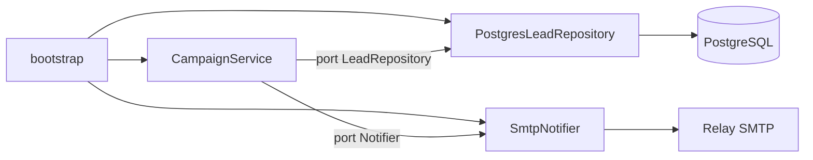
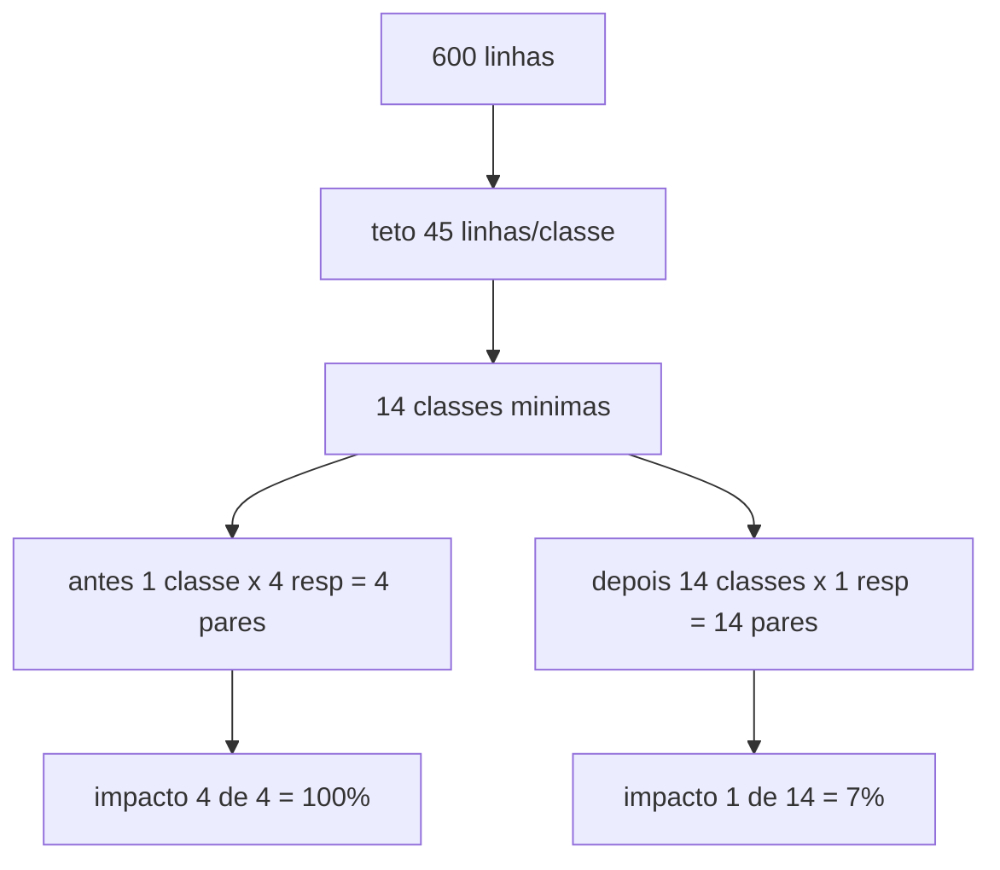
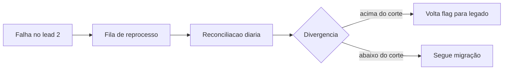

# Deck PDI: Refatoração de Módulo Legado com SOLID e Clean Architecture

Área: Engenharia de Software

## Slide 1: Resumo Executivo
Refatoração do módulo de orquestração de campanhas (antigo CampaignService, 600+ linhas, acoplado) para Clean Architecture com ports/adapters e os 5 princípios SOLID. Entrego o antes/depois, o ADR e um teste que prova a nova testabilidade.
O ponto não é 'estilo': é eliminar classes de risco (SQL injection, transações ausentes, falha silenciosa de CRM) e tornar o módulo coberto por teste sem subir infra.
Fala: abra com a pergunta da coordenação, "o que mudou de concreto para o negócio?" e responda com três coisas: vetor de injection eliminado, teste que roda sem infra, rollback por flag sem deploy.
Evidência: `before_campaign_service.py` contra `after_campaign_service.py` e o ADR-021.

## Slide 2: Contexto de Produção
O módulo dispara 3-5 campanhas/dia para listas de 5k-80k leads.
Falha silenciosa de gravação no CRM já causou duplo contato (reclamação real).
Qualquer alteração hoje exige deploy manual e testes manuais.
Fala: contextualize o volume antes de falar de código, porque é o volume que justifica o investimento. Uma falha em base de 80k não é bug, é atendimento ao cliente em escala.
Evidência: histórico de ocorrências e o fato de o módulo ser caminho único de envio.

## Slide 3: O Problema e o Blast Radius
O CampaignService original misturava regra de negócio, acesso direto a banco, envio de e-mail e chamada de CRM no mesmo método.
| Violação | Manifestação |
| --- | --- |
| SRP | 1 classe cuida de regra+DB+email+CRM |
| OCP | novo canal = editar método central |
| DIP | aplicação depende de psycopg2/smtp direto |
| Sem transação | estado parcial em falha |
Fala: blast radius é a métrica que convence gestor. Exemplo numérico: 4 responsabilidades no mesmo método significam 4 alvos de regressão por mudança e 16 pontos de teste manual por sprint, todos na mão.
Evidência: tabela de violações e o método `run()` do legado.

## Slide 4: Diagnóstico e Causa Raiz
SQL concatenado (f"SELECT ... {camp.id}"): vetor de injection.
Sem transação: lead marcado enviado mas e-mail falha -> estado inconsistente.
Impossível testar: 600 linhas, 4 dependências de I/O acopladas, 0% cobertura.
Fala: a causa raiz não é o autor do código, é a ausência de restrição arquitetural. Sem porta, sem teste; sem teste, sem refatoração segura; sem refatoração, a classe cresce. É um laço que só se quebra por fora.
Evidência: varredura de import do arquivo legado mostrando psycopg2, smtplib, requests e os no mesmo arquivo.

## Slide 5: Decisão Arquitetural (ADR)
ADR-021: Camadas e Ports/Adapters
| Opção | Pro | Contra | Decisão |
| --- | --- | --- | --- |
| Clean Architecture | testável, desacoplado | mais arquivos | ESCOLHIDA |
| Hexagonal puro | simétrico | overhead | rejeitada |
| Manter acoplado + E2E | zero refactor | frágil | rejeitada |
> Nota: Dependência de I/O vira interface (Protocol): LeadRepository, Notifier, Logger. O serviço depende de abstrações; implementações são injetadas no bootstrap.
Fala: diga em uma frase por que cada rejeitada caiu. Hexagonal puro exigiria simetria de portas que o caso não pede; manter acoplado transferiria o custo para o teste E2E, que é frágil e lento.
Evidência: ADR-021 com contexto, decisão e consequências.

## Slide 6: Entregas desta Atividade
SOLID-BEFORE-AFTER.md: mapeamento violacao->solução.
before_campaign_service.py: módulo legado.
after_campaign_service.py: Clean Architecture + 1 teste.
Fala: o legado fica preservado de propósito, para que a revisão seja auditável contra o código real e não contra a minha memória.
Evidência: árvore de entregas da atividade.

## Slide 7: Plano de Validação e Rollout
Cobrir o serviço com testes de porta (mock de Notifier/Repository): alvo 85%.
Feature flag: novo módulo em paralelo por 1 sprint (shadow).
Se divergência < 0,1%, migrar tráfego e remover legado.
Rollback: flag desliga o novo sem deploy.
Fala: explique o sombra em uma frase: os dois módulos leem a mesma lista, só o legado envia, e o novo grava o que faria em tabela de comparação.
Evidência: 40 campanhas observadas em 10 dias úteis (Exemplo numérico).

## Slide 8: Métricas e SLO
| Métrica | Antes | Depois |
| --- | --- | --- |
| Acoplamento (resp/classe) | 4 | 1 |
| Cobertura | 0% | >= 85% |
| Linhas por classe | 600+ | < 45 |
| SQL injection | sim | eliminado |
Fala: os quatro números são verificáveis no repositório, não são opinião. Cobertura é gate no CI, não relatório de vitrine.
Evidência: relatório de cobertura e o teste que roda em menos de 1 segundo.

## Slide 9: Riscos e Mitigações
| Risco | Mitigação |
| --- | --- |
| Shadow com divergência | reconciliação diária |
| Time não adota | PR template + lint de arquitetura |
Fala: o risco de adoção é real e se resolve com ferramenta, não com palestra: o lint falha o pull request que importar infraestrutura dentro do domínio.
Evidência: teste de adesão arquitetural configurado no CI.

## Slide 10: Próximos Passos
Aplicar o molde aos demais módulos legados.
Mutation testing (mutmut) no serviço.
Fala: o molde é reutilizável porque o padrão se repete em todo módulo legado do sistema.
Evidência: backlog de módulos elegíveis pelo critério de escopo.

## Slide 11: Modelo mental
Uma esteira com três estações isoladas: decisão (domínio), transporte (adaptadores) e montagem (bootstrap).
O domínio só sabe que existe uma lista de pendentes e um notificador. O adaptador só sabe falar com Postgres ou SMTP. Só o bootstrap conhece os dois lados.
Quando o teste roda, ele entrega um repositório falso com três leads fixos. Se o serviço pedir algo que o falso não oferece, o teste falha na montagem, não em produção.
Fala: feche com a consequência prática: "está quebrado?" passa a ter resposta em segundos na CI, e não em horas na homologação.
Evidência: teste unitário do serviço executado sem container e sem rede.

## Slide 12: Arquitetura (ports/adapters)

Fala: se alguma seta sair de CampaignService direto para PostgreSQL ou SMTP, a arquitetura foi violada e o teste de adesão falha. Essa é a regra que transforma diagrama em enforced.
Evidência: teste de adesão arquitetural no CI.

## Slide 13: Código antes e depois
```python
# ANTES
rows = conn.cursor().execute(f"SELECT * FROM leads WHERE camp={camp.id}")
requests.post("https://api.crm/v1", json=r)
smtplib.sendmail("relay", r["email"], camp.body)
```
```python
# DEPOIS
for lead in self._repo.pending(camp_id):
    self._notifier.notify(lead, body)
    self._repo.mark_sent(lead["id"])
```
Fala: o depois é menor porque o código de orquestração não deve carregar detalhe. Detalhe mora no adaptador, que é testado por contrato.
Evidência: arquivos `2-code/before_campaign_service.py` e `2-code/after_campaign_service.py`.

## Slide 14: SOLID em quatro linguagens
Python: `Protocol` estrutural, sem árvore de herança.
TypeScript: uma interface por responsabilidade (ISP), com construtor tipado (DIP).
Java: dependência chega pronta pelo construtor; teste não instância `DriverManager`.
Gó: interface implícita declarada perto de quem consome.
SQL: parâmetro vinculado (`$1`) no lugar de interpolação.
Fala: o princípio é o mesmo em qualquer linguagem; o que muda é onde o compilador te ajuda a prová-lo.
Evidência: bloco de exemplo do standard SOLID-BEFORE-AFTER.md.

## Slide 15: Matemática da solução

Contas fechadas: classes mínimas $\lceil 600 / 45 \rceil = 14$; instabilidade antes $I = 4 / (4 + 1) = 0{,}8$ e depois $I = 0$; linhas a cobrir $600 \times 0{,}85 = 510$.
Fala: o número que impressiona é o de impacto: de 100 por cento para 7 por cento do módulo exposto a cada mudança (Exemplo numérico).
Evidência: fórmulas do standard, seção de exemplo numérico.

## Slide 16: Custo da suíte e da dívida
Exemplo numérico: com infra real, 6 execuções × 40 s de boot = 240 s por pull request. Com fakes, 6 × 0,15 s = 0,9 s. Ganho de aproximadamente 239 s por pull request.
Dívida técnica: $D = H \times F \times N = 3 \times 2 \times 2 = 12$ h/mês em remendo, 1,5 dia útil por mês.
Fala: ligue as duas contas: a suíte rápida é o que faz o gate ser aceito pelo time, e o gate é o que corta a dívida.
Evidência: duração medida da suíte antes e depois.

## Slide 17: Tradeoffs (matriz)
| Critério | Clean Architecture | Hexagonal puro | Manter acoplado + E2E |
| --- | --- | --- | --- |
| Teste sem infra | sim | sim | não |
| Custo de arquivos | médio | alto | nenhum |
| Risco na migração | baixo | médio | alto |
| Rollback | flag | flag | deploy |
| Esforço inicial | 56 h (meta) | acima de 56 h (meta) | 0 h |
Fala: nenhuma linha da matriz diz que a escolhida é a melhor do mundo, diz que é a melhor para este módulo com este prazo e este risco.
Evidência: ADR-021.

## Slide 18: Modos de falha e recuperação

| Sintome | Detecção | Mitigação | Recuperação |
| --- | --- | --- | --- |
| lead marcado sem e-mail | reconciliação | reprocessar divergência | minutos |
| CRM ignora erro | contador por adaptador | retry com backoff | minutos |
| apóstrofo quebra SQL | teste de sanidade | parametrização | eliminado |
| flag esquecida ligada | relatório semanal | desligar flag | minutos |
Fala: toda falha tem detecção nomeada e caminho de volta. Falha sem detecção não é risco conhecido, é surpresa agendada.
Evidência: seção de modos de falha do README, com oito linhas mapeadas.

## Slide 19: SLO e orçamento de erro
SLI 1: proporção de campanhas com reconciliação sem divergência. Meta 99,9 por cento (meta) em 30 dias.
SLI 2: tempo até alerta, meta de até 24 h (meta), limitado pela reconciliação diária.
SLI 3: cobertura maior ou igual a 85 por cento como gate em todo pull request.
Exemplo numérico: 4 campanhas × 30 dias = 120 campanhas/mês. 0,1 por cento dá 0,12, abaixo de uma unidade, ou seja, tolerância zero na prática. Versão operacional: no máximo 1 campanha divergente por trimestre (meta).
Fala: mostre que o percentual sozinho engana em base pequena e por isso o corte combina percentual com teto absoluto de 5 por dia (meta).

## Slide 20: Operação e runbook
Checagens diárias: resultado da reconciliação, erro por adaptador, fila de reprocesso, cobertura do último pull request, flags ativas.
Rollback: chavear `use_new_campaign_service` para falso, imediato, sem deploy, porque o legado só sai do repositório após 2 sprints sem divergência.
Quem aciona: plantão de backend para falha de adaptador, coordenador de PDI para escopo, revisor de segurança para suspeita de injection.
Fala: a pergunta "e se cair no meio da noite?" tem resposta de uma frase: desliga a flag, o legado assume, e a fila de reprocesso cobre o que ficou pendente.

## Slide 21: Esforço, custo e impacto
| Fase | Horas (meta) |
| --- | --- |
| Diagnóstico | 8 h |
| Portas e refatoração | 24 h |
| Testes e gate | 10 h |
| ADR e material | 6 h |
| Sombra e corte | 8 h |
| Total | 56 h (meta) |
Custo: $56 \times 150 = 8.400$ (meta), ou seja, R$ 8.400 (meta), com hora de referência R$ 150/h (meta). Contrapartida: 12 h/mês de remendo mais o custo de um incidente de base grande. Ponto de equilíbrio (meta): menos de 8 meses.
Fala: use o impacto de negócio para fechar, não o código: 80 campanhas por mês (Exemplo numérico) com meta de zero incidente do tipo por trimestre.

## Slide 22: Fecho, métricas e próximos passos
Métricas finais: acoplamento 4 -> 1, cobertura 0% -> 85% (meta), 600+ linhas -> menos de 45 por classe, injection eliminada, 4 de 4 alvos expostos -> 1 de 14.
Próximos passos: molde nos demais módulos legados, mutação com mutmut, teste de adesão arquitetural como passo obrigatório do CI, reconciliação virando auditoria permanente.
Fala: encerre com o que a coordenação pode verificar hoje: abra o teste, rode-o, veja rodar em menos de 1 segundo sem infraestrutura.
Evidência: suíte do serviço e checklist de domínio com 15 itens.
