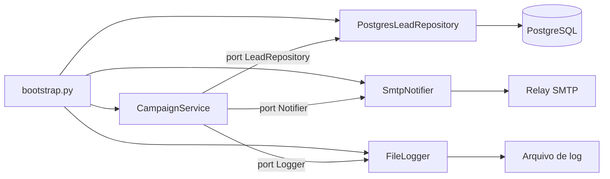

# Refatoração de Módulo Legado com SOLID e Clean Architecture

Engenharia de Software

## Resumo Executivo

Refatoração do módulo de orquestração de campanhas (antigo CampaignService, 600+ linhas, acoplado) para Clean Architecture com ports/adapters e os 5 princípios SOLID. Entrego o antes/depois, o ADR e um teste que prova a nova testabilidade.

O ponto não é 'estilo': é eliminar classes de risco (SQL injection, transações ausentes, falha silenciosa de CRM) e tornar o módulo coberto por teste sem subir infra.

A entrega tem três peças que se sustentam entre si. A primeira é o diagnóstico reproduzível: o legado fica preservado em `before_campaign_service.py`, então qualquer revisor consegue abrir o código e conferir cada acusação do diagnóstico sem precisar acreditar na minha palavra. A segunda é a refatoração executável em `after_campaign_service.py`, com um teste que roda em menos de um segundo e não toca em Postgres, SMTP nem rede. A terceira é o ADR-021, que registra a decisão, as alternativas descartadas e a consequência de cada escolha. O que se defende na coordenação é a decisão técnica documentada, não preferência estética por uma arquitetura da moda.

## Contexto de Produção

- O módulo dispara 3-5 campanhas/dia para listas de 5k-80k leads.

- Falha silenciosa de gravação no CRM já causou duplo contato (reclamação real).

- Qualquer alteração hoje exige deploy manual e testes manuais.

- O módulo é o único caminho de envio: não existe rota alternativa, então parar o serviço significa parar a comunicação com a base inteira.

- O time que mantém é o mesmo que escreveu o código original, o que reduz a pressão social para refatorar e aumenta o risco de conhecimento concentrado em uma pessoa.

## O Problema e o Blast Radius

O CampaignService original misturava regra de negócio, acesso direto a banco, envio de e-mail e chamada de CRM no mesmo método.

| Violação | Manifestação |
| --- | --- |
| SRP | 1 classe cuida de regra+DB+email+CRM |
| OCP | novo canal = editar método central |
| DIP | aplicação depende de psycopg2/smtp direto |
| Sem transação | estado parcial em falha |

Blast radius é o conjunto de código quebrado por uma única alteração aparentemente inocente. Aqui ele é total: mudar o formato do corpo do e-mail toca no mesmo método que escreve no banco, então um erro de rendering derruba a gravação de estado junto. Mudar a URL do CRM toca no mesmo laço que decide quais leads entram na campanha, então uma troca de ambiente pode disparar para a lista errada. Esse é o padrão que o SOLID existe para cortar: separar por motivo de mudança, não por tipo de arquivo.

Exemplo numérico: em um módulo com quatro responsabilidades no mesmo método, cada alteração de regra tem quatro alvos de regressão (regra, banco, e-mail, CRM) e nenhum teste automatizado para detectar a regressão. Com quatro mudanças por sprint, o esperado é 4 × 4 = 16 pontos de teste manual por sprint, todos executados na mão. Com 1 responsabilidade por classe e cobertura de 85 por cento (meta), os mesmos 4 pontos viram 4 execuções automatizadas de milissegundos.

## Modelo mental

O sistema se comporta como uma esteira com três estações isoladas entre si. A estação de decisão (domínio) só sabe que existe uma lista de pendentes e um notificador; ela não sabe se o destino é Postgres ou memória, nem se o canal é SMTP ou console. A estação de transporte (adaptadores) sabe falar com Postgres, com SMTP e com a API do CRM, mas não sabe nada sobre regra de campanha. A estação de montagem (bootstrap) é a única que conhece os dois lados e é a única que pode errar a fiação.

Quando o teste roda, ele entrega um repositório falso que devolve três leads fixos e um notificador falso que grava o que recebeu. Se o serviço pedir algo que o falso não oferece, o teste falha na montagem, não em produção. Essa é a promessa concreta da inversão de dependência: o código de negócio roda em qualquer lugar, inclusive no laptop de quem está revisando o pull request, porque nada dele abre socket, conexão ou arquivo.

A consequência prática é que a pergunta "está quebrado?" passa a ter resposta em segundos via CI, e não em horas via ambiente de homologação. O custo migrou do momento da produção (incidente, duplo contato, reclamação) para o momento do commit (teste vermelho). Essa troca é quase sempre vantajosa, porque o commit é barato de corrigir e o incidente, caro.

## Arquitetura



Legenda das decisões de borda:

- A seta do serviço para a porta é a única dependência do domínio. Se alguma seta sair de `S` direto para `DB`, `SMTP` ou `LOG`, a arquitetura foi violada e o teste de adesão falha.

- O bootstrap é o único arquivo que importa as três implementações concretas. Ele é deliberadamente não testado: ele é fiação, e fiação se valida em smoke test de subida.

- As portas são `Protocol` do Python, ou seja, contratos estruturais sem herança. Isso evita árvore de hierarquia e permite que qualquer objeto com os métodos certos seja aceito.

- O logger é porta e não módulo global. Log global é dependência escondida: quebra o teste de determinismo porque escreve em disco fora do controle do teste.

## Diagnóstico e Causa Raiz

- SQL concatenado (f"SELECT ... {camp.id}"): vetor de injection.

- Sem transação: lead marcado enviado mas e-mail falha -> estado inconsistente.

- Impossível testar: 600 linhas, 4 dependências de I/O acopladas, 0% cobertura.

A causa raiz não é incompetência de quem escreveu o código. É ausência de restrição arquitetural: quando nada impede a classe de importar o driver, ela importa o driver. Sem porta, sem teste; sem teste, sem refatoração segura; sem refatoração segura, a classe continua crescendo. É um laço de retroalimentação positiva que só se quebra por fora, com uma restrição que o linter ou o teste de adesão passe a impor.

```python
# ANTES: cada camada vaza para a próxima
def run(self, camp):
    conn = psycopg2.connect(os.getenv("DB"))            # infra no domínio
    rows = conn.cursor().execute(f"... WHERE camp={camp.id}")  # injection
    for r in rows:
        requests.post("https://api.crm/v1", json=r)     # sem status check
        smtplib.sendmail("relay", r["email"], camp.body)  # sem transação
```

```python
# DEPOIS: o domínio só enxerga portas
@dataclass
class CampaignService:
    repo: LeadRepository
    notifier: Notifier

    def run(self, camp_id: int, body: str) -> None:
        for lead in self.repo.pending(camp_id):
            self.notifier.notify(lead, body)
            self.repo.mark_sent(lead["id"])
```

## Decisão Arquitetural (ADR)

ADR-021: Camadas e Ports/Adapters

| Opção | Pro | Contra | Decisão |
| --- | --- | --- | --- |
| Clean Architecture | testável, desacoplado | mais arquivos | ESCOLHIDA |
| Hexagonal puro | simétrico | overhead | rejeitada |
| Manter acoplado + E2E | zero refactor | frágil | rejeitada |

> **Nota:** Dependência de I/O vira interface (Protocol): LeadRepository, Notifier, Logger. O serviço depende de abstrações; implementações são injetadas no bootstrap.

Contexto adicional registrado no ADR: o módulo é o único caminho de envio, existe feature flag no bootstrap e o legado precisa continuar rodando durante o sprint de sombra. Consequência prevista: mais arquivos para manter e um período em que dois caminhos existem ao mesmo tempo, com o custo de reconciliação diária que isso impõe.

## Matemática da solução

**1. Classes mínimas para respeitar o teto de linhas.** Fórmula: $C_{min} = \lceil L / L_{max} \rceil$, com $L$ em linhas e $L_{max}$ o teto por classe.

Exemplo numérico: $L = 600$ linhas e $L_{max} = 45$ linhas. $C_{min} = \lceil 600 / 45 \rceil = \lceil 13{,}3 \rceil = 14$ classes. Qualquer desenho com menos de 14 tipos no módulo já estoura o teto na média, mesmo que nenhum arquivo passe de 45 linhas isoladamente.

**2. Concentração de responsabilidades.** Fórmula: $P = C \times R$, com $C$ classes e $R$ responsabilidades por classe.

Exemplo numérico: antes, $C = 1$ e $R = 4$ (regra, banco, e-mail, CRM), logo $P = 4$ colaborações concentradas num único ponto de mudança, com 4 de 4 alvos expostos a toda alteração. Depois, $C = 14$ e $R = 1$, logo $P = 14$ colaborações distribuídas, com 1 de 14 alvos expostos. O total de pares sobe, a área de impacto de uma mudança cai de 100 por cento para 7 por cento (Exemplo numérico: 1/14 = 0,071).

**3. Instabilidade do módulo.** Fórmula de instabilidade: $I = C_e / (C_e + C_a)$, com $C_e$ dependências de saída e $C_a$ dependências de entrada.

Exemplo numérico: o `CampaignService` legado importa 4 pacotes (psycopg2, smtplib, requests, os) e é importado por 1 (o bootstrap), logo $C_e = 4$, $C_a = 1$ e $I = 4/5 = 0{,}8$. Módulo instável exatamente onde mora a regra de negócio. No desenho novo, o domínio importa 0 pacotes de infraestrutura, logo $I = 0/1 = 0$, e são os adaptadores que importam o domínio. A dependência aponta para o lado correto.

**4. Cobertura como gate.** Fórmula: linhas exercitadas $= L \times c$.

Exemplo numérico: $600 \times 0{,}85 = 510$ linhas precisam ser alcançadas pelo teste. As 90 restantes pertencem tipicamente aos adaptadores de I/O, que ficam atrás da porta e são validados por contrato de interface e por smoke test de subida, não por cobertura de linha do serviço.

**5. Custo da suíte.** Exemplo numérico (parâmetros: boot de container de 40 s, 6 execuções por pull request): com banco real, $6 \times 40 = 240$ s por pull request. Com portas e fakes, a mesma suíte roda em 0,15 s por execução, $6 \times 0{,}15 = 0{,}9$ s. Ganho por pull request: 240 - 0,9 ≈ 239 s, ou quase 4 minutos.

**6. Janela do sombra (shadow).** Exemplo numérico: 10 dias úteis × 4 campanhas/dia = 40 campanhas observadas em paralelo. Com lista média de 20.000 leads, são 40 × 20.000 = 800.000 eventos comparados. Aceitar 0,1 por cento de divergência significa aceitar 800 eventos divergentes. Por isso o corte usa percentual e teto absoluto: divergência menor que 0,1 por cento e no máximo 5 divergências por dia, senão o percentual esconde um volume de trabalho manual inaceitável.

**7. Dívida técnica em horas.** Fórmula: $D = H \times F \times N$, com $H$ horas de remendo por ocorrência, $F$ ocorrências por mês e $N$ pessoas afetadas.

Exemplo numérico: $H = 3$ h, $F = 2$ ocorrências/mês, $N = 2$ pessoas. $D = 3 \times 2 \times 2 = 12$ h/mês, equivalente a 1,5 dia útil por mês só em remendo. Meta (meta): baixar para 4 h/mês no trimestre seguinte à migração.

## Invariantes

1. Toda escrita de estado de campanha acontece dentro de transação ou possui compensação explícita rastreável. Violação: lead marcado como enviado sem e-mail entregue.
2. Nenhum valor de entrada chega a uma string SQL sem parâmetro vinculado. Violação: SQL injection e quebra de sintaxe com apóstrofo.
3. O domínio não importa módulo de infraestrutura (psycopg2, smtplib, requests). Violação: DIP quebrado e teste que exige rede.
4. Todo adaptador substituível passa no mesmo contrato do port. Violação: LSP violado e falso verde no teste.
5. Uma classe tem exatamente um motivo de mudança. Violação: SRP violado e blast radius volta a crescer.
6. Novo canal não altera código existente, apenas adiciona uma implementação. Violação: OCP violado.
7. Falha em um lead não descarta silenciosamente os demais: vira item rastreável em fila de reprocesso. Violação: perda de dado sem alerta.
8. O serviço não depende de horário, fuso ou aleatoriedade não semeada. Violação: teste não determinístico e suíte intermitente.
9. Toda execução carrega um ID de correlação propagado para logs de todos os adaptadores. Violação: impossibilidade de depurar em produção.
10. A feature flag é a única chave de corte entre legado e novo módulo e é auditável. Violação: rollback exige deploy.

## Modos de falha

| Sintome | Causa raiz | Como detecta | Como mitiga | Recuperação |
| --- | --- | --- | --- | --- |
| Lead marcado enviado sem e-mail | escrita de estado sem transação | reconciliação diária cruza estado com log do notificador | reprocessar divergência e corrigir ordem das operações | minutos |
| CRM não grava e ninguém percebe | chamada HTTP sem checagem de status | contador de erro por adaptador | retry com backoff limitado e alerta | minutos |
| Campanha quebra com nome contendo apóstrofo | SQL concatenado | teste de sanidade com entrada hostil | consulta parametrizada no port | imediato, eliminado no novo módulo |
| Um lead quebra a campanha inteira | exceção genérica levantada dentro do laço | métrica de falha por campanha | coletar falhas por lead e enviar a fila de reprocesso | minutos |
| Teste verde, bug em produção | mock que deixou de espelhar o contrato | teste de contrato + sombra de 1 sprint | reescrever o falso a partir do contrato, não do teste | horas |
| Flag esquecida ligada por semanas | ausência de auditoria de flag | relatório semanal de flags ativas | desligar flag e registrar decisão no ADR | minutos |
| Suíte lenta e ignorada pelo time | teste de integração subindo infraestrutura | duração da suíte no CI | mover para porta com fakes e deixar só o smoke no CI | horas |
| Latência alta em lista de 80k | repositório sem paginação | p95 do adaptador de leitura | paginação por cursor | horas |

## SLO e orçamento de erro

**SLI 1, consistência:** proporção de campanhas cuja reconciliação diária fecha com zero divergência. Meta: 99,9 por cento (meta), janela de medição de 30 dias. Coleta: execução diária da reconciliação às 08:00, com resultado gravado em tabela de auditoria.

**SLI 2, detecção:** tempo máximo entre uma divergência nascer e virar alerta. Meta: até 24 h (meta), limitado pela periodicidade diária da reconciliação. Se a tolerância do negócio cair, o passo seguinte é mover a reconciliação para hora em hora e reavaliar o custo.

**SLI 3, gate de qualidade:** cobertura do serviço maior ou igual a 85 por cento em todo pull request que altere o módulo. Isso não é meta, é gate: pull request sem a cobertura mínima não entra.

**Orçamento de erro:** com 4 campanhas por dia e 30 dias, há 120 campanhas por mês. 0,1 por cento de 120 dá 0,12 campanha, ou seja, abaixo de uma unidade inteira. Conclusão prática: em base pequena o percentual vira tolerância zero, então a versão operacional do SLO é "no máximo 1 campanha divergente por trimestre" (meta), acompanhada do teto absoluto de 5 divergências por dia durante o sombra.

**Quando estoura:** congelar a migração de tráfego, voltar a flag para o legado, abrir incidente com severidade 2 e fazer postmortem sem culpa em até 5 dias úteis. Ação corretiva obrigatória: atualizar o invariant correspondente e acrescentar o teste que teria pegado o caso.

## Entregas desta Atividade

- SOLID-BEFORE-AFTER.md: mapeamento violacao->solução.

- before_campaign_service.py: módulo legado.

- after_campaign_service.py: Clean Architecture + 1 teste.

- DECK-PDI.md, DEMO-SCRIPT.md e ROTEIRO-DOMINIO.md: material de defesa presencial.

## Plano de Validação e Rollout

1. Cobrir o serviço com testes de porta (mock de Notifier/Repository): alvo 85%.

2. Feature flag: novo módulo em paralelo por 1 sprint (shadow).

3. Se divergência < 0,1%, migrar tráfego e remover legado.

4. Rollback: flag desliga o novo sem deploy.

Detalhe operacional do sombra: os dois módulos leem a mesma lista de pendentes, mas apenas o legado envia. O novo roda em modo de sombra, ou seja, calcula o que faria, escreve o resultado numa tabela de comparação e não dispara nada para o lead. A reconciliação diária compara as duas decisões e classifica cada divergência em quatro causas: ordenação, dados nulos, formato de data e comportamento real de erro. Essa classificação é o que transforma "deu divergência" em "a causa é X", evitando que o time perca dias discutindo número.

Critério de aceite da fase: 40 campanhas em sombra, zero divergência de comportamento em erro (o que não pode mudar nunca) e divergência total abaixo de 0,1 por cento com no máximo 5 ocorrências por dia. Se qualquer um dos três itens falhar, a migração não avança e o defeito vira item de backlog com prioridade alta.

## Métricas e SLO

| Métrica | Antes | Depois |
| --- | --- | --- |
| Acoplamento (resp/classe) | 4 | 1 |
| Cobertura | 0% | >= 85% |
| Linhas por classe | 600+ | < 45 |
| SQL injection | sim | eliminado |
| Tempo de teste manual por alteração | horas | < 1 s (meta) |
| Pares de acoplamento expostos por mudança | 4 de 4 | 1 de 14 |

## Operação

**Checagens diárias:** resultado da reconciliação (08:00), contador de erro por adaptador, tamanho da fila de reprocesso, cobertura do último pull request, flags ativas. Cada checagem tem dono nomeado no time de backend.

**Mitigação em primeiro nível:** divergência isolada, reprocessa o item e investiga; fila de reprocesso acima de 50 itens (meta), congela a migração; erro do adaptador de CRM acima de 1 por cento em 15 minutos, ativa retry com backoff e desliga o sombra se persistir.

**Rollback:** chavear a flag `use_new_campaign_service` para falso. O caminho legado continua compilado e testado enquanto o sombra durar, então o retorno é imediato e não exige deploy. O rollback é sempre possível enquanto o legado não for removido do repositório.

**Quem aciona:** plantão de backend para falha de adaptador; coordenador de PDI para mudança de escopo ou de critério de aceite; revisor de segurança para qualquer suspeita de injection.

## Riscos e Mitigações

| Risco | Mitigação |
| --- | --- |
| Shadow com divergência | reconciliação diária |
| Time não adota | PR template + lint de arquitetura |
| Mock diverge do contrato real | teste de contrato + sombra |
| Legado removido cedo demais | remoção só após 2 sprints sem divergência |
| Escopo inflado (refatorar tudo de uma vez) | módulo a módulo, com feature flag por módulo |

## Decisões e tradeoffs
- Clean Architecture escolhida sobre hexagonal puro e manter acoplado com E2E: testabilidade com ports desacoplados compensa o custo de mais arquivos, como registra o ADR-021.
- Dependências de I/O como Protocol (LeadRepository, Notifier, Logger) com injeção no bootstrap: o serviço passa a depender de abstrações e o teste usa FakeRepo sem subir infra.
- Rollout em shadow por 1 sprint com reconciliação diária e corte em divergência menor que 0,1 por cento, em vez de cutover direto: compara o módulo novo com o legado de 600 linhas sem expor listas de 5k a 80k leads a estado parcial.
- Meta de cobertura de 85 por cento nos testes de porta com mocks, em vez de teste manual: o legado tinha 0 por cento de cobertura e 4 dependências de I/O acopladas, então o gate quantitativo impede regressão silenciosa.
- Classes menores que 45 linhas com 1 responsabilidade por classe, aceitando mais arquivos: elimina SQL concatenado, falta de transação e falha silenciosa de CRM que já causou duplo contato.
- Alternativa descartada: refatoração big bang em um pull request só. Rejeitada porque 600 linhas mudando de uma vez tornam a revisão humana ineficaz e o rollback impossível de ser granular; a alternativa vencedora foi fatiar por responsável, uma porta por vez, mantendo o legado funcionando.
- Alternativa descartada: herança de classe base para reaproveitar o código de envio. Rejeitada porque herança forte acopla o subtipo à classe base (risco de violar LSP com métodos que não se aplicam) e porque o Python já resolve a variação com duck typing e `Protocol`, sem árvore de hierarquia.
- Alternativa descartada: biblioteca de injeção de dependência pesada. Rejeitada porque o bootstrap tem 3 linhas de fiação; um container resolveria um problema que não existe e adicionaria dependência nova em um módulo cujo objetivo é reduzir dependência.
- Alternativa descartada: cobertura de 100 por cento. Rejeitada porque o retorno marginal cai depois de 85 por cento e empurra o time a escrever teste de implementação, que quebra a cada refatoração; o gate fica em 85 por cento com mutação como segundo sinal.

## Impacto no negócio

O módulo dispara 3 a 5 campanhas por dia para listas de 5k a 80k leads, então cada falha silenciosa vira duplo contato e reclamação real. Sair de 600 linhas com 0 por cento de cobertura para classes menores que 45 linhas com alvo de 85 por cento reduz o tempo de alteração de deploy manual com teste manual para validação automática, baixa o risco de SQL injection e estado parcial sem transação, e evita o custo de hotfix em base grande com rollback simples por feature flag.

Exemplo numérico de impacto: 4 campanhas por dia × 20 dias úteis = 80 campanhas por mês passam pelo módulo. Se 1 em 80 falhar de forma silenciosa, o módulo produz 1 incidente por mês, cada um com reclamação, remendo e reenvio manual. Com gate de cobertura e reconciliação, a meta (meta) é zero incidente do tipo por trimestre.

## Esforço e custo

| Fase | Horas (meta) |
| --- | --- |
| Diagnóstico e mapeamento de responsabilidades | 8 h |
| Extração de portas e refatoração | 24 h |
| Testes de porta, contrato e gate de cobertura | 10 h |
| ADR, deck e material de defesa | 6 h |
| Sombra, reconciliação e corte | 8 h |
| Total | 56 h (meta) |

Custo direto: com custo horário de referência de R$ 150/h (meta), $56 \times 150 = 8.400$ (meta), ou seja, R$ 8.400 (meta) de esforço interno. Contrapartida evitada: 12 h/mês de remendo (Exemplo numérico da seção de matemática) somadas ao custo de um incidente de base grande. Ponto de equilíbrio (meta): menos de 8 meses.

## Próximos Passos

- Aplicar o molde aos demais módulos legados.

- Mutation testing (mutmut) no serviço.

- Publicar o teste de adesão arquitetural como passo obrigatório do CI (verifica que `domain/` não importa infraestrutura).

- Converter a reconciliação de sombra em rotina permanente de auditoria.

## Referências de estudo
- Curso: Clean Architecture e SOLID com Python, na Alura.
- Vídeo: SOLID em código Python na prática, no YouTube.
- Doc oficial: Documentação do Python sobre Protocol e tipagem estrutural, em docs.python.org.
- Doc oficial: Documentação do pytest sobre fixtures e mocks, em docs.pytest.org.

## Checklist de domínio

1. O domínio não importa psycopg2, smtplib, requests ou módulo de log de arquivo.
2. Toda consulta aceita parâmetro vinculado; nenhum valor é interpolado na string SQL.
3. Toda escrita de estado de campanha é transacional ou tem compensação explícita.
4. Cada classe do módulo tem menos de 45 linhas e um único motivo de mudança.
5. O teste do serviço roda sem rede, sem container e em menos de 1 segundo.
6. Cobertura do serviço maior ou igual a 85 por cento no CI, como gate e não como relatório.
7. Todo adaptador passa no mesmo contrato do port, com teste de contrato executado no CI.
8. A feature flag permite voltar ao legado sem deploy e está documentada no ADR.
9. A reconciliação diária existe, tem dono e gera alerta quando há divergência.
10. Existe teto absoluto de divergência por dia, não só percentual.
11. O ID de correlação aparece em todos os logs de todos os adaptadores.
12. Falha em um lead vira item de reprocesso rastreável, nunca perda silenciosa.
13. O ADR registra alternativas descartadas e a consequência de cada escolha.
14. O legado só é removido depois de 2 sprints sem divergência.
15. O teste de adesão arquitetural roda no CI e falha o pull request em caso de violação.
