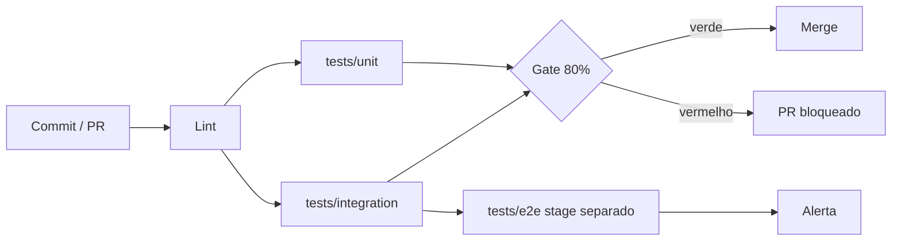

# Deck PDI: Pipeline de Testes Automatizados (Unit/Integration/E2E) com 80% de Cobertura

Área: Engenharia de Software

Padrão de narrativa: cada slide traz **Título** (como aparece), **Fala** (o que dizer em voz alta) e **Evidência** (o artefato que prova o que foi dito).

## Slide 1: Resumo Executivo
Entrego uma pipeline de testes em 3 camadas (unitário/integração/E2E) com gate de cobertura mínima de 80% no CI. Inclui testes reais, config de cobertura e um workflow de CI.
A entrega e defensável: roda em qualquer máquina e bloqueia merge abaixo do teto.
**Fala:** "Eu não entreguei opinião sobre qualidade. Entreguei um número que qualquer pessoa reproduz com um comando só, e uma regra automática que impede o merge quando o número cai."
**Evidência:** `pytest.ini` com `--cov-fail-under=80` versionado e o workflow `.github/workflows/ci.yml` rodando o mesmo comando.

## Slide 2: Contexto de Produção
Projeto de agentes com ~30 módulos Python + nos JS.
Sem suíte: refactor de prompt/tool injetava regressão em produção.
CI existente só roda lint.
**Fala:** "O lint pega forma, não comportamento. Ele fala que o arquivo está mal escrito, mas nunca fala que mudar a ordem das mensagens no prompt quebrou o contrato da tool."
**Evidência:** mapa dos cerca de 30 módulos e histórico de regressão pós-refactor.

## Slide 3: O Problema e o Blast Radius
Sem rede de segurança, toda mudança em main e indiretamente em produção.
| Sintoma | Hoje | Alvo |
| --- | --- | --- |
| Cobertura | 0% | >= 80% |
| Gate de CI | ausente | bloqueia < 80% |
| Regressão em prod | frequente | rara |
| Validação manual | dias por release | < 3 min no CI (meta) |
**Fala:** "Blast radius é a distância até o usuário. Sem gate, o defeito viaja até o usuário. Com gate, ele para no pull request."
**Evidência:** tabela de sintoma, estado atual e alvo, com o tempo de validação saindo de dias para minutos.

## Slide 4: Diagnóstico e Causa Raiz
Sem fixtures: testes dependiam de estado global/real.
Sem distinção de camada: tudo demorava horas.
Sem teto de cobertura: era possível piorar sem perceber.
**Fala:** "A leitura preguiçosa seria falta de disciplina. A causa raiz é outra: escrever teste era caro, tudo era lento, e sem teto não havia consequência por piorar. Preço alto e sem regra, a tarefa vira adiamento."
**Evidência:** cadeia causal de quatro níveis, terminando em "ausência de gate objetivo".

## Slide 5: Decisão Arquitetural (ADR)
ADR-022: Estratégia de Testes
| Opção | Pro | Contra | Decisão |
| --- | --- | --- | --- |
| pytest + testcontainers + playwright | realista, 3 camadas | setup maior | ESCOLHIDA |
| só unitários mockados | rápido | cego a integração | rejeitada |
| verificação manual | nenhum custo de setup | lenta, não bloqueia | rejeitada |
| cobertura sem teto | relatório bonito | não impede piora | rejeitada |
> Nota: Unitário mira lógica pura (90%), integração mira ports com DB efêmero (80%), E2E só happy path.
**Fala:** "Escolhi a opção com setup maior porque o contra dela é pago uma vez, e o contra das rejeitadas é pago toda vez que um defeito chega em produção."
**Evidência:** ADR-022 com as quatro opções, prós, contras e decisão registrada.

## Slide 6: Entregas desta Atividade
TEST-STRATEGY.md.
test_agent_pipeline.py.
test_integration_repo.py.
pytest.ini + .github/workflows/ci.yml.
**Fala:** "Quatro artefatos: a regra escrita, a camada rápida, a camada de integração e o gate. Sem qualquer um dos quatro, a cadeia não fecha."
**Evidência:** árvore do diretório da atividade com cada arquivo aberto no editor.

## Slide 7: Plano de Validação e Rollout
Rodar local: pytest --cov=src --cov-fail-under=80.
Subir o job no CI como required check.
Se < 80%, adicionar testes de lacuna.
E2E em stage separado com retry (não trava merge).
**Fala:** "A ordem importa: primeiro local, depois CI como check obrigatório, depois cobertura de lacuna. O E2E entra por último e fora do caminho crítico, justamente por ser a camada mais lenta."
**Evidência:** sequência de rollout com rollback documentado para cada etapa.

## Slide 8: Métricas e SLO
| SLO | Alvo |
| --- | --- |
| Cobertura global (gate) | >= 80% |
| Tempo unit/int | < 3 min |
| Flaky rate | < 1% |
**Fala:** "Três métricas, três janelas. Cobertura medida a cada execução, tempo na mediana semanal, flaky sobre o total de execuções da semana."
**Evidência:** tabela de SLI, meta, janela e ação ao estourar.

## Slide 9: Riscos e Mitigações
| Risco | Mitigação |
| --- | --- |
| Flaky | retry 1x + isolamento |
| Cobertura vazia | code review + mutation |
| Teto vira contabilidade | revisão do teste, não só do número |
| Suíte lenta | paralelismo e escopo de fixture |
**Fala:** "O risco mais elegante é o segundo da lista: cobertura alta com teste vazio. Por isso mutation testing entra nos módulos núcleo, medindo se o teste realmente falharia."
**Evidência:** matriz de risco com mitigação por linha.

## Slide 10: Próximos Passos
E2E para fluxos críticos.
Mutation testing em módulos núcleo.
**Fala:** "Próximos passos são dois, ambos mensuráveis: E2E nos fluxos que movem dinheiro e mutation testing nos módulos que sustentam o gate."
**Evidência:** backlog com critério de pronto para cada item.

## Slide 11: Arquitetura da solução

**Fala:** "Repare nas duas bordas: o lint roda antes de tudo porque é barato, e o E2E sai do caminho do merge porque é lento. Gate e alerta são papéis diferentes."
**Evidência:** diagrama de fluxo com o laço de correção `PR bloqueado -> testes de lacuna`.

## Slide 12: Matemática da cobertura
**Cobertura de ramo:** $C_b = \frac{R_t}{R_x} \times 100$, com teto $C_b \geq 80\%$.

**Exemplo numérico:** $R_x = 40$ ramos, $R_t = 31$ então $C_b = 77{,}5\%$, gate reprova. Cobrindo os ramos de erro, $R_t = 34$ e $C_b = 85\%$, gate aprova.

**Tempo do gate:** $T_{gate} = \frac{T_{unit}}{p} + \frac{T_{int}}{p}$. Com $T_{unit} = 90$ s, $T_{int} = 60$ s e $p = 2$: $45 + 30 = 75$ s, contra 180 s de orçamento.

**Fala:** "Dois cálculos fechados: o que faz o PR passar e quanto tempo o feedback leva. Ambos cabem num slide porque ambos são reproduzíveis."
**Evidência:** contas com parâmetros declarados e comparação com o teto de 80% e o orçamento de 3 min.

## Slide 13: Matriz de tradeoff
| Alternativa | Custo único | Custo recorrente | Cego a | Decisão |
| --- | --- | --- | --- | --- |
| 3 camadas com gate | Alto | Baixo | nada essencial | ESCOLHIDA |
| Só unitário mockado | Baixo | Baixo | integração | rejeitada |
| Só E2E | Médio | Alto (lento) | regressão localizada | rejeitada |
| Manual em staging | Zero | Altíssimo (horas) | tudo | rejeitada |
| Cobertura sem teto | Baixo | Alto (piora silenciosa) | intenção de qualidade | rejeitada |
**Fala:** "A coluna que decide é custo recorrente. As opções rejeitadas parecem baratas no primeiro mês e caras em todos os outros."
**Evidência:** matriz de decisão do ADR-022.

## Slide 14: Modo de falha e recuperação
| Falha | Detecção | Recuperação | Tempo |
| --- | --- | --- | --- |
| Teto estourado em PR | Check vermelho | Escrever teste da lacuna | Minutos |
| Suíte verde local, vermelha no CI | Divergência de comando/versão | Mesmo comando e dependências fixadas | Minutos |
| Teste instável | Falha seguida de sucesso sem diff | Isolar e corrigir causa, sem retry novo | Horas |
| Contêiner não sobe no CI | Falha de conexão na fixture | Serviço declarado no workflow | Minutos |
| E2E instável trava merge | Falha intermitente no required check | Mover E2E para estágio de alerta | Minutos |
**Fala:** "Todo modo de falha tem detecção automática e um caminho de recuperação que não envolve mudar o teto. Se a única saída fosse baixar o teto, o gate seria contornável."
**Evidência:** tabela de modos de falha com tempo de recuperação.

## Slide 15: Exemplo de código das três camadas
```python
# unitário: regra pura, sem I/O
def test_parse_prompt_encaminha():
    assert AgentPipeline().parse("envie para Maria") == {"action": "send", "target": "Maria"}

# integração: serviço + repositório + notificador instrumentado
def test_integracao_marcado_como_enviado():
    repo, notif = FakeRepo(), SpyNotifier()
    CampaignService(repo, notif, mock.Mock()).run(1, "oi")
    assert repo._store.get("1") is True

# gate: teto aplicado na execução
# pytest --cov=src --cov-report=term-missing --cov-fail-under=80
```
**Fala:** "Note a diferença do tipo de asserção: no unitário asserto a saída da regra; no integração asserto o efeito durável. Nos dois casos, asserto comportamento, não chamada interna."
**Evidência:** `test_agent_pipeline.py` e `test_integration_repo.py`.

## Slide 16: Impacto no negócio
Validação manual de 8 h por release, duas releases por semana, quatro semanas: $8 \times 2 \times 4 = 64$ h por mês.

**Exemplo numérico:** com o gate, o mesmo volume de releases passa a exigir minutos de leitura de resultado no CI, e as 64 h viram horas de construção de testes, que continuam protegendo depois de pagas.

**Fala:** "O ganho não é só velocidade: é trocar um custo que se repete todo mês por um custo que se amortiza."
**Evidência:** conta com parâmetros declarados e o corte de regressão de frequente para rara.

## Slide 17: Fecho com métricas e próximos passos
| Métrica | Antes | Depois | Como prova |
| --- | --- | --- | --- |
| Cobertura | 0% | >= 80% | Relatório do CI |
| Gate de merge | ausente | bloqueia < 80% | PR de teste com lacuna |
| Tempo de validação | dias | < 3 min (meta) | Duração do job |
| Flaky | sem medição | < 1% (meta) | Falha seguida de sucesso |
**Próximos passos:** E2E nos fluxos críticos; mutation testing nos módulos núcleo; sustentar o teto por 12 semanas consecutivas (meta).
**Fala:** "Fecho com o antes, o depois e a prova de cada linha. Se qualquer linha desta tabela não tiver artefato, ela não entra no slide."
**Evidência:** saída do CI, PR de validação negativa e histórico semanal de execuções.
