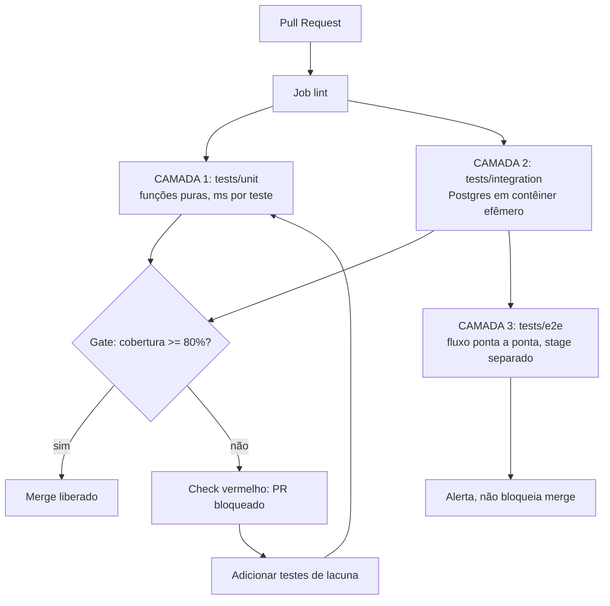

# Pipeline de Testes Automatizados (Unit/Integration/E2E) com 80% de Cobertura

Engenharia de Software

## Resumo Executivo

Entrego uma pipeline de testes em 3 camadas (unitário/integração/E2E) com gate de cobertura mínima de 80% no CI. Inclui testes reais, config de cobertura e um workflow de CI.

A entrega é defensável: roda em qualquer máquina e bloqueia merge abaixo do teto.

O ponto central da entrega é que o critério deixa de ser subjetivo. Antes, "está bom o suficiente para subir" era uma opinião de quem revisava na sexta-feira. Depois, é um número reproduzível: qualquer pessoa roda `pytest` na própria máquina e recebe o mesmo resultado que o CI vai receber. Se o pipeline fica verde local, ele fica verde remoto, porque a configuração de cobertura e o comando de execução são os mesmos artefatos versionados.

## Contexto de Produção

- Projeto de agentes com ~30 módulos Python + nos JS.

- Sem suíte: refactor de prompt/tool injetava regressão em produção.

- CI existente só roda lint.

O lint valida a forma do código, não o comportamento. Ele denuncia linha longa, import não usado e indentação inconsistente, mas é incapaz de dizer que a mudança de assinatura de `parse()` quebrou o contrato consumido por dezenas de `tool handlers`. Em um projeto de agentes, a superfície de regressão é ampla justamente onde o lint é cego: ordem das mensagens no prompt, parsing da resposta do modelo, contrato de entrada e saída das tools, idempotência de reenvio quando o provedor de IA falha no meio da execução.

Com cerca de 30 módulos Python mais os arquivos JavaScript, o acoplamento real não é visível no import graph. Ele aparece no fluxo: um módulo monta o contexto, outro chama a ferramenta, outro persiste o resultado. Mudou o formato do contexto em um ponto, o defeito só se manifesta em produção, quando o agente recebe um payload que não esperava.

## O Problema e o Blast Radius

Sem rede de segurança, toda mudança em main e indiretamente em produção.

| Sintoma | Hoje | Alvo |
| --- | --- | --- |
| Cobertura | 0% | >= 80% |
| Gate de CI | ausente | bloqueia < 80% |
| Regressão em prod | frequente | rara |
| Tempo de validação manual | dias por release | < 3 min no CI (meta) |
| Teste flaky | sem medição | < 1% das execuções (meta) |
| Feedback ao autor do PR | subjetivo | numérico e reproduzível |

Blast radius é a pergunta "até onde esse defeito viaja antes de alguém perceber". Sem suíte, a resposta é: até o usuário final. A mudança sobe para main porque o lint passou, o revisador olhou por cima, e o primeiro sinal do problema chega por suporte. Cada hora que o defeito fica no caminho crítico multiplica o custo de correção, porque em produção ele tem dado salvo, usuário afetado, rollback a coordenar e comunicação a fazer.

## Diagnóstico e Causa Raiz

- Sem fixtures: testes dependiam de estado global/real.

- Sem distinção de camada: tudo demorava horas.

- Sem teto de cobertura: era possível piorar sem perceber.

Cadeia causal completa, da causa aparente até a raiz:

1. **Causa aparente**: ninguém escreve teste. A leitura preguiçosa e "falta de disciplina do time".
2. **Causa intermediária**: escrever teste era caro, porque cada teste exigia preparar banco compartilhado, dados de semente e ambiente de homologação na mão. Teste caro vira tarefa adiada.
3. **Causa estrutural**: não havia distinção de camada. Se tudo precisava de infraestrutura, tudo era lento, e algo lento nunca roda a cada pull request.
4. **Causa raiz**: ausência de rede de segurança com critério objetivo. Sem gate, não há consequência mensurável por piorar a cobertura, então a cobertura podia cair infinitamente sem ninguém perceber.

O sintoma final, "refactor de prompt injeta regressão em produção", é a ponta dessa cadeia. Tratar só o sintoma (pedir mais cuidado na revisão) não resolve; tratar a raiz (tornar a verificação barata, rápida e bloqueante) resolve.

## Modelo mental

Como o sistema realmente se comporta por dentro depois da entrega: o repositório carrega um diretório `tests/` dividido em três subpastas que refletem o custo e o alcance de cada verificação. `tests/unit/` exercita funções puras, sem rede, sem disco e sem banco, em milissegundos por teste. `tests/integration/` sobe um contêiner efêmero de Postgres por sessão, aplica as migrações, roda o caso de uso contra o repositório real e derruba o contêiner ao final, sem deixar resíduo na máquina de ninguém. `tests/e2e/` sobe a aplicação e percorre um fluxo ponta a ponta pela API, como faria um cliente.

O `pytest` é o único orquestrador: ele coleta, executa na ordem certa, aplica `pytest-cov` para medir cobertura durante a execução e devolve um código de saída diferente de zero quando o teto configurado (`--cov-fail-under=80`) não é atingido ou quando qualquer teste falha. O CI, por sua vez, não tem lógica própria de qualidade: ele apenas trata esse código de saída como sinal de aprovação do merge. A rede de segurança inteira, portanto, é uma cadeia de três elos versionados: configuração de cobertura, execução reproducível e regra de merge no repositório. Rompeu um elo, o gate é apenas decoração.

## Arquitetura

Legenda das decisões de borda:

- **Lint antes dos testes**: falha barata primeiro. Não gasta minuto de contêiner para descobrir erro de sintaxe que o interpretador pegaria.
- **Unitário e integração alimentam o gate**: são as duas camadas rápidas e determinísticas, únicas com autoridade para bloquear merge.
- **E2E fora do caminho crítico**: é a camada mais lenta e mais propensa a instabilidade externa. Ela informa, mas não impede o fluxo diário.
- **Bloqueio gera laço de correção**: o PR bloqueado volta para o autor com a lista de linhas não cobertas, o que transforma o gate em feedback de imediato, não em punição final.

## Matemática da solução

**Cobertura simples (linhas).** $C = \frac{L_e}{L_t} \times 100$, onde $L_e$ são as linhas executadas ao menos uma vez e $L_t$ são as linhas executáveis.

**Exemplo numérico:** um módulo com $L_t = 1000$ linhas executáveis e $L_e = 780$ resulta em $C = 78\%$, abaixo do teto de 80%, e o gate reprova o PR. Ao adicionar testes para as 40 linhas faltantes do caminho de erro do parser, $L_e = 820$ e $C = 82\%$, e o gate aprova. A conta é fechada, sem margem para discussão.

**Cobertura de ramo (branch).** Com `branch = true` no `coverage.py`, o denominador vira pares condicionais: $C_b = \frac{R_t}{R_x} \times 100$, com $R_t$ ramos tomados e $R_x$ ramos existentes. Um `if` não testado conta dois ramos: o verdadeiro e o falso. Por isso a cobertura de ramo é sempre menor ou igual à de linha no mesmo conjunto, e é a métrica que o gate realmente usa.

**Exemplo numérico:** uma função com 4 ramos condicionais, dos quais 3 são exercitados, entrega $C_b = 75\%$ mesmo com 100% de linhas executadas, porque uma linha de dentro de um `else` nunca rodou. O gate com branch reprova, e corretamente: o comportamento alternativo ficou sem rede de segurança.

**Tempo de suíte.** Em série: $T_{total} = T_{unit} + T_{int} + T_{e2e}$. Com $p$ processos paralelos na camada unitária: $T'_{unit} \approx \frac{T_{unit}}{p}$.

**Exemplo numérico:** $T_{unit} = 90$ s, $T_{int} = 60$ s, $T_{e2e} = 120$ s. Em série, $T_{total} = 270$ s, ou 4,5 min, acima do alvo de 3 min. Com $p = 2$ na unitária: $T'_{unit} = 45$ s, $T'_{int} = 30$ s, gate $= 75$ s, e o E2E roda em stage separado, somando $195$ s apenas quando executa. O alvo de < 3 min no caminho crítico fica com folga de 105 s.

**Taxa de teste instável (flaky).** $F = \frac{n_{flaky}}{n_{execuções}} \times 100$, contando testes que falharam em uma execução e passaram na reexecução imediata sem mudança de código.

**Exemplo numérico:** em uma semana com $n_{execuções} = 5000$ e $n_{flaky} = 30$, $F = 0{,}6\%$, abaixo do teto de 1%. Se $n_{flaky}$ subir para 80, $F = 1{,}6\%$ e o alerta dispara, porque reexecução automática esconde defeito real atrás de instabilidade.

**Custo de detecção tardio.** Modelo didático: $C_{correção} = C_{base} \times m$, com $m$ o multiplicador da fase em que o defeito é encontrado.

**Exemplo numérico (parâmetros declarados):** correção em desenvolvimento, $C_{base} = 1$ h; encontrada em staging, $m = 3$; encontrada em produção, $m = 8$. A mesma correção custa 1 h, 3 h ou 8 h conforme o ponto de detecção. O gate existe para fixar $m = 1$ na maior parte dos defeitos.

## Invariantes

O que nunca pode ser falso, com a violação correspondente:

| Invariante | Violação detectada como |
| --- | --- |
| A cobertura medida no CI é sempre maior ou igual a 80% para haver merge | Check vermelho com `FAIL Required test coverage of 80% not reached` |
| Nenhum teste depende de banco compartilhado ou estado deixado por teste anterior | Teste que passa sozinho e falha em suíte, ou ordem de execução alterando resultado |
| Toda fixture que cria recurso externo o derruba no final | Vazamento de contêiner ou porta ocupada na segunda execução local |
| O comando que o CI roda é idêntico ao comando documentado para rodar localmente | Divergência entre verde no CI e vermelho na máquina de outro dev |
| A camada unitária não faz I/O de rede, disco ou banco | Unitário lento ou sensível a ambiente, o que corrompe a pirâmide |
| Todo teste falha por asserção, não por erro inesperado de exceção | `Error` em vez de `AssertionError` no relatório, sinal de teste mal formado |
| Reexecução de teste nunca máscara defeito persistente | Teste reexecutado duas vezes antes de falhar no CI |
| Cobertura só sobe, exceto quando código morre deliberadamente | Queda de cobertura sem remoção correspondente de código |

## Modos de falha

| Sintoma | Causa raiz | Como detecta | Como mitiga | Recuperação |
| --- | --- | --- | --- | --- |
| Gate reprova sem motivo aparente | Novo arquivo sem teste correspondente | Relatório `term-missing` lista as linhas | Escrever teste para o módulo novo antes do merge | Minutos |
| Suíte verde local, vermelha no CI | Divergência de versão de dependência ou de comando | Reproduzir com o mesmo `pip install` do workflow | Fixar versões em requisitos e usar o mesmo comando | Minutos |
| Suíte demora acima de 3 min | Fixture de integração recriando contêiner por teste | Tempo por teste no relatório `--durations` | Escopar fixture para sessão, não para função | Horas |
| Teste falha só em execução paralela | Corrida em recurso compartilhado ou ordem dependente | Rodar com 1 processo e depois com N | Isolar estado por teste e eliminar dependência de ordem | Horas |
| Cobertura cai de 80% para 78% sem mudança de teste | Código novo sem teste, ou teste removido | Diferença de cobertura entre execuções | Bloquear merge e cobrir o trecho novo | Minutos |
| Contêiner de banco não sobe no CI | Porta ocupada ou imagem indisponível no runner | Falha de conexão na fixture de integração | Usar serviço declarado no workflow e fixture efêmera | Minutos |
| Teste instável intermitente | Dependência de tempo, ordem ou rede externa | Falha seguida de sucesso sem mudança de código | Isolar, tornar determinístico e remover retry mascarador | Horas |
| E2E trava o merge por falha externa | Camada lenta no caminho crítico | E2E como required check com falha intermitente | Manter E2E em stage separado com alerta | Minutos |

## SLO e orçamento de erro

| SLI | Meta | Janela de medição | Ao estourar |
| --- | --- | --- | --- |
| Cobertura global (gate) | >= 80% | Cada execução de CI | Bloquear merge até cobrir a lacuna |
| Cobertura da camada unitária | >= 90% (meta) | Cada execução de CI | Priorizar lacunas em regras puras |
| Cobertura da camada de integração | >= 80% (meta) | Cada execução de CI | Adicionar caso por port não coberto |
| Tempo do gate (unit + int) | < 3 min | Por execução, mediana semanal | Paralelizar e escopar fixtures |
| Taxa de teste instável | < 1% | Semanal, sobre todas as execuções | Isolar e corrigir a causa, sem retry novo |
| Testes vermelhos no main | 0 | Contínuo | Correção ou reversão imediata |

Orçamento de erro: o único erro aceito é o falso positivo raro do teste instável, limitado a menos de 1% das execuções. Falso negativo, isto é, defeito aprovado pelo gate, não tem orçamento: é o que o plano de refatoração em sombra e o mutation testing endereçam nas próximas etapas.

## Operação

Runbook resumido, na ordem em que deve ser executado:

1. **Checagem diária**: abrir o último run do workflow e confirmar verde no job `test`. Tempo de leitura: menos de 1 minuto.
2. **Suspeita de teste instável**: reexecutar o job uma vez sem alterar código. Falhou de novo, é defeito real: tratar como bug de teste. Passou, é instabilidade: abrir item de correção para isolar.
3. **Gate estourado em PR aberto**: rodar `pytest --cov=src --cov-report=term-missing` localmente, ler a lista `Missing`, escrever os testes e reenviar. Não se altera o teto para fazer o PR passar.
4. **Suíte lenta**: executar `pytest --durations=10`, identificar os dez testes mais lentos e atacar fixture por fixture antes de qualquer otimização de paralelismo.
5. **Rollback da mudança de gate**: reverter o commit que alterou `pytest.ini` ou o workflow. O rollback é uma mudança de versão normal, com mesmo caminho de aprovação que qualquer outra, porque gate também é código versionado.
6. **Quem aciona**: autor do PR resolve item 3; mantenedor do pipeline resolve itens 2 e 4; coordenação é acionada só se o main ficar vermelho por mais de 1 hora (meta).

## Decisão Arquitetural (ADR)

ADR-022: Estratégia de Testes

| Opção | Pro | Contra | Decisão |
| --- | --- | --- | --- |
| pytest + testcontainers + playwright | realista, 3 camadas | setup maior | ESCOLHIDA |
| só unitários mockados | rápido | cego a integração | rejeitada |
| verificação manual em homologação | nenhum custo de setup | lenta, subjetiva, não bloqueia | rejeitada |
| cobertura medida sem teto | dá ilusão de métrica | não impede piora | rejeitada |

> **Nota:** Unitário mira lógica pura (90%), integração mira ports com DB efêmero (80%), E2E só happy path.

## Entregas desta Atividade

- TEST-STRATEGY.md.

- test_agent_pipeline.py.

- test_integration_repo.py.

- pytest.ini + .github/workflows/ci.yml.

Detalhe de cada entrega:

| Artefato | O que ele garante | Como validar |
| --- | --- | --- |
| `TEST-STRATEGY.md` | Regra única do que testar em cada camada, com teto e critério | Ler e conferir se cobre escopo, anti-padrões e checklist |
| `test_agent_pipeline.py` | Camada unitária sobre parser de prompt e retry com backoff | `pytest 2-code/test_agent_pipeline.py -v` |
| `test_integration_repo.py` | Camada de integração sobre serviço, repositório e notificador | `pytest 2-code/test_integration_repo.py -v` |
| `pytest.ini` | Teto de cobertura e caminho de coleta fixados em versão | Abrir o arquivo e conferir `--cov-fail-under=80` |
| `.github/workflows/ci.yml` | Gate como required check no repositório | Abrir PR com cobertura baixa e ver o check vermelho |

## Plano de Validação e Rollout

1. Rodar local: pytest --cov=src --cov-fail-under=80.

2. Subir o job no CI como required check.

3. Se < 80%, adicionar testes de lacuna.

4. E2E em stage separado com retry (não trava merge).

Sequência de rollback para cada etapa:

- Etapa 1 falha localmente: corrigir dependência ou caminho de coleta antes de qualquer push. Nada subiu, então não há o que reverter.
- Etapa 2 falha no CI: desmarcar o check como required, corrigir o workflow e voltar a marcar. A janela sem gate é documentada na issue, não silenciosa.
- Etapa 3 estoura o prazo: reduzir escopo do pull request, não o teto. Split de mudança grande em mudanças pequenas recoloca o gate no caminho viável.
- Etapa 4 instável: remover o E2E do estágio de pull request mantendo-o em execução agendada, até que a instabilidade seja isolada.

## Métricas e SLO

| SLO | Alvo |
| --- | --- |
| Cobertura global (gate) | >= 80% |
| Tempo unit/int | < 3 min |
| Flaky rate | < 1% |

Leitura de cada métrica:

- **Cobertura global**: percentual de linhas e ramos executados medido por `pytest-cov` com `branch = true`. Abaixo do teto, código de saída diferente de zero é merge bloqueado.
- **Tempo unit/int**: soma das duas camadas rápidas, medida como duração do job no CI. Acima de 3 min, o feedback chega tarde demais para manter o ritmo de revisão.
- **Flaky rate**: fração de testes que falham e passam na reexecução sem mudança de código. Acima de 1%, o sinal de falha perde confiança e o time começa a ignorar o vermelho.

## Riscos e Mitigações

| Risco | Mitigação |
| --- | --- |
| Flaky | retry 1x + isolamento |
| Cobertura vazia | code review + mutation |
| Teto vira alvo de contabilidade | Revisão de qualidade do teste no code review, não só do número |
| Suíte cresce além de 3 min | Paralelismo, escopo de fixture e corte de teste redundante |
| Contêiner lento no CI | Imagem em cache e fixture de sessão |
| Gate contorna por exceção | Teto só muda por ADR, nunca em branch de feature |

## Decisões e tradeoffs
- pytest com testcontainers e playwright escolhido sobre só unitários mockados: cobre 3 camadas com realismo e o custo maior de setup compensa, pois unitário sozinho é cego a integração.
- Unitário mira lógica pura com alvo de 90 por cento, integração mira ports com DB efêmero com alvo de 80 por cento, e E2E cobre só happy path: camadas rápidas seguram o merge e a camada lenta não trava o time.
- Gate de cobertura mínima de 80 por cento com --cov-fail-under=80 como required check no CI: impede piorar a cobertura sem perceber, saindo de 0 por cento e CI que só rodava lint.
- E2E em stage separado com retry, fora do caminho crítico do merge: evita que teste lento ou instável bloqueie o fluxo diário dos cerca de 30 módulos Python e nos JS.
- Fixtures isoladas com retry de 1 vez e isolamento contra estado global: sustenta tempo de unit e integração menor que 3 min e flaky rate menor que 1 por cento.
- Alternativas descartadas e por quê: (a) teto de 100%, descartado porque obriga a testar código morto e defensivo, elevando custo de manutenção sem reduzir defeito na mesma proporção; (b) medição de cobertura sem teto, descartada porque produz relatório bonito e nenhuma barreira; (c) mock total de rede e banco, descartado porque a falha clássica deste projeto é justamente na integração entre módulos; (d) gate só no merge final, descartado porque o feedback precisa chegar enquanto o contexto do autor ainda está na cabeça.

## Impacto no negócio

O projeto tem cerca de 30 módulos Python mais nos JS e o CI atual só roda lint, então refactor de prompt ou tool injeta regressão em produção sem rede de segurança. O gate de 80 por cento com unit e integração em menos de 3 min troca dias de validação manual por minutos no CI, reduz regressão frequente para rara com flaky abaixo de 1 por cento, e evita o custo de corrigir defeito tarde, quando ele já chegou a main e a produção.

**Exemplo numérico (parâmetros declarados):** validação manual de 8 h por release, duas releases por semana, quatro semanas no mês. $8 \times 2 \times 4 = 64$ h de validação manual por mês. Com o gate, o mesmo volume passa a custar o tempo de leitura do resultado no CI, na ordem de minutos por release, e as 64 h viram horas de desenvolvimento de testes, que continuam protegendo o sistema depois de pagas. O ganho não é só de velocidade: é a troca de um custo recorrente por um custo que se amortiza.

## Esforço e custo

| Item | Esforço estimado |
| --- | --- |
| Estrutura de pastas e configuração de cobertura | 2 h |
| Camada unitária sobre parser e retry | 4 h |
| Camada de integração com fixture efêmera | 6 h |
| Workflow de CI como required check | 2 h |
| Documentação TEST-STRATEGY.md | 3 h |
| Ajuste de flaky e paralelismo pós-implantação | 4 h (meta) |
| **Total da implantação** | **21 h (meta)** |

**Exemplo numérico de custo de execução (parâmetros declarados):** execução do gate de 2 min em um executor com 2 vCPU cobrado por minuto de processamento. $2 \text{ vCPU} \times 2 \text{ min} = 4$ vCPU·min por pull request. Com 50 pull requests por semana, $4 \times 50 = 200$ vCPU·min por semana. O número é apresentado como exemplo de método de conta, não como medição real da plataforma usada.

## Referências de estudo
- Curso: Testes automatizados com pytest, na Alura.
- Vídeo: Piramide de testes na prática com Python, no YouTube.
- Doc oficial: Documentação do pytest sobre execução e cobertura, em docs.pytest.org.
- Doc oficial: Documentação do Coverage.py sobre medição com branch, em coverage.readthedocs.io.

Leitura sugerida na ordem: primeiro a documentação do pytest sobre como executar a suíte e coletar testes, depois a do Coverage.py para entender por que `branch = true` derruba o número de cobertura em relação à medição por linha. Os dois textos oficiais bastam para sustentar a maior parte das decisões deste ADR.

## Checklist de domínio

Itens que o sênior confere antes de dizer "pronto":

1. `pytest --cov=src --cov-fail-under=80` roda verde do zero em máquina limpa.
2. O teto está no arquivo versionado, não em variável de ambiente do CI.
3. `branch = true` está configurado e o número de cobertura reflete ramos.
4. Todo teste de integração usa fixture efêmera e derruba o contêiner ao final.
5. Nenhum teste depende da ordem de execução.
6. Rodar a suíte duas vezes seguidas produz o mesmo resultado.
7. A camada unitária não toca rede, disco ou banco.
8. O workflow de CI falha exatamente quando o teto não é atingido.
9. O job de teste é required check nos pull requests.
10. O E2E está em estágio separado e não bloqueia o merge.
11. O relatório `--cov-report=term-missing` aponta as linhas faltantes.
12. O tempo do gate ficou abaixo de 3 min na mediana.
13. A taxa de teste instável ficou abaixo de 1% na semana.
14. O comando documentado para rodar localmente é idêntico ao do CI.
15. Toda mudança de teto passou por decisão registrada, não por pressa de merge.
