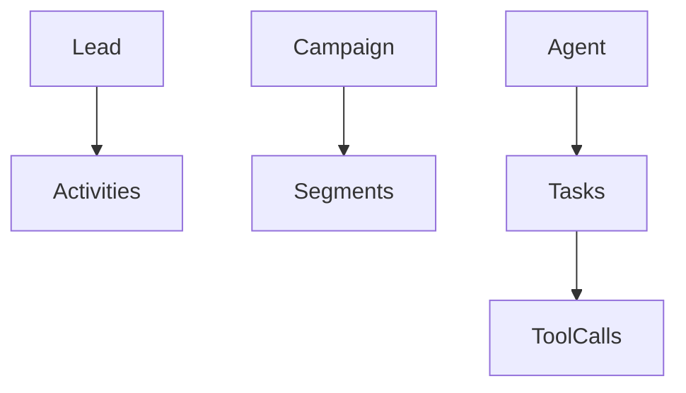

# Mapa de Domínios (DDD)

## Bounded Contexts
1. **CRM** — Lead, Contact, Deal, Account
2. **Campaign** — Campaign, Segment, Message
3. **Agent** — Agent, Task, Tool, Run
4. **Billing** — Invoice, Plan, Usage

## Agregados (raiz → filhos)
- Lead (raiz) → Activities, Scores
- Campaign (raiz) → Segments, Schedules
- Agent (raiz) → Tasks → ToolCalls

## Linguagem ubíqua (glossário)
- *Lead*: contato capturado ainda não qualificado.
- *Deal*: oportunidade com valor e estágio.
- *Run*: execução de um agente com trace.

## Diagrama (Mermaid)

