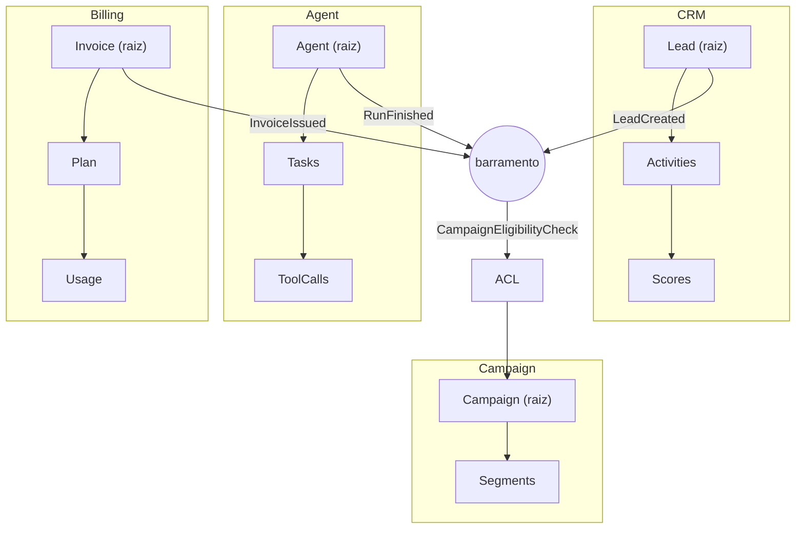

# Deck PDI: Mapeamento de Domínios com Domain-Driven Design (DDD)

Área: Engenharia de Software

Narrativa slide a slide: cada bloco traz **Título**, **Fala** (o que dizer) e **Evidência** (o que mostrar).

## Slide 1: Resumo Executivo
Mapeamento dos domínios da empresa em DDD antes de novas codificações: bounded contexts, agregados, linguagem ubíqua e eventos de domínio. Entrego o mapa, modelos e um exemplo de invariante de agregado.
O objetivo é eliminar modelos duplicados e linguagem inconsistente entre squads.
**Fala:** o problema não é falta de código, é falta de fronteira. Quatro squads escrevem sobre as mesmas tabelas e cada um traduz o negócio do seu jeito. A entrega devolve uma palavra por conceito e um dono por dado.
**Evidência:** tabela de partida: 3 modelos de Contato, 0 contextos explícitos, 5 toques por mudança de regra.

## Slide 2: Contexto de Produção
4 squads tocam dados de Lead/Conta/agente sem vocabulário comum.
Mesma entidade 'Contato' tem 3 modelos diferentes.
Novas features recriam agregados já existentes.
**Fala:** a consequência prática é retrabalho: a feature nasce, o time descobre que o agregado já existia com outro nome e refaz. Ninguém é culpado, o modelo é compartilhado por omissão.
**Evidência:** exemplo numérico: 5 repositórios/tabelas tocados por uma mudança de regra (CRM, Campaign, export, painel, ETL), $A = 5/1 = 5$.

## Slide 3: Diagnóstico e Causa Raiz
Ausência de bounded contexts -> tudo vira 'tabela única'.
Linguagem ubíqua ausente -> 'lead' significa 3 coisas.
Sem agregado -> regras de consistência espalhadas.
**Fala:** a causa raiz é estrutural. Sem fronteira, o custo de uma mudança é distribuído entre quem não criou o problema. Sem agregado, a invariante vive espalhada em `if`s e passa a valer em alguns caminhos e não em outros.
**Evidência:** diagrama de dependências antes da mudança.

## Slide 4: Decisão Arquitetural (ADR)
ADR-023: Mapa de Domínios
| Opção | Pro | Contra | Decisão |
| --- | --- | --- | --- |
| DDD explícito | consistência, linguagem | governança | ESCOLHIDA |
| Schema único | simples | acopla squads | rejeitada |
> Nota: Cada bounded context tem seu modelo; integração por eventos de domínio.
**Fala:** escolhemos DDD explícito porque o custo da governança é previsível e o custo do acoplamento não é. Schema único parece simples porque o custo aparece depois, em retrabalho.
**Evidência:** ADR-023 publicado com contexto, alternativas e consequências, não só a decisão.

## Slide 5: Entregas desta Atividade
DOMAIN-MAP.md.
domain_models.py: agregados com invariantes.
domain_events.py: eventos.
**Fala:** o mapa é o contrato social do modelo, os dataclasses são a prova executável e os eventos são a fronteira. Sem os três, o mapa vira slide esquecido.
**Evidência:** abrir `domain_models.py` e mostrar `Lead.contact()` recusando lead não qualificado com `DomainError`.

## Slide 6: Plano de Validação
Workshop de linguagem ubíqua com Product + 2 squads.
Validar agregados contra 3 user stories.
Gerar schemas dos agregados aprovados.
**Fala:** validamos antes de gravar schema. Se a user story só passar com tradução improvisada, o glossário está errado e não o código.
**Evidência:** critérios de aceite por etapa, com gate de CI no fim.

## Slide 7: Métricas e SLO
| SLO | Alvo |
| --- | --- |
| Domínios mapeados | 4 |
| Modelos duplicados | 0 |
| Eventos definidos | >= 6 |
**Fala:** são três metas verificáveis, não aspiração. Modelos duplicados igual a zero é a que exige gate, porque sem automação volta a subir.
**Evidência:** relatório de CI mostrando contagem de duplicações e leituras cruzadas.

## Slide 8: Riscos e Mitigações
| Risco | Mitigação |
| --- | --- |
| Mapa vira teoria | code review exige mapear |
| Over-engineering | só modelar o que tem regra |
**Fala:** os dois riscos se combatem com a mesma régua: só modela o que tem invariante, e só entra código se o mapa foi atualizado na mesma revisão.
**Evidência:** checklist de revisão de código com a pergunta "isso pertence a qual contexto?"

## Slide 9: Próximos Passos
Adotar eventos no barramento (05-A1).
Testes de invariante de agregado.
**Fala:** o mapa só se paga quando vira comportamento automatizado: barramento ligado e teste de invariante rodando em CI.
**Evidência:** fila de eventos ativa e suíte de invariantes verde.

## Slide 10: Modelo mental
Um bounded context é contrato de linguagem e dono de dados. O agregado é a fronteira de transação. Evento é fato datado e imutável. ACL traduz o vizinho.
**Fala:** a régua de decisão é curta: transação conjunta, mesmo agregado; só notificação, mesmo contexto; contrato estável e versionado, outro contexto.
**Evidência:** analogia do condomínio: portaria, acadêmia e conta de luz são contextos que conversam por recado, não por manual único.

## Slide 11: Arquitetura e fronteiras

**Fala:** nenhuma aresta vai de agregado a agregado. Todo caminho passa pelo barramento, e a ACL fica na recepção para traduzir antes de virar objeto local.
**Evidência:** o gráfico em si, com legenda das decisões de borda.

## Slide 12: Matemática da solução
Ampliação de mudança: $A = C_{tocados} / C_{dono}$, meta $A = 1$.
**Exemplo numérico:** antes, a regra "lead não qualificado não pode ser contatado" era aplicada em 5 pontos (CRM, Campaign, export, painel, ETL): $A = 5/1 = 5$. Depois: $A = 1/1 = 1$.
Ganho: 12 mudanças de regra por trimestre x 4 toques evitados x 2 h por toque = **96 h/trimestre** liberadas.
Custo transacional: $T_{tx} = T_{lock} + \sum T_{op}$; agregado com 3 filhos dá $4 + 3 \times 8 = 28$ ms, com 12 filhos dá $4 + 12 \times 8 = 100$ ms.
Carga do barramento: $\lambda = 40 \times 1{,}5 = 60$ eventos/s e $L = \lambda W = 60 \times 0{,}025 = 1{,}5$ eventos simultâneos por worker.
**Fala:** cada número tem parâmetro declarado. Se a coordenação mudar os parâmetros, o resultado muda junto, e isso é discutível em reunião.
**Evidência:** as quatro fórmulas com contas fechadas em números redondos.

## Slide 13: Invariantes e modos de falha
| Invariante | Se violar |
| --- | --- |
| Só a raiz é referenciada de fora | regra vaza por FK direta |
| Transação toca um agregado e um só | rollback parcial deixa estado inválido |
| Evento imutável e datado | consumidor reprocessa história |
| Contexto não lê tabela alheia | migração quebra runtime |

**Fala:** invariante sem teste é opinião. Cada linha da tabela tem teste automatizado correspondente, inclusive casos de borda: vazio, nulo, unicode e limite.
**Evidência:** suíte de testes com `DomainError` sendo levantada em lead não qualificado.

## Slide 14: Falha e recuperação
| Sintoma | Detecção | Mitigação | Recuperação |
| --- | --- | --- | --- |
| Job noturno falha após migração | alerta de ETL | schema como código com revisão | reverter migração |
| Consumidor duplica efeito | efeito > evento | dedup por `event_id` | reprocessar com dedup |
| Fila cresce 15 min (meta) | fila > 0 por 15 min | escalar workers | drenar e reprocessar |
| Evento "corrigido" depois de publicado | teste de imutabilidade | publicar novo evento | voltar consumidor |

**Fala:** a ordem é detectar, mitigar, recuperar. Pausar tópico é barato; rollback de contrato exige janela de compatibilidade retroativa.
**Evidência:** runbook com dono nomeado para cada etapa.

## Slide 15: Tradeoffs (matriz)
| Alternativa | Ganho | Custo | Decisão |
| --- | --- | --- | --- |
| DDD explícito | fronteira e linguagem | governança | ESCOLHIDA |
| Schema único | simplicidade inicial | acopla 4 squads | rejeitada |
| Microsserviços já | isolamento de deploy | rede e operação antes da hora | adiada |
| Eventos sem contrato | entrega rápida | quebra silenciosa | rejeitada |
| 2PC entre contextos | escrita coordenada | indisponibilidade agregada | rejeitada |
| ACL na fronteira | modelo local limpo | código de tradução | ESCOLHIDA |

**Fala:** nenhuma opção é grátis. Escolhemos duas que custam código (DDD e ACL) contra três que custam disponibilidade ou acoplamento.
**Evidência:** ADR-023 com alternativas descartadas e o motivo de cada uma.

## Slide 16: Telemetria e SLO
| SLI | Meta | Janela |
| --- | --- | --- |
| Mudanças que tocaram 1 contexto | >= 90% (meta) | trimestral |
| Modelos duplicados sem ACL | 0 (meta) | contínua |
| Falhas de contrato de schema | 0 (meta) | mensal |
| p95 de processamento de evento | < 1000 ms (meta) | diária |

Orçamento de erro: no máximo 1 contrato quebrado por trimestre; cada quebra custa 4 h de correção em dois contextos (Exemplo numérico) contra 8 h de orçamento do squad.
**Fala:** se estourar, congela a criação de eventos novos até os contratos existentes estarem versionados e testados.
**Evidência:** painel com as quatro séries e o alarme configurado.

## Slide 17: Operação e rollback
1. Checagem diária do gate de dependência entre contextos.
2. Checagem semanal de fila e razão efeitos/eventos.
3. Mitigação: pausar tópico, corrigir consumidor, reprocessar com dedup.
4. Rollback: versão anterior do contrato com compatibilidade retroativa.
5. Acionamento: dono do contexto decide, dono do barramento pausa tópico, coordenação quando o orçamento estoura.
**Fala:** o mapa sem runbook vira dependência de memória de alguém. Quem aciona está nomeado antes do incidente.
**Evidência:** runbook resumido do README da atividade.

## Slide 18: Esforço e custo
| Fase | Horas (meta) |
| --- | --- |
| Workshop de linguagem ubíqua | 4 |
| Modelagem de 4 contextos | 12 |
| Invariantes e testes | 10 |
| Contratos de 6 eventos + ACL | 8 |
| Gate de CI e documentação | 6 |
| Total | 40 h (meta) |

Custo de ferramenta: zero licença nova. Custo real: 1 ADR curto e 1 entrada de glossário por contexto novo.
**Fala:** o investimento é de um sprint de uma pessoa, contra 96 h de retrabalho por trimestre (Exemplo numérico) se nada mudar.
**Evidência:** planilha de horas por fase.

## Slide 19: Fecho com métricas
| Métrica | Antes | Depois (meta) |
| --- | --- | --- |
| Contextos explícitos | 0 | 4 |
| Modelos de Contato | 3 | 1 por contexto |
| Ampliação de mudança $A$ | 5 | 1 |
| Eventos de domínio | 0 | >= 6 |
| Retrabalho por trimestre | 96 h (Exemplo numérico) | 0 h (meta) |

**Fala:** o ganho é mensurável e reversível: se a métrica piorar, o gate avisa antes da feature cair em produção.
**Evidência:** tabelas de antes e depois com os parâmetros declarados.

## Slide 20: Próximos passos e donos
1. Publicar ADR-023 e o glossário versionado.
2. Ligar o gate de dependência entre contextos em todos os repositórios.
3. Adotar eventos no barramento (05-A1).
4. Cobrir INV-01 a INV-08 com teste automatizado.
5. Revisar o mapa a cada trimestre com as métricas do slide 19.
**Fala:** sem dono nomeado, o mapa parou. Por isso o fecho é lista com responsável e prazo, não com adjetivo.
**Evidência:** itens 1 a 5 com responsável e prazo no quadro da equipe.
