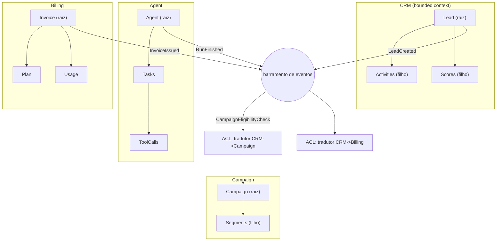

# Mapeamento de Domínios com Domain-Driven Design (DDD)

Engenharia de Software

## Resumo Executivo

Mapeamento dos domínios da empresa em DDD antes de novas codificações: bounded contexts, agregados, linguagem ubíqua e eventos de domínio. Entrego o mapa, modelos e um exemplo de invariante de agregado.

O objetivo é eliminar modelos duplicados e linguagem inconsistente entre squads.

Em termos de operação, a entrega substitui um modelo único e acoplado por quatro contextos com fronteiras explícitas. Cada contexto ganha a sua raiz de agregado, o seu glossário e o seu conjunto de eventos de publicação. O efeito prático esperado é que uma alteração de regra em Imobiliário pare de quebrar agendamento de Saúde, e que a palavra "lead" deixe de significar três coisas diferentes em três squads.

## Contexto de Produção

- 4 squads tocam dados de Lead/Conta/agente sem vocabulário comum.

- Mesma entidade 'Contato' tem 3 modelos diferentes.

- Novas features recriam agregados já existentes.

- Não existe dono de schema: quem precisa de coluna nova adiciona, e o ETL noturno descobre a mudança no dia seguinte quando o job falha.

- Revisão de código não pergunta "isso pertence a qual contexto?", porque a pergunta não tem resposta: tudo está no mesmo esquema.

## Diagnóstico e Causa Raiz

- Ausência de bounded contexts -> tudo vira 'tabela única'.

- Linguagem ubíqua ausente -> 'lead' significa 3 coisas.

- Sem agregado -> regras de consistência espalhadas.

- Sem fronteira de transação -> uma gravação toca tabelas de dois domínios, então rollback parcial deixa estado inválido registrado.

- Sem eventos versionados -> integração por SQL cruzado, o que transforma mudança de coluna em incidente.

A causa raiz é de classe, não de pessoa: com um único esquema, o modelo é compartilhado por omissão, e todo squad otimiza o próprio pedaço sem enxergar o custo que impõe aos demais.

## Problema Resolvido

Números de partida levantados na pré-análise desta atividade:

| Indicador de partida | Valor atual | Alvo após o mapa |
| --- | --- | --- |
| Contextos de domínio identificados | 0 explícitos | 4 |
| Modelos distintos para a entidade Contato | 3 | 1 por contexto, com tradução |
| Domínios mapeados com raiz de agregado | 0 | 4 |
| Eventos de domínio definidos | nenhum formalizado | >= 6 |
| Repositórios/tabelas tocados por mudança de regra | 5 (Exemplo numérico) | 1 |

O problema resolvido é, portanto, de fronteira e de vocabulário: hoje a mudança de regra se propaga por tudo que lê a mesma coluna; depois do mapa, ela se propaga só por quem publica e consome eventos.

## Modelo mental

Um bounded context é ao mesmo tempo um contrato de linguagem e um dono de dados: quem está dentro usa as palavras com um único significado e quem está fora não lê as tabelas, apenas contrata eventos. O agregado é a fronteira de consistência transacional: tudo que precisa mudar junto, muda na mesma transação, através de uma única raiz. Filhos do agregado existem, mas não têm identidade pública: de fora, ninguém cita um Item, cita-se o Pedido que o contém. Evento de domínio é um fato passado, escrito no tempo passado: `LeadCreated` nunca mais vira `LeadUpdated`, quem precisa mudar publica outro evento. A anti-corruption layer é o tradutor na fronteira: ela lê o modelo vizinho e devolve o modelo local, de modo que regra alheia nunca contamina a sua. Regra prática de decisão: se a regra precisa de transação conjunta, está no mesmo agregado; se precisa só de notificação, está no mesmo contexto; se precisa de contrato estável e versionado, está em outro contexto. Pense em cidades com códigos de trânsito próprios, ligadas por correio com carimbo de data: cada cidade administra o seu território e nenhuma lê o livro-caixa da outra.

## Arquitetura

Legenda das decisões de borda:

- Caixas `subgraph` são fronteiras de modelo: nada dentro de uma caixa lê tabela de outra caixa diretamente.

- Aresta só entra ou sai do barramento, nunca de um agregado a outro agregado: isso impede SQL cruzado entre domínios.

- Os nós `ACL` ficam na fronteira de recepção, para traduzir o payload externo antes de virar objeto local.

- O barramento é o único ponto que conhece todos os tópicos; os contextos conhecem apenas os seus.

- Setas de evento usam nome no passado, no padrão `contexto.substantivo.pretérito`, porque evento é fato consumado.

## Matemática da solução

**1. Ampliação de mudança (change amplification)**

$$A = \frac{\text{contextos tocados por mudança de regra}}{\text{contextos que realmente carregam a regra}}$$

Meta: $A = 1$. Qualquer $A > 1$ significa fronteira vazando.

**Exemplo numérico:** antes do mapa, uma mudança na regra de qualificação de lead era replicada em CRM, Campaign, export de Billing, painel e ETL noturno, ou seja, 5 contextos tocados para 1 que carrega a regra: $A = 5/1 = 5$. Depois, a regra vive só no CRM e os demais reagem ao evento: $A = 1/1 = 1$. Se o squad fizer 12 mudanças de regra por trimestre e cada toque evitado custa 2 h de análise e teste (parâmetros declarados acima), a economia é $12 \times 4 \times 2 = 96$ h/trimestre.

**2. Custo transacional do tamanho do agregado**

$$T_{tx} = T_{lock} + \sum_{i=1}^{n} T_{op,i}$$

**Exemplo numérico:** com 3 tabelas no agregado, 8 ms por operação e 4 ms de espera de lock: $T_{tx} = 4 + 3 \times 8 = 28$ ms. Com o mesmo agregado "gigante" de 12 tabelas: $T_{tx} = 4 + 12 \times 8 = 100$ ms, quase 4 vezes pior, além de lock mais longo disputando com escritas concorrentes. Por isso a regra: agregado pequeno o bastante para caber numa transação curta, grande o bastante para conter a invariante.

**3. Carga do barramento por contexto**

$$\lambda_{eventos} = \lambda_{comandos} \times e \qquad L = \lambda \times W$$

onde $e$ é o número médio de eventos gerados por comando e $W$ o tempo de processamento do consumidor.

**Exemplo numérico:** 40 comandos/s com $e = 1,5$ resultam em $\lambda = 60$ eventos/s. Consumidor com $W = 25$ ms (0,025 s) mantém $L = 60 \times 0,025 = 1,5$ eventos em processamento simultâneo por worker. Com 3 workers a fila média fica em 4,5 itens, folga suficiente para pico de 2x sem perder ordem de processamento por partição.

**4. Contagem de modelos duplicados**

$$D = |\{ (c_1, c_2, e) : e \in c_1 \land e \in c_2 \land \text{sem ACL} \}|$$

Meta: $D = 0$. Toda repetição de nome entre contextos exige ou renomear, ou provar que existe tradução explícita na fronteira.

## Invariantes

O que nunca pode ser falso, com a violação correspondente:

| ID | Invariante | Se violar, acontece |
| --- | --- | --- |
| INV-01 | Só a raiz do agregado é referenciada de fora | FK direta em filho permite alterar estado sem passar pela regra da raiz |
| INV-02 | Filho de agregado não tem identidade pública fora da raiz | Endpoints e eventos passam a citar `item_id` solto e o dono do dado some |
| INV-03 | Uma transação modifica um agregado e um só | Rollback parcial deixa metade da regra aplicada |
| INV-04 | Contexto não lê tabela de outro contexto | Migração de coluna alheia quebra runtime sem aviso |
| INV-05 | Cada termo do glossário tem um significado por contexto | "Lead" volta a valer 3 coisas e o relatório mente |
| INV-06 | Evento é imutável e datado; mudou, publica-se outro evento | Consumidor reprocessa história e contadores duplicam |
| INV-07 | Integração entre contextos é sempre por evento versionado ou ACL | SQL cruzado recria o acoplamento que o mapa removeu |
| INV-08 | Toda invariante de agregado é coberta por teste automatizado | Refatoração silenciosa derruba regra de negócio |

## Modos de falha

| Sintoma | Causa raiz | Como detecta | Como mitiga | Recuperação |
| --- | --- | --- | --- | --- |
| Coluna some e job noturno falha | Migração sem dono de schema | Alerta de falha de ETL + checagem de contrato de schema | Registro de schema como código com revisão obrigatória | Reverter migração e republicar versão anterior |
| Consumidor repete efeito ao reprocessar | Evento sem chave idempotente | Contagem de efeito maior que contagem de evento | Chave de deduplicação por `event_id` | Reprocessar com dedup ligado |
| Dois contextos gravam o mesmo negócio | Fronteira vazando, ACL ausente | Auditoria de dependência acusando leitura cruzada | Inserir ACL e renomear entidade local | Congelar escrita cruzada e migrar leitores |
| Fila cresce sem parar | Consumidor mais lento que a publicação | Fila $> 0$ por 15 min (meta) | Escalar workers e limitar publicação em lote | Drenar fila e reprocessar com janela |
| Evento consumado é "corrigido" | Exceção que edita payload já publicado | Teste de imutabilidade do evento falhando em CI | Proibir edição; publicar novo evento de correção | Reverter consumidor para versão anterior do contrato |
| Nome muda no meio da sprint | Glossário não versionado | Divergência entre termo do código e termo do glossário | Versionar glossário junto com o repositório | Reverter nome e republicar glossário |
| Agregado grande demais, latência sobe | Invariante modelada fora do agregado correto | p95 de transação acima da meta | Dividir agregado e mover regra para evento | Redimensionar e retestar invariantes |
| Rollback não restaura estado | Transação atravessa contextos | Erro de 2PC/timeout em dois contextos | Transação local por contexto, compensação por saga | Executar compensação manual guiada por runbook |

## SLO e orçamento de erro

| SLI | Meta | Janela | Estourou? |
| --- | --- | --- | --- |
| Mudanças de regra que tocaram apenas 1 contexto | >= 90% (meta) | trimestral | Auditar as demais e abrir ADR de fronteira |
| Modelos duplicados sem ACL | 0 (meta) | contínua | Congelar feature nova até corrigir |
| Eventos de domínio definidos | >= 6 (meta) | por atividade | Mapear os faltantes no próximo workshop |
| Falhas de contrato de schema em produção | 0 (meta) | mensal | Rollback da migração + postmortem sem culpa |
| Disponibilidade do barramento | 99,5% (meta) | mensal | Revisar plano de sobrevivência do barramento |

Orçamento de erro: a atividade tolera no máximo 1 contrato de evento quebrado por trimestre, porque cada quebra custa em média 4 h de correção em dois contextos (Exemplo numérico), e o orçamento de correção do squad é de 8 h/trimestre. Estourou o orçamento, congela-se a criação de novos eventos até que os contratos existentes estejam versionados e testados.

## Operação

Runbook resumido:

1. **Checagem diária**: rodar a verificação de dependência entre contextos (CI) e conferir que nenhum importou módulo de outro contexto sem ACL. Falhou: bloquear merge.

2. **Checagem semanal**: conferir a fila de eventos (profundidade e p95 de processamento) e a contagem de efeitos por evento contra a contagem de publicações. Divergiu: pausar o consumidor e revisar idempotência.

3. **Mitigação**: publicação com problema, pausar o tópico, corrigir consumidor, reprocessar com deduplicação ligada.

4. **Rollback**: voltar a versão anterior do contrato de evento, manter compatibilidade retroativa por uma janela, notificar os donos dos contextos consumidores.

5. **Quem aciona**: executor da etapa de modelagem do contexto afetado decide a correção; o dono do barramento autoriza a pausa do tópico; a coordenação é acionada quando o orçamento de erro é estourado.

## Decisão Arquitetural (ADR)

ADR-023: Mapa de Domínios

| Opção | Pro | Contra | Decisão |
| --- | --- | --- | --- |
| DDD explícito | consistência, linguagem | governança | ESCOLHIDA |
| Schema único | simples | acopla squads | rejeitada |

> **Nota:** Cada bounded context tem seu modelo; integração por eventos de domínio.

## Entregas desta Atividade

- DOMAIN-MAP.md.

- domain_models.py: agregados com invariantes.

- domain_events.py: eventos.

- README da apresentação, deck, roteiro de demonstração e roteiro de domínio em `7-apresentacao/`.

## Plano de Validação

1. Workshop de linguagem ubíqua com Product + 2 squads.

2. Validar agregados contra 3 user stories.

3. Gerar schemas dos agregados aprovados.

Critérios de aceite por etapa:

- **Etapa 1**: glossário aprovado com um significado por termo e zero sinônimos divergentes pendentes. Critério de falha: dois times ainda usam "lead" com sentidos diferentes.

- **Etapa 2**: as 3 user stories executam de ponta a ponta usando apenas o vocabulário do glossário, sem tradução improvisada no código. Critério de falha: aparece `contato_id` solto citado fora do agregado.

- **Etapa 3**: schema gerado compila, testes de invariantes passam e a verificação de dependência entre contextos acusa zero leitura cruzada. Critério de falha: qualquer contexto importando tabela de outro.

- **Etapa 4 (gate de publicação)**: pelo menos 6 eventos versionados publicados no barramento, com contrato testado por ambos os lados.

## Métricas e SLO

| SLO | Alvo |
| --- | --- |
| Domínios mapeados | 4 |
| Modelos duplicados | 0 |
| Eventos definidos | >= 6 |

## Riscos e Mitigações

| Risco | Mitigação |
| --- | --- |
| Mapa vira teoria | code review exige mapear |
| Over-engineering | só modelar o que tem regra |
| Governança vira burocracia | gate automatizado em CI, decisão em ADR curto |
| Evento virar acoplamento disfarçado | contrato versionado e testes de compatibilidade |
| Fronteira errada, regra dividida | validar com user stories antes de gerar schema |
| Barramento como ponto único | plano de sobrevivência e reprocessamento com dedup |

## Próximos Passos

- Adotar eventos no barramento (05-A1).

- Testes de invariante de agregado.

- Estender a verificação de dependência entre contextos para todos os repositórios.

- Versionar o glossário no mesmo repositório dos schemas.

## Decisões e tradeoffs
- DDD explícito escolhido sobre schema único: consistência e linguagem comum compensam o custo de governança, enquanto tabela única acopla os 4 squads.
- Cada bounded context tem seu modelo e a integração ocorre por eventos de domínio: evita que a entidade Contato continue com 3 modelos diferentes e que regra de um squad vaze para outro.
- Só modelar o que tem regra de consistência, com agregado de raiz única e filhos sem identidade pública: previne over-engineering e concentra esforço onde há invariante real.
- Validação em workshop de linguagem ubíqua com Product e 2 squads contra 3 user stories antes de gerar schemas: garante que o mapa reflete o negócio e não vira teoria.
- Anti-corruption layer na fronteira entre contextos: traduz o modelo vizinho sem poluir o contexto local, em vez de SQL cruzado entre domínios.

Alternativas descartadas e por quê:

| Alternativa | Por que foi descartada | O que ela teria custado |
| --- | --- | --- |
| Schema único com colunas nomeadas por domínio | Não elimina o acoplamento, só o esconde no nome | Manter 5 pontos de alteração por regra mudada |
| Microsserviços por domínio de imediato | O problema hoje é fronteira de modelo, não de deploy | Redeploy e rede para algo que um módulo resolve |
| Eventos sem contrato versionado | Troca SQL cruzado por JSON cruzado, mesmo acoplamento | Quebra silenciosa no consumidor |
| Big ball of mud documentado, sem mudança de código | Custo alto de leitura em cada nova feature | Continuar pagando 96 h/trimestre de retrabalho (Exemplo numérico) |
| 2PC entre contextos | Acopla disponibilidade: dois contextos caem juntos | Indisponibilidade agregada multiplicada |

## Impacto no negócio

Com 4 squads tocando Lead, Conta e agente sem vocabulário comum e 3 modelos diferentes de Contato, cada feature recria agregados e cada mudança tem efeito cascata. Mapear 4 domínios com 0 modelos duplicados e ao menos 6 eventos definidos troca retrabalho e acoplamento oculto por fronteiras claras, reduz o tempo de impacto de alterações e evita o custo de carregar regra inconsistente para novas codificações.

Leitura financeira do ganho: se a ampliação de mudança cair de 5 para 1 e cada toque evitado valer 2 h (Exemplo numérico), 12 mudanças de regra por trimestre liberam 96 h do squad. Essas horas voltam para feature nova em vez de manutenção espalhada, e o ganho se repete a cada trimestre enquanto o gate de revisão de código mantiver o mapa vivo.

## Esforço e custo

| Fase | Esforço estimado | Observação |
| --- | --- | --- |
| Workshop de linguagem ubíqua | 4 h (meta) | Product + 2 squads |
| Modelagem dos 4 contextos | 12 h (meta) | 3 h por contexto |
| Escrita de invariantes e testes | 10 h (meta) | 8 invariantes cobertos |
| Contratos de 6 eventos + ACL | 8 h (meta) | inclui teste de compatibilidade |
| Gate de CI e documentação | 6 h (meta) | dependência entre contextos |
| Total | 40 h (meta) | cerca de 1 sprint de 1 pessoa |

Custo adicional em ferramenta: nenhuma licença nova; o gate roda na CI existente e o barramento já está em operação. O custo real é de governança: cada novo contexto exige 1 ADR curto e 1 entrada no glossário antes de virar código.

## Referências de estudo
- Curso: Domain-Driven Design do zero, na Alura.
- Vídeo: Bounded contexts e linguagem ubíqua na prática, no YouTube.
- Doc oficial: Domain-Driven Design Reference, de Eric Evans, em domainlanguage.com.
- Doc oficial: Documentação do Python sobre dataclasses para modelar agregados e eventos, em docs.python.org.

## Checklist de domínio

Verificação que o sênior faria antes de dizer "pronto":

1. Todo termo do glossário tem um único significado dentro do seu contexto, sem sinônimos pendentes.

2. Nenhum contexto importa tabela, query ou classe de outro contexto sem passar por ACL.

3. Toda entidade filha é acessada exclusivamente pela raiz do agregado.

4. Toda mudança de estado do agregado publica evento datado e imutável.

5. Todo evento tem contrato versionado e teste de compatibilidade dos dois lados.

6. Todo evento de consumo é idempotente por chave de deduplicação.

7. A transação toca um agregado e um só, em um único contexto.

8. Os 4 contextos estão mapeados com raiz de agregado declarada no DOMAIN-MAP.

9. Ao menos 6 eventos estão definidos e publicados no barramento.

10. As 3 user stories foram validadas no workshop com o glossário na mão.

11. O gate de dependência entre contextos roda em CI e está em verde.

12. Os testes de invariantes (INV-01 a INV-08) cobrem os casos de borda: agregado vazio, filho órfão, evento duplicado e payload nulo.

13. Existe runbook de rollback para contrato de evento quebrado, com dono nomeado.

14. O ADR-023 está publicado com contexto, opções e consequências, e não só com a decisão.

15. O README reflete o estado real do código, sem metas desatualizadas.
