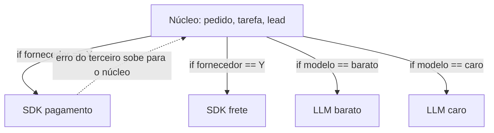
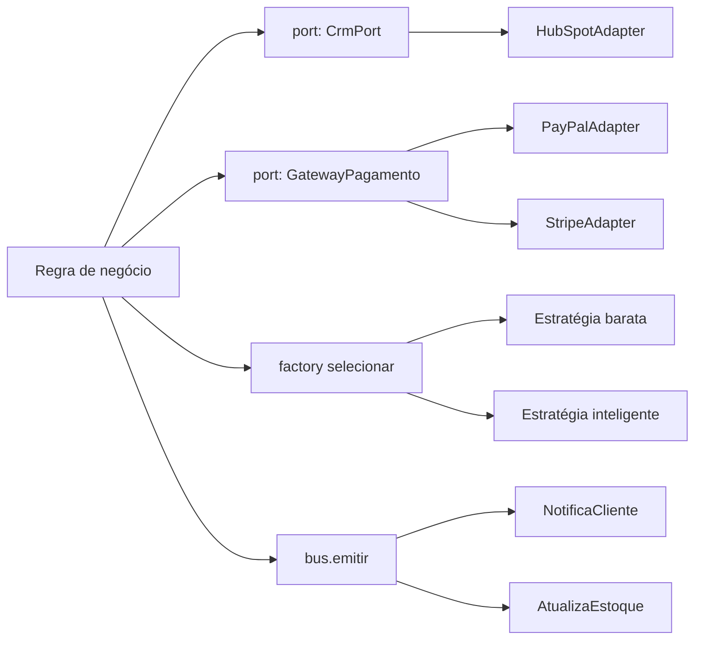
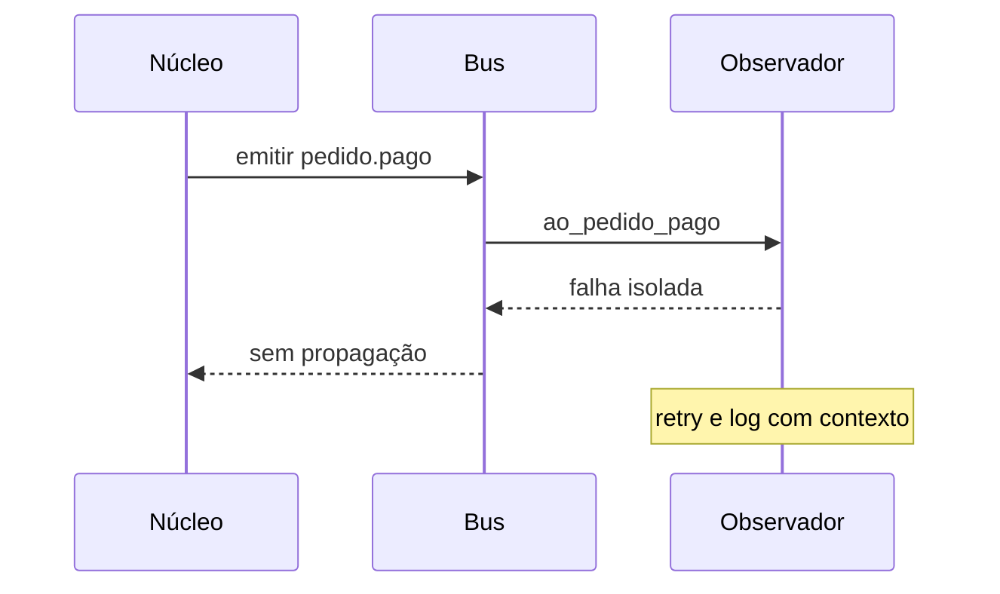

# Deck PDI: Estudo de Design Patterns aplicados ao ecossistema

Área: Engenharia de Software

Como usar este deck: cada slide traz três camadas, título para projeção, fala para quem apresenta
e evidência para quem pergunta "de onde veio esse número". A fala não é lida, é parafraseada; a
evidência é o que responde à coordenação.

## Slide 1: Resumo Executivo
Conclusão do minicurso de Design Patterns com aplicação prática aos problemas reais da operação. Entrego notas com exemplos funcionais de Adapter, Strategy, Observer e Command.
Entrega de evidência técnica: código que já roda no ecossistema.

**Fala:** "Eu não estou entregando um resumo de curso. Estou entregando um vocabulário e um
piloto: o vocabulário para o time parar de discutir 'àquela classe', e o piloto para provar que
novo fornecedor não mexe mais no núcleo."

**Evidência:** três entregas verificáveis: standard escrito, script executável sem infraestrutura
e PR de piloto em 1 handler de CRM.

## Slide 2: Contexto de Produção
Código repetitivo em handlers de webhook e workers.
Sem vocabulário comum: PRs discutem 'àquela classe'.
Oportunidade de aplicar padrões em agentes.

**Fala:** "O sintoma mais caro não é o código repetido, é a conversa travada em revisão: dois
revisores leem o mesmo diff e imaginam arquiteturas diferentes porque não existe nome canônico
para quem traduz o terceiro."

**Evidência:** handlers de webhook, workers de fila e rotinas de seleção de modelo de LLM são os
três pontos onde a variação aparece hoje em cadeia condicional.

## Slide 3: Diagnóstico
Acoplamento a APIs de terceiro espalhado (sem Adapter).
Seleção de modelo de LLM por if/else (sem Strategy).
Logs de domínio sem padrão (sem Observer).

**Fala:** "A causa raiz é uma só: ausência de camada de indireção com nome próprio. O núcleo
conhece assinatura, campo e código de erro de sistemas que pertencem a outras empresas. Isso é
vazamento de abstração, e ele transforma toda mudança externa em deploy nosso."

**Evidência:** inspeção estática do diretório de integrações e mapeamento de toda cadeia `if` que
diferencia fornecedor, modelo ou política.

## Slide 4: Decisão Arquitetural (ADR)
ADR-024: Catálogo de Padrões
| Padrão | Onde | Decisão |
| --- | --- | --- |
| Adapter | CRM/LLM externos | ESCOLHIDO |
| Strategy | roteamento de modelo | ESCOLHIDO |
| Observer | eventos de domínio | ESCOLHIDO |
| Singleton p/ clients | rejeitado (DI) | NÃO |

**Fala:** "O ADR registra o que foi escolhido e, principalmente, o que foi recusado. Singleton
saiu porque gera estado global oculto e teste dependente de ordem; a alternativa é injeção de
dependência na raiz com fake nos testes."

**Evidência:** ADR-024 com contexto, consequências positivas e negativas e alternativas
descartadas (herança de cliente base, dicionário de configuração por string, biblioteca externa
pronta).

## Slide 5: Entregas desta Atividade
DESIGN-PATTERNS-NOTES.md.
patterns_demo.py.
ESTUDO-PLANO.md.

**Fala:** "O standard é o que sobrevive depois que eu saio da sala: escopo, termos, regra
canônica, tabela de decisão, anti-padrões, telemetria e checklist de adesão. O script prova que
os padrões rodam em Python puro, em menos de um segundo, sem credencial."

**Evidência:** `python3 2-code/patterns_demo.py` termina com código de saída zero e imprime o
evento do bus e a estratégia selecionada.

## Slide 6: Validação
Rodar patterns_demo.py.
PR aplicando Adapter no handler de 1 CRM.
Checklist de padrões no template de PR.

**Fala:** "Validação tem critério de aceite, não só lista de desejo: saída zero no script, zero
import de SDK fora do diretório de integrações no diff do piloto, e as três perguntas do template
respondidas. PR que não responde, não passa."

**Evidência:** rollout em sombra por duas janelas consecutivas sem divergência, com rollback por
feature flag, sem deploy reverso.

## Slide 7: Métricas
| SLO | Alvo |
| --- | --- |
| Handlers com Adapter | >= 1 piloto |
| Padrões documentados | criacionais/estruturais/comportamentais |

| Métrica de apoio | Antes | Depois (meta) |
| --- | --- | --- |
| Pontos de toque por fornecedor | ramificação em cada módulo | 1 adapter + factory |
| Cobertura do núcleo sem rede | exige sandbox | fake de port roda em PR |
| Onboarding de fornecedor | ordem de semanas | <= 2 dias |

**Fala:** "Todo número novo desta atividade nasce como meta. Só vira fato depois de duas
medições consecutivas no mesmo instrumento. Métrica medida uma vez é anedota, não tendência."

**Evidência:** instrumento definido antes da meta ser prometida, para não medir com régua
diferente do que foi prometido.

## Slide 8: Riscos
| Risco | Mitigação |
| --- | --- |
| Over-engineering | só onde há variação |
| Padrão como fim | code review foca em valor |
| Factory virando cadeia condicional renomeada | teste de tabela de decisão |
| Observador virando esgoto de regra | observador só reage, não decide |

**Fala:** "O risco mais silencioso é o padrão virar fim em si mesmo. Por isso a regra de
contenção está escrita no standard: sem variação real, não se aplica padrão, e o revisor reprova
padrão sem caso de uso."

**Evidência:** checklist de adesão com item explícito de reprovação para padrão sem variação.

## Slide 9: Próximos Passos
Refatorar handlers de CRM para Adapter.
Roteamento de modelo via Strategy.

**Fala:** "Depois do piloto de CRM vêm StripeAdapter, a factory de roteamento de modelo e o
teste de arquitetura que bloqueia import de SDK no núcleo. O fecho é medir o primeiro onboarding
real e transformar as metas em número."

**Evidência:** quatro PRs consecutivos com o checklist de padrões aplicado (meta) para comprovar
adesão, não só existência do documento.

## Slide 10: Como funciona (arquitetura alvo)

**Fala:** "O núcleo fala um idioma só. Toda fronteira para fora passa por uma port. A escolha
entre algoritmos mora na factory. A reação a um fato mora no bus. Nenhum desses três pontos
depende de um fornecedor específico."

**Evidência:** regra de arquitetura imposta por teste de import proibido, não por memória do
time.

## Slide 11: Matemática da decisão

**Fala:** "A escolha não é gosto. Ela se paga com uma conta simples de pontos de toque."

**Conta fechada (Exemplo numérico):** sejam $F = 6$ fornecedores e $C = 4$ módulos que ramificam.

- Condicionais: $T = F \times C = 6 \times 4 = 24$ pontos de toque.
- Ports e adapters: $T = F + C = 6 + 4 = 10$ pontos de toque.
- Redução: $(24 - 10) / 24 = 58,3$ por cento.

**Custo de oportunidade:** $N = 4$ fornecedores por ano, $\Delta d = 10$ dias por fornecedor,
$C_{dia} = \text{R\$ } 350$ por dia-dev, logo $4 \times 10 \times 350 = \text{R\$ } 14.000$ por
ano devolvidos ao roadmap (meta).

**Risco de erro por mudança:** com $p = 0,15$ de chance de erro por ponto e $k = 6$ pontos
tocados, $P = 1 - 0,85^{6} = 0,623$, ou 62,3 por cento; com $k = 1$, cai para 0,15. Ganho de
$0,623 / 0,15 = 4,2$ vezes menos exposição.

**Evidência:** parâmetros declarados como exemplo numérico; nenhum deles é medição da operação.

## Slide 12: Tradeoffs (matriz)

| Opção | Ganha | Perde | Veredito |
| --- | --- | --- | --- |
| Adapter + port | estabilidade do núcleo, teste com fake | um nível de leitura a mais | ESCOLHIDO |
| Herança de cliente base | menos arquivos no início | hierarquia rígida, troca exige recompilação | rejeitado |
| Dicionário de configuração por string | menos classes | contrato opaco, erro só em runtime | rejeitado |
| Biblioteca de integração pronta | entrega rápida | dependência externa no caminho crítico | rejeitado |
| Broker de mensagens já no piloto | durabilidade e ordem | infra nova antes de provar desacoplamento | adiado |
| Bus in-memory síncrono | simplicidade para provar o padrão | ordem não garantida, acoplamento de processo | adotado no piloto |

**Fala:** "Todo sim tem um não junto. Eu estou aceitando custo de leitura e ordem não garantida
em troca de estabilidade do núcleo e velocidade para provar o desacoplamento de código."

## Slide 13: Falha e recuperação

| Sintome | Causa raiz | Detecção | Mitigação | Recuperação |
| --- | --- | --- | --- | --- |
| Erro 500 no webhook | exceção bruta do SDK no adapter | taxa de erro por rota | mapear para erro de domínio tipado | retry com backoff na borda |
| Emissão duplicada | semântica at-least-once | contador de duplicatas | idempotência por chave | deduplicação em janela |
| Estoque divergente | observador falhou ou mudou de ordem | reconciliação diária | fila durável por observador | reprocessar evento pendente |
| Núcleo degradado | terceiro lento sem timeout | p95 por adapter | timeout, circuit breaker, fallback | desligar fornecedor por flag |

**Fala:** "A regra que ninguém pode quebrar: falha de um observador nunca derruba o emissor. Um
erro de e-mail não pode cancelar a confirmação de um pedido. Se a reação é crítica para o
invariante, ela sai do bus e vira fila durável."

**Evidência:** teste com observador sabotado, que garante que os demais observadores continuam e
o emissor não falha.

## Slide 14: Telemetria

**Fala:** "Padrão sem telemetria é opinião. Cada fronteira nova nasce com suas métricas, com
cardinalidade controlada: nunca identificador de pedido ou de usuário como rótulo."

| Métrica | Cardinalidade | Alerta sugerido |
| --- | --- | --- |
| `integracao.erros_total{adapter,classe}` | baixa e fixa | acima de 1 por cento em 15 min (meta) |
| `integracao.latencia_p95_ms{adapter}` | 1 por adapter | acima de 800 ms por 10 min (meta) |
| `estrategia.escolhas_total{estrategia}` | 1 por estratégia | sem seleção por 30 dias |
| `evento.duplicado_total{tipo}` | 1 por tipo | crescimento sustentado |

## Slide 15: Checklist do sênior (fecho)

**Fala:** "Antes de dizer pronto, quinze perguntas. Se eu não responder a delas, o padrão está
no documento e não no código."

- Toda dependência de terceiro vive atrás de port, sem import de SDK no núcleo.
- A cadeia condicional de escolha está toda na factory, com teste de tabela.
- Todo observador isola erro e nenhuma regra depende da ordem de assinatura.
- Todo adapter traduz erro de terceiro para erro de domínio tipado.
- Existe timeout explícito em toda chamada de rede do núcleo.
- Os ports têm fake e a suíte roda sem credencial e sem rede.
- Nenhum singleton de cliente foi introduzido; tudo entra por injeção de dependência.
- O PR nomeia o padrão e a variação que ele absorve.
- As consequências negativas do ADR-024 foram lidas em voz alta na revisão.
- Nenhum padrão foi aplicado onde não havia variação real.

## Slide 16: Métricas finais e próximos passos

| O que | Quando | Como provo |
| --- | --- | --- |
| PR de piloto de Adapter no CRM | esta sprint (meta) | diff sem import proibido + teste de tabela |
| Roteamento de modelo via Strategy | sprint seguinte (meta) | fábrica com tabela assertada |
| Primeiro onboarding medido pós-piloto | após 1 fornecedor real (meta) | dias entre kickoff e primeiro evento |
| Checklist no template de PR | imediato (meta) | 4 PRs consecutivos com checklist preenchido |

**Fala:** "O fecho é simples: o padrão só existe quando ele aparece em PR, em métrica e em
onboarding medido. Enquanto isso é documento, é intenção."

**Evidência:** dossiê completo no relatório da atividade e o script executável em qualquer
máquina, sem infraestrutura.
