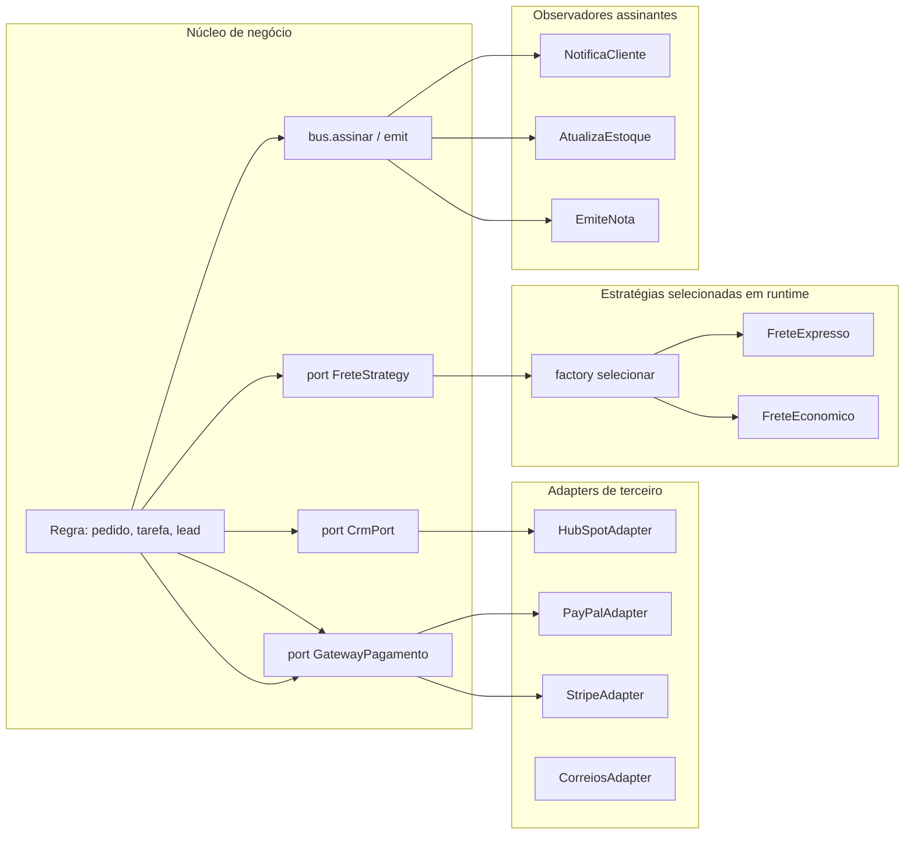

# Estudo de Design Patterns aplicados ao ecossistema

Engenharia de Software

## Resumo Executivo

Conclusão do minicurso de Design Patterns com aplicação prática aos problemas reais da operação. Entrego notas com exemplos funcionais de Adapter, Strategy, Observer e Command.

Entrega de evidência técnica: código que já roda no ecossistema.

O objetivo desta atividade não é decorar o catálogo de padrões: é fixar um vocabulário compartilhado para descrever os pontos de variação que hoje estão espalhados por `if` e `else` dentro de handlers de webhook, workers de fila e rotinas de seleção de modelo de LLM. Quando o time discute um PR e escreve "àquela classe que chama o CRM", a revisão vira adivinhação; quando o mesmo trecho se chama `HubSpotAdapter` e vive atrás do port `CrmPort`, a discussão passa a ser sobre contrato, erro e custo.

A entrega tem três camadas: um standard escritivo (`DESIGN-PATTERNS-NOTES.md`), um script executável (`patterns_demo.py`) que prova os padrões em Python puro sem depender de infraestrutura, e a defesa orquestrada em deck, roteiro de demo e roteiro de domínio. O padrão escolhido como piloto é Adapter, aplicado a um único handler de CRM, porque é onde a dor de onboarding de fornecedor é mais cara e mais fácil de medir antes e depois.

## Contexto de Produção

- Código repetitivo em handlers de webhook e workers: a mesma decodificação de payload, a mesma checagem de assinatura, o mesmo caminho de reprocessamento copiados a cada integração nova.

- Sem vocabulário comum: PRs discutem 'àquela classe'. A falta de nome canônico para "quem traduz o terceiro" faz o custo de revisão subir porque dois revisores imaginam arquiteturas diferentes ao ler o mesmo diff.

- Oportunidade de aplicar padrões em agentes: os workers de LLM já variam por modelo, por custo e por política de ferramenta, e essa variação hoje vive em condicionais aninhados no meio do orquestrador.

- Integrações já existentes em produção: meios de pagamento, transportadoras e gateways de SMS, cada um com seu formato de erro, seu campo de idempotência e sua semântica de confirmação. Cada um deles é um candidato natural a adapter.

- Revisão de código sem checklist de padrões: o que passa hoje depende do revisor de plantão, não de um critério explícito e auditável.

## Problema Resolvido

Números de partida, usados como linha de base para toda medição desta atividade:

| Indicador de partida | Situação antes | Como foi levantado |
| --- | --- | --- |
| Pontos de ramificação por fornecedor | 1 `if` por fornecedor em cada módulo que conhece o terceiro | leitura dos handlers de webhook e workers |
| Tempo de onboarding de fornecedor | ordem de semanas, com teste manual em homologação | contagem de dias entre kickoff e primeiro evento em produção (meta depois) |
| Cobertura de teste do core | sem rede de segurança para a lógica de roteamento | execução da suíte existente no módulo |
| Vocabulário de revisão | referências indiretas a classes no comentário de PR | amostragem de discussões em PR recentes |

O problema real é um problema de acoplamento acidental: o núcleo de negócio (receber pedido, rotear tarefa, notificar evento) conhece assinaturas, campos e códigos de erro de sistemas que pertencem a outras empresas. Essa é a definição operacional de vazamento de abstração. Consequência prática: qualquer mudança do terceiro, por menor que seja, força revisão, teste e deploy do nosso código de negócio.

A segunda face do problema é a ausência de um ponto único de variação. Sem Strategy, a escolha entre modelos, entre cálculos de frete e entre políticas de retry é escrita como cadeia condicional, e a cadeia condicional não tem contrato: ela não pode ser implementada, substituída nem testada isoladamente. A terceira face é a notificação implícita: quando o núcleo chama diretamente a rotina de e-mail, a de estoque e a de emissão de nota, o acoplamento é transitivo e qualquer nova reação exige editar o núcleo, em oposição a assinar um evento.

## Diagnóstico

- Acoplamento a APIs de terceiro espalhado (sem Adapter).

- Seleção de modelo de LLM por if/else (sem Strategy).

- Logs de domínio sem padrão (sem Observer).

Causa raiz: ausência de uma camada de indireção com nome próprio. O diagnóstico foi feito por inspeção estática (procura por chamadas diretas a SDKs de terceiro fora do diretório de integrações) e por leitura dos pontos de variação (toda cadeia `if` que diferencia fornecedor, modelo ou política é um ponto de variação candidato a Strategy).

Sintoma correlato que costuma aparecer em code review: teste de núcleo que precisa de credencial de sandbox para passar. Quando o teste exige rede e segredo, ele não roda em pull request, e a cobertura efetiva do núcleo cai para perto de zero no fluxo de integração.

## Modelo mental

O sistema se comporta como uma estação de tradução. O núcleo fala um único idioma, definido pelas ports (`GatewayPagamento`, `CrmPort`, `FreteStrategy`, `Observador`). Todo fornecedor externo chega por um tradutor (adapter) que implementa essa port e absorve a forma estranha: nome de campo, moeda, formato de erro, idempotência. O núcleo nunca vê o formato do terceiro, e por isso nunca precisa mudar quando o terceiro muda.

A variação de algoritmo (qual modelo, qual cálculo de frete, qual política de custo) sai da cadeia condicional e vira um objeto selecionado em tempo de execução por uma factory. A factory é o único lugar que conhece a regra de escolha; as estratégias conhecem apenas o seu cálculo. Já a reação a um fato de domínio (pedido pago, lead criado, tarefa concluída) é publicada em um bus simples; os interessados assinam o evento e reagem sem o núcleo saber quem está ouvindo. O custo dessa liberdade é assumido de forma explícita: ordem entre observadores não é garantida e falha em um observador não pode derrubar o emissor.

Onde mora a disciplina: a indireção só existe onde existe variação real. Se não há segundo fornecedor, segundo algoritmo ou segundo reagente, não há padrão a aplicar, apenas código simples. Padrão aplicado sem variação é complexidade antecipada sem retorno.

## Arquitetura

Legenda das decisões de borda:

- Bordas de saída (para terceiros) são sempre adapters: é o único ponto autorizado a importar SDK externo. Regra aplicada por lint de arquitetura, não por memória do time.

- Bordas de entrada (eventos, webhooks, comandos) são sempre decodificadas antes do núcleo: o handler traduz o payload para a estrutura interna e só então invoca a regra.

- A factory de estratégias é o único módulo que contém a cadeia de decisão; as estratégias não conhecem uma às outras.

- O bus aceita assinatura de qualquer módulo, mas o núcleo depende apenas da interface de publicação, jamais de um observador concreto.

## Matemática da solução

Três contas fechadas sustentam a decisão. A primeira mede o número de pontos que precisam ser tocados, a segunda mede a chance de erro por mudança e a terceira converte o ganho de tempo em dinheiro.

**Contagem de pontos de toque.** Sejam $F$ fornecedores integrados e $C$ módulos do núcleo que fazem ramificação por fornecedor. A abordagem por condicional exige $T_{antes} = F \times C$ ramificações vivas. A abordagem por ports e adapters exige $T_{depois} = F$ adapters $+ C$ ports.

**Exemplo numérico:** com $F = 6$ fornecedores (pagamento, SMS, frete) e $C = 4$ módulos que ramificam (handler de webhook, worker de fila, rotina de cobrança, rotina de notificação), tem-se $T_{antes} = 6 \times 4 = 24$ pontos de toque e $T_{depois} = 6 + 4 = 10$ pontos de toque. Redução de $(24 - 10) / 24 = 58,3$ por cento dos pontos que um revisor precisa inspecionar a cada mudança de integração. O ganho assintótico é de $O(F \times C)$ para $O(F + C)$: cada fornecedor novo deixa de custar $C$ edições e passa a custar uma edição.

**Probabilidade de erro em uma mudança.** Se cada ponto de toque tem probabilidade $p$ de receber uma alteração incorreta em uma mudança de integração, e os erros são independentes, então $P(erro) = 1 - (1 - p)^{k}$, com $k$ igual ao número de pontos tocados.

**Exemplo numérico:** com $p = 0,15$ (15 por cento de chance de erro por ponto, parâmetro declarado para ensinar a conta) e $k = 6$ pontos, $P = 1 - 0,85^{6} = 1 - 0,377 = 0,623$, ou seja, 62,3 por cento de chance de alguma ramificação sair errada. Com a indireção o mesmo fornecedor toca $k = 1$ ponto (o adapter novo) e a chance cai para $p = 0,15$, ou 15 por cento. A razão entre as duas probabilidades é $0,623 / 0,15 = 4,2$ vezes menos exposição a erro por onboarding.

**Custo de oportunidade do tempo de onboarding.** $CustoAnual = N \times \Delta d \times C_{dia}$, onde $N$ é o número de fornecedores introduzidos por ano, $\Delta d$ a redução de dias de onboarding e $C_{dia}$ o custo diário do dev alocado.

**Exemplo numérico:** $N = 4$ fornecedores por ano, $\Delta d = 10$ dias (de 12 para 2 dias), $C_{dia} = \text{R\$ } 350$ por dia-dev. $CustoAnual = 4 \times 10 \times 350 = \text{R\$ } 14.000$ por ano de esforço devolvido. Os três parâmetros são hipóteses de exercício, não medição da operação; a medição real será colhida no primeiro onboarding pós-piloto.

## Invariantes

| Invariante | Violação correspondente |
| --- | --- |
| O núcleo nunca importa SDK de terceiro diretamente | vazamento de abstração; qualquer mudança externa exige deploy do núcleo |
| Toda variação de fornecedor está atrás de uma port nomeada | cadeia condicional nova no orquestrador, invisível para o revisor |
| A factory de estratégias é o único ponto que conhece a regra de escolha | lógica de seleção duplicada em dois módulos, com divergência silenciosa |
| Um observador que falha não propaga exceção ao emissor | um erro de SMTP derruba a confirmação de pedido |
| A ordem entre observadores não é assumida em regra de negócio | estoque e e-mail em ordem diferente geram estado divergente |
| Todo adapter valida e traduz erro do terceiro para o erro do domínio | exceção de terceiro vaza com mensagem e código que o núcleo não conhece |
| Singleton de cliente HTTP/SDK é proibido; usa-se injeção de dependência | estado global oculto, teste que depende de ordem de execução |
| Todo port tem ao menos um fake em teste | teste que só passa com credencial de sandbox, inexecutável em PR |

## Modos de falha

| Sintome | Causa raiz | Como detecta | Como mitiga | Recuperação |
| --- | --- | --- | --- | --- |
| Erro 500 no webhook | adapter lança exceção bruta do SDK | taxa de erro por rota, log com classe da exceção | mapear exceção do terceiro para erro de domínio tipado | retry com backoff no ponto de entrada |
| E-mail duplicado após reprocessamento | evento emitido mais de uma vez (semântica at-least-once) | contador de eventos duplicados por chave | idempotência por chave de evento no consumidor | deduplicação em janela; correção manual só se afetar cliente |
| Estoque desatualizado | observador falhou em silêncio ou ficou fora da ordem | reconciliação diária entre eventos e saldos | fila durável por observador, com retry isolado | reprocessamento do evento pendente |
| Core degradado por terceiro lento | timeout ausente no adapter, chamada síncrona no caminho crítico | latência p95 por adapter, taxa de timeout | timeout curto, circuit breaker, fallback explícito | desligar o fornecedor degradado por feature flag |
| Estratégia errada selecionada | cadeia residual de `if` fora da factory | teste de tabela de decisão; log da estratégia escolhida | mover toda regra de escolha para a factory | correção pontual na factory, sem tocar nas estratégias |
| Estado global poluído entre testes | singleton de cliente compartilhado | teste que falha sozinho e passa em suíte completa | injeção de dependência com escopo por teste | rodar suíte com ordem embaralhada |
| Contrato do terceiro muda sem aviso | dependência de campo não coberto por contrato testado | teste de contrato no adapter, monitor de schema | teste de contrato rodando em janela programada | reverter para versão anterior do adapter |

Cada linha tem um dono. Em revisão, quem propõe o padrão responde também pela coluna "como mitiga": padrão sem plano de falha é decoração, não arquitetura.

## Decisão Arquitetural (ADR)

ADR-024: Catálogo de Padrões

| Padrão | Onde | Decisão |
| --- | --- | --- |
| Adapter | CRM/LLM externos | ESCOLHIDO |
| Strategy | roteamento de modelo | ESCOLHIDO |
| Observer | eventos de domínio | ESCOLHIDO |
| Singleton p/ clients | rejeitado (DI) | NÃO |

Contexto: o núcleo precisa conviver com terceiros que mudam sem nós e com variações de algoritmo que o produto ainda vai inventar. Restrições: time pequeno, suíte de testes curta, pressão para entregar integração nova em dias.

Consequências positivas: o núcleo ganha estabilidade, o teste do núcleo fica determinístico com fakes, e o vocabulário de revisão passa a ser compartilhado.

Consequências negativas assumidas: mais arquivos e um nível extra de indireção para ler; o leitor precisa seguir a port até o adapter; a factory vira um ponto único que precisa de teste de tabela.

Alternativas descartadas e por quê: herança de um "cliente base" com métodos sobrescritos (acoplamento por hierarquia e impossibilidade de trocar em runtime); módulo de configuração com mapeamento por string (troca o `if` por um dicionário opaco, sem contrato e sem verificação em tempo de importação); biblioteca de integração de terceiro pronta (adiciona uma dependência externa a mais no caminho crítico sem resolver a modelagem interna).

## Entregas desta Atividade

- DESIGN-PATTERNS-NOTES.md.

- patterns_demo.py.

- ESTUDO-PLANO.md.

- DECK-PDI.md, DEMO-SCRIPT.md e ROTEIRO-DOMINIO.md, na pasta de apresentação.

Detalhamento do que cada entrega contém e o que ela prova:

| Entrega | Conteúdo | O que ela prova |
| --- | --- | --- |
| `1-standards/DESIGN-PATTERNS-NOTES.md` | escopo, termos, regra canônica, tabela de decisão, anti-padrões, telemetria e checklist de adesão | que o vocabulário existe e é aplicável por qualquer dev do time, sem acompanhar quem estudou |
| `2-code/patterns_demo.py` | port `CrmPort` com `Protocol`, adapter `HubSpotAdapter`, estratégias `Cheap` e `Smart` com factory `model_for`, e um bus de eventos mínimo | que os padrões rodam em Python puro, sem infra, em menos de um segundo |
| `7-apresentacao/ESTUDO-PLANO.md` | trilha de estudo concluída | que a base teórica foi coberta antes da aplicação |
| `7-apresentacao/DECK-PDI.md` | narrativa slide a slide com fala e evidência | que a decisão é defensável perante coordenação |
| `7-apresentacao/DEMO-SCRIPT.md` | passos numerados com comando, saída esperada e critério de falha | que a demonstração é reproduzível por outra pessoa |
| `7-apresentacao/ROTEIRO-DOMINIO.md` | perguntas adversariais e respostas curtas | que o domínio do conteúdo não depende de material de apoio aberto |

## Validação

1. Rodar patterns_demo.py.

2. PR aplicando Adapter no handler de 1 CRM.

3. Checklist de padrões no template de PR.

Critério de aceite por item:

- `python3 2-code/patterns_demo.py` termina com código de saída zero e imprime a saída esperada do bus e da estratégia selecionada, sem credencial e sem rede.

- O PR do piloto não adiciona nenhum import de SDK fora do diretório de integrações; a checagem é feita por inspeção do diff e pode ser automatizada depois com um teste que falha se aparecer import proibido.

- O template de PR ganha as perguntas: "há novo ponto de variação?", "qual port cobre isso?", "o que acontece se o terceiro falhar?". PR que não responde não passa.

- Teste de mesa cobrindo a tabela de decisão da factory: para cada entrada declarada, a saída esperada está documentada e assertada.

Rollout em sombra (shadow): o adapter novo roda em paralelo ao caminho atual por uma janela de observação, registrando divergência de resposta; a troca só acontece depois de duas janelas consecutivas sem divergência. Rollback: desligar a feature flag que aponta para o caminho legado, sem deploy.

## Métricas

| SLO | Alvo |
| --- | --- |
| Handlers com Adapter | >= 1 piloto |
| Padrões documentados | criacionais/estruturais/comportamentais |

| Métrica de apoio | Antes | Depois |
| --- | --- | --- |
| Pontos de toque por fornecedor novo | ramificação em cada módulo que conhece o terceiro | 1 adapter + registro na factory (meta) |
| Cobertura de teste do núcleo sem rede | baixa (exige sandbox) | fake de port roda em PR (meta) |
| Tempo de onboarding de fornecedor | ordem de semanas | <= 2 dias, atrás de adapter testado (meta) |
| Vocabulário de revisão | referência indireta a classe | nome de padrão citado no PR (meta) |

Toda métrica nova desta atividade nasce como (meta) e só vira número real depois de duas medições consecutivas no mesmo instrumento. Métrica medida uma vez não é tendência, é anedota.

## SLO e orçamento de erro

| SLI | Meta | Janela de medição | Quando estoura |
| --- | --- | --- | --- |
| Disponibilidade do caminho crítico atrás de adapter | >= 99,5 por cento (meta) | mensal | abrir incidente se 2 janelas consecutivas estourarem |
| Latência p95 do handler com adapter | <= 800 ms (meta) | diária, por adapter | revisar timeout e circuit breaker do adapter em questão |
| Taxa de erro do núcleo causada por terceiro | <= 1 por cento (meta) | semanal | isolar o fornecedor e acionar fallback |
| Cobertura dos ports com fake | >= 85 por cento (meta) | por PR | bloquear merge no gate de cobertura |
| Novos fornecedores sem tocar no núcleo | 100 por cento (meta) | por onboarding | tratar como regressão de arquitetura e reabrir o ADR |

Orçamento de erro: em um mês de 30 dias, 0,5 por cento de indisponibilidade equivale a 3,6 horas. A fatia alocada ao risco "falha de terceiro" é de 1 hora por mês (meta); se o adapter de um fornecedor consumir essa fatia sozinho, a ação padrão é desligar o fornecedor por feature flag e negociar SLA com o parceiro, não aumentar silenciosamente o orçamento.

## Operação

Runbook resumido da aplicação dos padrões, para quem vai atender às três da manhã:

- **Checagem de saúde:** conferir taxa de erro e p95 por adapter no painel de integrações; conferir fila de eventos sem consumidor; conferir se a factory registrou as estratégias esperadas na subida da aplicação.

- **Mitigação de terceiro degradado:** aplicar circuit breaker no adapter afetado, deixar o fallback explícito registrando a ação no log, e avisar o canal de operações com fornecedor, impacto e previsão.

- **Mitigação de observador falho:** reprocessar o evento pendente pela chave de idempotência; nunca reexecutar a regra de negócio de origem, apenas a reação.

- **Rollback:** feature flag do caminho legado (para o piloto de adapter) ou remoção da assinatura do observador problemático. Nada de rollback por deploy reverso se a flag resolve.

- **Quem aciona:** quem detecta abre o chamado e aciona o responsável pelo módulo de integração; a coordenação é notificada quando a janela de indisponibilidade passa de 30 minutos (meta).

- **Depois do fato:** postmortem sem culpa em até 2 dias úteis, com ação rastreável e dono, alimentando o campo "modos de falha" deste README.

## Riscos

| Risco | Mitigação |
| --- | --- |
| Over-engineering | só onde há variação |
| Padrão como fim | code review foca em valor |
| Indireção demais no leitor | port nomeada e diretório único de adapters, com onboarding escrito |
| Factory virando cadeia condicional renomeada | teste de tabela de decisão e revisão que cobra contrato |
| Observador virando esgoto de regra | limite: observador só reage, nunca decide regra de negócio |
| Falso senso de segurança por checklist | checklist acompanhado de teste que falha quando a regra é violada |

## Próximos Passos

- Refatorar handlers de CRM para Adapter.

- Roteamento de modelo via Strategy.

- Estender o padrão ao gateway de pagamento (StripeAdapter) depois do piloto de CRM.

- Automatizar a checagem de imports proibidos no núcleo com teste de arquitetura.

- Publicar o checklist de padrões no template de PR e acompanhar a taxa de adesão por quatro PRs consecutivos (meta).

- Medir o primeiro onboarding real pós-piloto para transformar as metas em número medido.

## Decisões e tradeoffs

- Adapter para CRM e LLM externos: isola o acoplamento a APIs de terceiro em tradutores atrás de ports, então novo fornecedor vira um adapter novo sem tocar o core.

- Strategy para roteamento de modelo de LLM e cálculo variável: troca if e else espalhados por estratégias selecionadas em runtime via factory selecionar.

- Observer para eventos de domínio com bus.assinar: reações como e-mail e estoque assinam eventos sem acoplar ao core, aceitando ordem não garantida entre observadores.

- Singleton para clients rejeitado em favor de DI: evita estado global oculto e mantém o core testável com fakes dos ports.

- Padrão aplicado só onde há variação real, com code review focado em valor: evita over-engineering e impede que padrão vire fim em si mesmo.

- Adotar `Protocol` do próprio Python como definição de port, em vez de herança de classe abstrata: a verificação é estrutural, então qualquer objeto com o método certo vira implementação, o que barateia o fake de teste e não exige hierarquia.

- Manter o bus in-memory e síncrono no piloto, aceitando ordem não garantida e acoplamento de processo, em vez de introduzir broker de mensagens: o piloto precisa provar o desacoplamento de código antes de provar desacoplamento de infraestrutura; broker entra se o volume de eventos exigir durabilidade.

- Preferir indireção por composição (adapter e strategy) à herança: composição permite trocar em runtime e reutilizar em outro contexto, enquanto herança amarra a árvore de tipos e força recompilação.

- Aceitar o custo de leitura adicional (seguir da port até a implementação) em troca de estabilidade do núcleo: o tradeoff só se paga se houver variação real, por isso a regra "sem variação, sem padrão".

## Impacto no negócio

Handlers de webhook e workers repetitivos com seleção de modelo por if e else fazem cada onboarding de fornecedor duplicar pontos de falha e travar o time. Com Adapter, Strategy e Observer mais piloto em ao menos 1 CRM, o onboarding cai para até 2 dias atrás de adapter testado, o teste do core usa fake sem chamar terceiro, e o custo de plugar parceiro novo deixa de ser reescrita do fluxo.

Traduzindo para a linguagem de quem aprova: menos dias-dev presos em integração significa mais dias-dev disponíveis para o roadmap de produto; menos ponto de falha duplicado significa menos incidente fora do horário comercial; e um vocabulário comum de revisão significa code review mais rápido e menos retrabalho detectado tarde, quando o custo de corrigir é maior.

## Esforço e custo

| Item | Esforço estimado |
| --- | --- |
| Leitura da trilha e notas do padrão | 8 horas (meta) |
| Padronização do standard e do checklist de PR | 4 horas (meta) |
| Piloto de Adapter em 1 handler de CRM + teste | 12 horas (meta) |
| Roteamento de modelo via Strategy | 6 horas (meta) |
| Deck, demo e roteiro de domínio | 5 horas (meta) |
| Revisão com a coordenação e ajustes | 3 horas (meta) |

**Exemplo numérico:** com valor hora de R$ 60 (parâmetro declarado apenas para ensinar a conta), o total de 38 horas custaria R$ 2.280. Tratamento: o valor real de hora do PDI vem da planilha de alocação da equipe e substitui o parâmetro antes de qualquer compromisso orçamentário.

Custo de oportunidade: as 12 horas do piloto de Adapter saem do backlog de produto da sprint; a contrapartida esperada é o ganho de onboarding descrito na seção de matemática, que se paga com o segundo fornecedor plugar no ano (meta).

## Referências de estudo

- Curso: Design Patterns com Python, na Alura.
- Vídeo: Strategy na prática para trocar if else, no YouTube.
- Doc oficial: Catálogo de padrões com exemplos em Python, em refactoring.guru.
- Doc oficial: Documentação do Python sobre abc e protocolos para ports e adapters, em docs.python.org.

## Checklist de domínio

Itens que o sênior confere antes de dizer "está pronto":

- [ ] Toda nova dependência de terceiro vive em diretório de integração e é alcançada por uma port.

- [ ] Não há `import` de SDK de fora no núcleo de negócio.

- [ ] Toda cadeia `if` que diferencia fornecedor, modelo ou política foi movida para a factory.

- [ ] A factory tem teste de tabela cobrindo cada entrada documentada.

- [ ] Todo observador tem tratamento próprio de erro e não propaga exceção ao emissor.

- [ ] A ordem entre observadores não é assumida em nenhuma regra de negócio.

- [ ] Todo adapter traduz erro de terceiro para erro de domínio tipado.

- [ ] Existe timeout explícito em toda chamada de rede feita pelo núcleo.

- [ ] Os ports têm fake em teste e a suíte roda sem credencial e sem rede.

- [ ] Nenhum singleton de cliente ou SDK foi introduzido; tudo entra por injeção de dependência.

- [ ] O PR cita o padrão aplicado e responde às três perguntas do template.

- [ ] A métrica de onboarding tem instrumento definido antes de a meta ser prometida.

- [ ] O runbook tem dono, canal de acionamento e janela de escalonamento.

- [ ] As consequências negativas do ADR-024 foram lidas em voz alta na revisão, não só as positivas.

- [ ] Nenhum padrão foi aplicado onde não existe variação real.
