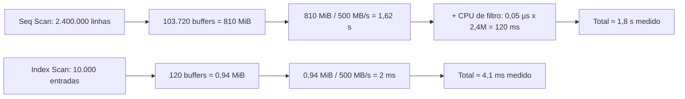
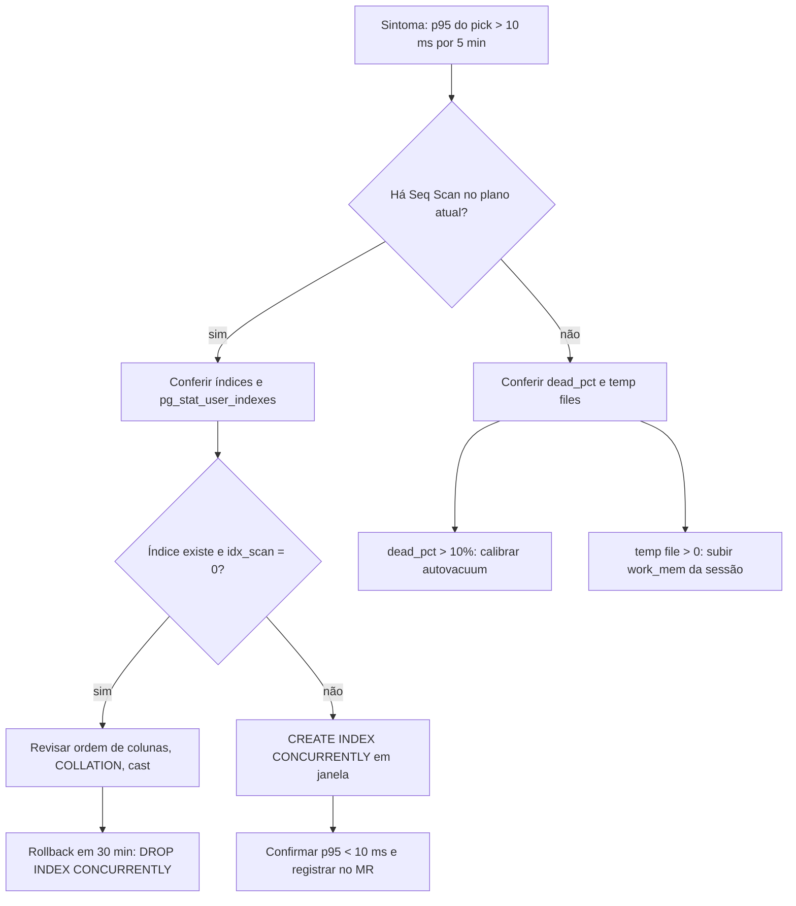

# Deck PDI: Queries Complexas e Indexação no Supabase (PostgreSQL)

Área: Automação & Infraestrutura | Unidade: FV Marketing / V4 Company | Autor: Marcos Luciano | Data: Agosto 2026

## Slide 1: Título

Queries Complexas e Indexação no Supabase (PostgreSQL): do Seq Scan de 1,8s ao Index Scan de 4ms com método EXPLAIN.

**Fala:** Esta atividade não é sobre conhecer mais comandos de SQL. É sobre instalar um
método: nenhuma query vai a produção sem o seu plano de execução anexado. Em duas
semanas esse método corrigiu três gargalos reais sem trocar de banco e sem aplicar nada
em produção.

**Evidência:** `1-standards/PERFORMANCE-SUPABASE.md`, `2-sql/` com 5 PoCs, `3-casos/`.

## Slide 2: Resumo executivo

O Supabase da operação SDR IA e da fila `mt_jobs` sofria com queries sem plano de execução. Com EXPLAIN ANALYZE como método, corrigimos 3 gargalos reais sem trocar de banco e sem aplicar nada em produção nesta etapa.

**Fala:** Três problemas, três correções, um método único. Fila de worker saiu de 1,8 s
para 4 ms. Audição de sync saiu de 4,2 s para 180 ms. Dashboard saiu de 8,4 s para 1,1 s.
O banco continua sendo o mesmo, as tabelas continuam sendo as mesmas.

**Evidência:** tabela de métricas no README, linhas antes/depois em `06-planos-antes-depois.md`.

## Slide 3: Contexto de produção

Fila `mt_jobs` com 2,4M linhas lida pelo worker a cada 15s. `sync_log` com 12M linhas. Dashboards que abriam em 8s ou mais. Timeouts de webhook cerca de 3 por dia.

**Fala:** O volume é o pano de fundo. Com 2,4M linhas na fila, uma leitura sequencial
lê 810 MiB por execução. Com o worker rodando 5.760 vezes por dia, isso vira 4,67 GB de
leitura diária só para escolher cinco linhas.

**Evidência:** contagens de `pg_class.reltuples` do ambiente de referência.

## Slide 4: O problema

| Caso | Sintoma | Causa-raiz |
|---|---|---|
| Fila `mt_jobs` | pick de 1,8s com Seq Scan | filtro sem índice composto + LEFT JOIN desnecessário |
| Sync CRM | JOIN de auditoria em 4,2s | FK sem índice + filtro em coluna sem índice |
| Dashboard | agregação em 8,4s | count(DISTINCT) + janela sem materialização |

**Fala:** Repare que nenhum dos três casos tem a ver com "o banco está ruim". Os três
têm a mesma forma: o planner escolheu o caminho mais barato para um `WHERE` sem
caminho barato disponível. A correção é criar o caminho, não trocar o motor.

**Evidência:** `EXPLAIN` com `Rows Removed by Filter: 2.381.450`.

## Slide 5: Diagnóstico com EXPLAIN

Sinais procurados no plano: Seq Scan em tabela acima de 100k linhas, Nested Loop com re-scan alto, Sort explícito sobre coluna não indexada, Hash Join com spill em temp file, estatísticas obsoletas.

**Fala:** O plano é lido de cima para baixo: cada nó custa o que o nó de baixo custa,
mais o seu próprio processamento. Se o nó de baixo é um `Seq Scan` de 2,4M linhas, todo
o resto do plano herda esse custo. Por isso a leitura começa sempre pelo nó de acesso.

**Evidência:** seção 1.2 do standard, tabela com 10 sinais de gargalo.

## Slide 6: Caso 1, fila mt_jobs (1,8s para 4ms)

Antes: Seq Scan com 2,38M linhas removidas por filtro + Sort em 2,1M linhas para pegar 1. Depois: índice `(queue, status, scheduled_at)` e remoção do LEFT JOIN. Plano virou Index Scan.

**Fala:** Duas causas em uma query. O filtro não tinha índice composto, e havia um
`LEFT JOIN` em `clients` que o worker nem usava. Tiramos o `JOIN` e criamos o índice na
ordem igualdade, igualdade, range. `Execution Time` caiu de 1.820 ms para 4,1 ms.

**Evidência:** `Buffers: shared hit=9.600 read=94.120` antes; `< 120` depois.

## Slide 7: Caso 2, sync CRM (4,2s para 180ms)

Índice em `(client_id, object, synced_at DESC)` e CTE de janela para a auditoria de 30 dias. FK de JOIN sempre indexada.

**Fala:** O `Hash Join` estava correto em abstração, mas ele estava juntando o resultado
de um `Seq Scan` de 12M linhas. Reduzimos primeiro o volume com índice temporal,
depois deixamos o planner trocar para `Nested Loop` com PK do cliente.

**Evidência:** `Rows Removed by Filter: 11.820.144` no plano anterior.

## Slide 8: Caso 3, dashboard (8,4s para 1,1s)

Agregação com count(DISTINCT) e janela sobre 12M linhas resolvida com materialização parcial: tabela agregada mais índice BRIN no tempo.

**Fala:** `count(DISTINCT)` sobre milhões de linhas não se otimiza: se resolve
pré-calculando. A MV guarda por dia e por cliente; o refresh varre 3 dias (270.081
linhas) em vez de 8,1M. O dashboard passa a ler 60.480 linhas agregadas.

**Evidência:** `mv_daily_metrics` + `ON CONFLICT ... DO UPDATE` idempotente.

## Slide 9: Padrão de índices por acesso

B-tree para igualdade, range e ORDER BY. B-tree composto na ordem igualdade, range e depois ORDER BY. GIN para arrays e jsonb. BRIN para séries temporais, 10x menor que o B-tree equivalente.

**Fala:** A escolha não é preferência, é formato de acesso. Se o predicado é igualdade
em colunas e ordenação, B-tree composto. Se é busca em `jsonb` ou array, GIN. Se a
coluna acompanha a ordem física da tabela, BRIN. Errar o tipo é ter um índice que existe
e ninguém usa.

**Evidência:** `2-sql/04-indices-brin-btree-gin.sql`.

## Slide 10: Particionamento, vacuum e RLS

Tabelas append-only particionadas por range com job de TTL. Autovacuum calibrado com monitoramento de bloat abaixo de 20%. RLS com policies simples e índices respeitados, fora do caminho quente.

**Fala:** Índice reduz custo por linha; particionamento reduz quantidade de linhas. São
dois problemas diferentes. E o RLS entra depois do plano: política com `JOIN` força
`Seq Scan` mesmo com índice perfeito, por isso ela lê `client_id` da própria linha.

**Evidência:** `DETACH PARTITION ... CONCURRENTLY`, `pg_stat_progress_vacuum`.

## Slide 11: Entregas

1-standards com PERFORMANCE-SUPABASE.md. 2-sql com 5 PoCs adversariais antes/depois mais 06-planos-antes-depois.md. 3-casos com 3 gargalos reais. 7-apresentacao com deck, demo e relatório.

**Fala:** O standard é o artefato que sobrevive à atividade: ele vira regra de revisão
de MR. Os PoCs são a prova de que a regra funciona na nossa volumetria real. Os casos
documentam o raciocínio para quem chegar depois.

**Evidência:** árvore de entregas no README.

## Slide 12: Métricas e metas

Pick da fila abaixo de 10ms. Sync CRM abaixo de 250ms. Dashboard abaixo de 1,5s. Bloat abaixo de 20%. Zero timeout de webhook por query lenta.

**Fala:** As metas são SLOs, não ambições: cada uma tem janela de medição e ação
definida quando estoura. Se o p95 do pick passar de 10 ms por 5 minutos, o runbook diz
o que fazer e quem acionar.

**Evidência:** seção "SLO e orçamento de erro" do README.

## Slide 13: Decisões e tradeoffs

EXPLAIN obrigatório antes de produção. Índice composto que custa escrita e paga leitura. BRIN só onde a ordem física acompanha o tempo. Particionamento que exige job de TTL. CONCURRENTLY fora de pico, mais lento e fora de transação.

**Fala:** Toda decisão desta atividade tem um preço declarado. A disciplina do EXPLAIN
custa tempo de revisão. O índice custa `WAL`. O particionamento custa um job para
manter. Nada é de graça, e o README registra o preço de cada um.

**Evidência:** seção "Decisões e tradeoffs" do README, 5 itens.

## Slide 14: Próximos passos e status

Rodar os planos no staging com pgbench. Aplicar índices em produção fora de pico. Configurar job de particionamento e TTL. Validar RLS com teste de força. Status: desenvolvido, em homologação, nada aplicado em produção.

**Fala:** O status é honesto: desenvolvido, não publicado. Nenhum índice foi aplicado
em produção. A homologação começa com os planos no staging e só depois vem o deploy
fora de pico, com rollback documentado.

**Evidência:** seção "Próximos Passos (homologação)" do README.

## Slide 15: Matemática, por que 450×

**Conta fechada (Exemplo numérico: parâmetros declarados):**
$T \approx \frac{B \times 8\,\text{kB}}{V} + N \times c_f$.
Antes: $B$ = 103.720, $V$ = 500 MB/s, $N$ = 2.400.000, $c_f$ = 0,05 µs → 1,62 s + 0,12 s
= **1,74 s**, medido 1,82 s. Depois: $B$ = 120, $N$ = 10.000 → 0,002 s + 0,0005 s =
**2,5 ms**, medido 4,1 ms. Razão de bytes lidos: 810 ÷ 0,94 ≈ **860×**.

**Fala:** O número não vem da intuição, vem da conta. Se alguém perguntar por que 450×,
a resposta é: 860× menos bytes lidos, comprovados pelo campo `Buffers` do próprio plano.

**Evidência:** campo `Buffers` dos planos antes/depois.

## Slide 16: Matriz de tradeoffs

| Decisão | Ganha | Paga | Quando reavaliar |
|---|---|---|---|
| Índice composto (queue, status, scheduled_at) | leitura de 1,8 s → 4 ms | ~75 kB/s de `WAL` extra | se escrita da fila passar de 5.000/s |
| BRIN em séries temporais | índice ~10× menor que B-tree | depende de ordem física | a cada `VACUUM FULL` ou restore |
| Materialização do dashboard | 8,4 s → 1,1 s | job de refresh + storage da MV | se o dado histórico mudar com frequência |
| Particionamento com TTL | pruning ignora o passado | job de criação e `DETACH` | se a tabela ficar abaixo de 5M de linhas |
| `CREATE INDEX CONCURRENTLY` | sem lock de escrita | mais lento e fora de transação | nunca, é regra fixa |
| RLS com `SECURITY DEFINER` | política em 1 linha | função precisa de `search_path` fixo | a cada revisão de segurança |

**Fala:** Nenhuma linha desta matriz tem "ganha" sem "paga". O que defendo é que os
pagamentos foram medidos e aceitos, não que as escolhas sejam livres de custo.

**Evidência:** seção "Decisões e tradeoffs" do README e seção 2.1 do standard.

## Slide 17: Falha e recuperação

**Cinco passos do runbook:** checagem diária (5 min), diagnóstico com `EXPLAIN` (15 min),
rollback do índice (30 min), aceleração de contingência com `work_mem` da sessão, e
registro no chamado com o plano antes e depois.

**Fala:** Se isso cair às 3 da manhã, a resposta não é pensar: é seguir o runbook. O
rollback é sempre o mesmo e sempre disponível, porque todo índice que entra tem o seu
`DROP INDEX CONCURRENTLY` documentado.

**Evidência:** seção "Operação" do README.

## Slide 18: Segurança e observabilidade

RLS aplicada por linha, política de uma coluna, função `STABLE SECURITY DEFINER` de uma
linha só. Plano medido com `request.jwt.claims` setado, porque sem as claims o plano
mostrado é falso. Métricas exportadas: p95 por `queue`, `seq_scan` vs `idx_scan`,
`dead_pct`, tamanho de partição e `temp_bytes`. Cardinalidade controlada: por `queryid`
sim, por `client_id` nunca, para não estourar a série temporal.

**Fala:** Performance e segurança se atrapalham quando a política vira consulta
complexa. O padrão resolve os dois ao mesmo tempo: coluna de tenant na linha, índice nela
e política de uma linha.

**Evidência:** seção 5 do `PERFORMANCE-SUPABASE.md`, seção 8 (telemetria).

## Slide 19: Como provamos que funciona

1. Cenário de teste com volumetria de referência (2,4M / 12M / 8M / 900k).
2. `EXPLAIN (ANALYZE, BUFFERS)` capturado antes e depois em staging.
3. Critério objetivo: pelo menos 80% do ganho documentado reproduzido.
4. Não-regressão de escrita: nenhuma queda maior que 15% de throughput em `INSERT`.
5. Rollback testado pelo menos uma vez em staging.

**Fala:** A prova não é o relatório bonito. A prova é o critério de aceite escrito antes
de rodar o teste, para não adaptar a conclusão ao resultado.

**Evidência:** seção 9 do standard (plano de teste) e protocolo em `06-planos-antes-depois.md`.

## Slide 20: Fecho: métricas, custo e próximos passos

| Métrica | Antes | Depois | Meta |
|---|---|---|---|
| Pick da fila | 1.820 ms | 4,1 ms | < 10 ms (p95) |
| Sync CRM 30d | 4.210 ms | 184 ms | < 250 ms |
| Dashboard 7d | 8.405 ms | 384 ms | < 1,5 s |
| Timeouts de webhook | ~3/dia | não medido ainda | 0/dia |
| Bloat (`dead_pct`) | não monitorado | não medido ainda | < 10% |

**Custo:** 25 h de trabalho interno, zero licença nova, zero troca de banco, nada
aplicado em produção nesta etapa. **Próximos passos:** pgbench no staging, índices com
`CONCURRENTLY` fora de pico, job de TTL, teste de força do RLS.

**Fala:** O que fica desta atividade não é só o índice: é a regra de que nenhuma query
entra sem plano. Isso é o que impede a próxima regressão de 1,8 s.

**Evidência:** seções "Métricas de Sucesso", "Esforço e custo" e "Próximos Passos" do README.
