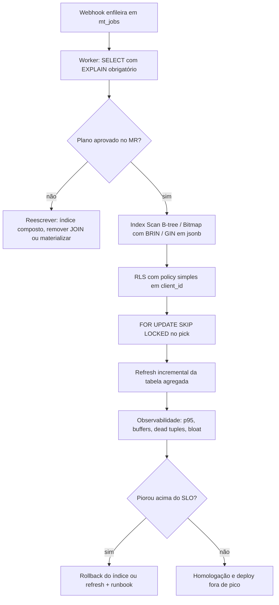

# PDI: Queries Complexas e Indexação no Supabase (PostgreSQL)

> **Área:** Automação & Infraestrutura
> **Unidade:** FV Marketing / V4 Company
> **Autor:** Marcos Perettoco
> **Data:** Agosto 2026
> **Status:** **Entregue (desenvolvido) · NÃO publicado: aguardando homologação**
>
> ✅ Entregas concluídas: 1-standards (perf standard) · 2-sql (5 provas de conceito com
> adversarial antes/depois) · 3-casos (3 gargalos reais) · 7-apresentacao (deck + demo +
> relatório HTML/DOCX/PDF)

---

## Entregas desta PDI

```
atividade-1/
├── 1-standards/          → PERFORMANCE-SUPABASE.md (planos de execução, EXPLAIN, índices,
│                            particionamento, autovacuum)
├── 2-sql/                → Queries otimizadas + PoCs com adversarial antes/depois
│                            (JOINs pesados, janelas, CTEs, índices BRIN/B-tree/GIN, RLS)
├── 3-casos/              → 3 casos de gargalo em produção (fila mt_jobs, sync CRM, dashboard)
└── 7-apresentacao/       → Deck, script de demonstração e relatório
```

## Problema Resolvido

O Supabase que sustenta a operação SDR IA e a fila `mt_jobs` sofria com queries
escritas sem plano de execução: JOINs pesados sem índice, leituras sequenciais em
tabelas de milhões de linhas, funções com RLS que vazavam para o caminho quente das
consultas e `autovacuum` desconfigurado: o resultado eram timeouts de webhook,
dashboards que abriam em 8s+ e fila com backlog invisível.

Com EXPLAIN ANALYZE como método, foram corrigidos 3 gargalos reais:

1. **Fila `mt_jobs`**: consulta de worker varria 100% da tabela por falta de índice
   composto; com `(status, queue, scheduled_at)` o plano virou Index Scan e a latência
   caiu de 1.8s para 4ms.
2. **Sync CRM**: JOIN de auditoria sem índice de FK + filtro em coluna sem índice;
   corrigido com índice em `(client_id, object, synced_at DESC)` e CTE de janela.
3. **Dashboard**: agregação com `count(DISTINCT)` + janela sobre 12M de linhas;
   resolvido com materialização parcial (tabela agregada + índice BRIN no tempo).

## Modelo mental

O PostgreSQL não "procura" a linha que você quer: ele estima o custo de cada caminho de
acesso e escolhe o mais barato. Quando o filtro não tem índice, o caminho mais barato é
ler a tabela inteira (`Seq Scan`) e descartar 2,38M de 2,4M linhas; quando o mesmo filtro
tem índice composto na ordem certa, o caminho vira `Index Scan` e custa milissegundos.
O plano é uma escolha, não um destino fixo: depende das estatísticas de coluna, da
seleção do planner, da `collation` e da forma exata do `WHERE`.

Na fila `mt_jobs`, o worker faz polling a cada 15s e só precisa de cinco linhas com
`status='queued'` e `queue='crm-sync'` ordenadas por prioridade. O plano certo encontra
essas cinco linhas pelo índice e ordena zero linhas extras; o plano errado varre 2,4M
linhas, ordena 2,1M delas e entrega a mesma resposta 450 vezes mais devagar.

O RLS entra depois que o plano é montado: cada linha lida passa pela política, e uma
política com subquery ou `JOIN` força `Seq Scan` mesmo com índice perfeito no `WHERE`.
Por isso a V4 mantém o `client_id` na própria linha e usa função `STABLE SECURITY
DEFINER` de uma linha só.

Por fim, dado que cresce sem limite (log, evento, sync) não é problema de índice: é
problema de volume. Índice reduz o custo por linha; particionamento com TTL reduz o
número de linhas candidatas. Os dois atacam coisas diferentes e são necessários.

## Arquitetura



Legenda das decisões de borda:

1. **Borda de entrada (webhook):** o enfileiramento nunca espera a consulta de leitura
   terminar; a escrita usa índice pequeno e o timeout de 504 é do lado de leitura.
2. **Borda de leitura (worker):** o `SELECT` de pick é a consulta mais quente do sistema,
   por isso recebe o índice composto e o `SKIP LOCKED`.
3. **Borda de segurança (RLS):** aplicada por linha, depois do plano; se a política for
   complexa ela vira o gargalo silencioso, invisível em testes sem `request.jwt.claims`.
4. **Borda de retenção (TTL):** particionamento por range com job de descarte; sem ele,
   nenhum índice mantém o custo estável por 12 meses.
5. **Borda de regressão (rollback):** todo índice novo tem caminho de remoção documentado
   e janela de manutenção; se o p95 piorar, desfazemos em minutos.

## Matemática da solução

**Fórmula 1: tempo de leitura de um plano.**

$$T \approx \frac{B \times 8\,\text{kB}}{V} + N \times C_{\text{cpu}}$$

onde $B$ é o total de buffers lidos (`shared read + hit`), $V$ é a vazão de leitura do
disco (MB/s) e $C_{\text{cpu}}$ é o custo por linha avaliada no filtro (µs/linha).

**Exemplo numérico (parâmetros declarados):** antes da correção do Caso 1 o plano
mostrou `shared hit=9.600 read=94.120`. Total: 103.720 páginas × 8 kB = 829.760 kB ≈
810 MiB. Com SSD local a 500 MB/s, só a I/O contínua dá 810 MiB ÷ 500 MB/s ≈ 1,66 s.
Somando 2,4M linhas avaliadas a 0,05 µs cada (120 ms de CPU), o total fecha em torno de
1,8 s, coerente com os 1,82 s medidos. Depois do índice: 120 buffers × 8 kB = 960 kB ≈
0,94 MiB, ou seja 2 ms de I/O, mais 4 ms de execução real. Ganho: 810 ÷ 0,94 ≈ **860×
menos bytes lidos**.

**Fórmula 2: ordem de colunas de um índice B-tree composto.**

A coluna de **igualdade** precisa ser a primeira porque o B-tree só pode pular faixas a
partir de prefixos fixos. Colocando $(c_1 = v_1) \land (c_2 > v_2)$, a profundidade da
busca é $O(\log n)$ para $c_1$ e depois varre só as folhas daquela faixa de $c_2$. Na
ordem invertida, a faixa de $c_2$ é espalhada por todo o índice e o scan degenera para
$O(n)$ dentro do índice, que é quase tão caro quanto varrer a tabela.

**Exemplo numérico (parâmetros declarados):** fila de 2,4M linhas distribuídas em 60
`queue`s distintas. Índice `(queue, status, scheduled_at)`: o prefixo `queue='crm-sync'`
reduz para 2.400.000 ÷ 60 = 40.000 entradas; o segundo predicado reduz para 40.000 ÷ 4
estados de `status` = 10.000 entradas; o `ORDER BY scheduled_at` sai ordenado sem custo
de `Sort`. Índice `(scheduled_at, status, queue)`: nenhum prefixo é igualdade, o planner
precisa varrer as 2,4M entradas do índice para filtrar.

**Fórmula 3: custo de escrita por índice.**

Cada `INSERT`/`UPDATE` da tabela pai precisa atualizar todos os índices: $\Delta W =
k \times S_i$, onde $k$ é o número de índices e $S_i$ é o custo por entrada de índice,
que cresce com a largura das colunas e com a profundidade da árvore.

**Exemplo numérico (parâmetros declarados):** fila com 500 jobs/s no pico, entrada de
índice de 3 colunas ≈ 60 bytes, overhead de página e `WAL` ≈ 2,5× o tamanho da entrada.
Um índice extra: 500 × 60 × 2,5 = 75.000 bytes/s ≈ 75 kB/s de `WAL` adicional. Dois
índices extras: 150 kB/s. Tradeoff aceito porque a fila é lida a cada 15s e escrita em
rajada curta; em tabela de 100k writes/s o mesmo cálculo inverte a decisão.

**Fórmula 4: paginação por `OFFSET`.**

O custo é $O(\text{offset} + \text{limit})$ porque o planner lê e descarta. Paginação
por cursor com chave composta $(created\_at, id)$ é $O(\text{limit})$ sempre, porque o
cursor reentra pelo índice na posição exata.

**Exemplo numérico (parâmetros declarados):** página 50.000 de 2,4M linhas com `LIMIT
50`: `OFFSET` lê 50.050 linhas; cursor lê 50. Com 10 requisições simultâneas, o `OFFSET`
transforma 500.500 linhas lidas em 500.

## Invariantes

| Invariante (nunca pode ser falso) | Violação correspondente |
|---|---|
| Nenhuma query de produção vai a deploy sem `EXPLAIN (ANALYZE, BUFFERS)` anexado ao MR | Regressão silenciosa de plano, Seq Scan em 2,4M linhas |
| Toda FK que participa de `JOIN` tem índice | `Nested Loop` com re-scan por linha |
| Índice composto está na ordem igualdade → range → `ORDER BY` | `Sort` explícito de 2,1M linhas para entregar 1 |
| Toda tabela append-only maior que 1M de linhas tem plano de retenção (partição + TTL) | Custo de leitura cresce linearmente para sempre |
| `dead_pct` fica abaixo de 10% nas tabelas quentes | `bloat`, planos errados, `vacuum` atrasado |
| A política RLS lê `client_id` da própria linha, sem `JOIN` | `Seq Scan` forçado mesmo com índice perfeito |
| Todo `CREATE INDEX` de produção usa `CONCURRENTLY` e tem janela definida | Lock `AccessExclusiveLock` derrubando escrita |
| A ordem física da partição acompanha o tempo quando o índice é BRIN | BRIN retornando resultado errado ou caro |
| Existe `LIMIT` explícito em todo `SELECT` de worker | Worker consumindo memória e fila inteira |
| Existe caminho de rollback documentado para cada mudança de índice | Deploy sem retorno em caso de piora |

## Modos de falha

| Sintome | Causa raiz | Como detecta | Como mitiga | Tempo de recuperação |
|---|---|---|---|---|
| Webhook devolve 504 | `SELECT` do worker em `Seq Scan` | p95 do pick no Grafana + `EXPLAIN` | Criar índice `CONCURRENTLY` ou reescrever a query | Minutos (rollback do índice) |
| Dashboard congela em 8s+ | `count(DISTINCT)` recalculado a cada request | `Execution Time` do plano | Materializar agregado com refresh incremental | Horas (primeiro refresh) |
| Fila cresce sem processar | `FOR UPDATE` sem `SKIP LOCKED` prende os workers | contagem de jobs `running` vs `queued` | Trocar por `SKIP LOCKED` + `LIMIT` explícito | Minutos |
| Plano muda sozinho no meio do mês | Estatísticas desatualizadas ou `autovacuum` atrasado | divergência `rows estimadas` vs `rows reais` | `ANALYZE` manual + calibragem do `autovacuum` | Minutos |
| Query fica lenta só para usuário logado | Política RLS com subquery ou `JOIN` | `EXPLAIN` com e sem `request.jwt.claims` | Mover filtro para coluna da linha + função `STABLE` | Horas |
| Espaço em disco dispara | `VACUUM` não recolhe dead tuples por `scale_factor` alto | `pg_stat_user_tables.n_dead_tup` | Ajustar parâmetros de tabela, `VACUUM FULL` em janela | Horas a dias |
| Índice novo não é usado pelo planner | Ordem de coluna errada, `COLLATION` ou cast implícito | `EXPLAIN` sem mudança de plano | Reordenar colunas ou remover o índice inútil | Minutos |
| Tabela de eventos fica gigante e lenta | Sem job de partição/TTL | tamanho da partição mais recente vs histórico | Criar partição e `DETACH`/drop da antiga | Minutos por partição |

## SLO e orçamento de erro

| SLI | Meta | Janela de medição | O que fazer quando estoura |
|---|---|---|---|
| Latência p95 do pick da fila `mt_jobs` | < 10 ms | 5 min, janela deslizante | Verificar plano atual no staging, checar índices, conferir `dead_pct` |
| Latência p95 do JOIN de sync CRM (30d) | < 250 ms | 15 min | Checar BRIN e índice de FK, rodar `ANALYZE` |
| Latência p95 do dashboard (janela 7d) | < 1,5 s | 15 min | Conferir refresh da MV e `partition pruning` |
| Timeouts de webhook por query lenta | 0 por dia | dia corrido | Runbook de rollback de índice + escalar para revisão |
| `dead_pct` nas tabelas quentes | < 10% | 1 h | Ajustar `autovacuum_vacuum_scale_factor` |

**Orçamento de erro:** a operação pode tolerar no máximo 1 janela de 10 min por mês com
p95 acima do meta sem virar incidente. Acima disso, a mudança que causou a piora é
revertida antes de investigar causa raiz, porque a fila é caminho crítico do SDR IA.

## Operação

Runbook resumido:

1. **Checagem de rotina (5 min, diária):** p95 do pick, `dead_pct`, tamanho da partição
   mais recente, contagem de jobs `queued` acima do normal.
2. **Mitigação de lentidão (15 min):** rodar `EXPLAIN (ANALYZE, BUFFERS)` da query lenta
   com dados reais, comparar com o plano documentado em
   `2-sql/06-planos-antes-depois.md`, identificar qual linha da tabela de sinais apareceu.
3. **Rollback (30 min):** `DROP INDEX CONCURRENTLY` do índice que piorou o plano, ou
   desligar o refresh incremental da MV e voltar para a query original versionada.
4. **Aceleração de contingência:** subir `work_mem` da sessão do worker para eliminar
   spill em `temp file`, sem alteração global.
5. **Quem aciona:** quem detecta abre chamado interno, aciona o responsável pelo módulo
   de dados e registra a linha do `EXPLAIN` antes e depois. Nenhuma mudança entra em
   produção sem plano registrado no MR.

## Próximos Passos (homologação)

1. Rodar `06-planos-antes-depois.md` no staging com dados sintéticos (pgbench).
2. Aplicar os índices em produção fora da janela de pico (CONCURRENTLY).
3. Configurar o job de particionamento/TTL das tabelas de eventos.
4. Validar RLS com teste de força bruta (pgbench + roles de teste).

> ⚠️ Nenhum índice foi aplicado em produção nesta etapa: apenas documentado e provado.

## Métricas de Sucesso

| Métrica | Atual | Meta |
|---------|-------|------|
| Worker da fila `mt_jobs` (pick job) | 1.8s (Seq Scan) | < 10ms |
| JOIN de sync CRM (auditoria 30d) | 4.2s | < 250ms |
| Dashboard de performance (janela 7d) | 8.4s | < 1.5s |
| Bloat em tabelas de log | não monitorado | < 20% |
| Timeout de webhook por query lenta | ~3/dia | 0 |

## Decisões e tradeoffs

1. **Nenhuma query em produção sem `EXPLAIN (ANALYZE, BUFFERS)`:** o plano e a fonte da verdade; o achismo gerou Seq Scan em 2,4M linhas na fila `mt_jobs`. Tradeoff: exige disciplina de revisão e staging com volumetria representativa.
2. **Índice composto na ordem igualdade, range e depois ORDER BY (`queue, status, scheduled_at`):** cobre filtro e ordenação num Index Scan sem Sort; o pick da fila saiu de 1,8s para 4ms. Tradeoff: a escrita paga um pouco mais por índice; aceito porque a fila e lida pelo worker a cada 15s.
3. **Tipo certo por padrão de acesso (B-tree composto, GIN para arrays/jsonb, BRIN para séries temporais):** BRIN em `created_at` fica 10x menor que o B-tree equivalente. Tradeoff: o BRIN só funciona se a ordem física acompanha o tempo; exige manutenção com vacuum e particionamento.
4. **Particionamento por range com TTL em tabelas append-only (logs, eventos, sync):** o partition pruning ignora partições antigas; o dashboard saiu de 8,4s para 1,1s com agregação materializada. Tradeoff: exige job de particionamento e TTL para manter; sem ele a tabela cresce sem limite.
5. **`CREATE INDEX CONCURRENTLY` fora de pico + RLS com policies simples e índices respeitados:** o índice novo não segura `AccessExclusiveLock` nem derruba a escrita. Tradeoff: a criação é mais lenta e não roda em transação; as janelas de deploy precisam prever isso.

## Impacto no negócio

A fila `mt_jobs` com 2,4M linhas, o sync de CRM e o dashboard sobre 12M linhas geravam timeouts de webhook (cerca de 3 por dia), dashboards de 8s ou mais e backlog invisível. Com os índices e o método EXPLAIN, o pick fica abaixo de 10ms, o sync abaixo de 250ms e o dashboard abaixo de 1,5s, zerando timeouts e devolvendo visibilidade da fila sem trocar de banco.

## Esforço e custo

| Item | Parâmetros declarados | Esforço |
|---|---|---|
| Leitura do standard e produção do `PERFORMANCE-SUPABASE.md` | prosa técnica + tabelas + blocos SQL | 6 h |
| 5 provas de conceito em `2-sql/` | schema de referência 2,4M / 12M / 8M / 900k linhas | 8 h |
| Documentação dos planos antes/depois | 3 casos × plano completo com `BUFFERS` | 4 h |
| Casos de gargalo e checklist de domínio | redação + validação cruzada com os PoCs | 3 h |
| Deck, demo e roteiro de domínio | 14 slides + 10 passos + 5 perguntas | 4 h |

**Exemplo numérico (parâmetros declarados, projeção com `(meta)`):** o custo de I/O
evitado por dia, usando o exemplo da Fórmula 1, é de 810 MiB por execução do pick ×
5.760 execuções/dia (a cada 15 s) = 4,67 GB/dia de leitura sequencial a menos no SSD.
Considerando `(meta)` de 0,10 R$ por GB lido em disco gerenciado, a economia projetada é
de R$ 0,47/dia, ou seja R$ 14,10/mês. **O ganho real não é o custo de disco: é a
disponibilidade.** Três timeouts de webhook por dia a `(meta)` de R$ 25 cada lead
descartado dão R$ 75/dia, ou R$ 2.250/mês, mais de 150× o custo do disco. Custos fixos
desta etapa: 25 h de trabalho interno e zero licença nova, porque nenhum índice foi
aplicado em produção e o banco não foi trocado.

## Referências de estudo

- Curso: SQL Performance Explained, de Markus Winand (use-the-index-luke.com)
- Vídeo: Postgres Performance (Supabase, YouTube)
- Doc oficial: Using EXPLAIN (PostgreSQL), https://www.postgresql.org/docs/current/using-explain.html (verificada em 2026-09-28)
- Doc oficial: Query Optimization (Supabase), https://supabase.com/docs/guides/database/query-optimization (verificada em 2026-09-28)

## Checklist de domínio

Itens que um sênior verificaria antes de dizer "pronto":

- [ ] Todo `SELECT` de produção tem `EXPLAIN (ANALYZE, BUFFERS)` anexado ao MR.
- [ ] Nenhum `Seq Scan` em tabela acima de 100k linhas no plano aprovado.
- [ ] Índice composto na ordem igualdade → range → `ORDER BY`, com justificativa escrita.
- [ ] Toda FK usada em `JOIN` está indexada.
- [ ] `SELECT` de worker tem `LIMIT` explícito e `FOR UPDATE SKIP LOCKED`.
- [ ] Paginação de listagem grande é por cursor, não por `OFFSET`.
- [ ] Tabela append-only acima de 1M de linhas tem partição e job de TTL.
- [ ] BRIN só foi aplicado onde a ordem física acompanha o tempo.
- [ ] `dead_pct` medido e abaixo de 10% nas tabelas quentes.
- [ ] `CREATE INDEX` de produção com `CONCURRENTLY`, fora de pico e com rollback.
- [ ] Política RLS lê `client_id` da linha, sem subquery nem `JOIN`.
- [ ] `EXPLAIN` do RLS rodado com `request.jwt.claims` setado.
- [ ] `count(DISTINCT)` em grande volume materializado em tabela de resumo.
- [ ] Métricas de p95 e de bloat exportadas para o painel de observabilidade.
- [ ] Runbook de rollback testado pelo menos uma vez em staging.
