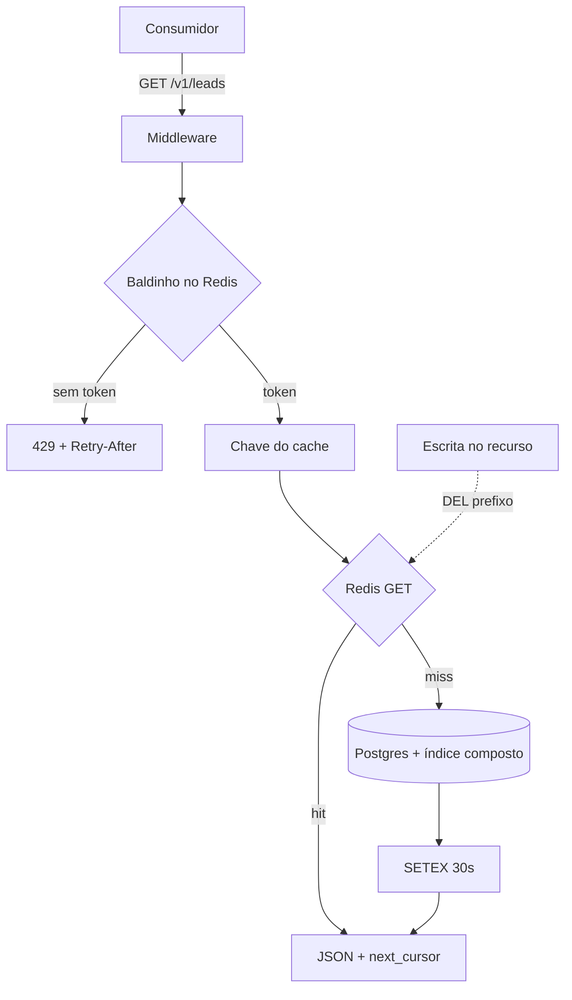
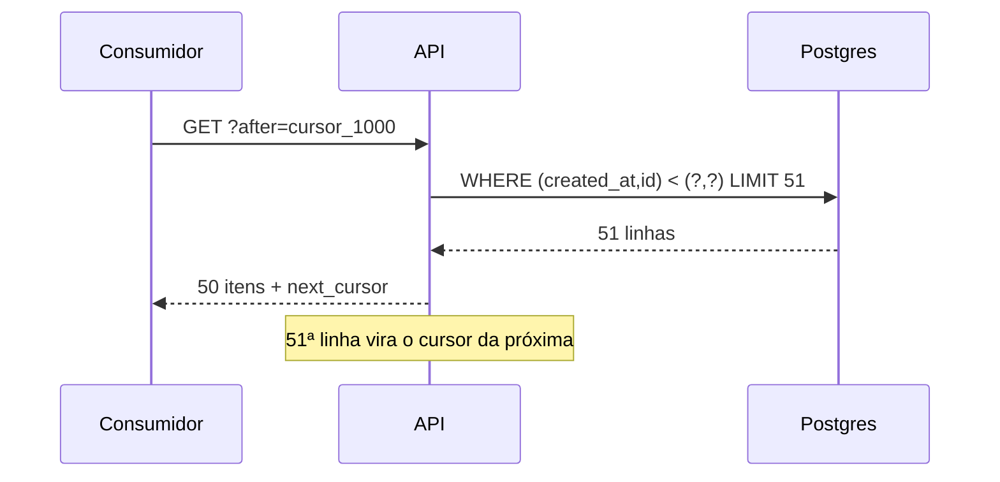

# Deck PDI: APIs Modulares de Missão Crítica (FastAPI) com Paginação, Cache e Rate Limiting

Área: Arquitetura Full Stack

## Slide 1: Resumo Executivo
API modular FastAPI para dados de missão crítica, com paginação cursor-based, cache Redis com invalidação e rate limiting por chave. Entrego o padrão e uma implementação real.
Foco em corretude sob carga: uma API de leads não pode vazar memória nem derrubar o banco em pico.
Frase que costura a apresentação: o custo de uma listagem deve ser proporcional ao tamanho da página, nunca à profundidade da página nem à popularidade do recurso.

## Slide 2: Contexto de Produção
Endpoints internos servem 3-5 sistemas.
Listas de 5k-80k sem paginação estouravam memória.
Sem rate limit: 2k req/min derrubava o Postgres.
Detalhe que explica a urgência: varrer 80k em páginas de 50 são 1.600 requisições. Quatro sistemas na mesma janela dobram a carga só de leitura, competindo com a escrita transacional.

## Slide 3: O Problema e o Blast Radius
| Sintoma | Hoje | Alvo |
| --- | --- | --- |
| Paginação | offset | cursor-based |
| Cache | nenhum | Redis + invalidação |
| Rate limit | ausente | por api_key |
| Erro 5xx | stack cru | envelope |
Leitura do blast radius: quatro dos cinco modos de falha atingem o Postgres, o único recurso compartilhado sem redundação barata. Todo o investimento da atividade reduz e isola carga nele.

## Slide 4: Diagnóstico
Offset em tabelas grandes = full scan.
Conexões não pooladas -> esgotamento.
Sem distinção 4xx vs 5xx.
A consequência prática: erro 500 genérico faz todo consumidor retentar, e o retry em tempestade piora exatamente o pico que causou o erro.

## Slide 5: Modelo mental em três frases
A requisição atravessa três portões baratos antes do banco: identidade, balde de tokens, chave de cache.
O banco só é consultado no quarto portão, com seek no índice composto e linha extra para detectar próxima página.
Se o Redis cai, os portões dois e três são pulados com degradação controlada: prioridade é disponibilidade, não p95.

## Slide 6: Arquitetura (fluxo)

Legenda: o portão mais barato fica sempre à frente; cache por cliente para nunca cruzar permissão; linha extra na query elimina a segunda ida ao banco.

## Slide 7: Decisão Arquitetural (ADR)
ADR-032: API Modular
| Opção | Pro | Contra | Decisão |
| --- | --- | --- | --- |
| FastAPI + Redis + slowapi | async, maduro | mais deps | ESCOLHIDA |
| Flask manual | simples | menos perf | rejeitada |
> Nota: Cursor-based para estabilidade; cache por chave com invalidação no write.

## Slide 8: Alternativas descartadas
| Alternativa | Por que ficou de fora |
| --- | --- |
| OFFSET com índice parcial | índice reduz a ordenação, não o descarte: continua lendo e jogando fora as linhas anteriores |
| Cache em memória local por processo | em várias réplicas, estado divergente e invalidação que não se propaga |
| Cache só em header HTTP | protege quem obedece ao header e não centraliza invalidação por escrita |
| Rate limit por IP | atrás de NAT e proxy, todos parecem a mesma origem e um pune os outros |
| Paginação por número de página | por baixo é offset, é instável sob inserção e refaz a ordenação a cada chamada |

## Slide 9: Paginação por cursor: por que é estável
Antes (offset): `ORDER BY created_at DESC OFFSET 100000 LIMIT 50` lê 100.050 linhas para entregar 50.
Depois (keyset): `WHERE (created_at, id) < (c_ts, c_id) ... LIMIT 51` lê 51 linhas, independente da profundidade.
O par `(created_at, id)` é obrigatório: empate de data sem desempate pula ou repete item entre páginas.

## Slide 10: Matemática da solução (conta fechada)
Custo por página: `linhas_offset = N × L + L` contra `linhas_cursor = L + 1`.
**Exemplo numérico:** página 1.000 com `L = 50` e linhas de 200 bytes.
Offset: `1000 × 50 + 50 = 50.050` linhas lidas, cerca de 10,0 MB.
Cursor: 51 linhas, cerca de 10,2 KB.
Fator de redução: `50.050 / 51 = 981` vezes menos linhas lidas na página profunda.
Carga residual no banco com cache: `λ_banco = λ × (1 - H)`. Com `λ = 200 req/s` e `H = 0,92` (meta), `200 × 0,08 = 16 req/s` chegam ao Postgres, redução de 92% do tráfego de listagem.

## Slide 11: Token bucket com conta
Baldinho `B = 100`, recarga `r = 100/min`. Recarga ao consultar: `tokens = min(B, tokens + ⌊Δs × r / 60⌋)`.
**Exemplo numérico:** cliente gasta os 100 tokens em 12 segundos. Após 60 segundos parado, `Δs = 48`, recarga = `⌊48 × 100 / 60⌋ = 80` tokens.
O `Retry-After` devolvido é o tempo real de recarga de um token, não um número fixo inventado: o retry do consumidor volta no momento em que já existe orçamento.

## Slide 12: Matriz de trade-offs
| Decisão | Ganha | Perde | Por que aceitamos |
| --- | --- | --- | --- |
| Cursor em vez de offset | custo estável por página | salto direto para a página N | listas são varridas em sequência |
| TTL 30 s + SWR 60 | memória contida, latência baixa | até 90 s de dado defasado | listagem de leads tolera atraso curto |
| 100 req/min por chave | isolamento entre clientes | 429 em pico legítimo | contrato exige backoff com jitter |
| Fallback ao banco | disponibilidade sem Redis | p95 pior no pior caso | indisponibilidade é pior que lentidão |
| Índice único composto | leitura barata | escrita um pouco mais cara | leituras superam escritas em vários dígitos |

## Slide 13: Entregas desta Atividade
API-STANDARD.md.
main_api.py.
requirements.txt.
O standard é a regra durta para o próximo endpoint; o código é a prova de que ela cabe em 25 linhas; o `requirements.txt` fixa versão entre homologação e produção.

## Slide 14: Validação
Carga com k6: 200 req/s por 5 min.
Rate limit: estourar quota -> 429.
Cache: 2o hit vem do Redis.
Complemento: teste de varredura completa contando itens, para provar zero duplicidade e zero omissão.

## Slide 15: Plano de teste (12 casos)
| # | Caso | Critério de aceite |
| --- | --- | --- |
| P1 | Varredura completa | contagem = total, sem repetição |
| P2 | Empate de data | nenhuma linha pula de página |
| P3 | Página 1.000 com EXPLAIN | linhas lidas próximas de `limit + 1` |
| P6 | MISS depois HIT | `X-Cache` confirma a troca |
| P7 | Escrita invalida | leitura pós-escrita é MISS |
| P8 | Redis parado | 200 pelo caminho do banco |
| P9 | 101ª chamada | 429 com `Retry-After` |

## Slide 16: Métricas e SLO
| SLO | Alvo |
| --- | --- |
| p95 (lista) | < 200 ms cache hit |
| Rate limit | 100/min/key |
| Disponibilidade | >= 99.5% |
Complementos (meta): p95 em miss < 400 ms, hit rate >= 90%, 5xx < 0,5%, 429 < 2%.
Regra de cardinalidade: nunca usar `api_key`, `cursor` ou `trace_id` como label de métrica.

## Slide 17: Orçamento de erro
99,5% em 30 dias dá `0,005 × 30 × 24 × 60 = 216` minutos de indisponibilidade.
Um corte de 15 minutos consome 6,9% do orçamento mensal.
Regra operacional: passou de 50% na metade do mês, congela-se toda mudança não corretiva na API.
Isso mata a morte por mil cortes de 90 segundos.

## Slide 18: Modos de falha e recuperação
| Sintoma | Causa raiz | Detecção | Mitigação | Recuperação |
| --- | --- | --- | --- | --- |
| 500 em massa | pool esgotado | `db_pool_in_use` no teto | reduzir pool, cortar varredura | minutos |
| p95 dispara sem troca de tráfego | índice perdido | EXPLAIN com seq scan | `CREATE INDEX CONCURRENTLY` + `ANALYZE` | 5 a 15 min |
| 429 em massa | quota mal calibrada | 429 > 2% | subir quota só após auditar consumidor | imediato / horas |
| Redis fora | rede ou failover | `redis_up = 0` | fallback banco, flag do balde local | até o Redis voltar |
| Dado antigo em tela | invalidação não disparou | teste de integração | `DEL` do prefixo, corrigir caminho de escrita | segundos |

## Slide 19: Riscos
| Risco | Mitigação |
| --- | --- |
| Cache stale | TTL + invalidar no write |
| Redis down | fallback DB |
Riscos adicionais: consumidor sem backoff (mitigado por `Retry-After` e contrato de integração), troca de ordenação quebrando contrato (mitigada por cursor opaco e `/v2`), limpeza de índice "otimista" (mitigada por `EXPLAIN` em teste automatizado).

## Slide 20: Impacto no negócio
Endpoint de 5k a 80k registros servindo 3 a 5 sistemas: sem o padrão, picos de 2k req/min derrubavam o Postgres.
Com o padrão, p95 abaixo de 200 ms no hit e disponibilidade de 99,5% (meta).
Consequência operacional: varredura de 80k com duração previsível, sincronismo noturno sem brigar com o horário comercial.

## Slide 21: Próximos Passos
Gateway com OAuth2.
Tracing OTel.
Ordem importa: o gateway troca `api_key` estática por token com escopo e validade, o que habilita rate limit por cliente e por escopo. O tracing vem depois, porque é ele que faz o `trace_id` atravessar aplicação e banco numa única trilha de consulta.
