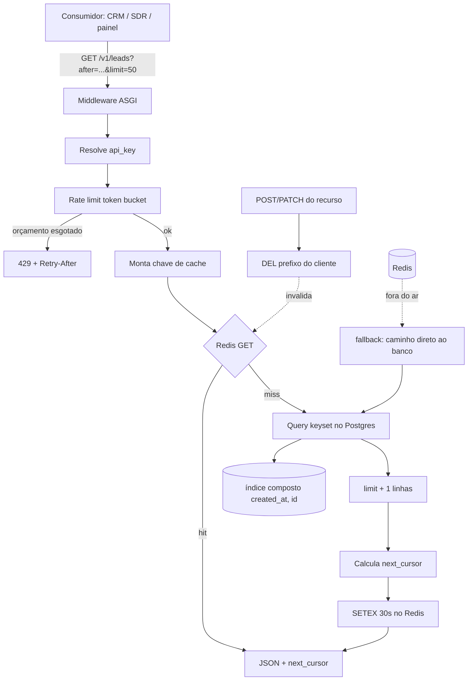

# APIs Modulares de Missão Crítica (FastAPI) com Paginação, Cache e Rate Limiting

Arquitetura Full Stack

## Resumo Executivo

API modular FastAPI para dados de missão crítica, com paginação cursor-based, cache Redis com invalidação e rate limiting por chave. Entrego o padrão e uma implementação real.

Foco em corretude sob carga: uma API de leads não pode vazar memória nem derrubar o banco em pico.

O que essa atividade entrega, em uma frase: um padrão repetível de endpoint de listagem que mantém o custo do banco constante por página, devolve o mesmo JSON recalculado a partir do cache quando é possível, e isola o consumo de cada cliente com um limite de taxa rígido. Não é um framework novo, é um conjunto de regras duras, com SQL, código e critérios de aceite, que qualquer endpoint de listagem do sistema pode adotar sem redesenhar a aplicação.

O princípio que costura tudo: **o custo de uma requisição de listagem deve ser proporcional ao tamanho da página pedida, nunca à profundidade da página nem à popularidade do recurso.** Toda decisão desta atividade (cursor, cache, rate limit) é consequência direta dessa frase.

## Contexto de Produção

- Endpoints internos servem 3-5 sistemas.

- Listas de 5k-80k sem paginação estouravam memória.

- Sem rate limit: 2k req/min derrubava o Postgres.

O detalhe operacional que motiva o trabalho: os consumidores são serviços internos (CRM, ferramenta de SDR, painel comercial, sync noturno) que fazem varredura completa das listas. Uma varredura de 80k registros em páginas de 50 significa 1.600 requisições. Se quatro sistemas fazem isso na mesma janela de 5 minutos, o banco recebe 3.200 requisições de listagem só para leitura, além do tráfego transacional normal de escrita. Com cursor e cache, boa parte dessa varredura nem chega ao Postgres.

Também há um segundo efeito menos visível: quando o endpoint estoura memória, o processo do servidor morre e os consumidores recebem erro de conexão. Como eles não diferenciam 5xx transitório de 5xx permanente, a maioria entra em retry imediato em loop, o que piora o pico. Por isso o envelope de erro com separação 4xx/5xx não é enfeite: é parte da estabilidade do ecossistema inteiro.

## O Problema e o Blast Radius

| Sintoma | Hoje | Alvo |

| --- | --- | --- |

| Paginação | offset | cursor-based |

| Cache | nenhum | Redis + invalidação |

| Rate limit | ausente | por api_key |

| Erro 5xx | stack cru | envelope |

**Blast radius** (o que é afetado quando algo dá errado):

| Falha | Alcance imediato | Alcance em cascata | Contenção |
| --- | --- | --- | --- |
| Endpoint devolve lista inteira | 1 processo de API | conexões do Postgres esgotadas, demais endpoints caem | cursor + `limit` máximo |
| Página profunda com OFFSET | 1 requisição lenta | fila de requisições atrás dela, timeouts nos consumidores | cursor com seek no índice |
| Cliente dispara 2k req/min | 1 api_key | saturação global do banco, indisponibilidade geral | 429 por chave |
| Redis fora do ar | p95 de lista sobe | nenhum: o banco assume o tráfego | fallback para banco |
| Resposta de erro com stack cru | 1 cliente confuso | retrabalho de suporte, vazamento de caminho interno | envelope com `trace_id` |

A leitura correta da tabela é: quatro dos cinco cenários atingem o banco, que é o único recurso compartilhado sem redundação barata. Por isso a maior parte do investimento da atividade está em reduzir e isolar a carga no Postgres.

## Diagnóstico

- Offset em tabelas grandes = full scan.

- Conexões não pooladas -> esgotamento.

- Sem distinção 4xx vs 5xx.

Profundando cada ponto, porque o diagnóstico é o que separa quem aplica o padrão de quem decora o padrão:

1. **OFFSET não é lentidão abstrata, é trabalho descartado.** O Postgres para `SELECT ... ORDER BY created_at DESC OFFSET 100000 LIMIT 50` precisa localizar, ordenar e *ler* 100.050 linhas para entregar 50. As 100.000 primeiras são lidas do heap ou do índice e jogadas fora. O custo é linear na profundidade. Com cursor, o mesmo plan busca a posição `(created_at, id) = (cursor)` no índice composto e lê 51 linhas, independente de a página ser a primeira ou a décima milésima.

2. **Pool de conexões ausente significa 1 conexão por requisição.** Sob 200 req/s, em 30 segundos o servidor tenta abrir 6.000 conexões. O Postgres tem `max_connections` finito (Exemplo numérico: 200). O esgotamento não é gradual: as primeiras requisições ficam lentas, depois todas falham com `too many connections`, incluindo as de escrita do sistema transacional. Pool com tamanho fixo e `pool_timeout` converte esse modo de falha abrupto em espera previsível.

3. **Sem distinção 4xx/5xx o cliente não sabe o que fazer.** Se todo erro vira 500 genérico, todo consumidor retenta. Erro de validação (400) retentado é carga inútil; erro interno (500) não retentado é perda de operação. A separação economiza carga no pior momento, que é justamente quando o sistema está sob estresse.

4. **Cachê ausente repete trabalho determinístico.** Listagem ordenada com os mesmos parâmetros é função pura do estado do banco num intervalo de segundos. Recalculá-la dezenas de vezes por minuto é pagar o custo do planner e a leitura de blocos para o mesmo resultado.

## Modelo mental

Como o sistema realmente se comporta por dentro:

A requisição chega e passa por uma cadeia de portões, cada um podendo recusar antes que qualquer trabalho caro aconteça. Primeiro a autenticação resolve qual `api_key` está falando. Segundo o rate limit consulta o bucket daquela chave no Redis: se o orçamento estourou, responde 429 e encerra ali, sem tocar em nada além do Redis. Terceiro, a camada de cache monta a chave a partir de (recurso, cliente, cursor, limit) e tenta ler: em acerto, o JSON pronto volta em milissegundos. Só no quarto portão o Postgres é consultado, com `WHERE (created_at, id) > (cursor) ORDER BY created_at, id LIMIT limit+1`. A linha extra existe só para descobrir se há página seguinte sem uma segunda consulta. O resultado é gravado no Redis com TTL de 30 segundos e devolvido junto do próximo cursor.

O cursor é opaco para o cliente: ele não decodifica, não calcula, não página sozinho. Ele repassa o valor que recebeu. Isso é deliberado: mantém a API livre para trocar a chave de ordenação num dia futuro sem quebrar consumidores. Escrito por engenharia reversa, o cursor vira contrato interno e trava a evolução do esquema.

Quando há escrita no recurso, o cache do cliente afetado é invalidado. Não há invalidação global: cada cliente enxerga a própria partição lógica dos dados, então a invalidação é por prefixo de cliente, o que mantém o custo da invalidação proporcional ao impacto real da escrita.

Se o Redis estiver indisponível, os portões segundo e terceiro são pulados com degradação controlada: o rate limit pode operar em modo local (memória do processo, sem compartilhamento entre instâncias) ou ser desligado por flag, e o cache vira não-ocorrência. O caminho banco->resposta continua de pé. A troca é consciente: sob Redis fora, priorizamos disponibilidade a p95.

Por fim, todo erro vira o mesmo formato de envelope, com `trace_id`. O cliente lê `code`, decide se retenta, e se precisar abrir chamado, o `trace_id` liga a resposta ao log do servidor. Nenhum caminho de erro devolve stack trace.

## Arquitetura



**Legenda das decisões de borda:**

- **O rate limit vem antes do cache.** Se a ordem fosse invertida, um cliente abusivo ainda consumiria CPU e rede montando chaves e lendo Redis antes de ser barrado. O portão mais barato fica sempre à frente.
- **O cache é por cliente e por cursor.** Chave genérica por recurso vazaria página de um cliente para outro quando o filtro de permissão difere. O custo de armazenar mais chaves é irrelevante comparado a um vazamento de dado entre contas.
- **O `limit + 1` evita segunda ida ao banco.** É o truque que torna a detecção de "existe próxima página?" de custo zero.
- **A invalidação é por prefixo de cliente.** Global seria mais simples e mataria o cache de todos a cada escrita; por prefixo, o dano fica no alcance do dado alterado.
- **O fallback não tenta reinventar o Redis.** Se o cache está fora, a aplicação aceita latência pior e segue. Tentar um cache em memória local criaria estado divergente entre instâncias num deploy com múltiplas réplicas.
- **Cursor opaco.** O cliente repassa o valor. A API ganha liberdade de mudar a ordenação interna sem quebrar contrato.

## Matemática da solução

**1. Custo da paginação por offset.**

Linhas lidas para atingir a página de índice $N$ com tamanho $L$:

$$linhas_{offset} = N \times L + L$$

Linhas lidas pela mesma página em keyset (cursor):

$$linhas_{cursor} = L + 1$$

**Exemplo numérico:** página de índice 1.000 com $L = 50$ e linhas de 200 bytes.
Offset: $1000 \times 50 + 50 = 50.050$ linhas lidas, cerca de $10{,}0$ MB lidos do heap. Cursor: $51$ linhas, cerca de $10{,}2$ KB. Fator de redução: $50.050 / 51 \approx 981$ vezes menos linhas lidas na página profunda.

**2. Custo de escrita do índice versus custo de leitura evitado.**

Cada índice adicional custa em toda escrita da tabela. A regra prática adotada aqui é manter o índice composto único que serve a ordenação:

```sql
CREATE INDEX CONCURRENTLY idx_pedidos_created_id
    ON pedidos (created_at DESC, id DESC);
```

**Exemplo numérico:** tabela com 80.000 linhas, 300 bytes por linha de heap, índice com 24 bytes por entrada de índice + ponteiro. O índice ocupa aproximadamente $80.000 \times (16 + 6) \approx 1{,}7$ MB, contra $80.000 \times 300 = 24$ MB de heap. A escrita de uma linha passa a atualizar 2 estruturas em vez de 1: o custo extra por `INSERT` é o de escrever e balancear ~22 bytes de entrada mais o trabalho do B-tree, tipicamente um dígito percentual do tempo total da escrita. A troca é vantajosa porque a leitura paginada acontece milhares de vezes mais vezes que a escrita (Exemplo numérico: 1.600 leituras por varredura × 4 sistemas versus ~20 escritas/min).

**3. Taxa de acerto de cache e carga residual no banco.**

Seja $H$ a taxa de acerto do cache e $\lambda$ a taxa de requisições por segundo:

$$\lambda_{banco} = \lambda \times (1 - H)$$

**Exemplo numérico:** $\lambda = 200$ req/s, $H = 0{,}92$ (meta). Então $\lambda_{banco} = 200 \times 0{,}08 = 16$ req/s. Sem cache seriam 200 req/s no Postgres. Redução de 92% do tráfego de listagem. Mesmo que $H$ caia para 0 (Redis fora), o teto continua em 200 req/s, que é exatamente o patamar que o pool e o rate limit foram dimensionados para suportar.

**4. Janela de dado defasado (stale).**

Com `max-age=30` e `stale-while-revalidate=60`, o consumidor pode enxergar no pior caso:

$$stale_{max} = TTL + SWR = 30 + 60 = 90\text{ s}$$

Com invalidação por escrita, esse teto só vale para escritas feitas por outro cliente no mesmo recurso; a escrita do próprio cliente limpa o prefixo e zera a defasagem. A janela aceita é de 90 segundos no pior caso teórico, considerada aceitável para listagem (meta: janela real observada < 5 s, porque a invalidação derruba a chave antes do TTL).

**5. Token bucket: quantidade e recarga.**

$$t = \left\lfloor \frac{\Delta_{segundos} \times r}{60} \right\rfloor$$

em que $r$ é a taxa em req/min e $\Delta_{segundos}$ é o intervalo decorrido. Balde com capacidade $B$ e recarga $r$:

$$tokens(t) = \min(B,\ tokens_{anterior} + t)$$

**Exemplo numérico:** $r = 100$ req/min, $B = 100$. Após 6 segundos parado: $\lfloor 6 \times 100 / 60 \rfloor = 10$ tokens. Após 60 segundos: 100 tokens (teto do balde). Um cliente que gasta 100 tokens num minuto recebe `429` com `Retry-After: 6`, que é exatamente o tempo para recarregar 10 tokens e conseguir a próxima requisição.

**6. Taxa de ocupação do Redis.**

$$memória \approx chaves \times (tamanho\_chave + tamanho\_valor)$$

**Exemplo numérico:** 5 sistemas × 1.000 combinações de (cursor, limit) quentes × (60 bytes de chave + 4.000 bytes de valor) $\approx 5.000 \times 4{,}06$ KB $\approx 20$ MB. Com `maxmemory-policy=allkeys-lru` e teto de 256 MB, o cache comporta folga de mais de um dígito antes de qualquer evicção, e a evicção só degrada p95, nunca disponibilidade.

**7. Custo de conexão.**

$$conexões_{necessárias} = \lambda_{banco} \times t_{consulta}$$

**Exemplo numérico:** $\lambda_{banco} = 16$ req/s (item 3), $t_{consulta} = 25$ ms. $16 \times 0{,}025 = 0{,}4$ conexão em uso médio. Com fator de pico de 5×, 2 conexões bastam; o pool é dimensionado em 10 para sobra, o que mantém `max_connections` do Postgres confortável mesmo com outras aplicações conectadas.

## Invariantes

Nunca pode ser falso. Se alguma linha abaixo falhar em produção, é incidente:

| # | Invariante | Violação correspondente | Como prova |
| --- | --- | --- | --- |
| 1 | Toda listagem usa cursor, nunca `OFFSET` acima de 10k | página profunda com custo linear, estouro de memória | teste de contrato: query com `OFFSET` rejeitada em revisão |
| 2 | Todo `limit` é menor ou igual a 200 | resposta gigante, estouro de heap no processo | validação Pydantic, `422` fora da faixa |
| 3 | A ordenação da listagem é determinística e estável | item pulado ou duplicado entre páginas | unicidade de `(created_at, id)` garantida por índice |
| 4 | Toda resposta de erro tem `code`, `message` e `trace_id` | consumidor sem como correlacionar incidente | teste de contrato em todos os status 4xx/5xx |
| 5 | Nenhuma resposta contém stack trace ou caminho de arquivo | vazamento de detalhe interno | teste de regressão varrendo corpo das respostas |
| 6 | Nenhuma escrita retorna sucesso sem, em seguida, invalidar o prefixo de cache | cliente lê dado antigo indefinidamente | teste de integração: escrever, ler, esperar não haver hit da chave antiga |
| 7 | O 429 sempre traz `Retry-After` em segundos | cliente em retry imediato, agravando o pico | teste de contrato no estouro de quota |
| 8 | O cache nunca é requisito de disponibilidade | Redis fora derruba a API | teste de caos: parar Redis e verificar 200 no banco |
| 9 | O cursor é opaco e validado antes do uso | injeção de valor arbitrário no `WHERE` | rejeição de cursor não numérico/assinado |
| 10 | Toda consulta de listagem usa o índice composto | seq scan silencioso ao mudar o esquema | `EXPLAIN (ANALYZE, BUFFERS)` no plano de teste |
| 11 | A conexão com o banco vem sempre do pool | esgotamento de `max_connections` | código sem `create_engine` avulso, lint e revisão |
| 12 | `next_cursor` só é `null` na última página | consumidor para cedo ou loop infinito | teste de varredura completa com contagem de itens |

## Modos de falha

| Sintoma | Causa raiz | Como detecta | Como mitiga | Tempo de recuperação |
| --- | --- | --- | --- | --- |
| `500` em massa nas listas | pool de conexões esgotado | métrica `pool_in_use` no teto, log `too many connections` | reduzir `pool_size`, ativar rate limit, matar varreduras | minutos (derrubar a varredura) + restart do pool |
| p95 da lista dispara sem troca de tráfego | perda do índice (migração mal feita) ou plano trocado | alerta de p95 > 200 ms, `EXPLAIN` mostrando seq scan | recriar índice com `CREATE INDEX CONCURRENTLY`, `ANALYZE` | 5 a 15 min dependendo do tamanho |
| 429 generalizado em clientes legítimos | quota baixa demais ou janela mal configurada | proporção de 429 > 2% do total | subir quota por chave, revisar política de retry dos consumidores | imediato na configuração; horas no ajuste do consumidor |
| Resposta stale após escrita | invalidação não disparou (exceção no caminho de escrita) | teste de integração ou reclamação de dado antigo | `DEL` manual do prefixo, corrigir caminho de escrita para usar transação | segundos |
| Redis fora | rede, memória, failover | health check do Redis, log de exceção de conexão | fallback banco + flag desligando rate limit local | até o Redis voltar (minutos); degradação contínua |
| Lentidão intermitente em uma api_key | consumidor sem backoff, retry em tempestade | distribuição de intervalos entre requisições da chave | bloquear temporariamente a chave, exigir backoff com jitter | horas (ajuste no consumidor) |
| Fuga de memória no processo | serialização de resposta gigante (`limit` alto ou sem cursor) | RSS do processo em crescimento, alerta de memória | derrubar o processo (orquestador reinicia), reduzir `limit` | segundos com reinício automático |
| Erro não correlacionável | `trace_id` ausente por exceção fora do handler | amostragem de respostas 5xx sem `trace_id` | garantir handler global único cobrindo todas as exceções | imediato no deploy da correção |
| Custo de CPU do Redis em pico | varredura com `KEYS` para invalidar | `redis-cli INFO commandstats` com `keyspace_hits` e uso de CPU | trocar `KEYS` por `SCAN` com `MATCH` e `COUNT`, ou invalidação por prefixo rastreável | imediato na correção |
| Duplicidade de item entre páginas | ordenação não estável (`created_at` só, com empates) | teste de varredura completa detectando `id` repetido | ordenar por `(created_at, id)` | minutos |

## SLO e orçamento de erro

**SLIs (o que é medido):**

| SLI | Definição operacional | Janela |
| --- | --- | --- |
| Disponibilidade da listagem | razão entre respostas 2xx/3xx/4xx/429 e total de requisições (429 conta como disponível: o sistema respondeu) | 30 dias móveis |
| p95 de latência da lista (cache hit) | percentil 95 das latências com `X-Cache: HIT` | 5 min rolante |
| p95 de latência da lista (cache miss) | percentil 95 das latências com `X-Cache: MISS` | 5 min rolante |
| Taxa de acerto de cache | `hits / (hits + misses)` | 15 min rolante |
| Proporção de 5xx | `5xx / total` | 5 min rolante |
| Proporção de 429 | `429 / total` | 15 min rolante |

**Metas:**

| SLO | Alvo |
| --- | --- |

| p95 (lista) | < 200 ms cache hit |

| Rate limit | 100/min/key |

| Disponibilidade | >= 99.5% |

Complementos (meta): p95 em miss < 400 ms; taxa de acerto de cache >= 90%; 5xx < 0,5% do total; 429 < 2% do total.

**Orçamento de erro:** com 99,5% de disponibilidade em 30 dias, o orçamento de indisponibilidade é $0{,}005 \times 30 \times 24 \times 60 = 216$ minutos. Um corte de 15 minutos consome 6,9% do orçamento mensal. Regra operacional: se o consumo do orçamento passar de 50% na metade do mês, suspende-se toda mudança não corretiva na API até o mês fechar. Isso impede a morte por mil cortes de 90 segundos.

**O que fazer quando estoura:**

1. **p95 acima da meta por 10 min:** verificar taxa de acerto do cache. Se < 70%, checar se as chaves mudaram de formato (deploy) ou se a invalidação está excessiva. Se o cache está bem, olhar `EXPLAIN` das queries.
2. **5xx acima de 1% por 5 min:** olhar pool e Redis. Se Redis caiu, confirmar que o fallback está de pé e reduzir carga dos consumidores via configuração de rate limit.
3. **429 acima de 5%:** antes de subir quota, confirmar se é um cliente sem backoff. Subir quota às cegas transfere o problema do 429 para o banco.
4. **Orçamento de erro > 50%:** congelar deploys e priorizar correção.

## Operação

**Runbook resumido:**

| Situação | Checagem | Mitigação | Rollback | Quem aciona |
| --- | --- | --- | --- | --- |
| Latência da lista alta | `EXPLAIN (ANALYZE, BUFFERS)` da query monitorada; métrica de hit rate | forçar `ANALYZE` na tabela; reconstruir índice `CONCURRENTLY` | reverter a migração de esquema anterior | plantão de banco com aprovação do tech lead |
| Redis fora | `redis-cli PING` retornando `PONG`; health check da API | confirmar fallback ativo; subir Redis ou trocar de nó | n/a (o fallback já é o estado seguro) | plantão de infra |
| Pico de 429 | painel de 429 por `api_key` | falar com o dono do consumidor; ajustar temporariamente a quota | voltar a quota anterior | responsável pela API |
| Erro 5xx em cascata | painel de 5xx + uso do pool | reduzir `limit` padrão, atuar no rate limit, reiniciar instâncias | voltar a versão anterior da API | plantão da aplicação |
| Suspeita de fuga de memória | RSS por processo | reiniciar instâncias; capturar dump de memória antes | voltar a versão anterior | plantão da aplicação |
| Dado desatualizado em tela | gravar e reler imediatamente | `DEL` do prefixo do cliente afetado | corrigir o caminho de escrita | responsável pela API |

**Checagens de rotina (diárias):** taxa de acerto de cache, proporção de 429, uso do pool, tamanho do Redis, contagem de chaves com TTL próximo do vencimento.

**Rollback:** a API é versionada em `/v1`. Mudança de comportamento de listagem exige `/v2` ou flag de recurso; assim, o rollback é apontar o consumidor para a versão anterior sem mexer no dado. Migração de índice usa sempre `CREATE INDEX CONCURRENTLY` para não travar escrita, e o `DROP INDEX` correspondente vem só depois da confirmação de que nenhum plano depende dele.

**Quem aciona:** incidente de banco com plantão de infraestrutura; incidente de contrato de API com o responsável pela API; decisão de subir quota com o tech lead da área.

## Decisão Arquitetural (ADR)

ADR-032: API Modular

| Opção | Pro | Contra | Decisão |

| --- | --- | --- | --- |

| FastAPI + Redis + slowapi | async, maduro | mais deps | ESCOLHIDA |

| Flask manual | simples | menos perf | rejeitada |

Alternativas descartadas e por quê:

- **Rejeitada: paginação por offset com índice parcial.** Ainda que o índice cubra a ordenação, o Postgres continua lendo e descartando as linhas anteriores à página. O índice reduz o custo de ordenação, não o custo de descarte. Só resolveria até páginas rasas, e o problema real são as varreduras completas de 80k.

- **Rejeitada: cache em memória local (TTL no processo).** Em múltiplas réplicas, cada instância teria seu próprio cache, com invalidação que não se propaga. O cliente receberia respostas diferentes dependendo de qual instância atingir, e a memória seria multiplicada pelo número de réplicas. Redis centraliza o estado e torna a invalidação única.

- **Rejeitada: cache side-by-side só no nível de HTTP (`Cache-Control` do proxy).** Resolve o consumidor que obedece ao header, mas não elimina o cálculo no servidor para clientes que não usam cache e não centraliza a invalidação por escrita. A combinação escolhida mantém o header (para o consumidor economizar banda) e grava no servidor (para o banco economizar consulta).

- **Rejeitada: rate limit fixo por IP.** Endereços internos atrás de NAT compartilham IP, então um cliente puniria os outros; e instâncias atrás de proxy fazem todas parecerem a mesma origem. Por `api_key`, a identidade é estável e independente da topologia de rede.

- **Rejeitada: paginação por número de página (`?page=100`).** Visualmente simples, mas exige offset por baixo, é instável sob inserções (itens pulam de página) e obriga o banco a refazer a ordenação a cada chamada. O cursor elimina as três.

> **Nota:** Cursor-based para estabilidade; cache por chave com invalidação no write.

## Entregas desta Atividade

- API-STANDARD.md.

- main_api.py.

- requirements.txt.

Cada entrega tem papel definido: o standard é a regra durta para quem for escrever o próximo endpoint; `main_api.py` é a prova de que a regra é executável num arquivo curto; `requirements.txt` fixa as versões para o ambiente de homologação não divergir do de produção.

## Validação

1. Carga com k6: 200 req/s por 5 min.

2. Rate limit: estourar quota -> 429.

3. Cache: 2o hit vem do Redis.

Plano de teste estendido, com critério de aceite explícito:

| # | Caso | Passo | Critério de aceite | Se falhar |
| --- | --- | --- | --- | --- |
| T1 | Varredura completa | paginar do começo ao fim com `limit=50` | contagem de itens = total da tabela, zero duplicado e zero pulado | revisar ordenação e unicidade do par ordenado |
| T2 | Estabilidade do cursor | inserir 100 linhas no meio da varredura | nenhum item aparece duas vezes na varredura | ordenar por `(created_at, id)` |
| T3 | Custo de página profunda | página até a página 1.000 e coletar `EXPLAIN (ANALYZE, BUFFERS)` | linhas lidas próxima de `limit + 1`, sem seq scan | verificar índice e estatísticas |
| T4 | Acerto de cache | repetir a mesma chamada 2 vezes | 1ª `X-Cache: MISS`, 2ª `X-Cache: HIT` | revisar chave e TTL |
| T5 | Invalidação | gravar no recurso e repetir a leitura | leitura pós-escrita é `MISS` | revisar caminho de invalidação |
| T6 | Fora do limite | disparar 101 requisições no minuto | a 101ª responde 429 com `Retry-After` | revisar configuração do balde |
| T7 | Redis fora | parar o Redis e repetir T1 | 200 no caminho do banco | revisar fallback |
| T8 | Erro de contrato | forçar exceção não tratada | corpo com `code`, `message`, `trace_id`, sem stack | revisar handler global |
| T9 | `limit` inválido | `?limit=100000` | 422 com mensagem clara | revisar schema Pydantic |
| T10 | Cursor inválido | `?after=abc` | 422, sem consulta ao banco | revisar validação do cursor |
| T11 | Carga | k6 a 200 req/s por 5 min | p95 hit < 200 ms, zero 5xx por esgotamento de pool | revisar pool e rate limit |
| T12 | Memória | observar RSS durante T11 | sem crescimento contínuo | revisar serialização e `limit` |

## Métricas e SLO

| SLO | Alvo |
| --- | --- |

| p95 (lista) | < 200 ms cache hit |

| Rate limit | 100/min/key |

| Disponibilidade | >= 99.5% |

Métricas expostas (cardinalidade deliberadamente baixa, para não estourar a base de séries temporais):

| Métrica | Tipo | Labels | Alerta |
| --- | --- | --- | --- |
| `api_request_duration_seconds` | histograma | `rota`, `metodo`, `cache` (hit/miss) | p95 > 200 ms por 10 min |
| `api_requests_total` | contador | `rota`, `status` | 5xx > 1% por 5 min |
| `api_rate_limit_total` | contador | `resultado` (allow/deny) | 429 > 5% por 15 min |
| `api_cache_hits_total` | contador | `recurso` | hit rate < 70% por 15 min |
| `db_pool_in_use` | gauge | `pool` | > 90% por 5 min |
| `redis_up` | gauge | `instancia` | = 0 por 1 min |

Regra de cardinalidade: nunca usar `api_key`, `cursor` ou `trace_id` como label. Esses valores têm cardinalidade ilimitada e transformariam o coletor no novo gargalo. Identidade vira log estruturado, não série temporal.

## Riscos

| Risco | Mitigação |
| --- | --- |
| Cache stale | TTL + invalidar no write |
| Redis down | fallback DB |

Riscos adicionais e tratamento:

| Risco | Probabilidade | Impacto | Tratamento |
| --- | --- | --- | --- |
| Consumidor sem backoff causa tempestade de retry | média | alto | 429 com `Retry-After`; contrato de integração exige backoff exponencial com jitter |
| Troca de ordenação quebra contrato de consumidor | baixa | alto | cursor opaco; mudança de ordenação exige `/v2` |
| Índice removido por limpeza "otimista" | baixa | alto | migração única e revisada; `EXPLAIN` em teste automatizado |
| Rate limit local por processo cria divergência entre instâncias | média | médio | balde no Redis como fonte única; modo local só em contingência e por janela curta |
| Varredura legítima esbarra no limite | média | médio | política de quota por perfil de cliente; varredura em lote com caminho dedicado |
| Resposta grande estoura memória | baixa | médio | `limit` máximo de 200; paginação obrigatória |

## Decisões e tradeoffs

1. **Paginação cursor-based (`after` + `limit`, nunca offset acima de 10k):** páginas profundas com OFFSET fazem o Postgres varrer e descartar milhares de linhas; o cursor mantém custo estável por página. Tradeoff: perde o salto direto para a página N, aceito porque as listas de 5k-80k são consumidas sequencialmente.
2. **Cache Redis com TTL curto (30s) + `stale-while-revalidate=60` e invalidação no write:** o mesmo JSON recalculado dezenas de vezes por minuto passa a sair do cache. Tradeoff: janela de segundos com dado defasado, aceita porque listagem de leads tolera atraso curto.
3. **Rate limiting 100 req/min por chave via slowapi com 429 + `Retry-After`:** impede que 2k req/min de um único cliente derrubem o Postgres. Tradeoff: cliente legítimo em pico recebe 429 e precisa implementar retry com backoff.
4. **Fallback para o banco se o Redis cair:** o endpoint continua respondendo sem cache. Tradeoff: a latência degrada no caminho direto até o Redis voltar; disponibilidade vale mais que p95 nesse cenário.
5. **Envelope de erro único com `trace_id` e separação 4xx (não retentar) vs 5xx (retry com backoff):** o cliente sabe como reagir sem ler stack trace. Tradeoff: o stack cru some da resposta, então todo erro precisa de log com `trace_id` para depuração.
6. **Índice composto `CREATE INDEX CONCURRENTLY` em vez de índice parcial ou particionamento:** o particionamento por tempo resolveria varreduras por janela, mas introduz retención e manutenção de partição num volume de 80k linhas, que é pequeno demais para justificar. Tradeoff: o índice único não resolve filtro por data antiga; aceito porque as consultas são de listagem recente e ordenadas.
7. **Cache invalidado por prefixo de cliente em vez de invalidação global por recurso:** a invalidação global derrubaria o cache de todos a cada escrita de um cliente, derrubando a taxa de acerto para perto de zero em horário de pico de escrita. Tradeoff: é preciso manter o prefixo presente em toda chave e em todo caminho de escrita, o que exige disciplina de código e um teste de integração dedicado.
8. **TTL de 30 segundos em vez de minutos:** TTL longo multiplica a memória aproveitável, mas aumenta a janela de dado defasado para um valor que a operação não tolera. Tradeoff: taxa de acerto menor do que seria com TTL de 5 minutos; aceita porque o banco tem folga depois das outras medidas.

## Impacto no negócio

Os endpoints internos servem 3 a 5 sistemas com listas de 5k a 80k registros; sem o padrão, picos de 2k req/min derrubavam o Postgres e estouravam memória. Com cursor, cache e rate limit, o p95 da lista fica abaixo de 200ms no hit e a disponibilidade atinge 99,5%, o que protege a operação de SDR e CRM em pico de campanha sem aumentar custo de banco.

Leitura em termos de horas de operação: uma varredura completa de 80k em páginas de 50 são 1.600 chamadas. Se a latência média da página profunda era alta e o sistema travava, cada travamento consumia tempo de suporte e de reprocessamento nos consumidores. Com custo estável por página, a varredura passa a ter duração previsível, o que permite agendar os sincronismos noturnos sem competir com o horário comercial.

## Esforço e custo

**Esforço de desenvolvimento (meta):**

| Item | Horas (meta) |
| --- | --- |
| Padronização e escrita do API-STANDARD.md | 4 |
| Implementação do cursor + testes de varredura | 8 |
| Cache com invalidação + testes de contrato | 6 |
| Rate limit + testes de estouro | 4 |
| Telemetria, alertas e runbook | 5 |
| Carga k6, ajuste e documentação | 5 |
| **Total** | **32** |

**Custo de infraestrutura (meta, com parâmetros declarados):**

- Redis: Exemplo numérico: 20 MB de uso efetivo (item 6 da matemática) numa instância de 256 MB. Em R$: valor da instância conforme o plano contratado da empresa, sem estimativa própria aqui.

- Banco: nenhuma instância adicional. O ganho é de uso, não de capacidade: redução de 92% do tráfego de listagem com 90% de acerto (meta), o que evita escala de compute.

- Observabilidade: histogramas com cardinalidade baixa (6 métricas), custo adicional irrelevante frente ao volume de séries já coletadas.

**Custo de oportunidade de não fazer:** manter offset e sem cache significa manter o risco de um incidente de indisponibilidade do banco por trimestre. Não há número medido no material; a estimativa qualitativa é que um incidente desses afeta CRM, SDR e painel comercial simultaneamente.

## Referências de estudo

- Curso: FastAPI Beyond CRUD (TalkPython Training)
- Vídeo: Curso completo de FastAPI (freeCodeCamp, YouTube)
- Doc oficial: Documentação do FastAPI, https://fastapi.tiangolo.com/ (verificada em 2026-09-28)
- Doc oficial: Redis, https://redis.io/ (site oficial com link para a documentação, verificado em 2026-09-28)

## Checklist de domínio

O que o sênior verifica antes de dizer "está pronto":

1. Nenhum `SELECT` de listagem com `OFFSET` acima de 10k aparece no código nem em migração.
2. Todo endpoint de listagem tem `limit` validado com teto (<= 200) e default explícito.
3. A ordenação é por par estável `(created_at, id)` e existe índice cobrindo essa ordem.
4. `EXPLAIN (ANALYZE, BUFFERS)` da listagem profunda mostra busca no índice, sem seq scan.
5. Toda chave de cache carrega o prefixo do cliente e o cursor; nenhum dado cru vaza entre contas.
6. Toda escrita no recurso dispara a invalidação do prefixo, dentro do mesmo caminho de código.
7. O 429 existe, por chave, e carrega `Retry-After`.
8. Nenhuma resposta de erro contém stack trace, caminho de arquivo ou SQL.
9. Todo erro 5xx tem `trace_id` presente e o mesmo valor no log estruturado.
10. O pool de conexões é único e com tamanho fixo; não há `create_engine` avulso.
11. Parar o Redis não derruba nenhum teste de caminho feliz do endpoint.
12. Existe teste de varredura completa que conta itens e garante zero duplicidade.
13. Métricas expostas não usam `api_key`, `cursor` nem `trace_id` como label.
14. Existe runbook com sintoma, detecção, mitigação e quem aciona para os quatro modos de falha principais.
15. As metas de SLO têm janela de medição declarada e alarme configurado, não só escrito no documento.

## Próximos Passos

- Gateway com OAuth2.

- Tracing OTel.

Sequência lógica dos próximos passos: o gateway com OAuth2 substitui a `api_key` estática por token com escopo e validade, o que permite rate limit por cliente e por escopo. O tracing com OpenTelemetry vem depois, porque sem `trace_id` distribuído o `trace_id` de aplicação não propaga para as chamadas internas, e aí o envelope de erro passa a amarrar cliente, aplicação e banco numa única trilha de consulta.
