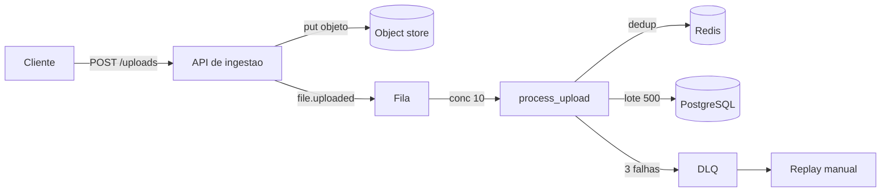
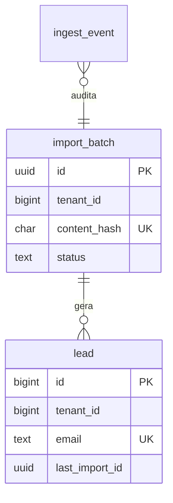
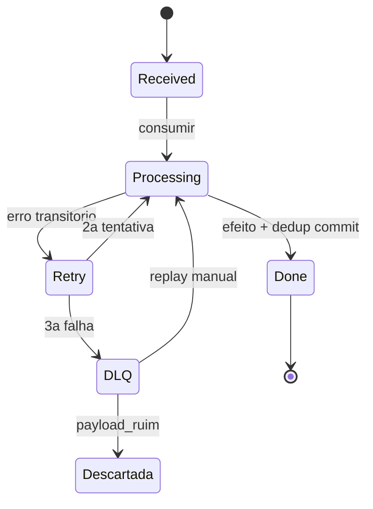

# Deck PDI: Arquitetura Serverless para Processamento Assíncrono (event-driven)

Área: Arquitetura Full Stack

Como usar: cada slide traz título, fala (o que dizer) e evidência (o que mostrar). Diagramas em `mermaid` ficam nos slides 11, 14 e 17.

## Slide 1: Resumo Executivo
Desenho serverless event-driven para processar uploads e webhooks sem servidor sempre ligado: fila + função + armazenamento, com backpressure e retries. Entrego o padrão e um handler real.
Valor: custo por uso + escala automática sob rajada.
Fala: "A mudança é simples de dizer e difícil de acertar: o request de upload não processa mais nada. Ele grava e publica evento. Todo o trabalho pesado acontece em fila, com concorrência limitada e deduplicação."
Evidência: padrão SERVERLESS-STANDARD.md e handler `process_upload.py` rodando.

## Slide 2: Contexto de Produção
Clientes enviam planilhas de 1k-50k linhas.
Worker always-on: 90% ocioso.
Pico de 200 uploads derrubava o worker.
Fala: "Três fatos do dia a dia: entrada variável, máquina parada a maior parte do tempo e pico que estoura a capacidade. É a combinação clássica de capacidade fixa contra demanda variável."
Evidência: logs de utilização do worker (90% ocioso) e registro do incidente de pico.

## Slide 3: O Problema
| Hoje | Alvo |
| --- | --- |
| worker ocioso | scale to zero |
| sem fila | queue + retry |
| sem isolamento | 1 falha não derruba |
Fala: "O alvo não é 'usar nuvem', é ter três propriedades: escala a zero quando não há carga, fila com retry quando há, e isolamento para que um arquivo ruim não derrube o resto."
Evidência: tabela acima, mantida como contrato de aceite.

## Slide 4: Diagnóstico
Processamento síncrono no request = timeout.
Sem idempotência: reprocessar duplicava leads.
Sem limite de concorrência.
Fala: "O timeout é de conta fechada: 50k linhas a 2 ms dão 100 s, e o teto da função é 60 s. A duplicação vem do retry automático do gateway, que ninguém configurou e ninguém pode desligar. A falta de limite transforma problema de CPU em problema de conexão: 200 eventos contra pool de 100."
Evidência: Exemplo numérico do README, seção Diagnóstico.

## Slide 5: Decisão Arquitetural (ADR)
ADR-033: Serverless event-driven
| Opção | Pro | Contra | Decisão |
| --- | --- | --- | --- |
| Fila + função + store | scale to zero | cold start | ESCOLHIDA |
| Lambda direto no upload | simples | sem backpressure | rejeitada |
> Nota: Upload grava objeto e publica evento; consumo com concorrência limitada e dedup.
Fala: "Três alternativas contra os mesmos quatro critérios: custo no vale, comportamento no pico, complexidade operacional e tempo até o primeiro deploy. Direto no upload morre em backpressure; VM com auto-scaling morre em custo no vale porque a mínima é cobrada 730 h por mês."
Evidência: ADR-033 com alternativas descartadas.

## Slide 6: Entregas
SERVERLESS-STANDARD.md.
process_upload.py.
terraform_serverless.tf.
Fala: "Entrego padrão (regra, tabela de decisão, anti-padrões, checklist), código com dedup e lote, e infraestrutura como código com concorrência fixa e DLQ declaradas."
Evidência: os três arquivos no repositório.

## Slide 7: Validação
Enviar 200 planilhas; medir paralelismo e custo.
Forçar falha parcial; confirmar retry + sem duplicata.
1 arquivo ruim não afeta os outros.
Fala: "Três provas, não uma: volume (200), falha forçada (retry sem duplicata) e isolamento (arquivo ruim na DLQ enquanto os demais seguem). Critérios de aceite por escrito, todos marcados no README."
Evidência: checklist de critérios de aceite do README.

## Slide 8: Métricas e SLO
| SLO | Alvo |
| --- | --- |
| Custo/1k planilhas | < R$ 0,20 |
| P95 | < 60 s |
| Duplicatas | 0 |
Fala: "Quatro números no dashboard, todo dia: idade da fila, tamanho da DLQ, duração p95 e custo do dia. Se um deles estoura, existe ação definida, não reunião para decidir o que fazer."
Evidência: seção SLO e orçamento de erro do README.

## Slide 9: Riscos
| Risco | Mitigação |
| --- | --- |
| Cold start | provisioned concurrency |
| Fila sem limite | DLQ |
Fala: "Cold start é real e incomoda no primeiro request do dia; a mitigação é concorrência provisionada só nas rotas críticas. Fila sem DLQ é o risco silencioso: uma mensagem veneno paralisa tudo."
Evidência: plan do Terraform com `reserved_concurrent_executions` e `redrive_policy`.

## Slide 10: Próximos Passos
Observabilidade por trace_id.
Workers de agentes no mesmo molde.
Fala: "Primeiro o trace do upload ao upsert para fechar o p95 por etapa; depois trocar o set em memória por store de dedup persistente; por fim repetir o molde nos workers de agentes."
Evidência: roadmap com dono e data.

## Slide 11: Modelo mental (diagrama)
Fala: "Três estações e uma fila. A primeira estação só empurra material; a fila transforma rajada em ritmo; a segunda estação tem dez caixas abertas por decisão nossa; a terceira grava em lote deduplicado. Nada de estado vive dentro da caixa, porque a caixa some."
Evidência: diagrama abaixo.

## Slide 12: Matemática da capacidade
Fala: "Lei de Little na prática: tamanho da fila é chegada vezes espera. E a capacidade é concorrência sobre tempo de serviço. Com 10 caixas e 15 s por planilha, temos 0,67 mensagem por segundo. Se chega 1 por segundo, a fila nunca para de crescer: ou dobra a concorrência para 15 arredondado em 20, ou aceita espera maior."
Evidência: conta fechada.

**Exemplo numérico:** $\mu = C/S = 10/15 = 0{,}67$ msg/s. Chegada $\lambda = 1$ msg/s. Déficit de 0,33 msg/s; em 5 minutos a fila acumula 100 mensagens. Para convergir: $C = \lceil \lambda S \rceil = 15$, adotado 20 por variabilidade (meta).

## Slide 13: Matemática do custo
Fala: "Custo é execução vezes duração vezes memória, mais o pedágio por invocação. Fechando a conta com a planilha média, chegamos abaixo de vinte centavos por mil planilhas, que é a meta."
Evidência: conta abaixo, comparada à meta da tabela de SLO.

**Exemplo numérico:** 10.000 uploads/mês × 1.500 ms × 0,5 GB = 7.500 GB-s. A R$ 0,0000166 por GB-s e R$ 0,000002 por invocação: 7.500 × 0,0000166 + 10.000 × 0,000002 = R$ 0,145 (meta), contra a meta de R$ 0,20.

## Slide 14: Arquitetura de dados (diagrama)
Fala: "O efeito durável tem quatro peças: o lote de importação guarda o que foi recebido e a chave única de dedup; o lead guarda o efeito com restrição única por tenant e e-mail; a trilha de eventos fica particionada por mês para descarte barato; o store rápido é só aceleração, a autoridade é o banco."
Evidência: DDL do README, seção Modelagem de dados do pipeline.

## Slide 15: Matriz de trade-offs
Fala: "Nenhuma escolha é gratuita. Lista do que ganhamos e do que pagamos em cada decisão."
Evidência: matriz abaixo.

| Decisão | Ganha | Paga | Aceito porque |
| --- | --- | --- | --- |
| Fila + função | Escala a zero, backpressure | Cold start | Pico é esporádico |
| Dedup em duas barreiras | Zero duplicata | 1 leitura por evento | Leitura é barata, duplicata não |
| Lote de 500 | Menos round-trips | Janela de rollback maior | 50 ms de escrita, contenção baixa |
| Payload só com URL | Fila leve | 1 busca por mensagem | Dado sensível não trafega em texto |
| Cursor em vez de OFFSET | Página estável e barata | Código um pouco mais verboso | Navegação longa é comum |
| Partição só na auditoria | DROP instantâneo | Sem chave única global lá | Dedup mora em tabela inteira |

## Slide 16: Falha e recuperação
Fala: "Quando dá errado, o caminho é escrito: retry automático três vezes, depois DLQ, depois triagem humana em três classificações. O replay é em lote de dez com dedup ligada, para não reinjetar o problema inteiro."
Evidência: tabela de modos de falha do README.

| Sintome | Causa | Recuperação |
| --- | --- | --- |
| Arquivo parado em `received` | Evento perdido | Varredura republica o evento |
| Duplicata no banco | Retry sem dedup | Chave única segura; corrige dedup e reprocessa |
| Timeout da função | Planilha de 50k linhas | Processa em lotes; se persistir, vai à DLQ |
| Mensagem veneno | Payload malformado | 3 tentativas, DLQ, replay manual corrigido |

## Slide 17: Fluxo de falha (diagrama)
Fala: "O percurso de uma mensagem que falha, com o ponto exato de decisão em cada etapa."
Evidência: diagrama abaixo e `redrive_policy` no Terraform.

## Slide 18: Validação comandada (passos da demo)
Fala: "A demo tem quatro batidas: problema e blast radius, defesa do ADR contra as alternativas, prova em produção e plano de mitigação. Em seguida, o dossiê completo em PDF."
Evidência: `DEMO-SCRIPT.md` com 18 passos e saída esperada de cada um.

## Slide 19: Decisões e tradeoffs (resumo falado)
1. **Request nunca processa:** elimina timeout; custo é status assíncrono.
2. **Idempotência por `hash(arquivo + tenant)`:** retry não duplica; custa uma leitura.
3. **DLQ após 3 tentativas:** mensagem veneno não trava a fila; exige replay manual.
4. **Payload só com URL:** fila leve; consumer busca o objeto.
5. **Serverless só onde há ociosidade:** 90% de uso parado justifica escala a zero; carga constante fica com worker.
Fala: "Cada item tem ganho e preço escritos. Ninguém aprova arquitetura que só mostra ganho."

## Slide 20: Impacto no negócio e fecho
Fala: "O cliente ganha campanha de importação em rajada sem provisionar servidor parado. O time ganha quatro números para olhar e rollback cronometrado. O próximo passo é reaproveitar o molde nos workers de agentes."
Evidência: custo por mil abaixo de R$ 0,20 (meta), p95 abaixo de 60 s (meta), zero duplicatas (meta), 80% de redução do custo ocioso (meta).

| Métrica | Antes | Depois (meta) |
| --- | --- | --- |
| Custo no vale | 100% pago | 0 |
| Custo por mil planilhas | não medido | < R$ 0,20 |
| p95 upload até processado | estourava 60 s | < 60 s |
| Duplicatas em retry | ocorriam | 0 |
| Conexões simultâneas no pico | 200 | 10 |
