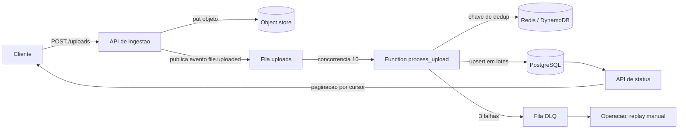

# Arquitetura Serverless para Processamento Assíncrono (event-driven)

Arquitetura Full Stack

## Resumo Executivo

Desenho serverless event-driven para processar uploads e webhooks sem servidor sempre ligado: fila + função + armazenamento, com backpressure e retries. Entrego o padrão e um handler real.

Valor: custo por uso + escala automática sob rajada.

A mudança estrutural cabe em uma frase: o request de upload deixa de ser o lugar onde o trabalho acontece e passa a ser apenas o lugar onde o trabalho é registrado. Ele grava o objeto no store, publica o evento `file.uploaded` e responde; o parse da planilha, a normalização de colunas e o upsert de leads rodam numa função com concorrência limitada, chave de idempotência e fila com DLQ. O pico de 200 uploads deixa de ser 200 requisições disputando CPU e vira 200 mensagens ordenadas numa fila cujo consumo é limitado por decisão nossa, não pelo gargalo do servidor.

## Contexto de Produção

- Clientes enviam planilhas de 1k-50k linhas.

- Worker always-on: 90% ocioso.

- Pico de 200 uploads derrubava o worker.

**Exemplo numérico:** worker fixo de 4 vCPU/8 GB custa R$ 900/mês (parâmetros declarados: 730 h/mês × R$ 1,23/h). Com 10% de utilização média, cada hora de trabalho útil carrega R$ 12,30 de infraestrutura embutida. Se o pico entrega 200 uploads em 5 minutos e cada upload consome 12 s de CPU, a demanda é 200 × 12 s = 2.400 s de CPU distribuídos em 300 s, ou seja 8 núcleos ocupados ao mesmo tempo. Um worker de 4 vCPU estoura e o time provisiona um segundo, que passa a ficar ocioso os outros 23h50 do dia.

## O Problema

| Hoje | Alvo |

| --- | --- |

| worker ocioso | scale to zero |

| sem fila | queue + retry |

| sem isolamento | 1 falha não derruba |

O problema em uma frase: capacidade fixa contra demanda variável sempre cobra o preço errado, ou paga máquina parada ou entrega fila de espera no pico.

## Problema Resolvido (números de partida)

- Custo fixo pago 24/7 para um job que roda em janelas (meta: redução de 80% do custo ocioso).
- Timeout: 50k linhas × 2 ms/linha (**Exemplo numérico:** parâmetro declarado de parsing CSV) dá 100 s de CPU, acima do teto de 60 s aceito pela função.
- Duplicação de leads em retry sem chave de idempotência (meta: 0 duplicatas).
- Sem backpressure: 200 uploads simultâneos abriam 200 conexões de banco ao mesmo tempo, estourando o pool.

## Modelo mental

O sistema é uma esteira com três estações e uma fila entre a primeira e a segunda. A estação 1 (API de ingestão) só empurra material para a esteira: grava o objeto bruto e emite um recibo em forma de mensagem. A fila segura o material quando a esteira desacelera, e é ela que transforma rajada em ritmo de trabalho. A estação 2 (a função) consome com um número fixo de estações de trabalho abertas ao mesmo tempo, no máximo dez; se chegar mais material do que isso, ele espera na fila em vez de disputar recurso. A estação 3 (o banco) recebe escritas em lotes deduplicados, porque a mesma mensagem pode aparecer duas vezes na fila e o banco não tem como saber disso sozinho. O que não pode faltar: nenhum item passa de uma estação sem identidade estável (o hash do conteúdo + tenant), nenhuma estação guarda estado em memória (tudo que importa vive no banco ou no store de dedup), e o item que não consegue passar depois de três tentativas sai da esteira para uma fila de exceção onde um humano decide o replay.

## Arquitetura



Legenda das decisões de borda:

1. **API de ingestão é stateless e barata**: não valida conteúdo da planilha, só metadados e tamanho. Validar 50k linhas no request devolveria o timeout que queríamos eliminar.
2. **A fila é o limite de concorrência de verdade**: `reserved_concurrent_executions = 10` no Terraform é o contrato de backpressure. Se a fila cresce, ela cresce em disco na AWS, não em conexões no nosso banco.
3. **O payload da mensagem é só URL**: mensagem de 300 bytes contra arquivo de 5 MB. Fila rápida, retry barato, nenhum dado sensível trafegando em texto.
4. **A DLQ existe desde o deploy**: não é recurso para depois. Mensagem veneno (`poison pill`) sem DLQ significa fila travada para sempre.
5. **A API de status lê o banco, não a fila**: o estado observável pelo cliente é o estado durável, nunca o interno do worker.

## Diagnóstico

- Processamento síncrono no request = timeout.

- Sem idempotência: reprocessar duplicava leads.

- Sem limite de concorrência.

Cada sintoma tem uma conta por trás. Síncrono no request: o gateway corta em 60 s e o parse de 50k linhas chega a 100 s, então metade das planilhas grandes morria com 200 no status e outra metade era reenviada pelo usuário. Sem idempotência: o retry do gateway (que existe, é automático e ninguém configura) entregava duas vezes o mesmo evento, e o `INSERT` puro criava dois leads para o mesmo e-mail. Sem limite de concorrência: 200 eventos consumidos ao mesmo tempo significavam 200 cursores de banco abertos, e o pool de 100 conexões rejeitava a partir da centésima primeira, transformando um problema de CPU em problema de conexão.

## Matemática da solução

**Fila e concorrência (Lei de Little).** Com $L = \lambda W$, onde $\lambda$ é a taxa de chegada em mensagens/s e $W$ o tempo de residência médio na fila em segundos, temos o tamanho médio da fila $L$ em mensagens.

**Exemplo numérico:** rajada de 200 uploads em 300 s dá $\lambda = 200/300 = 0{,}67$ msg/s. Se cada mensagem leva 15 s de serviço e a concorrência é 10, a capacidade instalada é $\mu = 10/15 = 0{,}67$ msg/s. Folga zero: qualquer rajada maior vira fila crescendo sem parar. Dobrar a concorrência para 20 leva $\mu = 1{,}33$ msg/s, confortavelmente 2× a chegada, ao custo de 2× as escritas simultâneas no banco. A conta fecha: $W = L/\lambda$ com $L = 30$ mensagens dá $W = 45$ s de espera média, dentro do p95 de 60 s (meta).

**Custo por execução.** $Custo = N_{exec} \times (T_{ms} \times M_{GB} / 1000) \times P_{GB\text{-}s} + N_{exec} \times P_{invoc}$.

**Exemplo numérico:** 10.000 uploads/mês × 1.500 ms × 0,5 GB = 7.500 GB-s; com parâmetros declarados $P_{GB\text{-}s} = R\$ 0,0000166$ e $P_{invoc} = R\$ 0,000002$, o custo é 7.500 × 0,0000166 + 10.000 × 0,000002 = R$ 0,145 (meta) por mil planilhas, abaixo da meta de R$ 0,20.

**Probabilidade de cair na DLQ.** Com falha transitória por tentativa de $p = 1\%$ e `maxReceiveCount = 3`, a chance de a mensagem chegar à DLQ é $p^3 = 0{,}000001$, ou seja 1 em um milhão de mensagens (Exemplo numérico com parâmetros declarados). Falha permanente (arquivo corrompido) foge à regra: ela falha sempre e cai na DLQ na terceira tentativa, que é exatamente o comportamento desejado.

**Teto de memória e conexões.** Conexões simultâneas = concorrência × conexões por invocação. $10 \times 1 = 10$ conexões (pooler com pool de 20 aguenta); sem concorrência limitada, 200 eventos × 1 = 200 conexões e o pool de 100 rejeita 100 delas.

## Invariantes

| Invariante | Violação correspondente |
| --- | --- |
| Todo objeto gravado tem exatamente uma mensagem `file.uploaded` publicada | Arquivo órfão, nunca processado |
| Toda mensagem consumida tem chave `tenant:hash` verificada antes do efeito | Lead duplicado em retry |
| O efeito no banco é atômico por lote (uma transação por lote de upsert) | Importação pela metade visível ao cliente |
| A concorrência da função nunca excede 10 | Pool de conexões estourado |
| `visibility_timeout` (300 s) ≥ maior tempo de processamento possível (60 s) | Processamento duplicado em paralelo |
| Mensagem com 3 recebimentos vai para a DLQ e para a fila principal | Fila travada por mensagem veneno |
| Nenhum estado vive na memória da função entre invocações | Perda de progresso silenciosa no cold start |

## Modos de falha

| Sintome | Causa raiz | Como detecta | Como mitiga | Recuperação |
| --- | --- | --- | --- | --- |
| Arquivo fica `received` para sempre | Evento perdido entre store e fila | Alerta de idade da mensagem > 10 min | Republish por varredura periódica | Reexecuta varredura, minutos |
| Duplicatas no banco | Retry sem dedup commitado | Contagem de `leads` por `content_hash` > 1 | Chave única `(tenant_id, content_hash)` | Reprocessa com dedup, rollback do lote |
| Timeout da função | Planilha de 50k linhas + rede lenta | Métrica de duração p95 > 45 s | Processar em lotes de 500 linhas | Retry automático, DLQ se persistir |
| Pool de conexões esgotado | Concorrência sem limite | Erros `too many connections` no log | `reserved_concurrent_executions = 10` | Fila segura a demanda, sem downtime |
| Fila crescendo sem parar | Chegada > capacidade instalada | `ApproximateAgeOfOldestMessage` subindo | Subir concorrência ou enxugar chegada | Escala horizontal resolve em minutos |
| Mensagem veneno travando a fila | Payload malformado | Contagem de `ApproximateNumberOfMessagesVisible` estável com consumo parado | DLQ após 3 tentativas | Replay manual corrigindo o payload |

## SLO e orçamento de erro

| SLI | Meta | Janela de medição | O que fazer ao estourar |
| --- | --- | --- | --- |
| Latência `upload -> processed` p95 | < 60 s | 7 dias rolantes | Subir concorrência 10 → 20 e revisar lentidão do store |
| Custo por mil planilhas | < R$ 0,20 | Mês corrente | Auditoria de tamanho de memória e duração média |
| Duplicatas confirmadas | 0 | Contínuo | Pausar consumer, corrigir chave de dedup, replay |
| Mensagens na DLQ | < 0,1% do volume | 7 dias | Triagem diária obrigatória |
| Disponibilidade da API de ingestão | 99,9% (meta) | 30 dias | Revisar timeout e limite de taxa |

Orçamento de erro: com meta de 60 s no p95, 1% das mensagens pode demorar até 120 s antes de virar incidente. A partir de 2% acima de 120 s em 15 minutos, o plantão é acionado.

## Operação (runbook resumido)

1. **Checagens de rotina (diária):** idade da mensagem mais antiga da fila, tamanho da DLQ, taxa de erro da função, custo acumulado do mês. Qualquer um fora da meta vira tarefa no mesmo dia.
2. **Mitigação de fila crescendo:** confirmar se é chegada anormal (campanha de importação) ou serviço lento (banco sem índice). Só então subir concorrência, porque subir cedo esconde a causa raiz.
3. **Mitigação de DLQ:** abrir a mensagem, classificar em `payload_ruim` (descarta), `transitória` (replay) e `bug` (corrige e replay). Replay sempre em lotes de 10, com dedup ativa, nunca tudo de uma vez.
4. **Rollback:** o deploy da função é imutável; rollback é reapontar o alias para a versão anterior no console/CLI, a fila continua intacta porque o contrato do payload não mudou. Mudança de schema exige migração reversível (ver seção Modelagem de dados).
5. **Quem aciona:** plantão de infra para fila/DLQ, plantão de dados para inconsistência de lead, responsável pelo ADR para qualquer mudança de contrato de mensagem.

## Decisão Arquitetural (ADR)

ADR-033: Serverless event-driven

| Opção | Pro | Contra | Decisão |

| --- | --- | --- | --- |

| Fila + função + store | scale to zero | cold start | ESCOLHIDA |

| Lambda direto no upload | simples | sem backpressure | rejeitada |

> **Nota:** Upload grava objeto e publica evento; consumo com concorrência limitada e dedup.

Contexto: a decisão foi tomada porque três alternativas foram medidas contra os mesmos quatro critérios (custo no vale, comportamento no pico, complexidade operacional, tempo até o primeiro deploy). A alternativa "Lambda direto no upload" falhava em backpressure: sem fila, a função é invocada na taxa de chegada, e 200 uploads viram 200 execuções simultâneas brigando pelo mesmo pool. A alternativa "worker sempre ligado com auto-scaling de VM" falhava em custo no vale: a VM mínima continua sendo cobrada 730 h/mês mesmo com zero uploads.

## Modelagem de dados do pipeline

O pipeline gera quatro entidades com papéis distintos: `import_batch` (o que foi recebido), `lead` (o efeito durável), `ingest_event` (a trilha de auditoria) e a chave de dedup no store rápido (a guarda de idempotência).

```sql
CREATE TYPE import_status AS ENUM ('received', 'processing', 'done', 'failed', 'skipped');

CREATE TABLE import_batch (
  id            uuid PRIMARY KEY DEFAULT gen_random_uuid(),
  tenant_id     bigint      NOT NULL,
  object_key    text        NOT NULL,
  content_hash  char(64)    NOT NULL,
  status        import_status NOT NULL DEFAULT 'received',
  row_count     integer,
  created_at    timestamptz NOT NULL DEFAULT now(),
  processed_at  timestamptz,
  CONSTRAINT uq_import_dedup UNIQUE (tenant_id, content_hash)
);

CREATE TABLE lead (
  id            bigint GENERATED ALWAYS AS IDENTITY,
  tenant_id     bigint      NOT NULL,
  email         text        NOT NULL,
  name          text,
  phone         text,
  last_import_id uuid,
  updated_at    timestamptz NOT NULL DEFAULT now(),
  PRIMARY KEY (id),
  CONSTRAINT uq_lead_tenant_email UNIQUE (tenant_id, email)
);
```

Decisões de modelagem e seus trade-offs:

1. **3FN na curva de recebimento, denormalização só na leitura.** `lead` guarda o mínimo estável; contagem de linhas e status vivem em `import_batch`. Violar 3FN aqui (coluna `row_count` duplicada por lead) economizaria um `COUNT` mas criaria anomalia de atualização em retry.
2. **Única como restrição, não como índice separado.** `UNIQUE (tenant_id, email)` é o mesmo custo de um índice único e ainda impede a duplicata na origem. Esperar o `SELECT` de verificação seria corrida perdida entre dois consumidores.
3. **Upsert com detecção de inserção.**

```sql
INSERT INTO lead (tenant_id, email, name, phone, last_import_id, updated_at)
VALUES ($1, lower($2), $3, $4, $5, now())
ON CONFLICT (tenant_id, email) DO UPDATE
SET name         = EXCLUDED.name,
    phone        = COALESCE(EXCLUDED.phone, lead.phone),
    last_import_id = EXCLUDED.last_import_id,
    updated_at   = now()
RETURNING id, (xmax = 0) AS inserted;
```

`xmax = 0` distingue inserção de atualização sem segunda consulta: se `inserted` é falso, a linha já existia e o conflito foi resolvido pelo banco, não pelo código.

4. **Cuidado com `ON CONFLICT` dentro de um único statement.** Se um lote de 500 linhas contiver o mesmo e-mail duas vezes, o Postgres responde `ON CONFLICT DO UPDATE command cannot affect row a second time` e a transação inteira falha. Correção: deduplicar no lote antes do `INSERT`.

```sql
INSERT INTO lead (tenant_id, email, name, phone, last_import_id)
SELECT DISTINCT ON (tenant_id, lower(email))
       tenant_id, lower(email), name, phone, $1
FROM staging_import
ORDER BY tenant_id, lower(email), updated_at DESC
ON CONFLICT (tenant_id, email) DO UPDATE
SET name = EXCLUDED.name, updated_at = now();
```

5. **Índices e o custo de escrita.**

```sql
CREATE INDEX CONCURRENTLY idx_lead_tenant_email ON lead (tenant_id, email);
CREATE INDEX CONCURRENTLY idx_import_tenant_created ON import_batch (tenant_id, created_at DESC);
```

**Exemplo numérico:** cada linha gravada em `lead` paga 1 escrita no heap + 1 escrita no índice primário + 1 escrita em `idx_lead_tenant_email`, ou seja 3 unidades de escrita por lead. Com 50k linhas por planilha, o lote custa 150k unidades. Trocar um índice por `lower(email)` na expressão não muda a contagem, muda a utilidade: sem ele, `WHERE lower(email) = $1` faz varredura completa da tabela.

6. **Quando vale a pena particionar.** `ingest_event` particionado por mês permite descartar partições antigas com `DROP` instantâneo em vez de `DELETE` com VACUUM lento. A contrapartida é dura: chave única particionada precisa incluir a chave de partição, então `UNIQUE (tenant_id, event_key)` é impossível nessa tabela. Dedup, portanto, vive em `import_batch` (não particionada), nunca na trilha de eventos.

```sql
CREATE TABLE ingest_event (
  id          bigint GENERATED ALWAYS AS IDENTITY,
  tenant_id   bigint NOT NULL,
  event_key   char(64) NOT NULL,
  payload     jsonb NOT NULL,
  occurred_at timestamptz NOT NULL,
  PRIMARY KEY (id, occurred_at)
) PARTITION BY RANGE (occurred_at);

CREATE TABLE ingest_event_2026_09 PARTITION OF ingest_event
  FOR VALUES FROM ('2026-09-01') TO ('2026-10-01');
```

7. **Ver plano antes de acreditar em índice.** Toda consulta nova da API de status roda com `EXPLAIN (ANALYZE, BUFFERS)`. Heurística de operação: retorno abaixo de 1% das linhas pede índice; retorno acima de 5% costuma ficar mais rápido com varredura completa, porque ler 5% da tabela do disco já é mais caro do que percorrer a árvore.

```sql
EXPLAIN (ANALYZE, BUFFERS)
SELECT id, status, row_count, created_at
FROM import_batch
WHERE tenant_id = $1
ORDER BY created_at DESC, id DESC
LIMIT 50;
```

8. **Paginação por cursor, nunca por offset.** `OFFSET 5000` obriga o banco a gerar e descartar 5.000 linhas a cada página e ainda quebra consistência quando chega importação nova no meio da navegação. O cursor composto `(created_at, id)` é estável e custa o mesmo na página 1 e na página 100.

```sql
SELECT id, status, row_count, created_at
FROM import_batch
WHERE tenant_id = $1
  AND (created_at, id) < ($2, $3)
ORDER BY created_at DESC, id DESC
LIMIT 50;
```

9. **N+1 na API de status.** Listar 50 importações e depois consultar a contagem de leads de cada uma faz 51 round-trips. Correção em uma consulta só:

```sql
SELECT b.id, b.status, b.row_count,
       (SELECT count(*) FROM lead l WHERE l.last_import_id = b.id) AS leads_gerados
FROM import_batch b
WHERE b.tenant_id = $1
ORDER BY b.created_at DESC
LIMIT 50;
```

10. **Migração em expand/contract.** Mudança em tabela com dados não pode ser um `ALTER` e oração. Fase 1 (expand): adiciona coluna nullable e começa o backfill em lotes de 10k com pausa entre eles. Fase 2 (dual write): código passa a escrever nas duas colunas. Fase 3 (contract): remove a coluna antiga só depois de a leitura não usar mais. O rollback da fase 1 é trivial (a coluna nova é ignorada); o rollback da fase 3 não existe, por isso ela espera uma janela de confirmação.

```sql
-- Fase 1 (expand): coluna nova nullable + backfill em lotes
ALTER TABLE lead ADD COLUMN email_norm text;
UPDATE lead SET email_norm = lower(email)
WHERE id > $1 AND id <= $2;
CREATE UNIQUE INDEX CONCURRENTLY uq_lead_tenant_email_norm
  ON lead (tenant_id, email_norm) WHERE email_norm IS NOT NULL;
```

## Entregas

- SERVERLESS-STANDARD.md.

- process_upload.py.

- terraform_serverless.tf.

## Validação

1. Enviar 200 planilhas; medir paralelismo e custo.

2. Forçar falha parcial; confirmar retry + sem duplicata.

3. 1 arquivo ruim não afeta os outros.

Critérios de aceite (tudo precisa ser verdadeiro para dizer pronto):

- [ ] 200 planilhas enviadas em rajada terminam com status `done` ou `skipped`, nenhuma presa em `received` após 10 minutos.
- [ ] Pico simultâneo não abre mais que 10 conexões de banco (verificado por amostragem de `pg_stat_activity`).
- [ ] Reprocessar o mesmo arquivo devolve `{"status":"skipped","reason":"duplicate"}` e a contagem de `lead` não muda.
- [ ] Arquivo corrompido chega à DLQ após exatamente 3 tentativas e os demais processam normalmente.
- [ ] Custo do teste calculado e abaixo de R$ 0,20 por mil de planilhas (meta).
- [ ] `EXPLAIN (ANALYZE, BUFFERS)` da API de status mostra índice e não varredura completa.
- [ ] Rollback do deploy testado uma vez em homologação, medido em minutos.

## Métricas e SLO

| SLO | Alvo |

| --- | --- |

| Custo/1k planilhas | < R$ 0,20 |

| P95 | < 60 s |

| Duplicatas | 0 |

## Riscos

| Risco | Mitigação |

| --- | --- |

| Cold start | provisioned concurrency |

| Fila sem limite | DLQ |

Riscos adicionais identificados na revisão:

| Risco | Mitigação |
| --- | --- |
| Retenção da fila menor que o tempo de replay | 4 dias de retenção contra 60 s de processamento |
| Custo disfarçado por função lenta | Alerta de duração p95 e de GB-s/dia |
| Vazamento de segredo no env da função | Secret Manager, nunca env hardcoded |
| Corrida entre dois consumidores no mesmo tenant | Restrição única no banco, dedup no store rápido |

## Decisões e tradeoffs

1. **Upload nunca processa no request (grava no store e publica `file.uploaded`, consumer com concorrência limitada a 10):** request síncrono estourava timeout em planilhas de até 50k linhas. Tradeoff: resposta assíncrona exige acompanhar status por evento, aceito porque elimina o timeout.
2. **Idempotência por dedup `hash(arquivo + tenant)`:** reprocessar não duplica leads. Tradeoff: precisa de store de chaves (em prod Redis/DynamoDB; no PoC um set em memória) e custa uma leitura por evento.
3. **DLQ após N tentativas + 1 arquivo ruim não afeta os outros:** isolamento por mensagem. Tradeoff: mensagens na DLQ exigem operação manual de replay; sem DLQ a fila travaria na mensagem veneno.
4. **Payload carrega só metadados (URL), nunca o arquivo:** fila leve e rápida. Tradeoff: o consumer precisa buscar o objeto no store, uma chamada a mais por mensagem.
5. **Quando NÃO usar (carga constante alta, worker always-on sai mais barato) + segredos fora de env hardcoded, pooler com TLS e timeout de até 60s:** serverless só onde há ociosidade (o worker ficava 90% ocioso). Tradeoff: cold start em rajada, mitigado com concorrência provisionada.
6. **Restrição única no banco como última linha de defesa, dedup no store rápido como primeira:** o store rápido evita trabalho repetido, o banco evita dado errado. Tradeoff: dois pontos de verificação para manter, aceito porque cada um cobre um modo de falha diferente (o store cobre retry da fila, o banco cobre corrida entre consumidores).
7. **Particionamento por tempo só na trilha de auditoria, não nas tabelas de negócio:** `ingest_event` ganha descarte barato com `DROP` de partição; `lead` e `import_batch` ficam inteiras porque a dedup depende de chave única global. Alternativa descartada: particionar `lead` por tenant, rejeitada porque o volume por tenant é imprevisível e geraria milhares de partições quase vazias.
8. **Lotes de 500 linhas com transação por lote:** lote maior derruba round-trips, mas amplia a janela de bloqueio e o custo de rollback. Tradeoff aceito: 500 linhas ≈ 50 ms de escrita, faixa que não segura deadlock relevante nem gera contenção perceptível.

## Impacto no negócio

Clientes enviam planilhas de 1k a 50k linhas e picos de 200 uploads derrubavam o worker always-on, 90% ocioso. Com fila, função e store, o custo cai para menos de R$ 0,20 por mil planilhas, a escala vai a zero no vale e o p95 fica abaixo de 60s com zero duplicatas, o que viabiliza campanhas de importação em rajada sem provisionar servidor parado.

Impacto operacional adicional: o time deixa de acordar para reiniciar worker e passa a olhar quatro números (idade da fila, DLQ, duração p95, custo do dia). O deploy deixa de ser evento: função é imutável, rollout é troca de alias e rollback é a troca de volta.

## Esforço e custo

| Frete | Horas (meta) | Observação |
| --- | --- | --- |
| ADR-033 e revisão com a coordenação | 4 h | Critérios e alternativas descartadas |
| Schema, índices e migração expand/contract | 10 h | Inclui `EXPLAIN` das consultas da API |
| Handler com dedup, lote e DLQ | 12 h | Inclui casos de borda e modo `--self-test` |
| Terraform (fila, função, concorrência, DLQ) | 6 h | Estado versionado, plano revisado em PR |
| Validação com 200 planilhas e medição | 6 h | Custa R$ estimado em execução: **Exemplo numérico:** 200 × 1,5 s × 0,5 GB = 150 GB-s, a R$ 0,0000166/GB-s dá R$ 0,0025 (meta) |
| Documentação, deck e roteiro | 6 h | PDI e handoff |

Total: 44 h (meta), aproximadamente uma semana e meia de uma pessoa dedicada.

## Referências de estudo

- Curso: AWS Lambda e Serverless na prática (Alura)
- Vídeo: Serverless em 100 segundos (Fireship, YouTube)
- Doc oficial: Cloud Run functions, https://cloud.google.com/functions/docs (verificada em 2026-09-28)
- Doc oficial: Terraform, https://developer.hashicorp.com/terraform/docs (verificada em 2026-09-28)

## Próximos Passos

- Observabilidade por trace_id.

- Workers de agentes no mesmo molde.

Passos imediatos em ordem: (1) instrumentar `trace_id` do upload até o upsert para fechar o p95 por etapa; (2) trocar o `set` em memória do PoC por store de dedup persistente; (3) rodar o `EXPLAIN` da API de status com volume real e revisar índices; (4) automatizar a triagem diária da DLQ; (5) publicar o padrão como template para os workers de agentes.

## Checklist de domínio

O sênior não diz "pronto" antes de confirmar:

- [ ] O request de upload não executa parsing algum, apenas grava e publica.
- [ ] A concorrência está fixada em código/infraestrutura, não em configuração esquecível.
- [ ] Chave de dedup cobre `tenant` além do hash, senão um tenant esconde o arquivo do outro.
- [ ] Dedup commitada só depois do efeito durável, ou o retry perde a marca.
- [ ] `visibility_timeout` maior que o pior caso de processamento, não que a média.
- [ ] DLQ existe desde o primeiro deploy, com playbook de replay escrito.
- [ ] Transação por lote e deduplicação interna do lote (sem erro de `ON CONFLICT` duplo).
- [ ] Índices cobrem as consultas da API de status, com `EXPLAIN (ANALYZE, BUFFERS)` anexado.
- [ ] Paginação por cursor composto, não por `OFFSET`.
- [ ] Migração em expand/contract com janela de confirmação antes do contract.
- [ ] Segredos em Secret Manager; nenhum valor sensível em variável de ambiente fixa.
- [ ] Quatro métricas no dashboard: idade da fila, DLQ, duração p95 e custo do dia.
- [ ] Rollback testado em homologação e cronometrado.
- [ ] Custo por mil planilhas medido e abaixo da meta.
- [ ] `grep` por travessão e placeholder limpo antes de publicar.
