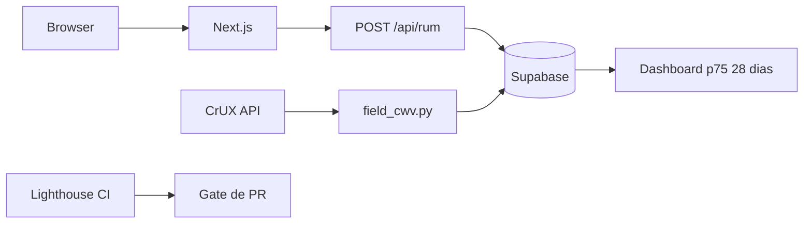
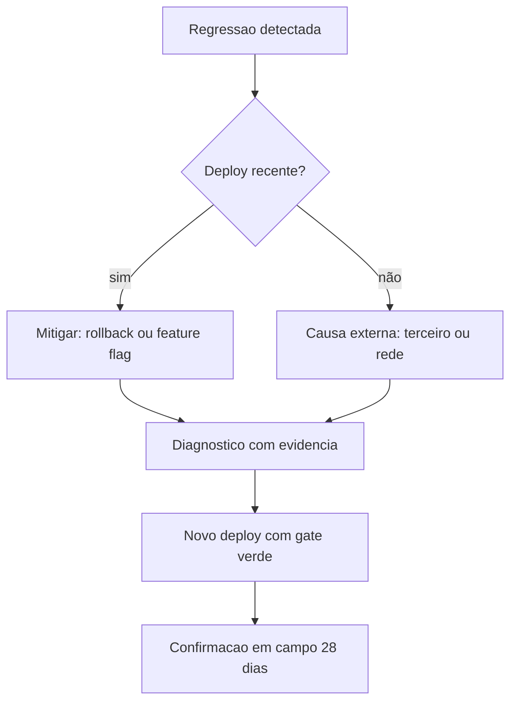
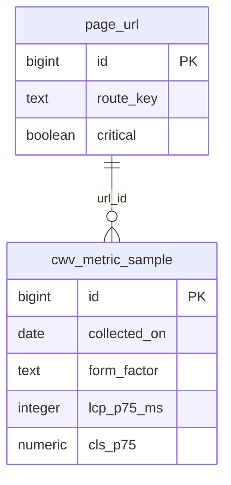

# Deck PDI: Otimização de Core Web Vitals (LCP/INP/CLS) com Diagnóstico Real

Área: Arquitetura Full Stack

## Slide 1: Resumo Executivo
Diagnóstico e plano de Core Web Vitals (LCP, INP, CLS) para as interfaces dos agentes/portal, com evidências de campo (CrUX) e laboratório, mais correções aplicadas.
CWV e sinal de ranqueamento e de retenção.
Fala: o portal saiu reprovado nas três métricas ao mesmo tempo e este trabalho entrega a causa de cada uma, a ordem de ataque e a prova de que não regressa.
Evidência: linha de base congelada por `field_cwv.py` e ADR-034 registrado.

## Slide 2: Contexto de Produção
Portais com LCP ~ 4s.
INP ruim ao clicar em ações.
CLS ao carregar cards.
Fala: três sintomas que o usuário descreve sem saber os nomes das métricas: imagem demora, botão trava, layout pula.
Evidência: relato de uso do portal mais leitura de campo p75.

## Slide 3: O Problema
| Métrica | Campo | Alvo |
| --- | --- | --- |
| LCP | 4.1 s | <= 2.5 s |
| INP | 410 ms | <= 200 ms |
| CLS | 0.22 | <= 0.1 |
Fala: a distância até o alvo é de 1,6 s no LCP, 210 ms no INP e de 0,12 no CLS. São problemas de naturezas diferentes e por isso não existe uma correção única.
Evidência: p75 de campo em janela de 28 dias.

## Slide 4: Diagnóstico
LCP: hero sem fetchpriority/preconnect.
INP: handler síncrono bloqueia.
CLS: cards sem aspect-ratio.
Fala: a árvore de decisão do diagnóstico chega a causa acionável em no máximo três ramos por métrica, sem chute.
Evidência: `1-standards/CWV-DIAGNOSTICO.md` com árvore de decisão e roteiro de coleta.

## Slide 5: Modelo mental
Fala: o main thread é único; enquanto o JavaScript executa, entrada do usuário espera. LCP depende de TTFB mais descoberta do recurso mais render. CLS mede geometria, não tempo.
Evidência: decomposição $LCP = TTFB + t_{fetch} + t_{decode/render}$ e limiar de `long task` em 50 ms.
Fecho: quem entende a fórmula escolhe a correção; quem não entende escolhe por gosto.

## Slide 6: Arquitetura

Fala: duas fontes de verdade com papéis distintos: campo decide, laboratório diagnostica. O gate de PR impede regressão antes do deploy.
Evidência: diagrama da arquitetura no README da atividade.

## Slide 7: Decisão Arquitetural (ADR)
ADR-034: Ordem de Otimização
| Opção | Pro | Contra | Decisão |
| --- | --- | --- | --- |
| LCP->INP->CLS | maior ROI | - | ESCOLHIDA |
> Nota: Medir no CrUX antes de cada mudança.
Fala: a ordem é uma decisão de negócio: LCP afasta mais gente na primeira impressão e é onde a distância até o alvo é maior.
Evidência: ADR-034 com alternativas descartadas registradas.

## Slide 8: Matemática e capacidade
$LCP = TTFB + t_{fetch} + t_{decode/render}$ e $t_{rede} = (bytes \times 8) / bandwidth$.
**Exemplo numérico:** 420 kB gzip a 1,6 Mbit/s: 420 × 8 / 1.600 = 2,1 s de transferência pura, antes de parse. Com RTT de 80 ms e 3 RTT por origem nova, mais 240 ms perdidos sem `preconnect`.
Conta fechada do plano (meta): 400 + 500 + 700 = 1.600 ms de LCP, folga de 900 ms para o limite de 2.500 ms.
Fala: cada técnica ataca um termo da fórmula; quem não sabe qual termo, não sabe se a técnica resolve.

## Slide 9: Tradeoffs (matriz)
| Técnica | Ganha | Custa | Aceito? |
| --- | --- | --- | --- |
| `priority` só no hero | LCP cedo | prioridade disputada se houver dois heróis | sim, com auditoria |
| Code splitting | menos JS no clique | atraso no 1º uso do chat/mapa | sim |
| Reserva de espaço | CLS zera | área vazia breve em conteúdo variável | sim |
| Campo em 28 dias | veredito honesto | confirmação demorada | sim, com gate em CI |
| Denormalizar p75 diário | leitura rápida | latência de até 1 dia no painel | sim, evento bruto cobre o incidente |
Fala: não existe ganho sem custo; o que defendo é o conjunto de trocas escolhido, não a ausência de troca.

## Slide 10: Entregas
CWV-DIAGNOSTICO.md.
cwv_fixes.html.
field_cwv.py.
Fala: diagnóstico replicável, correção em HTML de referência e coleta automatizada de campo.
Evidência: pastas `1-standards/`, `2-code/` e `3-supabase/`.

## Slide 11: Validação
Baseline de campo via field_cwv.py.
Aplicar correções; re-medir em 28 dias.
Confirmar LCP<=2.5, INP<=200, CLS<=0.1.
Fala: a entrega só fecha com três evidências: gate verde, laboratório dentro do alvo e campo confirmado.
Evidência: critérios de aceite numerados no README.

## Slide 12: Métricas e SLO
| SLO | Alvo |
| --- | --- |
| LCP p75 | <= 2.5 s |
| INP p75 | <= 200 ms |
| CLS p75 | <= 0.1 |
Fala: SLI é p75 de campo em janela rolante de 28 dias; meta é 75% das sessões em "bom" nas três métricas.
Evidência: consulta de tendência salva no banco com comparação contra a linha de base.

## Slide 13: Modos de falha e recuperação

Fala: a regra é mitigar primeiro e diagnosticar depois. Esperar a janela de 28 dias com piora no ar é decisão ruim.
Evidência: tabela de modos de falha do README (8 cenários com detecção e recuperação).

## Slide 14: Modelo de dados da medição

Fala: URL normalizada em tabela própria (3FN), agregado diário gravado com chave única (url, dia, formato, fonte) para a ingestão ser idempotente.
Evidência: DDL, índice BRIN de tempo, índice parcial de estouro e RLS no standard.

## Slide 15: Riscos
| Risco | Mitigação |
| --- | --- |
| Regressão | budget no CI |
| CrUX baixo | RUM próprio |
Fala: dois riscos endêmicos: alguém quebrar o orçamento sem perceber, e origem sem volume de amostra para reportar campo.
Evidência: asserção de orçamento no pipeline e caminho alternativo de coleta via RUM.

## Slide 16: Esforço, próximos passos e fecho
Exemplo numérico (meta): 12 h de diagnóstico, 16 h de LCP, 20 h de INP, 8 h de CLS, 16 h de CI e RUM, total de 72 h.
Lighthouse CI no pipeline.
RUM de INP por rota.
Fala: com o gate no CI, a otimização vira estado e não evento; o próximo passo é o RUM por rota para pegar o INP que o CrUX não segmenta.
Evidência: checklist de domínio com 14 itens antes de dizer pronto.
