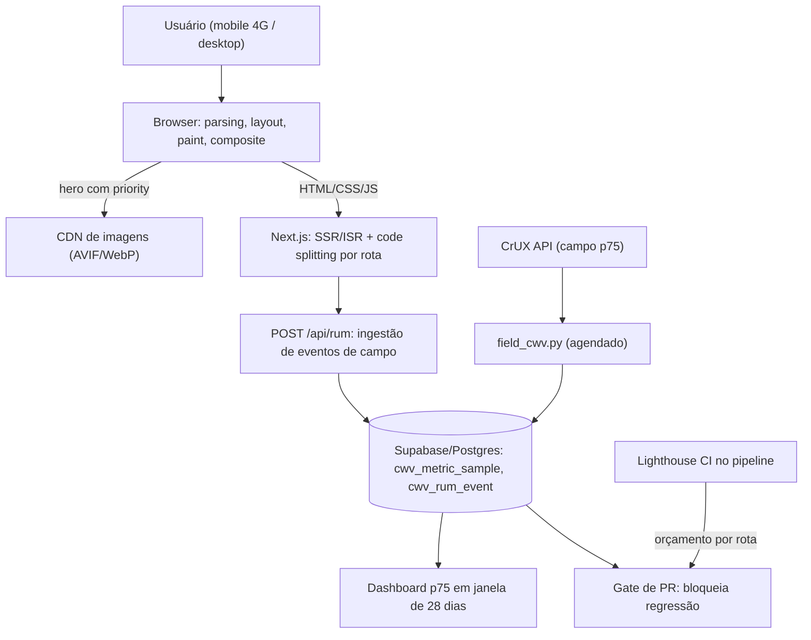

# Otimização de Core Web Vitals (LCP/INP/CLS) com Diagnóstico Real

Arquitetura Full Stack

## Resumo Executivo

Diagnóstico e plano de Core Web Vitals (LCP, INP, CLS) para as interfaces dos agentes/portal, com evidências de campo (CrUX) e laboratório, mais correções aplicadas.

CWV e sinal de ranqueamento e de retenção.

## Problema Resolvido

Os portais do time estavam fora do limiar do Google nas três métricas ao mesmo tempo. A linha de base de campo (p75, janela de 28 dias) era LCP de 4,1 s, INP de 410 ms e CLS de 0,22, contra limites de 2,5 s, 200 ms e 0,1. Nenhum dos defeitos vinha de causa única: o LCP era gargalo de rede mais prioridade errada na descoberta do recurso, o INP era gargalo de CPU no main thread depois do clique, e o CLS era ausência de reserva de espaço em elementos que chegam depois do primeiro paint.

O sintoma relatado pelo usuário traduzia isso em linguagem de gente: a página "abria", mas a maior imagem demorava a aparecer, os botões travavam um instante quando clicados e o layout pulava quando os cards terminavam de carregar. O efeito de negócio é duplo: perda de retenção nas sessões lentas e degradação do sinal de ranqueamento, porque Core Web Vitals compõe os sinais de experiência de página usados na busca.

A entrega deste trabalho não é só a lista de correções. É o diagnóstico com evidência reproduzível, a ordem de ataque justificada por ROI (ADR-034), os artefatos de código (`cwv_fixes.html`, `example_next.tsx`), a coleta automatizada de campo (`field_cwv.py` lendo a CrUX API) e o orçamento de performance que transforma "não regredir" em regra de pipeline, não em expectativa de gente boa.

## Contexto de Produção

- Portais com LCP ~ 4s.

- INP ruim ao clicar em ações.

- CLS ao carregar cards.

## O Problema

| Métrica | Campo | Alvo |

| --- | --- | --- |

| LCP | 4.1 s | <= 2.5 s |

| INP | 410 ms | <= 200 ms |

| CLS | 0.22 | <= 0.1 |

## Diagnóstico

- LCP: hero sem fetchpriority/preconnect.

- INP: handler síncrono bloqueia.

- CLS: cards sem aspect-ratio.

Leitura técnica de cada constatação:

- **LCP**: a imagem principal só entrou na fila de descoberta do navegador quando o CSS já estava interpretado, ou seja, depois de dois saltos de rede. Sem `fetchpriority="high"` e sem `preconnect` nas origens de CDN, o navegador abre a conexão tarde e disputa largura de banda com scripts não críticos que, tecnicamente, ajudam menos a primeira impressão.

- **INP**: o handler de clique fazia trabalho síncrono pesado (processamento, montagem de lista, chamada de rede disparada de forma bloqueante) dentro de uma única task. Toda task acima de 50 ms é `long task` e impede o navegador de processar a entrada seguinte, que é exatamente o que o INP mede.

- **CLS**: os cards não declaravam `width`, `height` nem `aspect-ratio`. Enquanto a imagem ou o dado chegava, o bloco tinha altura zero e, ao renderizar, empurrava todo o conteúdo de baixo para baixo. O navegador pontua isso como layout shift: distância percorrida multiplicada pela fração do viewport afetada.

## Modelo mental

O navegador não "abre a página" de uma vez: baixa o HTML, monta o DOM, baixa o CSS, monta o CSSOM, calcula layout, pinta e compõe. Cada etapa pode virar gargalo do LCP, e enquanto o JavaScript executa o main thread fica ocupado, porque existe só um. O INP mede exatamente essa ocupação depois de um clique, toque ou tecla: o tempo desde a entrada até a apresentação do resultado na tela. O CLS não mede tempo, mede geometria: se um elemento visível muda de posição sem que o usuário tenha provocado a mudança, o navegador soma a distância percorrida ponderada pela fração do viewport afetada.

O número que decide classificação é o percentil 75 (p75) em janela de 28 dias, por origem e formato de aparelho: a experiência é considerada boa quando 75% das sessões estão dentro do limite em cada uma das três métricas. Laboratório (Lighthouse) serve para achar o elemento culpado e para barrar regressão no CI, mas nunca dá o veredito, porque não reproduz rede 4G, aparelho intermediário nem o estado de cache do usuário real.

Ponto de confusão que separa sênior de pleno: as três métricas têm ciclos de vida diferentes. LCP congela depois da primeira interação do usuário, CLS acumula em janelas de sessão de 5 segundos separadas por 1 segundo de silêncio, e INP é um percentil de muitas interações, não um número único por página. Por isso o plano trata cada métrica com técnica própria e verificador próprio, e por isso a ordem de ataque é uma decisão de negócio (ADR-034), não um gosto pessoal.

## Arquitetura

Legenda das decisões de borda:

- **Borda browser/CDN**: `fetchpriority="high"` só no elemento LCP da rota e `preconnect` nas origens já conhecidas. A regra é um único elemento com prioridade alta por página; dois heróis com prioridade alta disputam entre si e o ganho anula.
- **Borda app/banco**: ingestão de RUM é escrita por endpoint dedicado com validação e idempotência, nunca por conexão direta do browser ao Postgres. O browser não pode escolher schema nem acumular custo de escrita.
- **Borda campo/laboratório**: CrUX e RUM respondem a "o que o usuário sentiu"; Lighthouse e CI respondem a "o que este commit quebrou". Nenhuma das duas fontes substitui a outra, e o relatório sempre indica qual das duas está falando.
- **Borda CI**: o orçamento de performance é asserção de pipeline com o mesmo peso de teste quebrado. Sem isso, a otimização vira evento e não estado.

## Matemática da solução

### 1. Decomposição do LCP

$LCP = TTFB + t_{fetch} + t_{decode/render}$

Toda decisão de otimização do LCP precisa dizer qual dos três termos ela ataca. Otimizar `next/image` sem olhar o TTFB resolve 0 do primeiro termo.

**Exemplo numérico:** linha de base da rota principal com os parâmetros: TTFB de 1.100 ms, download da imagem herói de 1.200 ms em rede de 1,6 Mbit/s, decode mais render de 1.800 ms. Soma: 1.100 + 1.200 + 1.800 = 4.100 ms, que é o LCP de 4,1 s medido. Alvo do plano (meta): TTFB de 400 ms com cache na borda, download de 500 ms com AVIF menor e conexão já aberta, decode/render de 700 ms com imagem com dimensões declaradas: 400 + 500 + 700 = 1.600 ms, folga de 900 ms em relação ao limite de 2.500 ms.

### 2. Custo de rede por byte e por conexão

$t_{rede} = \frac{bytes \times 8}{bandwidth}$

e o custo de abrir conexão é $t_{conn} \approx n_{RTT} \times RTT$, com 3 RTT típicos de handshake TLS 1.3 mais DNS.

**Exemplo numérico:** bundle de 420 kB gzip transmitido a 1,6 Mbit/s: 420 × 8 = 3.360 kbit; 3.360 / 1.600 = 2,1 s de transferência pura, antes de qualquer parse. Com RTT de 80 ms e 3 RTT por origem nova: 3 × 80 = 240 ms perdidos só por abrir a conexão tarde. O `preconnect` não reduz o bytes, reduz o $t_{conn}$; o `preload` reduz o atraso entre o parse e o início da transferência. São alvos diferentes e atacam termos diferentes da fórmula do LCP.

### 3. Orçamento de INP e o limiar de long task

$INP \approx t_{input\_delay} + t_{processing} + t_{presentation}$

O limiar de `long task` é 50 ms: acima disso o navegador já não consegue reagir a entradas seguintes dentro do quadro.

**Exemplo numérico:** orçamento de 200 ms repartido (meta) em 40 ms de `input delay`, 100 ms de processamento e 60 ms de apresentação. O handler que hoje leva 410 ms precisa cair para 100 ms de processamento: se o trabalho total é de 400 ms de CPU, fatiar em blocos de 8 ms com `yield` entre eles (o valor já usado em `cwv_fixes.html`) mantém cada task muito abaixo de 50 ms e devolve o main thread ao navegador entre as fatias. Custo da fatia: 400 / 8 = 50 fatias; o overhead de agendamento é irrelevante frente aos 310 ms que precisam sumir.

### 4. Pontuação de CLS

$CLS = \min\left(1,\ \sum \frac{distância\ movida}{tamanho\ do\ viewport} \times \frac{área\ afetada}{área\ do\ viewport}\right)$

por janela de sessão de no máximo 5 segundos, com 1 segundo de silêncio encerrando a janela; a métrica reportada é a pior janela, limitada a 1.

**Exemplo numérico:** card que desloca 96 px em viewport de 640 px de altura com 50% de sua área visível afetada: distância 96 / 640 = 0,15; impacto 0,5; produto 0,15 × 0,5 = 0,075. Três shifts desse tipo na mesma janela: 3 × 0,075 = 0,225, arredondado igual ao 0,22 medido. Conclusão prática: corrigir um único card pode não bastar, porque a janela soma; e separar os shifts por mais de 1 segundo de propósito não reduz a pontuação, apenas troca a janela.

### 5. Custo de índice e de consulta no banco de campo

Para responder "p75 da rota X nos últimos 28 dias", o banco precisa varrer amostras temporais. O custo de leitura cai com índice, e o custo de escrita sobe junto: cada índice B-tree extra é uma estrutura a manter por `insert`/`upsert`.

**Exemplo numérico:** 1.000 eventos de RUM por segundo com 4 índices B-tree na tabela: o banco mantém, no limite, 4.000 atualizações de índice por segundo além da escrita da linha. Um índice BRIN sobre a coluna de tempo em uma tabela append-only custa fração do tamanho do B-tree, porque guarda resumo por bloco, e é a escolha certa quando a consulta é sempre "intervalo de tempo" e nunca "igualdade em coluna de baixa cardinalidade".

A regra de leitura é sempre a mesma: antes de aceitar um plano, rodar `EXPLAIN (ANALYZE, BUFFERS)` e conferir três coisas: se houve `Seq Scan` onde deveria haver `Index Scan`, quantas linhas o filtro reduziu de verdade, e quantos blocos de dados foram lidos do disco versus servidos do cache.

## Invariantes

| Invariante | O que vira se violar | Como detectar |
| --- | --- | --- |
| Exatamente um elemento por rota com `fetchpriority="high"` | Heróis disputam prioridade e o LCP não melhora | Auditoria estática do HTML gerado + teste Lighthouse |
| Toda `` acima do fold declara `width`/`height` ou `aspect-ratio` | CLS volta a subir com qualquer troca de dado | Assersão de CLS no CI e revisão de código |
| Nenhum script não crítico bloqueia o parser | INP e LCP pioram junto | Verificação de `defer`/`async` na saída do build |
| Bundle por rota respeita o orçamento de kB gzip | Regressão silenciosa de INP a cada merge | Orçamento no Lighthouse CI |
| Ingestão de RUM é idempotente por chave | Duplicação infla amostra e distorce p75 | Chave única no banco + teste de reenvio |
| Toda métrica publicada indica fonte (campo ou laboratório) e janela | Decisão tomada com número errado | Revisão de relatório e contrato da API |
| Orçamento de performance é asserção de pipeline | A otimização vira evento, não estado | Pipeline que falha quando o orçamento estoura |

## Modos de falha

| Sintoma | Causa raiz | Como detecta | Como mitiga | Recuperação |
| --- | --- | --- | --- | --- |
| LCP pula de 2,4 s para 4,0 s depois do deploy | Imagem herói perdeu `priority` ou passou a vir de outra origem sem `preconnect` | CrUX p75 por origem + diff do HTML gerado | Rollback do template de imagem | Minutos com rollback; 28 dias para o campo confirmar |
| INP estoura em uma rota específica | Componente pesado voltou a ser importado estático no lugar de `dynamic import` | RUM por rota + perfil de `long task` | Remover o import estático e restabelecer code splitting | Próximo build; bloqueado pelo orçamento no CI |
| CLS sobe após campanha | Banner ou card inserido acima do fold via JS tarde, sem reserva de espaço | Sessões de CLS no RUM + gravação de replay | Reservar com `aspect-ratio` e `min-height` | Correção no ar; janela de 5 s do CLS some na próxima sessão |
| CrUX não devolve dado da URL | Volume de amostra insuficiente na origem | `field_cwv.py` sinalizando resposta sem métrica | Trocar para RUM próprio e agregar por rota | Sem parada: o RUM cobre a lacuna |
| Tag manager reintroduz script bloqueante | Terceiro carregado sem `defer` em produção | Diferença entre build de CI e HTML público | Desativar a tag e reprocessar com carregamento adiado | Horas; exige confirmação em campo |
| Página pisca com texto invisível | Fonte carregada sem estratégia de swap apropriada | Métrica de fonte + inspeção de `font-display` | Preload da fonte com `size-adjust` e `font-display` compatível | Próximo deploy |
| Ingestão de RUM grava duplicado | Reenvio sem chave de idempotência após timeout | Contagem de eventos por chave na janela | `insert ... on conflict do update` na chave única | Reconciliação pontual do lote afetado |
| Orçamento no CI não pega regressão | Budget mal calibrado ou audit desativado | Teste do pipeline com commit proposital ruim | Corrigir asserção e voltar a rodar o gate | Imediato após correção da asserção |

## SLO e orçamento de erro

- **SLI**: percentil 75 de LCP (ms), INP (ms) e CLS (adimensional) medido em campo, por origem e formato de aparelho, em janela rolante de 28 dias.
- **Meta**: 75% das sessões em "bom" nas três métricas ao mesmo tempo (LCP até 2,5 s, INP até 200 ms, CLS até 0,1).
- **Janela de medição**: 28 dias para campo (CrUX e RUM); sessão de 5 segundos para cada janela de CLS; por interação para INP.
- **Orçamento de erro (meta)**: no máximo 1 rota em regressão por release, e nenhuma regressão que permaneça mais de 2 releases sem plano. Regressão é qualquer rota que cruze o limite de campo depois do deploy.
- **Quando estoura**: primeiro rollback ou feature flag desligando a mudança, depois diagnóstico com evidência (diferença de HTML, perfil de `long task`, sessão de CLS), e só então novo deploy. Nunca "acompanhar por 28 dias" sem mitigação ativa: a janela de campo é para confirmar melhoria, não para conviver com piora.
- **Falso positivo esperado**: janela de 28 dias tem memória longa. Uma melhoria recém-publicada leva até 28 dias para aparecer no CrUX inteiro; por isso o gate de regressão usa o CI (laboratório) em tempo real e o campo serve de confirmação.

## Operação

Runbook resumido:

1. **Checagens rotineiras**: rodar `field_cwv.py` na frequência acordada, conferir p75 das três métricas por origem, comparar com a leitura anterior e olhar o gate do último merge.
2. **Alerta de regressão**: se uma métrica cruzar o limite, abrir ocorrência, identificar a rota e o último deploy que tocou nela.
3. **Mitigação imediata**: rollback do deploy ou desligamento da feature responsável. Ação em minutos, sem discussão de causa nesse momento.
4. **Diagnóstico**: diff do HTML gerado, `EXPLAIN`/perfil de `long task` da rota, conferência de dimensões das imagens e de `fetchpriority`.
5. **Rollback**: voltar à versão anterior do template e do bundle; confirmar com medição de laboratório antes de voltar a campo.
6. **Quem aciona**: quem está de plantão na frente, com apoio de quem detém a rota afetada; decisão de rollback é de quem responde pela experiência, não de quem fez o commit.

## Decisão Arquitetural (ADR)

ADR-034: Ordem de Otimização

| Opção | Pro | Contra | Decisão |

| --- | --- | --- | --- |

| LCP->INP->CLS | maior ROI | - | ESCOLHIDA |

> **Nota:** Medir no CrUX antes de cada mudança.

Leitura do ADR em detalhe: a ordem escolhida ataca primeiro a métrica com maior distância até o alvo e maior impacto de primeira impressão (LCP), depois a métrica ligada a interação direta (INP) e por último a métrica de estabilidade visual (CLS). Alternativas avaliadas e descartadas ficam registradas na seção de tradeoffs.

## Entregas

- CWV-DIAGNOSTICO.md.

- cwv_fixes.html.

- field_cwv.py.

## Validação

1. Baseline de campo via field_cwv.py.

2. Aplicar correções; re-medir em 28 dias.

3. Confirmar LCP<=2.5, INP<=200, CLS<=0.1.

### Critérios de aceite

1. **Campo**: p75 de LCP <= 2.500 ms, INP <= 200 ms e CLS <= 0,1 na janela de 28 dias, para cada formato de aparelho reportado.
2. **Laboratório**: orçamento de performance por rota verde no CI para as rotas críticas, sem `long task` acima de 50 ms no caminho do clique principal.
3. **Estrutura**: apenas um elemento com `fetchpriority="high"` por página; toda imagem acima do fold com dimensão declarada; nenhum script não crítico bloqueando o parser.
4. **Dados**: ingestão de RUM idempotente (reenvio do mesmo lote não altera p75), leitura de histórico paginada por cursor, e RLS ativo em toda tabela de métrica.
5. **Operação**: `field_cwv.py` executável de ponta a ponta com saída legível, runbook com rollback testado e alerta disparando em teste proposital de regressão.

## Métricas e SLO

| SLO | Alvo |

| --- | --- |

| LCP p75 | <= 2.5 s |

| INP p75 | <= 200 ms |

| CLS p75 | <= 0.1 |

## Riscos

| Risco | Mitigação |
| --- | --- |
| Regressão | budget no CI |
| CrUX baixo | RUM próprio |

## Decisões e tradeoffs

1. **Ordem de otimização LCP, INP e depois CLS (ADR-034, maior ROI):** ataca primeiro o que mais pesa na experiência e no ranqueamento. Tradeoff: o CLS visível continua por mais um ciclo; aceito porque o LCP de 4,1s afasta mais usuário que o deslocamento de layout.
2. **Medir no CrUX (campo, p75, janela de 28 dias) antes de cada mudança via `field_cwv.py`:** laboratório não captura gargalo real. Tradeoff: ciclo de confirmação de 28 dias; o Lighthouse guia o dia a dia e o campo da o veredito.
3. **LCP com `next/image priority` no hero + preconnect + AVIF:** entrega a maior imagem cedo. Tradeoff: priority na imagem errada atrasa o resto; só o hero recebe.
4. **INP com dynamic import e code splitting por rota + debounce:** o handler síncrono que bloqueava (410ms) sai do caminho crítico. Tradeoff: o chunk sob demanda pode dar atraso no primeiro uso do componente pesado (chat, mapa).
5. **CLS com `aspect-ratio` e width/height reservados, sem inserir conteúdo acima do fold via JS tardio:** os cards param de pular (0,22 para 0,1 ou menos). Tradeoff: a reserva fixa pode deixar espaço vazio breve em conteúdo variável; melhor que o salto.
6. **Ingestão de RUM em endpoint próprio com idempotência e rate limit, e não conexão direta do browser ao Postgres:** mantém schema sob controle do servidor e o custo de escrita previsível. Tradeoff: mais uma superfície de API para versionar e monitorar; aceita porque a alternativa entrega credencial de escrita ao cliente e abre janela de abuso.
7. **Agregado diário de p75 materializado para o dashboard, mantendo o evento bruto para investigação:** leitura de painel fica em milissegundos e não varre a tabela de eventos a cada load. Tradeoff: dado agregado tem latência de até 1 dia e não serve para incidente em tempo real; por isso o incidente usa o evento bruto.
8. **Índice BRIN no tempo da tabela de eventos e B-tree só nas chaves de igualdade:** o BRIN é minúsculo e rápido em escrita, mas ineficaz se a ordenação física da tabela não correlacionar com o tempo. Tradeoff: exige tabela com escrita ordenada e `VACUUM` saudável; se a correlação quebrar, o plano de consulta piora e o `EXPLAIN` avisa.

### Alternativas descartadas

- **Otimizar as três métricas ao mesmo tempo em um único ciclo:** descartada porque multiplica risco de regressão e impede isolar a causa de qualquer mudança na leitura de campo. A janela de 28 dias não permite separar efeitos de três frentes simultâneas.
- **Medir só com Lighthouse e considerar resolvido:** descartada porque laboratório não representa rede, aparelho nem cache reais. O veredito de campo é quem confirma.
- **Só cache agressivo no CDN sem mexer em prioridade:** descartada porque reduz o termo $t_{fetch}$ apenas para quem já tinha conexão quente; não resolve o primeiro acesso nem o TTFB.
- **Adiar tudo com `loading="lazy"` indiscriminado na página inteira:** descartada porque `lazy` no elemento LCP atrasa justamente o recurso que precisa ser o mais rápido da página. Lazy serve para o que está fora do primeiro viewport.
- **Reescrever o front em outra stack para resolver performance:** descartada por custo e risco. As causas são de entrega de recurso e de orçamento de JS, corrigíveis no código atual.

## Impacto no negócio

Portais com LCP de 4,1s, INP de 410ms e CLS de 0,22 perdiam retenção e sinal de ranqueamento. Com o plano, a meta e 75% das sessões no "bom" (LCP até 2,5s, INP até 200ms, CLS até 0,1), o que reduz abandono no portal de agentes e protege tráfego orgânico sem reescrever o front.

Leitura de custo do problema em termos de operação: cada rota crítica fora do limite exige investigação manual depois do deploy, e cada investigação consome hora de gente que poderia estar entregando feature. O orçamento de performance no CI troca essa hora por um gate automático.

## Esforço e custo

**Exemplo numérico (parâmetros declarados, projeção com (meta)):** diagnóstico e baseline com `field_cwv.py`, 12 h (meta); correções de LCP em template e imagens, 16 h (meta); correções de INP com code splitting e fatiamento de handler, 20 h (meta); correções de CLS em cards e slots, 8 h (meta); orçamento no CI e RUM, 16 h (meta). Total: 72 h (meta) de esforço de engenharia, sem custo de infraestrutura nova, porque a coleta usa a API já existente e o banco já provisionado.

Custo de operação incremental: execução agendada do script de coleta e retenção das amostras por 13 meses (meta), sem serviço pago novo. Se o volume de eventos exigir retenção maior, o custo cresce pelo armazenamento, e a decisão de descartar partições antigas passa a ser de negócio, não de desempenho.

## Referências de estudo

- Curso: Learn Performance (web.dev, Google)
- Vídeo: Core Web Vitals (Google Chrome Developers, YouTube)
- Doc oficial: Web Vitals, https://web.dev/vitals/ (verificada em 2026-09-28)
- Doc oficial: PageSpeed Insights, https://developers.google.com/speed/docs/insights/v5/about (verificada em 2026-09-28)

## Próximos Passos

- Lighthouse CI no pipeline.

- RUM de INP por rota.

- Consolidar alerta de regressão ligado ao p75 rolante de 28 dias e ao gate do merge.

- Migrar a leitura de histórico para paginação por cursor e materializar o agregado diário de p75.

## Checklist de domínio

Antes de dizer "está pronto", o sênior confere:

1. A linha de base veio de campo, com p75 e janela de 28 dias declarados, e não só de laboratório.
2. Cada correção aponta qual termo da fórmula do LCP ou do INP ela ataca.
3. Existe exatamente um elemento com `fetchpriority="high"` por rota, verificado no HTML gerado.
4. Toda imagem acima do fold tem dimensão declarada; nenhuma usa `lazy` no primeiro viewport.
5. Nenhum handler do caminho crítico executa mais de 50 ms sem `yield`.
6. Orçamento de bundle por rota está como asserção de CI, não como relatório manual.
7. A ingestão de RUM é idempotente e resistiu ao teste de reenvio do mesmo lote.
8. Leitura de histórico página por cursor; nenhuma tela usa `offset` profundo.
9. Tabelas de métrica têm RLS ligado e escrita restrita ao serviço de ingestão.
10. Existe `EXPLAIN (ANALYZE, BUFFERS)` salvo para a consulta principal do dashboard.
11. O runbook tem rollback testado, com responsável nomeado por etapa.
12. Todo número publicado indica fonte (campo ou laboratório), formato de aparelho e janela.
13. A regressão proposital inserida no pipeline falhou o gate como esperado.
14. O relatório final não promete melhoria antes da confirmação em campo.
