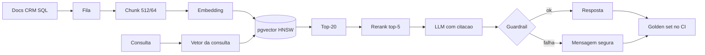

# Deck PDI: Fundamentos de IA Generativa (NVIDIA DLI) aplicados a RAG

Área: Engenharia de IA

## Slide 1: Resumo Executivo
Conclusão do curso NVIDIA DLI 'Building RAG Agents with LLMs' com transposição prática. Entrego notas e um notebook funcional de RAG end-to-end.
A base sustenta as próximas atividades (RAG híbrido, multi-agente, custos).
Fala: o que saiu desta atividade é um baseline reproduzível, com parâmetros fixados em ADR-041, medidos contra golden set e protegidos por guardrails.
Evidência: `DLI-NOTES.md`, `rag_baseline.py`, `CONCLUSAO.md`.

## Slide 2: Contexto de Produção
Time comenta 'RAG' mas sem padrão de chunking.
Similaridade pura trazia contexto irrelevante.
Sem métrica de qualidade.
Fala: sem fatia controlada, dois índices feitos na mesma semana devolviam trechos diferentes para a mesma pergunta.
Evidência: diagnóstico registrado no README da atividade.

## Slide 3: Diagnóstico
Chunk grande -> ruído; pequeno -> perde contexto.
Embedding sem normalização.
Sem rerank -> top-k ruído.
Fala: cada sintoma tem causa mensurável. Chunk grande dilui atenção, chunk pequeno parte a evidência, vetor sem norma vicia o score.
Evidência: correlação entre parâmetro e falha descrita no standard DATA-PIPELINE-AI.

## Slide 4: Modelo mental do pipeline
Passo 1: fatiar em 512 tokens com overlap 64.
Passo 2: vetorizar cada chunk em dimensão fixa normalizada.
Passo 3: buscar top-20 por cosseno e reordenar com rerank para 5.
Passo 4: gerar resposta com citação obrigatória de `chunk_id`.
Passo 5: avaliar contra golden set e bloquear se reprovar.
Fala: o que separa RAG amador de RAG operável é o rerank e a avaliação, não o modelo.
Evidência: seção Modelo mental do README.

## Slide 5: Arquitetura

Fala: ingestão é caminho frio com fila, consulta é caminho quente sem fila, e avaliação roda fora da requisição.
Evidência: diagrama do README com legenda das decisões de borda.

## Slide 6: Decisão Arquitetural (ADR)
ADR-041: Baseline RAG
| Opção | Pro | Contra | Decisão |
| --- | --- | --- | --- |
| Chunk 512 + overlap 64 + rerank | coeso | mais tokens | ESCOLHIDA |
> Nota: Normalizar embeddings; top-k=20 + rerank para top-5.
Fala: a escolha não é a melhor em abstrato, é a melhor sob a restrição de orçamento de tokens e de latência.
Evidência: ADR-041 com alternativas descartadas e motivo de cada recusa.

## Slide 7: Matemática com conta fechada
Volume do índice: ceil(N / (S - O)).
Exemplo numérico: 1.000.000 de tokens, S = 512, O = 64, passo 448, resultado 2.232 chunks.
Com overlap zero: 1.953 chunks. Diferença de 279 vetores, ou 14 por cento, pago uma vez na indexação.
Custo de contexto por consulta: 5 chunks x 512 tokens = 2.560 tokens de entrada mais prompt e pergunta.
Fala: todo parâmetro desta atividade tem uma conta atrás, não uma preferência.
Evidência: seção Matemática da solução do README.

## Slide 8: Matriz de tradeoff
| Decisão | Ganho | Pagamento | Quando reavaliar |
| --- | --- | --- | --- |
| Chunk fixo 512 | orçamento previsível | perde adaptação a documento assimétrico | corpus com seções muito desiguais |
| Overlap 64 | fronteira coberta | 14 por cento a mais de vetores | armazenagem pesar 10x |
| Rerank top-5 | menos ruído no prompt | latência por consulta | p95 acima de 800 ms |
| Fail-closed | risco zerado | falso positivo bloqueia resposta boa | bloqueio acima de 3 por cento |
Fala: cada linha mostra o que foi aceito para ter o que foi ganho.
Evidência: matriz de tradeoffs do README.

## Slide 9: Falha e recuperação
Sintome: resposta plausível fora do corpus. Causa: rerank ausente ou k pequeno. Detecção: faithfulness abaixo de 0,8. Mitigação: subir candidatos e medir recall@5. Recuperação: minutos, sem reindexar.
Sintome: vetor congelado ou sem normalização. Causa: espaço inconsistente. Detecção: score com variância quase nula. Mitigação: normalizar na escrita e na leitura. Recuperação: reindexar.
Sintome: documento novo invisível. Causa: fila parada. Detecção: contagem de chunks por doc_id não cresce. Mitigação: drenar backlog. Recuperação: minutos a horas.
Fala: toda falha tem sintome, detecção, mitigação e tempo de recuperação escritos antes de acontecer.
Evidência: tabela de modos de falha do README e runbook da seção Operação.

## Slide 10: Entregas
DLI-NOTES.md.
rag_baseline.py.
CONCLUSAO.md.
Fala: notas com justificativa de cada parâmetro, código que roda do zero e checklist de conclusão.
Evidência: árvore de entregas da atividade.

## Slide 11: Validação
Rodar rag_baseline.py.
Medir faithfulness em 10 perguntas.
Comparar com similaridade pura.
Fala: a comparação é controlada, mesmo embedder e mesma consulta, variando só a reordenação.
Evidência: critério de aceite com posição média do primeiro trecho relevante.

## Slide 12: Métricas
| SLO | Alvo |
| --- | --- |
| Faithfulness | >= 0.8 |
| Chunk | 512/64 |
Complemento: recall@5, score médio do golden set, custo por consulta e latência p95 por etapa.
Fala: métrica sem janela de medição e sem ação de estouro não é SLO, é aspiração.
Evidência: tabela de SLI, meta, janela e ação do README.

## Slide 13: Invariantes
Todo vetor gravado está normalizado.
Toda resposta cita ao menos um `chunk_id` recuperado.
Nenhuma resposta passa com guardrail reprovado.
O golden set só muda com revisão registrada.
Fala: violar qualquer uma dessas quatro invalida a avaliação inteira.
Evidência: seção Invariantes do README, com a violação correspondente.

## Slide 14: Riscos
| Risco | Mitigação |
| --- | --- |
| Contexto irrelevante | rerank |
| Hallucination | cite trecho |
Riscos adicionais: regressão silenciosa com gate de CI, vazamento de PII com guardrail de saída, fatura fora do orçamento com contagem prévia de tokens.
Fala: risco sem controle dono e sem detecção é dívida assumida.
Evidência: tabela de riscos com dono no README.

## Slide 15: Esforço e custo
Leitura e notas do curso, implementação do baseline, curadoria do golden set de 50 pares, indexação do corpus de teste e execução diária do gate de CI.
Parâmetros da conta: tokens do corpus, preço por mil tokens de embedding, preço de entrada e saída do gerador, consultas por dia.
Fala: com esses quatro números a planilha fecha sem estimativa adicional.
Evidência: seção Esforço e custo com projeção marcada como meta.

## Slide 16: Próximos Passos
RAG híbrido (04-A2).
Avaliação RAGAS.
Fala: primeiro fusão ranqueada entre busca vetorial e lexical medindo recall@5 contra este baseline, depois troca da avaliação por métricas de fidelidade e cobertura no mesmo golden set.
Evidência: seção Próximos Passos do README.

## Slide 17: Fecho
Baseline entregue com faithfulness >= 0,8 (meta), golden set de 50 pares no CI e custo por consulta contado antes da chamada.
Pendente: homologação antes da publicação.
Fala: a atividade seguinte herda o baseline, o golden set e o runbook, sem retrabalho.
Evidência: CONCLUSAO.md e status final do relatório da atividade.
