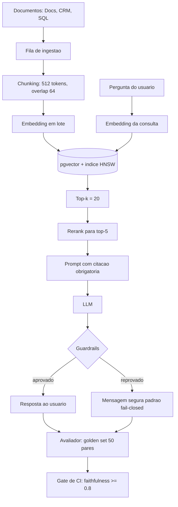

# Fundamentos de IA Generativa (NVIDIA DLI) aplicados a RAG

Engenharia de IA

## Resumo Executivo

Conclusão do curso NVIDIA DLI 'Building RAG Agents with LLMs' com transposição prática. Entrego notas e um notebook funcional de RAG end-to-end.

A base sustenta as próximas atividades (RAG híbrido, multi-agente, custos).

A transposição não é cópia do notebook do curso. É a adaptação do pipeline para o corpus interno, com os parâmetros que o curso deixou em aberto agora fixados em uma ADR, medidos contra um golden set e protegidos por guardrails. O resultado é um baseline reproduzível: qualquer pessoa do time clona o repositório, roda `rag_baseline.py` e obtém o mesmo ranking dos mesmos chunks, sem estado escondido na nuvem e sem configuração que só existe na máquina de quem desenvolveu.

## Problema Resolvido

Números de partida, antes de qualquer solução:

- Time comenta 'RAG' mas sem padrão de chunking: cada pessoa fatiava o texto do seu jeito, então dois índices construídos na mesma semana não devolviam os mesmos trechos para a mesma pergunta.
- Similaridade pura trazia contexto irrelevante: o top-k devolvia vizinhança estatística, não evidência. A resposta soava plausível, mas não era sustentada pelo corpus.
- Sem métrica de qualidade: não havia como provar que uma mudança de prompt ou de modelo melhorou ou piorou o sistema. Toda decisão de ajuste era discutida por impressão.
- Sem contagem de tokens antes da chamada: o custo só aparecia na fatura fechada, o que impedia qualquer projeção de orçamento por consulta.

O custo oculto é este: sem fatia controlada do documento, sem vetor normalizado e sem gate de avaliação, o sistema gera resposta sem rastro de onde ela veio. Em domínio regulado isso é inaceitável. Em domínio interno é caro, porque a confiança some na primeira resposta errada e ninguém consegue explicar o que mudou entre uma versão e outra.

## Contexto de Produção

- Time comenta 'RAG' mas sem padrão de chunking.

- Similaridade pura trazia contexto irrelevante.

- Sem métrica de qualidade.

## Diagnóstico

- Chunk grande -> ruído; pequeno -> perde contexto.

- Embedding sem normalização.

- Sem rerank -> top-k ruído.

Cada sintoma tem causa mensurável. Chunk grande dilui a atenção porque a janela de contexto é preenchida com material que só parcialmente responde à pergunta. Chunk pequeno fragmenta a evidência necessária em duas partes que o gerador enxerga isoladas. Embedding sem normalização vicia a similaridade de cosseno: o comprimento do vetor passa a pesar no score e textos longos ganham vantagem arbitrária sobre textos curtos. Sem rerank, o modelo recebe os 20 vizinhos mais próximos em ordem de similaridade bruta e o ruído entra no prompt com a mesma autoridade que o trecho correto.

## Modelo mental

Como o sistema se comporta por dentro, sem jargão solto:

1. O documento é fatiado em blocos (`chunk`) de tamanho fixo em tokens, com sobreposição (`overlap`) entre vizinhos, para que uma frase que cruza a fronteira não seja perdida.
2. Cada bloco vira um vetor de dimensão fixa por uma função de embedding. Vetores de textos semanticamente próximos caem em pontos próximos do mesmo espaço.
3. A consulta do usuário é projetada nesse mesmo espaço. A busca ordena os blocos pela similaridade de cosseno entre o vetor da consulta e o vetor de cada bloco.
4. Os `k` candidatos brutos passam por um rerank, que reordena com um modelo mais lento e mais preciso, medindo a relevância de cada trecho em relação à pergunta, e não apenas a proximidade estatística.
5. Os trechos sobreviventes entram no contexto do gerador junto com a instrução de citar a fonte. A resposta sai com a referência presa a ela.
6. O avaliador compara a resposta com o golden set por similaridade de cosseno e por checagens de guardrail. Falhou, a resposta não vai para o usuário.

O que separa um RAG amador de um RAG operável está nos passos 4 e 6. Recuperação barata e geração boa não bastam: sem reordenação o ruído entra no contexto, e sem avaliação ninguém percebe quando algo quebra.

## Arquitetura



Legenda das decisões de borda:

- **Fila entre ingest e serve**: a ingestão pode falhar ou demorar sem derrubar a consulta. Consulta é caminho quente, ingestão é caminho frio, e os dois têm SLO diferente.
- **`k=20` na saída do índice e `5` na saída do rerank**: o índice vetorial é barato e precisa explorar; o rerank é caro e precisa extrair. Pagar 20 passes de rerank para descartar 15 é latência jogada fora.
- **Normalização na escrita e na leitura**: o mesmo transformador de vetor roda nos dois caminhos, com a mesma rotina de normalização, para que o espaço de consulta seja idêntico ao espaço de indexação.
- **Guardrail depois do LLM e antes do usuário**: checar só a entrada não basta, porque a saída é que carrega o risco de PII, conteúdo tóxico e resposta fora de domínio.
- **Avaliação fora do caminho quente**: o golden set roda no CI e em lote, nunca dentro da requisição do usuário.

## Matemática da solução

**Similaridade de cosseno.** Para consulta $q$ e chunk $c$, com vetores já normalizados:

$$\text{score}(q, c) = \frac{q \cdot c}{\|q\| \, \|c\|} \in [-1, 1]$$

Com normalização prévia o denominador é 1 e a conta vira produto escalar puro, o que é muito mais barato em lote: a matriz de scores inteira sai de um único `matriz_chunks @ vetor_consulta`.

**Exemplo numérico:** 1.000 chunks de dimensão $d = 1536$ e uma consulta. Cada produto escalar custa 1.536 multiplicações e 1.535 somas, ou seja, 1.536.000 multiplicações para varrer o índice completo em busca por força bruta. O banco não faz isso: o índice HNSW explora um grafo de vizinhos mais próximos e visita apenas uma fração dos nós por consulta.

**Janela de sobreposição.** Com tamanho $S$ e overlap $O$, a distância entre o início de dois chunks vizinhos é $S - O$. Com $S = 512$ e $O = 64$: passo $= 512 - 64 = 448$ tokens. A fração de cobertura dupla é $O / S = 64 / 512 = 12{,}5$ por cento dos tokens de cada bloco, que é o custo pago para que a frase cortada na fronteira exista inteira em pelo menos um bloco.

**Exemplo numérico:** corpus de 1.000.000 de tokens com $S = 512$ e $O = 64$ resulta em $1.000.000 / 448 \approx 2.232$ chunks indexados. Com overlap zero, o mesmo corpus geraria $1.000.000 / 512 \approx 1.953$ chunks. Diferença: 279 chunks a mais, aproximadamente 14 por cento de acréscimo de vetor e de armazenagem, pago uma única vez, na indexação. A conta fecha porque o custo do overlap é fixo por corpus e o benefício é por consulta.

**Extravio de contexto.** Se a resposta depende de um trecho de evidência com $E$ tokens e o bloco tem $S$ tokens, o trecho só fica íntegro quando $E \lê S$ e o corte não cai no meio dele. Daí a regra prática: $S$ maior que o maior trecho de evidência esperado no domínio, e $O$ maior ou igual ao travessão de frase que o corte costuma pegar. Quando $E > S$, é preciso recuperação por expansão de vizinhança: achou o chunk, inclui também o anterior e o seguinte antes de montar o prompt.

**Custo por consulta.** Tokens de entrada por consulta $= T_{prompt} + T_{contexto}$, com $T_{contexto} \approx 5 \times S$, porque entram 5 chunks depois do rerank. Com $S = 512$ tokens, o contexto sozinho ocupa 2.560 tokens, mais a instrução de sistema e a pergunta. Como o custo de entrada é linear em tokens, cortar de 5 para 3 chunks após validar recall@5 derruba 40 por cento da parcela de contexto do custo de entrada e não toca no custo fixo do prompt de sistema.

**Exemplo numérico de orçamento:** se o custo por mil tokens de entrada é $p$ e a consulta média repete 20 vezes por dia, o custo diário de contexto com 5 chunks é $2.560 / 1000 \times p \times 20 = 51{,}2 \times p$. Reduzindo para 3 chunks, cai para $30{,}7 \times p$. A economia anual é $(51{,}2 - 30{,}7) \times p \times 365 = 7.482{,}5 \times p$ por ano, com $p$ em reais por mil tokens (parâmetro da tabela de preços vigente, declarado na planilha de custos).

**Recall@k.** Para os chunks que contêm a evidência correta:

$$\text{recall@}k = \frac{\text{evidências recuperadas nas posições } 1..k}{\text{evidências totais do caso}}$$

É a métrica que localiza a falha. recall@5 baixo aponta índice ou chunking; recall alto com faithfulness baixa aponta prompt ou modelo. Medir só a resposta final obriga a adivinhar onde está o erro, e adivinhação não é engenharia.

## Decisão Arquitetural (ADR)

ADR-041 : Baseline RAG

| Opção | Pro | Contra | Decisão |

| --- | --- | --- | --- |

| Chunk 512 + overlap 64 + rerank | coeso | mais tokens | ESCOLHIDA |

> **Nota:** Normalizar embeddings; top-k=20 + rerank para top-5.

Alternativas descartadas e o motivo de cada uma:

- **Documento inteiro no prompt**: descartada porque não escala, porque cada consulta repaga o documento inteiro, porque estoura a janela de contexto em corpus real e porque impede citar o trecho exato de onde veio a resposta.
- **Chunking por parágrafo com tamanho livre**: descartada porque a variância de tamanho quebra o orçamento de tokens e porque parágrafos muito curtos ou muito longos tornam o rerank instável entre documentos diferentes.
- **Somente busca por palavras-chave, sem vetor**: descartada como caminho único porque falha em paráfrase, quando pergunta e resposta usam palavras diferentes com o mesmo sentido. Segue útil como complemento na atividade 04-A2.
- **Embedding sem normalização**: descartada porque o score deixa de ser comparável entre textos de tamanhos distintos, que é exatamente a condição de funcionamento do threshold 0.82.
- **Rerank sobre todos os 20 candidatos**: descartada pelo custo: rerank avalia parágrafo por parágrafo, e reordenar 20 para entregar 5 desperdiça 15 passes de inferência dentro do orçamento de latência.

## Entregas

- DLI-NOTES.md.

- rag_baseline.py.

- CONCLUSAO.md.

| Entrega | Conteúdo | Critério de pronto |
| --- | --- | --- |
| `DLI-NOTES.md` | Notas do curso com os quatro pontos que viraram padrão: normalização, chunking, retrieval, avaliação | Contém anti-padrões e a justificativa de cada parâmetro |
| `rag_baseline.py` | Pipeline mínimo executável: `embed`, `chunk`, `retrieve`, `answer` | Roda sem serviço externo além do modelo local carregado |
| `CONCLUSAO.md` | Checklist do que foi concluído na trilha | Marca a transposição executada no corpus próprio |

## Validação

1. Rodar rag_baseline.py.

2. Medir faithfulness em 10 perguntas.

3. Comparar com similaridade pura.

Critério de aceite da comparação: para as mesmas 10 perguntas, o pipeline com rerank precisa recuperar os mesmos trechos relevantes da similaridade pura e entregá-los em posição melhor, medido pela posição média do primeiro trecho relevante. Se a posição média não melhorar, o rerank não paga a latência dele e a ADR-041 precisa ser reaberta.

```python
# Comparação controlada: mesmo embedder, mesma consulta, ordem de saída diferente.
def comparar(perguntas: list[str], golden: dict, com_rerank: bool) -> dict:
    """Devolve posição média do primeiro trecho relevante e faithfulness."""
    posicoes, fidelidades = [], []
    for p in perguntas:
        candidatos = retrieve(p, CHUNKS, k=20)
        trechos = rerank(p, candidatos)[:5] if com_rerank else candidatos[:5]
        posicoes.append(primeira_posicao_relevante(trechos, golden[p]))
        fidelidades.append(faithfulness(p, trechos, golden[p]))
    return {
        "posicao_media": sum(posicoes) / len(posicoes),
        "faithfulness": sum(fidelidades) / len(fidelidades),
    }
```

## Métricas

| SLO | Alvo |

| --- | --- |

| Faithfulness | >= 0.8 |

| Chunk | 512/64 |

Complemento das métricas acompanhadas e do que cada uma responde:

| Métrica | Como mede | O que responde | Janela |
| --- | --- | --- | --- |
| Faithfulness | similaridade de cosseno entre resposta e evidência recuperada | a resposta fica fiel ao que o corpus diz | por execução do golden set |
| Answer relevance | similaridade entre resposta e pergunta | a resposta responde o que foi perguntado | por execução do golden set |
| Recall@5 | evidências encontradas em até 5 posições | o problema é busca ou geração | por lote de indexação |
| Score médio do golden set | média dos 50 pares | regressão geral entre versões | por build de CI |
| Custo por consulta | tokens de entrada e saída multiplicados pelo preço | orçamento mensal previsível | diária |
| Latência p95 da busca | tempo do início da consulta ao fim do rerank | se a busca cabe no SLO da interface | contínua |

## Invariantes

Lista do que nunca pode ser falso, com a violação correspondente:

| Invariante | Se violar, o que acontece |
| --- | --- |
| Todo vetor gravado está normalizado | o threshold 0.82 vira ruído e passa a bloquear ou liberar por acaso |
| Todo chunk tem `chunk_id`, `doc_id`, versão de modelo e hash do texto | reindexação se torna irreversível e a citação aponta para lugar inexistente |
| A resposta entregue sempre cita ao menos um `chunk_id` recuperado | a avaliação de faithfulness perde a âncora e a alucinação fica invisível |
| Nenhuma resposta chega ao usuário com falha de guardrail aberta | fail-closed deixa de existir e PII ou conteúdo tóxico vaza |
| O golden set só muda com revisão registrada | a métrica deixa de ser comparável entre versões e o gate de CI vira teatro |
| O modelo de embedding usado na consulta é o mesmo da indexação | os vetores ficam em espaços diferentes e a busca devolve coincidência aleatória |
| A indexação é idempotente por `(doc_id, hash_texto, modelo)` | duplicar o corpus infla o índice e degrada o recall silenciosamente |

## Modos de falha

| Sintome | Causa raiz | Como detecta | Como mitiga | Recuperação |
| --- | --- | --- | --- | --- |
| Resposta plausível fora do corpus | rerank ausente ou `k` pequeno demais | faithfulness cai abaixo de 0.8 no golden set | aumentar candidatos e validar recall@5 | correção de parâmetro, reprocessa golden set em minutos |
| Contexto correto, resposta errada | prompt sem exigência de citação ou modelo fraco | recall alto e faithfulness baixa | travar instrução de citação e revisar modelo | novo build, sem reindexar |
| Busca devolve sempre os mesmos trechos | vetor não normalizado ou embedding congelado | score de cosseno com variância mínima entre consultas | normalizar na escrita e na leitura | reindexar com o modelo corrigido |
| Documento novo não aparece na busca | fila de ingestão parada ou lote de embedding falho | contagem de `chunk_id` por `doc_id` não cresce | reiniciar fila, reprocessar lote com retry | minutos a horas conforme o backlog |
| Latência estoura no p95 | rerank serializado ou `k` alto em carga | métrica de latência por etapa | limitar `k`, paralelizar, escalar | rollback de parâmetro |
| Resposta vazia ou bloqueada em massa | guardrail com threshold mal calibrado | taxa de bloqueio sobe sem mudança de tráfego | rever limiar e amostra de bloqueio | ajuste de configuração, sem perda de dados |
| Custo mensal acima da previsão | contexto por consulta maior que o planejado | tokens por consulta acima do orçado | reduzir chunks pós-rerank e revisar modelo | corte de parâmetro no próximo deploy |

## SLO e orçamento de erro

| SLI | Meta | Janela de medição | Estourou, faz o quê |
| --- | --- | --- | --- |
| Disponibilidade da busca vetorial | >= 99,5 por cento de requisições sem erro (meta) | mensal | checar fila, índice e conexão do banco antes de escalar réplica |
| Latência p95 da busca + rerank | <= 800 ms (meta) | diária, por hora de pico | reduzir `k`, revisar modelo de rerank, medir por etapa |
| Faithfulness no golden set | >= 0.8 | a cada build de CI | bloquear publicação e abrir investigação de regressão |
| Taxa de bloqueio por guardrail | <= 3 por cento das respostas (meta) | diária | acima disso, revisar limiar: pode ser ataque, pode ser calibration errada |
| Custo por consulta | dentro do orçamento da planilha (meta) | diária | rastrear tokens de contexto e cortar fatia do prompt |

Orçamento de erro: se a faithfulness cai para 0,75 em um build, o gate de CI impede a publicação, ou seja, zero resposta ruim chega ao usuário. Se a latência p95 estoura em duas janelas consecutivas, a mitigação é parâmetro, não código: reverter `k` e rerank para a última configuração aprovada.

## Operação

Runbook resumido, do sintoma à ação:

1. **Checagens de rotina**: fila de ingestão com idade do mensageiro mais antigo, contagem de chunks por modelo de embedding, idade do índice, faithfulness do último build e custo por consulta das últimas 24 horas.
2. **Mitigação de busca ruim**: conferir se a consulta e a indexação usam o mesmo modelo; conferir normalização; subir `k` temporariamente e medir recall@5 em amostra de 10 perguntas.
3. **Mitigação de latência**: separar tempo de busca do tempo de rerank, porque são causas diferentes. Busca lenta é índice ou banco. Rerank lento é modelo ou serialização.
4. **Rollback**: parâmetros de chunking, `k` e threshold de guardrail ficam versionados; reverter é voltar a versão anterior e reindexar apenas os documentos afetados, não o corpus inteiro.
5. **Quem aciona**: responsável pelo pipeline de indexação para falha de ingestão; responsável pela avaliação para falha de faithfulness; coordenação de PDI para mudança de escopo ou de domínio de dados.

## Riscos

| Risco | Mitigação |
| --- | --- |
| Contexto irrelevante | rerank |
| Hallucination | cite trecho |

Riscos adicionais já cobertos por controle existente:

| Risco | Controle | Dono |
| --- | --- | --- |
| Regressão silenciosa de qualidade | golden set de 50 pares como gate de CI | avaliação |
| Vazamento de PII no contexto recuperado | varredura de PII no guardrail de saída, fail-closed | segurança |
| Reindexação cara por mudança de modelo | versionamento do dataset de embeddings e reindexação por documento | indexação |
| Fatura fora do orçamento | contagem de tokens antes da chamada e teto por consulta | custo |

## Decisões e tradeoffs

- Chunk 512 com overlap 64: escolhi coesão contra custo de tokens, porque chunk grande gera ruído e chunk pequeno perde contexto, conforme ADR-041.
- Top-k 20 com rerank para top-5: aceitei latência extra do rerank para filtrar o ruído da similaridade pura.
- Normalizar embeddings de 1536 dim com cosseno e threshold 0.82: padronizei a medida para o score ser comparável entre textos de tamanhos distintos.
- Golden set com 50 pares e faithfulness maior ou igual a 0.8 em 10 perguntas: troquei avaliação no olhômetro por gate reproduzível no CI.
- Guardrail fail-closed com 100 por cento de bloqueio antes da produção: preferi falso positivo seguro a resposta tóxica, fora de domínio ou com PII.

Matriz de tradeoff, para não perder de vista o que foi pago em cada escolha:

| Decisão | Ganho | Pagamento | Quando reavaliar |
| --- | --- | --- | --- |
| Chunk fixo em 512 tokens | orçamento previsível e ranking estável | perde adaptação a documento com estrutura desigual | quando surgir corpus com seções muito assimétricas |
| Overlap 64 | fronteira de frase coberta | 14 por cento a mais de vetores (Exemplo numérico acima) | se o custo de armazenagem pesar em corpus dez vezes maior |
| Rerank top-5 | menos ruído no prompt | latência adicional por consulta | se o p95 de 800 ms estourar duas janelas seguidas |
| Fail-closed | risco zerado na saída | falso positivo bloqueia resposta boa | se a taxa de bloqueio passar de 3 por cento (meta) |
| Avaliação só em CI | caminho quente sem custo de avaliação | feedback de qualidade só no build | se precisar de monitoramento contínuo em produção |

## Impacto no negócio

O baseline com faithfulness maior ou igual a 0.8 e score médio maior ou igual a 0.90 no golden set de 50 pares reduz risco de hallucination em produção e elimina a surpresa de fatura com contagem previa de tokens, o que encurta homologação e sustenta as atividades seguintes de RAG híbrido e custos.

Efeito direto na operação: a homologação deixa de ser uma leitura subjetiva de respostas e vira um número comparável entre versões, o que reduz o tempo de decisão sobre mudanças de prompt e de modelo. Com custo por consulta contado antes da chamada, a projeção de orçamento passa a ser uma multiplicação simples em vez de uma aposta.

## Esforço e custo

| Item | Esforço estimado | Observação |
| --- | --- | --- |
| Leitura e notas do curso DLI | horas (meta) | material do curso, sem custo adicional de infra |
| Implementação do `rag_baseline.py` | horas (meta) | pipeline local, sem serviço pago para rodar o exemplo |
| Montagem do golden set de 50 pares | horas (meta) | esforço concentrado em curadoria, não em código |
| Indexação do corpus de teste | custo de embedding por token (meta) | calculado com a tabela de preços vigente na planilha de custos |
| Execução diária do gate de CI | custo de avaliação por pergunta (meta) | 10 perguntas por execução, mais os 50 pares do golden set em lote |

Parâmetros declarados para a conta de custo: tamanho do corpus em tokens, preço por mil tokens de embedding, preço por mil tokens de entrada e saída do gerador, número de consultas por dia. Com esses quatro números a planilha fecha sem estimativa adicional.

## Próximos Passos

- RAG híbrido (04-A2).
- Avaliação RAGAS.

Sequência planejada: primeiro combinar busca vetorial com busca lexical por fusão ranqueada, medindo recall@5 do híbrido contra o baseline vetorial puro; depois trocar a avaliação por similaridade de cosseno por um conjunto de métricas de fidelidade, relevância e cobertura, mantendo o mesmo golden set para que a comparação entre as duas formas de avaliação seja justa.

## Referências de estudo

- Curso: Building RAG Agents with LLMs, plataforma NVIDIA Deep Learning Institute (DLI).
- Vídeo: RAG from Scratch com chunking, embeddings e avaliação, plataforma YouTube, canal LangChain.
- Doc oficial: Guia de embeddings text-embedding-3-small, documentação oficial OpenAI.
- Doc oficial: Documentação do pgvector com índice HNSW, documentação oficial pgvector.

## Checklist de domínio

O que o sênior verifica antes de dizer "pronto":

1. Consulta e indexação apontam para o mesmo modelo de embedding, com a versão registrada.
2. Todo vetor gravado está normalizado e o score de cosseno é comparável entre documentos.
3. Chunking declarado em tokens, com `S = 512` e `O = 64` aplicados de forma idêntica em todo o corpus.
4. Indexação idempotente por `(doc_id, hash_texto, modelo)`, sem duplicidade no índice.
5. `k = 20` no índice e 5 no pós-rerank, com a latência de cada etapa medida separadamente.
6. Toda resposta entregue cita ao menos um `chunk_id` recuperado.
7. Golden set de 50 pares versionado e alteração nele justificada em registro de revisão.
8. Faithfulness >= 0.8 é gate de CI, não relatório manual.
9. Guardrail fail-closed testado com caso de PII, caso tóxico e caso fora de domínio.
10. Custo por consulta calculado antes da chamada, com os quatro parâmetros declarados.
11. Runbook com checagens, mitigação, rollback e responsável nomeado para cada falha.
12. Alternativas descartadas documentadas na ADR-041, com o motivo de cada recusa.
13. Métricas de regressão comparáveis entre versões: mesmo golden set, mesma janela.
14. Corpus de teste reproduzível: quem clona o repositório obtém o mesmo ranking.
15. Próximos passos ligados à atividade 04-A2, sem trabalho duplicado entre as duas.


