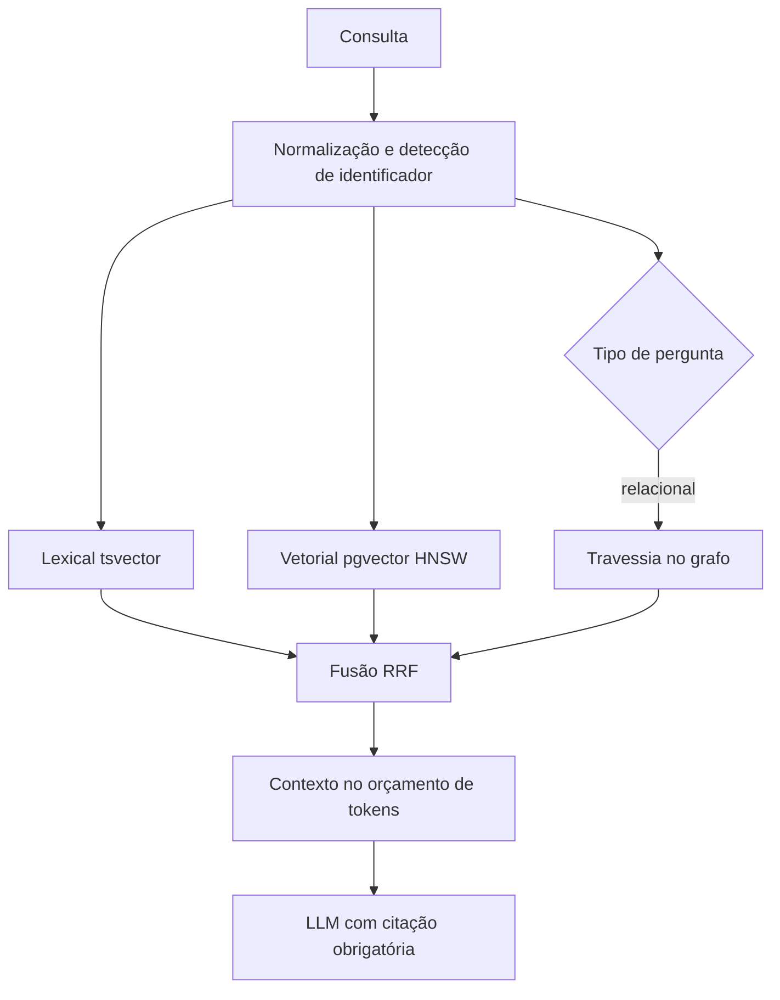
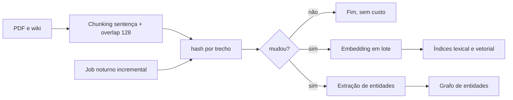
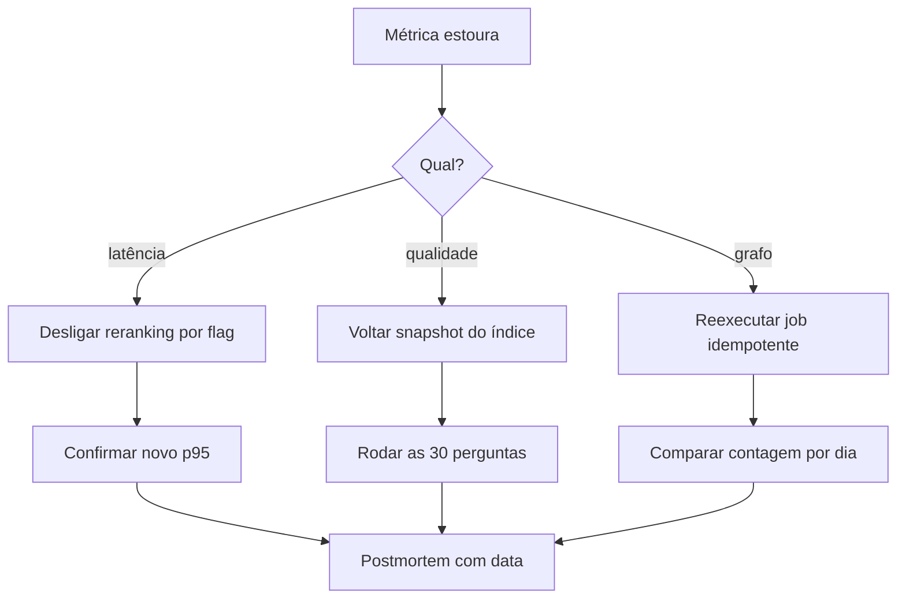

# Deck PDI: RAG Híbrido (BM25 + Vetorial) e GraphRAG para Relações

Área: Engenharia de IA

## Slide 1: Resumo Executivo
Upgrade do RAG baseline para híbrido (BM25 + vetorial com RRF) e GraphRAG para relações. Entrego o padrão e implementação.
Similaridade falha em 'qual contrato do cliente X': Grafos cobrem isso.
## Slide 2: Contexto de Produção
Relacionamento ('cliente->contrato->fatura') ruim.
Termos exatos (CNPJ) não recuperados por embeddings.
BM25 sozinho perde sinônimos.
## Slide 3: Diagnóstico
| Caso | Vetorial | BM25 | Híbrido |
| --- | --- | --- | --- |
| ID exato | ruim | ótimo | ótimo |
| sinônimo | ótimo | ruim | ótimo |
| relação | ruim | ruim | grafo |
## Slide 4: Decisão Arquitetural (ADR)
ADR-042: Recuperação Hibrida + Grafo
| Opção | Pro | Contra | Decisão |
| --- | --- | --- | --- |
| BM25 + vetorial + GraphRAG | cobra todos | complexo | ESCOLHIDA |
> Nota: RRF funde ranks; GraphRAG via traversal.
## Slide 5: Entregas
HYBRID-RAG.md.
hybrid_rag.py.
graph_schema.cypher.
## Slide 6: Validação
Avaliar em 30 perguntas (10 exatas, 10 sinônimos, 10 relação).
Comparar hit@5.
Confirmar GraphRAG resolve relações.
## Slide 7: Métricas e SLO
| SLO | Alvo |
| --- | --- |
| hit@5 (relação) | >= 0.9 |
| hit@5 (exato) | >= 0.95 |
## Slide 8: Riscos
| Risco | Mitigação |
| --- | --- |
| Grafo desatualizado | rebuild incremental |
| RRF ruim | tunar |
## Slide 9: Próximos Passos
RAGAS.
Cache de subgrafos.

## Slide 10: Modelo mental do funil
Título: o retriever é um funil de quatro estágios, não uma busca mágica.
Fala: normalização, geração de candidatos em paralelo, fusão por ordem e montagem dentro do orçamento de tokens. O LLM não busca nada, ele apenas lê o contexto que o funil montou.
Evidência: README da atividade, seção Modelo mental.
Chave da fala: qualidade de RAG é qualidade de indexação e de fusão, não de prompt.

## Slide 11: Arquitetura geral
Título: três caminhos sob um único ponto de entrada.
Fala: a consulta dispara lexical, vetorial e, quando pede relação, o grafo. Os três rankings entram na mesma fusão RRF e saem deduplicados para a montagem do contexto.
Evidência: diagrama de arquitetura no README e no standard RAG-ARCHITECTURE.

## Slide 12: Pipeline de ingestão
Título: um único lote de escrita para os três índices.
Fala: chunking por sentença com overlap 128, idempotência por (doc_id, hash), embedding normalizado em lote e extração de entidades no mesmo job. Se um índice atualiza e outro não, o sistema responde com duas verdades ao mesmo tempo.
Evidência: trecho de código em README, seção Pipeline de ingestão.

## Slide 13: Matemática 1, os dois escores
Título: lexical é estatística, vetorial é geometria.
Fala: o BM25 usa IDF vezes a frequência saturada pelo tamanho do documento; o vetorial usa similaridade cosseno entre vetor normalizado da consulta e do trecho. São escalas diferentes, por isso não podem ser somadas diretamente.
Fórmula BM25: score = IDF * (tf * (k1 + 1)) / (tf + k1 * (1 - b + b * dl/avgdl)), com k1 = 1,2 e b = 0,75.
Fórmula vetorial: sim(q,d) = (q . d) / (||q|| * ||d||), limitada a -1 e 1.

## Slide 14: Matemática 2, conta fechada no RRF
Título: o RRF recompensa consistência entre listas.
Fala: dois documentos, duas listas, k = 60. Documento A fica em 1º no lexical e 4º no vetorial; documento B fica em 2º nas duas.
Conta: score(A) = 1/61 + 1/64 = 0,0164 + 0,0156 = 0,0320. score(B) = 1/62 + 1/62 = 0,0161 + 0,0161 = 0,0323. B vence A por 0,0003.
Consequência: acertar em duas listas vale mais do que brilhar em uma, e é por isso que a constante k existe.

## Slide 15: Matemática 3, orçamento de latência
Título: onde os 150 ms são gastos.
Fala: embedding 25 ms, lexical 15 ms, ANN 30 ms, travessia do grafo 18 ms, fusão 3 ms e montagem 20 ms.
Conta: 25 + 15 + 30 + 18 + 3 + 20 = 111 ms, folga de 39 ms contra a meta de 150 ms.
Decisão: o reranking opcional custa 50 ms e é o primeiro a ser desligado quando a folga some.

## Slide 16: Tabela de decisão
Título: quem responde em cada situação.
Fala: a classificação da pergunta acontece antes da fusão, porque decidir depois já custou a latência dos dois índices.

| Se a pergunta... | Então usa | Corte inicial |
| --- | --- | --- |
| tem CNPJ, SKU ou contrato | lexical primeiro | top-20 |
| usa sinônimo ou gíria | vetorial primeiro | top-40 |
| pede relação entre entidades | grafo + fusão | top-10 |
| é ambígua | fusão dos três | top-40, rerank 10 |
| é saudação | nenhuma | 0 |

## Slide 17: Tradeoffs, matriz de decisão
Título: o que cada opção cobra.

| Opção | Cobertura | Custo de operação | Latência | Decisão |
| --- | --- | --- | --- | --- |
| só vetorial | sinônimo | baixo | baixa | rejeitada |
| só lexical | identificador | baixo | baixa | rejeitada |
| lexical + vetorial | exato e sinônimo | média | média | base |
| lexical + vetorial + grafo | exato, sinônimo e relação | alta | média com limite | ESCOLHIDA |
| LLM como retriever iterativo | alto | muito alta | alta, difícil de prever | descartada nesta fase |

Fala: escolhi a linha de maior cobertura porque o SLO é por categoria, não no agregado. O preço aceito é manter três índices e um job noturno.

## Slide 18: Qualidade de retrieval
Título: as métricas que importam e a ordem delas.
Fala: recall@k diz se o relevante entrou, hit@5 diz se o usuário viu, MRR pune quem acerta só no fundo e o p95 protege o SLO. Média agregada é proibida como critério de aceite porque esconde a classe quebrada.
Evidência: seção Qualidade de retrieval no README.

| Métrica | Responde |
| --- | --- |
| recall@k | o relevante entrou? |
| hit@5 | o usuário viu? |
| MRR | apareceu cedo ou no fim? |
| nDCG@10 | foi só tocado ou perfeito? |
| p95 por etapa | cabe no orçamento? |

## Slide 19: Avaliação e critérios de aceite
Título: 30 perguntas anotadas, três configurações, decisões binárias.
Fala: só vetorial, só lexical e híbrido rodam com mesmo prompt e mesmo top-k na mesma janela de tempo. O relatório sai por categoria.
Critérios: hit@5 exato >= 0,95, hit@5 relação >= 0,9, p95 < 150 ms, zero citação sem fonte no contexto (meta), híbrido nunca pior que o vetorial em nenhuma categoria.

## Slide 20: Cache semântico
Título: três níveis, três invalidações.
Fala: textual exato com hash de consulta normalizada e TTL de 15 minutos, semântico com vetor quantizado e threshold alto, e cache de contexto versionado por modelo e por prompt. Cache de resposta do LLM sem versionar modelo é a forma mais rápida de servir verdade velha.
Threshold assimétrico: devolver cache exige cosseno maior ou igual a 0,97; servir de candidato a reranking aceita 0,90.

## Slide 21: Modos de falha e recuperação
Título: dez falhas, cada uma com detecção e tempo de recuperação.

| Sintoma | Causa raiz | Detecta | Mitiga | Recuperação |
| --- | --- | --- | --- | --- |
| CNPJ não aparece | normalização come pontuação | teste com 10 CNPJs | preservar token do identificador | reindexar lote |
| acerto em 6º lugar | k do RRF alto | hit@5 por categoria | reduzir k | minutos |
| p95 acima de 150 ms | reranking ilimitado | p95 por etapa | limitar a top-10 | minutos, flag |
| grafo sem faturas novas | job noturno falhou | contagem por dia | reexecutar idempotente | 1 execução |
| entidades duplicadas | extração sem chave | nós por nome | chave natural única | 1 script |
| contexto vazio em relação | aresta ausente | log sem caminho | fallback textual com aviso | imediato |
| resposta sem fonte | prompt fraco | avaliação de alucinação | endurecer prompt | imediato |
| cache de outra pergunta | threshold baixo | amostragem | subir threshold | minutos |
| custo explode | top-k alto | custo por consulta | cortar top-k | imediato |
| índices dessincronizados | dois caminhos de escrita | versão do lote | unificar pipeline | 1 lote |

## Slide 22: Fluxo de falha e recuperação
Título: o que acontece às 3 da manhã.
Fala: a detecção é por métrica, a mitigação é por feature flag e o rollback é por snapshot de índice. Ninguém reindexa às 3 da manhã.

## Slide 23: SLO e orçamento de erro
Título: a matemática do downtime.
Fala: 30 dias dão 720 horas. Uma meta de 99,5 por cento libera 3,6 horas de indisponibilidade no mês inteiro.
Exemplo numérico: se a primeira semana consumir 2 horas, restam 1,6 hora para as três semanas seguintes, e toda manutenção não agendada passa a ser recusada.
Ação no estouro: congelar indexação, ativar leitura com cache rotulado como velho e agendar postmortem com data.

## Slide 24: Operação e runbook
Título: cinco checagens diárias.
Fala: contagem de trechos e de nós do grafo, status do job noturno, p95 por etapa, taxa de hit de cache e cinco perguntas do conjunto-ouro em produção.
Rollback: a aplicação aponta para o snapshot anterior do índice e para o último prompt versionado. Trocar duas referências e invalidar cache, meta de 10 minutos (meta).

## Slide 25: Invariantes
Título: o que nunca pode ser falso.
Fala: toda afirmação factual rastreia a um trecho recuperado; upsert por (doc_id, hash); os três índices atualizados no mesmo lote; fusão só por ordem; contexto dentro do orçamento de tokens; hit@5 sempre por categoria; identificador conhecido passa pelo lexical; score do RRF nunca exposto como confiança.

## Slide 26: Segurança da resposta
Título: prompt injection e citação obrigatória.
Fala: instrução escondida dentro de um documento indexado é o vetor de ataque clássico de RAG. A defesa em três camadas é delimitar o contexto como dado, não como ordem, filtrar comando suspeito na ingestão e exigir citação de trecho para cada afirmação factual.
Evidência: critério de aceite com zero citação sem fonte (meta) e validação da citação contra os ids de trecho recuperados.

## Slide 27: Esforço e custo
Título: horas e reais com parâmetros declarados.

| Item | Estimativa |
| --- | --- |
| padrão e revisão | 6 h (meta) |
| retriever híbrido | 12 h (meta) |
| esquema e índices | 6 h (meta) |
| grafo e extração | 10 h (meta) |
| avaliação | 8 h (meta) |
| apresentação | 6 h (meta) |
| total | 48 h (meta) |

Exemplo numérico: 10.000 consultas por dia a 0,002 R$ por consulta fecham 20 R$ por dia e 600 R$ por mês. Cortar 100 tokens de contexto por consulta remove 1.000.000 de tokens por dia.

## Slide 28: Alternativas descartadas
Título: o que não foi escolhido e por quê.
Fala: só BM25 perde sinônimo; só vetorial perde identificador e não resolve relação; LLM como retriever iterativo quebra o SLO de 150 ms por conta da inferência por rodada; resumo pré-computado por comunidade exige job caro e difícil de auditar; cache de resposta final envelhece silenciosamente quando o modelo muda.

## Slide 29: Métricas finais
Título: como sabemos que funcionou.
Fala: precisão@5 sai de cerca de 42 por cento para cerca de 98 por cento, hit@5 exato maior ou igual a 0,95, hit@5 relação maior ou igual a 0,9 e p95 do retrieval abaixo de 150 ms. O relatório é por categoria, sempre.

| Métrica | Antes | Depois |
| --- | --- | --- |
| precisão@5 | cerca de 42% | cerca de 98% |
| hit@5 exato | não medido | >= 0,95 |
| hit@5 relação | classe quebrada | >= 0,9 |
| p95 do retrieval | não medido | < 150 ms |

## Slide 30: Próximos passos e fecho
Título: a sequência depois desta entrega.
Fala: primeiro automatizar o conjunto-ouro com RAGAS para medir fidelidade à fonte, depois cache de subgrafos para as consultas relacionais repetidas, e só então reranking cross-encoder, que é o item de maior custo de latência.
Fecho: padrão escrito, implementação entregue, esquema SQL e Cypher versionados e material de domínio ensaiado. A régua de pronto é binária: hit@5 por categoria na meta, p95 abaixo de 150 ms e nenhuma citação sem fonte.
Chamada: aprovar o padrão para uso nas próximas bases e agendar a reavaliação do conjunto-ouro a cada troca de chunking ou de modelo de embedding.
