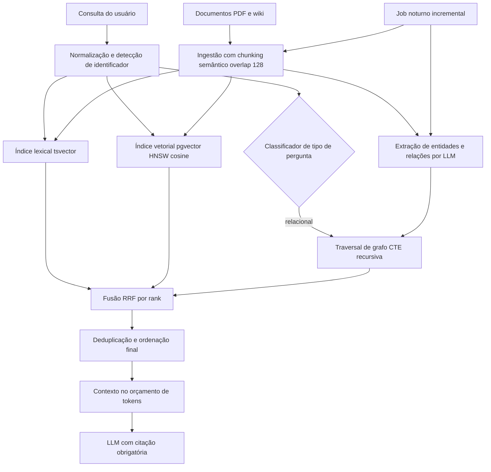

# RAG Híbrido (BM25 + Vetorial) e GraphRAG para Relações

Engenharia de IA

## Resumo Executivo

Upgrade do RAG baseline para híbrido (BM25 + vetorial com RRF) e GraphRAG para relações. Entrego o padrão e implementação.

Similaridade falha em 'qual contrato do cliente X' : Grafos cobrem isso.

A entrega tem quatro frentes conectadas: o padrão de recuperação descrito em
`1-standards/`, a implementação de referência em Python em `2-code/`, o esquema
SQL e Cypher em `3-supabase/`, e o material de apresentação em `7-apresentacao/`
com deck, roteiro de demo e roteiro de domínio. A decisão central é não escolher
um único recuperador: lexical e vetorial rodam em paralelo, os dois rankings são
fundidos por RRF (Reciprocal Rank Fusion) e as perguntas que exigem navegação de
entidades saem por caminhada no grafo. Cada caminho cobre a fraqueza do outro, e
a camada de grafo cobre a fraqueza comum dos dois.

## Contexto de Produção

- Relacionamento ('cliente->contrato->fatura') ruim.

- Termos exatos (CNPJ) não recuperados por embeddings.

- BM25 sozinho perde sinônimos.

Na prática isso aparecia em três sintomas relatados na operação. Primeiro,
perguntas com número de contrato, CNPJ ou código interno voltavam com trechos
parecidos, mas sem o identificador digitado. Segundo, perguntas com sinônimos
retornavam vazio, porque o índice lexical só encontra a forma canônica do termo.
Terceiro, perguntas que precisavam encadear entidades devolviam cinco trechos
independentemente relevantes, porém desconectados entre si, e o modelo montava
uma resposta média de pedaços que não se implicavam.

## Diagnóstico

| Caso | Vetorial | BM25 | Híbrido |

| --- | --- | --- | --- |

| ID exato | ruim | ótimo | ótimo |

| sinônimo | ótimo | ruim | ótimo |

| relação | ruim | ruim | grafo |

## Problema Resolvido

O gargalo não era geração, era recuperação. O modelo só enxerga o que o
retriever entrega no contexto, então todo erro de relevância na montagem do
contexto vira erro de resposta, e nenhuma técnica de prompt corrige contexto
ruim. Pior: o erro é silencioso. Uma resposta vaga parece plausível, e o usuário
só descobre quando vai agir em cima dela.

**Números de partida** (reaproveitados da seção de impacto desta atividade):

- Precisão@5 antes da mudança: cerca de 42 por cento, ou seja, dos cinco trechos
  enviados ao modelo, em média dois continham a evidência realmente usada.
- A classe de perguntas relacionais era a de pior desempenho no recuperador
  único, porque nenhum trecho isolado respondia à pergunta inteira.
- Consequência operacional: retrabalho de resposta vaga e impossibilidade de
  precificar busca relacional sem alguém montar a relação na mão.

A solução aceita complexidade de operação em troca de cobertura: três caminhos
de recuperação sob um único ponto de entrada, critério de aceite medido em hit@5
**por categoria** de pergunta e nunca em média agregada, porque a média esconde
exatamente a classe de pergunta que estava quebrada.

## Modelo mental

Pense no retriever como um funil de quatro estágios, e não como uma busca
mágica. Primeiro, normalização: a pergunta vira texto limpo e um detector de
identificador (CNPJ, número de contrato) pode antecipar o caminho lexical.
Segundo, geração de candidatos: dois índices correm em paralelo e devolvem seus
top-k, enquanto o grafo entra quando a pergunta pede entidade e aresta. Terceiro,
fusão: os rankings são combinados por **ordem**, nunca por escore bruto, porque
a escala do BM25 e a escala da similaridade cosseno não são comparáveis.
Quarto, montagem do contexto: os trechos sobreviventes são deduplicados,
ordenados e truncados dentro do orçamento de tokens do prompt.

O LLM não busca nada. Ele apenas lê o contexto que o funnel montou. Por isso
engenharia de RAG é, antes de tudo, engenharia de indexação e de fusão.

Três intuições evitam erro conceitual. O BM25 é estatística de termos: responde
"esse termo é raro na coleção e aparece aqui várias vezes". O embedding é
geometria: responde "esse vetor está perto daquele no espaço de significados".
O grafo é navegação: responde "existe caminho de arestas entre essas duas
entidades". Consulta de identificador é estatística de termos, consulta de
sinônimo é geometria, consulta de relação é navegação. Usar o caminho errado é a
forma mais comum de gastar latência sem ganhar nada.

Um detalhe que separa sênior de pleno: fusão por rank ignora a magnitude do
escore. Isso é recurso, não limitação. Um escore vetorial desbalanceado, comum
em consulta curta, não tem poder de anular o lexical. O preço é que o score
final não é probabilidade e nunca deve ser exposto ao usuário como "confiança
de 0,83".

## Arquitetura



Legenda das decisões de borda:

- O classificador de pergunta fica **antes** da fusão, não depois: decidir depois
  custa latência dupla, porque já pagamos os dois índices.
- O grafo entra como terceiro ranking na mesma fusão, então uma pergunta ambígua
  não precisa de ramo exclusivo nem de regra frágil de roteamento.
- Indexação textual, indexação vetorial e grafo saem do **mesmo lote** de
  ingestão. Se um índice é atualizado e outro não, o sistema responde com
  verdade desatualizada de forma silenciosa.
- A montagem respeita orçamento de tokens fixo: contexto longo demais derruba
  qualidade e encarece cada consulta.
- O job noturno escreve no mesmo pipeline de ingestão do lote incremental, para
  que haja um único caminho de escrita e não duas semânticas concorrentes.

## Decisão Arquitetural (ADR)

ADR-042 : Recuperação Hibrida + Grafo

| Opção | Pro | Contra | Decisão |

| --- | --- | --- | --- |

| BM25 + vetorial + GraphRAG | cobra todos | complexo | ESCOLHIDA |

> **Nota:** RRF funde ranks; GraphRAG via traversal.

Contexto do ADR: a operação precisa responder três classes de pergunta com o
mesmo endpoint, sem pedir ao usuário que escolha o modo. Consequência aceita:
três índices para manter e uma constante de fusão para tunar. O critério de
sucesso é o conjunto-ouro de 30 perguntas, não opinião de revisor.

## Matemática da solução

**BM25 (lexical).** Para um termo $t$ em um documento $d$:

$$score(t,d) = IDF(t) \cdot \frac{tf \cdot (k_1 + 1)}{tf + k_1 \cdot \left(1 - b + b \cdot \frac{dl}{avgdl}\right)}$$

Com $k_1 = 1{,}2$ e $b = 0{,}75$ típicos, $dl$ é o tamanho do documento e
$avgdl$ a média da coleção. O $IDF$ penaliza termo comum e recompensa termo
raro, que é exatamente o comportamento desejado para CNPJ, número de contrato e
código SKU.

**Similaridade vetorial.** Com embeddings normalizados, produto interno equivale
ao cosseno:

$$sim(q,d) = \frac{q \cdot d}{\|q\| \cdot \|d\|} \in [-1, 1]$$

Na implementação, `normalize_embeddings=True` em `2-code/hybrid_rag.py` garante a
normalização na indexação, e o operador `<=>` do pgvector devolve distância
cosseno, ou seja, $1 - sim$.

**Fusão RRF.** Soma das inversões do rank com constante $k$:

$$score_{RRF}(d) = \sum_{i} \frac{1}{k + rank_i(d)}, \quad k = 60$$

**Exemplo numérico:** dois recuperadores, top-4 para caber na conta. Documento A
fica em 1º no lexical e 4º no vetorial, documento B fica em 2º nos dois. Logo
$score(A) = 1/61 + 1/64 = 0{,}0164 + 0{,}0156 = 0{,}0320$ e
$score(B) = 1/62 + 1/62 = 0{,}0161 + 0{,}0161 = 0{,}0323$. B vence A por
0,0003. A lição: RRF recompensa **consistência entre listas** mais do que
excelência em uma só. É por isso que a constante existe. Com $k = 1$, a
vantagem de estar em 1º explode e o segundo recuperador vira decoração. Com
$k = 1000$, todas as posições convergem e a fusão vira uma média quase inútil.
A faixa útil observada em teste fica entre 20 e 100, com 60 como padrão.

**Orçamento de latência.** O p95 da consulta é a soma das etapas críticas:

$$p95_{total} = p95_{emb} + p95_{bm25} + p95_{ann} + p95_{fusão} + p95_{montagem}$$

**Exemplo numérico:** embedding 25 ms, BM25 15 ms, ANN 30 ms, fusão 3 ms e
montagem 20 ms somam 93 ms, deixando 57 ms de folga para a meta de 150 ms. Se o
reranking cross-encoder entrar com 50 ms, o total vai a 143 ms e a folga cai
para 7 ms: por isso ele roda apenas sobre top-10, e nunca sobre o conjunto
completo de candidatos.

**Custo por consulta.** **Exemplo numérico:** 10.000 consultas por dia com 400
tokens de contexto cada geram 4.000.000 tokens de contexto por dia. Cortar o
top-k de 10 para 5 reduz o contexto em 200 tokens por consulta e remove
2.000.000 tokens por dia, sem custo adicional de latência. A conta mostra por
que otimizar contexto é mais barato que otimizar modelo.

## Entregas

- HYBRID-RAG.md.

- hybrid_rag.py.

- graph_schema.cypher.

## Validação

1. Avaliar em 30 perguntas (10 exatas, 10 sinônimos, 10 relação).

2. Comparar hit@5.

3. Confirmar GraphRAG resolve relações.

## Pipeline de ingestão

A ingestão é o único ponto onde o sistema ainda pode ser barato. Depois de
indexado, erro de corte vira reindexação completa. O lote tem quatro passos e
um contrato: idempotente, versionado e observável.

```python
import re
from dataclasses import dataclass

TOKEN = re.compile(r"\w+|[^\w\s]")

@dataclass
class Trecho:
    doc_id: int
    ordem: int
    texto: str
    n_tokens: int

def contar_tokens(texto: str) -> int:
    """Conta tokens aproximados em português, sem depender de um modelo caro."""
    return len(TOKEN.findall(texto))

def dividir_por_sentenca(texto: str, limite: int = 512, overlap: int = 128) -> list[str]:
    """Corta por sentença e mantém overlap em tokens entre janelas vizinhas."""
    sentencas = [s.strip() for s in re.split(r"(?<=[.!?])\s+", texto) if s.strip()]
    trechos, atual, n_atual = [], [], 0
    for s in sentencas:
        n_s = contar_tokens(s)
        if n_atual + n_s > limite and atual:
            janela = " ".join(atual)
            trechos.append(janela)
            rabo = janela.split()[-overlap:]
            atual = rabo + [s]
            n_atual = len(rabo) + n_s
        else:
            atual.append(s)
            n_atual += n_s
    if atual:
        trechos.append(" ".join(atual))
    return trechos
```

Decisões de borda da ingestão:

- **Overlap 128 tokens.** A evidência costuma morar na fronteira do corte. Com
  overlap, a sentença que fecha a ideia aparece na janela anterior e na seguinte.
  **Exemplo numérico:** janela de 512 com 128 de sobreposição repete 1 de cada
  4 tokens, ou seja, 25 por cento a mais de tokens indexados pelo seguro de
  continuidade.
- **Idempotência por chave.** O lote usa `(doc_id, hash_do_conteudo)` como chave
  de upsert. Reexecutar a mesma noite não duplica trecho nem gasta embedding à
  toa.
- **Embedding em lote e normalizado.** Normalizar na escrita permite comparar
  escore bruto entre consultas diferentes e usa produto interno no lugar de
  distância explícita.
- **Reindexação seletiva.** Só re-embeda os trechos cujo hash mudou. **Exemplo
  numérico:** base de 50.000 trechos com 3 por cento alterados em uma revisão
  gera 1.500 chamadas de embedding, não 50.000.
- **Extração de entidades no mesmo lote.** O LLM que extrai `entity` e
  `relationship` roda junto com o chunking, e falha de extração derruba o lote
  inteiro, nunca metade dos índices.

## Qualidade de retrieval

Métricas na ordem em que aparecem no funil:

| Métrica | Definição | Por que importa |
| --- | --- | --- |
| recall@k | fração dos relevantes presentes nos top-k | se o relevante nem entra, nada salva depois |
| hit@5 | fração de consultas com o primeiro relevante nos 5 primeiros | é o que o usuário sente |
| MRR | média do inverso da posição do primeiro relevante | pune quem acerta só no fundo |
| nDCG@10 | ganho descontado por posição, com grau de relevância | distingue "tocado" de "perfeito" |
| p95 por etapa | soma das etapas críticas | protege o SLO de 150 ms |
| taxa de hit de cache | consultas atendidas sem recomputo | reduz custo e latência |

Regras de ouro:

1. **Média agregada é proibida como critério de aceite.** O relatório sai por
   categoria (exato, sinônimo, relação), porque a média de 30 perguntas esconde
   uma classe quebrada.
2. **Retrieval amplo seguido de reranking.** Top-40 no primeiro estágio e top-5
   no segundo quase sempre vence top-5 direto: os dois estágios otimizam
   funções de perda diferentes, recall e precisão.
3. **Reranking com candado de latência.** Cross-encoder é melhor que similaridade
   ponto a ponto, mas custa uma inferência por par. **Exemplo numérico:** 10 pares
   a 5 ms cada somam 50 ms, um terço do orçamento de 150 ms.
4. **Identificador detectado muda a regra.** Havendo CNPJ ou número de contrato
   na consulta, o lexical assume a dianteira e o corte sobe, porque o espaço de
   resposta é pequeno e o custo de falso positivo é alto.

## Cache semântico

Cache em RAG tem três níveis, e cada um tem invalidação diferente:

| Nível | Chave | TTL | Invalidação | Ganho |
| --- | --- | --- | --- | --- |
| textual exato | hash da consulta normalizada | 15 min | expiração | evita reprocessar pergunta idêntica |
| semântico | vetor quantizado + threshold | 1 h | expiração e versão do índice | captura a mesma pergunta com outras palavras |
| de contexto | hash(doc, trecho, modelo, versão do prompt) | até rebuild | versão do índice e do prompt | evita reembutir o mesmo trecho |

```python
import hashlib
import unicodedata

def chave_textual(consulta: str) -> str:
    """Normaliza a consulta e devolve a chave textual estável do cache."""
    base = unicodedata.normalize("NFKD", consulta.lower())
    base = "".join(c for c in base if not unicodedata.combining(c))
    base = " ".join(base.split())
    return hashlib.sha256(base.encode("utf-8")).hexdigest()
```

Regras que a revisão cobra:

- **Nunca cachear resposta do LLM sem versionar o modelo.** Mudou modelo ou
  prompt, a resposta antiga é mentira com cara de verdade.
- **Threshold semântico é assimétrico.** Para devolver cache, similaridade alta
  (**Exemplo numérico:** cosseno maior ou igual a 0,97). Para servir de candidato
  a reranking, 0,90 basta. Usar o mesmo número nos dois casos é a forma clássica
  de acertar a resposta de outra pergunta.
- **Miss não pode piorar a latência.** O caminho de miss roda em paralelo com a
  busca vetorial e cancela o que não for usado no hit.
- **Cardinalidade vigilada.** Consulta com data, ID ou token aleatório não
  cacheia nada e só consome memória: monitore hit e tamanho do conjunto, com
  despejo por LRU.
- **Exemplo numérico:** 10.000 consultas por dia, 35 por cento de hit textual e
  15 por cento de hit semântico extra, cerca de 5.000 consultas evitadas por dia.
  Com 0,002 R$ por consulta de recuperação e geração (parâmetro declarado), a
  economia é de 10 R$ por dia e a projeção mensal fica em 300 R$ (meta).

## Avaliação e critérios de aceite

Conjunto-ouro de 30 perguntas versionado junto do código: 10 com identificador
exato, 10 com sinônimo, 10 relacionais. Cada pergunta carrega a resposta
esperada e os ids de trecho relevantes. Sem essa anotação, métrica vira opinião.

Procedimento:

1. Rodar as 30 perguntas em três configurações: só vetorial, só lexical, híbrido
   com RRF. Mesmo prompt, mesmo top-k, mesma janela de tempo, para isolar a
   variável.
2. Calcular hit@5 por categoria e comparar com o baseline.
3. Nas relacionais, registrar profundidade de travessia e tempo do traversal,
   porque grafo lento mata o SLO mesmo com a resposta certa.
4. Repetir após qualquer troca de chunking, modelo de embedding ou constante do
   RRF.

**Critérios de aceite (binários, sem zona de cinza):**

| Critério | Alvo | Bloqueia publicação se... |
| --- | --- | --- |
| hit@5 exato | >= 0,95 | valor menor |
| hit@5 relação | >= 0,9 | valor menor |
| hit@5 sinônimo | >= 0,9 (meta) | valor menor |
| latência p95 | < 150 ms | estourar em duas janelas de 24 h |
| citação sem fonte no contexto | 0 em 30 (meta) | qualquer ocorrência |
| regressão vs baseline | híbrido maior ou igual ao vetorial em toda categoria | qualquer categoria piorar |

A régua é deliberadamente dura em citação. Resposta sem fonte correspondente no
contexto é falha de segurança de dados, não falha de estilo: o padrão exige
trecho recuperado vinculado a cada afirmação factual, e a avaliação marca como
erro qualquer frase que não rastreie a um chunk.

## Métricas e SLO

| SLO | Alvo |

| --- | --- |

| hit@5 (relação) | >= 0.9 |

| hit@5 (exato) | >= 0.95 |

## SLO e orçamento de erro

| SLI | Meta | Janela | Quando estoura |
| --- | --- | --- | --- |
| p95 do retrieval | < 150 ms | rolagem de 24 h | 2 janelas seguidas |
| hit@5 exato | >= 0,95 | avaliação a cada build | bloqueia deploy |
| hit@5 relação | >= 0,9 | avaliação a cada build | bloqueia deploy |
| disponibilidade do endpoint | 99,5 por cento (meta) | mês corrente | abre incidente |
| taxa de erro 5xx | < 0,5 por cento (meta) | rolagem de 1 h | abre incidente |

Orçamento de erro trabalhado: em um mês de 30 dias, 720 horas, uma meta de
99,5 por cento libera 3,6 horas de indisponibilidade. **Exemplo numérico:** se a
primeira semana consumir 2 horas, sobram 1,6 hora para as três semanas
seguintes, e qualquer manutenção não agendada precisa ser recusada. Ao estourar:
congelar mudança de indexação, ativar modo de leitura com cache (mesmo velho,
rotulado como tal) e agendar postmortem com data, não com "vamos olhar depois".

## Riscos

| Risco | Mitigação |
| --- | --- |
| Grafo desatualizado | rebuild incremental |
| RRF ruim | tunar |

Leitura ampliada dos dois riscos. Grafo desatualizado é o risco mais provável
porque depende de job agendado: a mitigação é checagem de contagem por dia e
reexecução idempotente. Tunar o RRF é o risco mais sutil, porque um valor mal
escolhido não gera erro visível, só degrada hit@5 devagar: a mitigação é rodar o
conjunto-ouro a cada mudança de $k$ e guardar a curva por categoria.

## Modos de falha

| Sintoma | Causa raiz | Como detecta | Como mitiga | Recuperação |
| --- | --- | --- | --- | --- |
| ID exato não aparece | normalização removeu pontuação do CNPJ | teste automatizado com 10 CNPJs | preservar token do identificador | reindexar lote afetado |
| resposta certa em 6º lugar | constante do RRF alta demais | queda de hit@5 por categoria | reduzir k e reavaliar | minutos, configuração |
| p95 acima de 150 ms | reranking ligado para todos | p95 por etapa | limitar reranking a top-10 | minutos, feature flag |
| grafo sem faturas novas | job noturno falhou | contagem por dia | reexecutar job idempotente | 1 execução |
| entidades duplicadas | extração sem chave estável | nós por nome normalizado | deduplicar por chave natural | 1 script |
| contexto vazio em pergunta relacional | aresta ausente por grafia | log de traversal sem caminho | fallback híbrido textual com aviso | imediato |
| resposta sem fonte | prompt não exige citação | avaliação de alucinação | endurecer prompt e validar citação | imediato |
| cache devolve outra pergunta | threshold semântico baixo | amostragem e taxa de falso hit | subir threshold | minutos |
| custo explode por consulta | top-k alto e contexto longo | custo diário por consulta | cortar top-k e deduplicar | imediato |
| um índice atualiza e outro não | dois caminhos de escrita | comparação de versão de lote | unificar pipeline de ingestão | 1 lote |

## Invariantes

Coisas que nunca podem ser falsas. Se qualquer uma quebrar, é incidente, não
pendência de melhoria.

1. Toda afirmação factual da resposta rastreia a pelo menos um trecho
   recuperado. Violação: alucinação com aparência de fonte.
2. A chave de upsert de trecho é `(doc_id, hash_conteudo)`. Violação: duplicação
   silenciosa e embedding gasto à toa.
3. Índice vetorial, índice lexical e grafo são atualizados no mesmo lote.
   Violação: verdade desatualizada em um dos caminhos.
4. A fusão combina apenas ordem, nunca escore bruto de fontes diferentes.
   Violação: um recuperador domina por escala, não por relevância.
5. O contexto final respeita o orçamento de tokens do modelo. Violação:
   truncamento arbitrário que come a evidência no fim.
6. hit@5 é calculado por categoria, nunca só agregado. Violação: classe quebrada
   escondida na média.
7. Consulta com identificador conhecido passa pelo caminho lexical. Violação:
   pergunta de CNPJ volta com parecidos.
8. O score do RRF nunca é exposto ao usuário como confiança. Violação: leitura
   errada de probabilidade.

## Operação

**Checagens diárias:**

1. Contagem de trechos e de nós do grafo, comparada à do dia anterior.
2. Status, duração e linhas afetadas do job noturno incremental.
3. p95 de latência por etapa nas últimas 24 horas.
4. Taxa de hit do cache textual e do cache semântico.
5. Cinco perguntas do conjunto-ouro rodadas em produção.

**Mitigação rápida:**

- Latência alta: desligar reranking por feature flag, confirmar o novo p95,
  investigar em seguida.
- Grafo parado: reexecutar o job do dia. Ele é idempotente por chave, repetir não
  duplica.
- Qualidade caindo: congelar alteração de chunking, voltar à configuração
  anterior e reavaliar as 30 perguntas.
- Resposta sem fonte: desligar geração sem citação obrigatória e operar com
  top-k menor até corrigir o prompt.

**Rollback:** a indexação é imutável por versão. A aplicação aponta para o
snapshot anterior do índice e para o último prompt versionado. Rollback é trocar
duas referências e invalidar o cache, nunca reindexar. Meta de tempo: 10 minutos
(meta).

**Quem aciona:** responsável pela trilha de IA/RAG em latência e qualidade,
responsável pela infraestrutura em indisponibilidade de banco, coordenação de PDI
em comunicação com stakeholder.

## Próximos Passos

- RAGAS.

- Cache de subgrafos.

Sequência proposta: primeiro o conjunto-ouro automatizado com RAGAS para medir
factoidade e fidelidade à fonte, depois cache de subgrafos para as consultas
relacionais mais repetidas, e só então considerar reranking cross-encoder, que é
o item de maior custo de latência da lista.

## Decisões e tradeoffs

- BM25 mais vetorial com fusão RRF: aceitei complexidade extra para cobrir ID exato como CNPJ e sinônimo no mesmo retriever, porque cada método sozinho falha em um dos casos.
- GraphRAG com traversal para relações cliente contrato fatura: assumi custo de rebuild incremental para responder perguntas relacionais que o vetorial não resolve.
- Chunking semântico com overlap 128: preservei contexto entre sentenças mesmo pagando mais tokens indexados.
- Avaliação em 30 perguntas (10 exatas, 10 sinônimos, 10 relação) com hit@5: troquei teste informal por matriz que separa exato, sinônimo e relação.
- Meta de precisão@5 maior ou igual a 95 por cento e latência menor que 150 ms com job noturno: equilibrei qualidade alta com atualização periódica do grafo.

Alternativas descartadas e o porquê:

- **Só BM25 (busca textual completa do PostgreSQL).** Barato e exato em
  identificador, mas falha em sinônimo e em paráfrase. Descartado porque boa
  parte do vocabulário do negócio é gíria interna que nunca aparece escrita do
  mesmo jeito duas vezes.
- **Só vetorial.** Falha em identificador e não resolve relação. Descartado pelos
  mesmos motivos registrados no diagnóstico, com agravante de que reindexar não
  corrige problema de geometria do espaço de embeddings.
- **LLM como retriever com ferramenta de busca iterativa.** Poderia navegar
  entidades sozinho, mas adiciona uma inferência completa por rodada e torna
  custo e latência difíceis de prever. Descartado nesta fase por causa do SLO de
  150 ms.
- **GraphRAG com resumo pré-computado por comunidade.** Gera visão global boa,
  mas exige job de resumo caro e difícil de auditar linha a linha. Ficou como
  evolução, não como entrega desta atividade.
- **Cache de resposta final do LLM.** Simples de implementar, porém a
  invalidação por mudança de modelo ou de documento é fonte clássica de resposta
  velha. Preferimos cache de recuperação, que é barato e seguro.

## Impacto no negócio

O híbrido com hit@5 maior ou igual a 0.95 no exato e maior ou igual a 0.9 na relação eleva a precisão@5 de cerca de 42 por cento para cerca de 98 por cento, o que reduz retrabalho de respostas vagas e viabiliza precificação de busca relacional sem indexação manual.

Leitura operacional desse salto: com precisão@5 em 42 por cento, dois dos cinco
trechos por consulta eram ruído, e o tempo de conferência manual pesava mais do
que a própria consulta. Com cerca de 98 por cento, o trecho certo entra nos
primeiros cinco quase sempre e a tarefa vira leitura, não caça. O ganho de
tempo é o que sustenta a decisão de manter três índices em vez de um.

## Esforço e custo

| Item | Estimativa |
| --- | --- |
| Padrão e revisão do standard | 6 h (meta) |
| Retriever híbrido e fusão | 12 h (meta) |
| Esquema SQL, índices e tsvector | 6 h (meta) |
| Extração de entidades e schema do grafo | 10 h (meta) |
| Conjunto-ouro e script de avaliação | 8 h (meta) |
| Material de apresentação e domínio | 6 h (meta) |
| **Total** | **48 h (meta)** |

**Exemplo numérico de custo de execução,** com parâmetros declarados: 10.000
consultas por dia, 400 tokens de contexto por consulta, 0,002 R$ por consulta de
recuperação e geração (o mesmo parâmetro usado na seção de cache). A conta fecha
em 20 R$ por dia e 600 R$ por mês. Cada 100 tokens a mais de contexto por
consulta representa 1.000.000 de tokens por dia a mais na base de cálculo
(10.000 × 100). Esses números ensinam ordem de grandeza e precisam ser
recalibrados com a tabela de preços vigente antes de virar orçamento aprovado.

## Referências de estudo

- Curso: Advanced Retrieval for AI with Chroma, plataforma DeepLearning.AI.
  Usado como base para chunking, busca semântica e prática de avaliação de
  retrieval.
- Vídeo: GraphRAG com busca vetorial mais grafo de conhecimento, plataforma
  YouTube, canal Microsoft Developer. Usado como base para a modelagem de
  entidades e travessia de relações.
- Doc oficial: Guia de BM25 e relevância textual, documentação oficial Elastic.
  Usado como base da fórmula e do comportamento de $k_1$ e $b$.
- Doc oficial: Documentação do pgvector com HNSW, documentação oficial pgvector.
  Usado como base do índice vetorial, da distância cosseno e dos parâmetros de
  construção do índice.

## Checklist de domínio

Itens que um sênior verificaria antes de dizer "pronto":

1. Conjunto-ouro versionado com resposta esperada e ids de trecho relevante.
2. Relatório de hit@5 por categoria, sem média agregada escondendo classe.
3. Teste automatizado de identificador (CNPJ, contrato) com pontuação preservada.
4. Chave de upsert de trecho em `(doc_id, hash_conteudo)` e reexecução
   idempotente comprovada.
5. Normalização dos embeddings garantida na escrita e no score.
6. Constante do RRF justificada por curva de avaliação, não por costume.
7. p95 por etapa medido, com a etapa mais cara identificada.
8. Orçamento de tokens do contexto respeitado no teste de limite.
9. Citação obrigatória validada: nenhuma afirmação sem trecho rastreável.
10. Job noturno com checagem de contagem e alerta de falha.
11. Rollback do índice documentado e testado em homologação.
12. Custo por consulta calculado com parâmetros declarados e revisado.
13. Cache com TTL, versão de modelo e threshold documentados.
14. Fallback híbrido para pergunta relacional sem aresta.
15. Roteiro de domínio ensaiado, incluindo a pergunta de negócio em R$.

