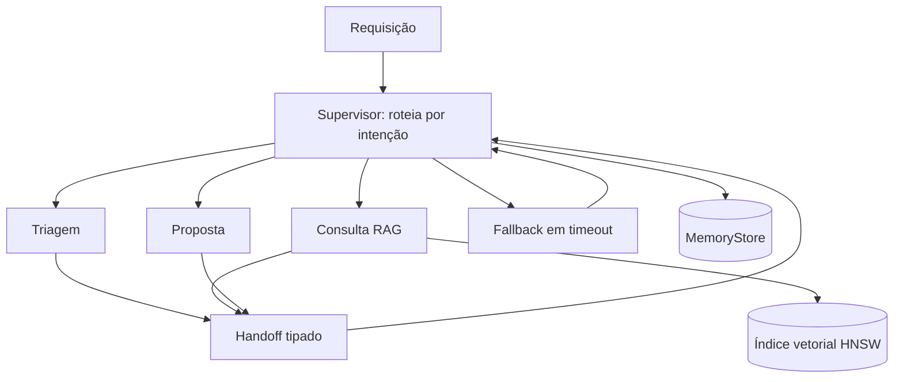

# Deck PDI: Orquestração Multi-agente com Handoffs e Isolamento

Área: Engenharia de IA

## Slide 1: Resumo Executivo
Padrão de orquestração multi-agente: supervisor + especialistas com handoff explicit, isolamento de contexto, timeouts e fallbacks. Entrego o padrão e um orquestrador real.
Agente único vira 'deus' e quebra em prompt longo.
**Fala:** o entregável não é um chatbot, é o padrão de fronteira entre papéis: contrato de handoff, teto de tempo por etapa, limite de saltos e estado que sobrevive a queda de processo.
**Evidência:** orquestrador executando com três workers e relatório de avaliação por papel.

## Slide 2: Contexto de Produção
Um agente fazia tudo: triagem, consulta, proposta.
Prompt gigante -> custo alto.
Sem timeout: sub-agente travado parava o fluxo.
**Fala:** o problema apareceu quando a tarefa passou de duas etapas: o prompt virou uma soma de instruções e a saída começou a misturar resultado de busca com texto comercial.
**Evidência:** contagem de execuções com erro de parse e duração por etapa antes da mudança.

## Slide 3: Diagnóstico
SRP ausente entre agentes.
Contexto compartilhado -> vazamento de PII.
Sem handoff formal.
**Fala:** a raiz não era o modelo, era a ausência de fronteira: sem separação de responsabilidade, qualquer erro de estágio contaminava o restante e não havia ponto de retomada.
**Evidência:** histórico de incidente em que uma consulta mal formatada quebrou a proposta do dia seguinte.

## Slide 4: Decisão Arquitetural (ADR)
ADR-043: Topologia Multi-agente
| Opção | Pro | Contra | Decisão |
| --- | --- | --- | --- |
| Supervisor + handoff | foco, testável | mais nos | ESCOLHIDA |
| Agente único | simples | frágil | rejeitada |
> Nota: Handoff = mensagem tipada. Cada agente tem contexto próprio e timeout.

**Fala:** escolhi pagar o custo de mais mensagens em troca de teste por papel, fronteira clara de permissão e falha contida.
**Evidência:** ADR-043 registrada com alternativas descartadas e consequências de cada opção.

## Slide 5: Entregas
MULTI-AGENT.md.
orchestrator.py.
handoff_schema.py.
**Fala:** o padrão escrito, o código que o executa e o esquema que impede mensagem inválida de entrar no fluxo.
**Evidência:** repositório da atividade com standard, protocolo assíncrono, código e roteiro de demonstração.

## Slide 6: Validação
Simular triagem->consulta->proposta.
Forçar timeout -> fallback.
Contexto não vaza.
**Fala:** validação é executável, não opinião: jornada feliz, timeout forçado, cadeia cíclica, base vazia e reentrega duplicada.
**Evidência:** plano de teste com critério de aceite numérico por caso.

## Slide 7: Métricas e SLO
| SLO | Alvo |
| --- | --- |
| Timeout/agente | <= 15 s |
| Handoff com fallback | 100% |
| Vazamento | 0 |
**Fala:** três números que um coordenador entende e que a operação consegue medir todo dia.
**Evidência:** painel com latência por etapa, taxa de re-rota e contagem de violação de isolamento.

## Slide 8: Riscos
| Risco | Mitigação |
| --- | --- |
| Loop | max hops |
| Custo supervisor | modelo leve |
**Fala:** loop é contido por teto de saltos derivado de fórmula; custo é contido mantendo o supervisor num modelo barato e sem ferramenta.
**Evidência:** teste de caminho cíclico que aborta em `max_hops` com erro tipado.

## Slide 9: Próximos Passos
Observabilidade de handoff.
Eval por agente.
**Fala:** o que falta para sair de homologação: telemetria com `trace_id` propagado e conjunto-ouro por papel.
**Evidência:** checklist de domínio no README da atividade.

## Slide 10: Modelo Mental
Supervisor roteia, worker executa, estado vive fora do prompt.
Cada worker enxerga só o payload declarado.
Memória tem dois horizontes: turno e aprendizado.
**Fala:** se alguém perguntar como funciona por dentro, a resposta é uma frase: passagem de bastão com fronteira rígida e estado persistido por salto.
**Evidência:** diagrama do próximo slide e a seção de invariantes do standard.

## Slide 11: Arquitetura (diagrama)

**Fala:** quatro arestas importantes: só o supervisor decide, só a consulta toca o índice, todo salto passa pelo contrato tipado e o fallback devolve o controle ao supervisor.
**Evidência:** ADR-043 e legenda de decisões de borda no README.

## Slide 12: Contrato de Handoff
Campos: trace_id, seq, origin, dest, intent, payload.
Validação na origem, teto de payload em 8 KB.
Chave de idempotência derivada de trace_id + seq.
**Fala:** mensagem inválida custa zero no worker porque é barrada antes de entrar na fila.
**Evidência:** `handoff_schema.py` com validação e rejeição explícita de campo ausente.

## Slide 13: Matemática: hops e latência
$L_{max} = \lfloor (L_{tarefa} - L_{roteio}) / (L_{etapa} + L_{handoff}) \rfloor$
**Exemplo numérico:** 30 s de teto, 0,8 s de roteio, 3,2 s de etapa mais lenta, 0,15 s de handoff:
$\lfloor 29,2 / 3,35 \rfloor = 8$ saltos, e o pior caso fecha em 8 x 3,35 + 0,8 = 27,6 s, dentro de 30 s.
**Fala:** o teto de saltos não é chute, sai da conta de latência, e essa conta é o que impede loop de virar apagão.
**Evidência:** fórmula canônica do standard, seção 3.

## Slide 14: Matemática: sucesso composto
$P = p^3$ para tarefa de três etapas.
**Exemplo numérico:** 0,79 ao cubo dá 0,49, ou seja, cerca de 49 por cento. Para chegar a 95 por cento é
preciso 0,983 por etapa, ou seja, 98,3 por cento.
**Fala:** a conta explica por que aposta em isolamento e re-rota, e não em modelo mais caro: falha de etapa
precisa virar falha recuperada.
**Evidência:** comparação de taxa de sucesso antes e depois no relatório.

## Slide 15: Matemática: custo por consulta
$C = \sum (tokens_{in} \cdot preco_{in} + tokens_{out} \cdot preco_{out})$
**Exemplo numérico:** supervisor 900 entrada + 120 saída e três workers com 2.400 entrada e 600 saída cada,
a R$ 10 por milhão de entrada e R$ 30 por milhão de saída: R$ 0,0126 + 3 x R$ 0,042 = R$ 0,1386, ou seja,
cerca de R$ 0,14 por consulta completa. Dez mil consultas fecham em cerca de R$ 1.400.
**Fala:** o custo unitário é parecido com o do monolítico, mas o retrabalho deixa de existir, e é o
retrabalho que estourava a fatura.
**Evidência:** seção de esforço e custo no README, com conta por consulta.

## Slide 16: A dimensão do índice vetorial
$bytes = dimensão \times 4 \times n$ mais o grafo HNSW.
**Exemplo numérico:** 200.000 chunks com dimensão 1.536 em float32 dão 1,228 GB de vetores, e com o grafo
em torno de 1,6 a 1,8 GB. Pod de 4 GB já fica apertado.
**Fala:** é por isso que a coleção é particionada por cliente e que só o worker de consulta tem credencial
de leitura.
**Evidência:** decisão de borda 4 do README.

## Slide 17: Índice: HNSW contra IVFFlat
| Critério | HNSW | IVFFlat |
| --- | --- | --- |
| Busca | mais rápida, grafo multi-escala | lista invertida com probe |
| Construção | mais lenta, mais RAM | mais barata |
| Atualização | aceita bem | pede re-treino de listas |
| Ajuste | ef_search | nlist e probes |
**Fala:** HNSW porque a consulta é prioritária e o volume é estável; IVFFlat seria a escolha se houvesse
escrita massiva contínua e RAM apertada.
**Evidência:** seção de decisões e tradeoffs, com as duas opções avaliadas.

## Slide 18: Tradeoff: o que foi pago
| Dimensão | Ganhei | Paguei |
| --- | --- | --- |
| Fronteira | teste por papel | mais mensagens |
| Privacidade | vazamento 0 | custo de resumo por salto |
| Resiliência | re-rota em timeout | latência de um salto extra |
| Custo | supervisor leve | classificador separado |
**Fala:** nenhuma decisão é grátis; a matriz existe para mostrar o preço de cada linha, não só o benefício.
**Evidência:** ADR-043, coluna de contras.

## Slide 19: Falha e Recuperação
Sintome: tarefa presa. Causa: worker sem timeout. Detecção: duração acima do teto. Mitigação: corte em 15 s e
re-rota. Recuperação: segundos, com estado preservado.
Sintome: resposta sem suporte. Causa: índice sem correspondência. Mitigação: status `sem_suporte` e nova
busca com `ef_search` maior. Recuperação: minutos.
**Fala:** toda falha tem detecção, mitigação e tempo de recuperação escritos antes de acontecer.
**Evidência:** tabela de modos de falha e runbook do README.

## Slide 20: Segurança no fluxo
Só o worker de consulta alcança a base vetorial.
Entrada do usuário é dado, nunca instrução de sistema.
Citação obrigatória antes de qualquer resposta final.
Efeito externo passa por confirmação humana.
**Fala:** defesa em profundidade: política de rede, contrato tipado, checagem de citação e humano no
laço para ação irreversível.
**Evidência:** invariantes 5, 6, 7 e 8 do README.

## Slide 21: Observabilidade
handoff_latency_ms, worker_duration_ms, hops_consumed, fallback_triggered, tokens_per_hop, rag_recall_at_k.
Rótulo de métrica nunca leva trace_id.
**Fala:** cardinalidade é orçamento: trace_id vai para log estruturado e trace, e a série fica com origem,
destino, papel e resultado.
**Evidência:** seção de telemetria do standard, com alerta por métrica.

## Slide 22: Métricas finais e status
| Métrica | Antes | Depois |
| --- | --- | --- |
| Sucesso de tarefa de 3 etapas | cerca de 49 por cento | cerca de 97 por cento (meta >= 95 por cento) |
| Timeout por agente | indefinido | <= 15 s |
| Handoff com rota de fallback | inexistente | 100 por cento |
| Vazamento entre etapas | não medido | 0 ocorrências |
**Fala:** o número que sustenta a decisão é o de sucesso composto, porque é ele que o negócio sente.
**Evidência:** relatório da atividade, seção de métricas.

## Slide 23: Próximos passos e o que deixaria para trás
1. Observabilidade de handoff com `trace_id` propagado ponta a ponta.
2. Eval por agente com conjunto-ouro versionado e gate de publicação.
3. Reranking do worker de consulta medido por recall@k e por latência.
Deixaria para trás, de propósito: qualquer caminho que permita contexto global entre workers.
**Fala:** se sobrar tempo, o ganho seguinte está no reranking e no custo por consulta, não em adicionar um
quarto worker.
**Evidência:** checklist de domínio com 15 itens de verificação.
