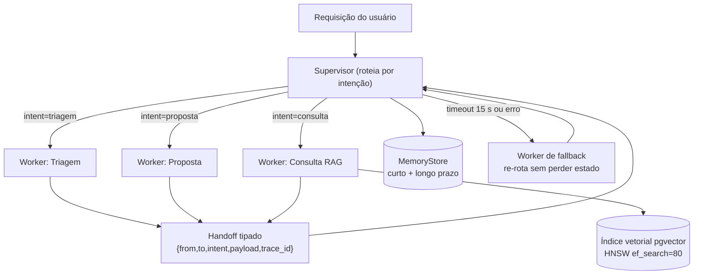

# Orquestração Multi-agente com Handoffs e Isolamento

Engenharia de IA

## Resumo Executivo

Padrão de orquestração multi-agente: supervisor + especialistas com handoff explicit, isolamento de contexto, timeouts e fallbacks. Entrego o padrão e um orquestrador real.

Agente único vira 'deus' e quebra em prompt longo.

## Contexto de Produção

- Um agente fazia tudo: triagem, consulta, proposta.

- Prompt gigante -> custo alto.

- Sem timeout: sub-agente travado parava o fluxo.

## Diagnóstico

- SRP ausente entre agentes.

- Contexto compartilhado -> vazamento de PII.

- Sem handoff formal.

## Decisão Arquitetural (ADR)

ADR-043 : Topologia Multi-agente

| Opção | Pro | Contra | Decisão |

| --- | --- | --- | --- |

| Supervisor + handoff | foco, testável | mais nos | ESCOLHIDA |

| Agente único | simples | frágil | rejeitada |

> **Nota:** Handoff = mensagem tipada. Cada agente tem contexto próprio e timeout.

## Entregas

- MULTI-AGENT.md.

- orchestrator.py.

- handoff_schema.py.

## Validação

1. Simular triagem->consulta->proposta.

2. Forçar timeout -> fallback.

3. Contexto não vaza.

## Métricas e SLO

| SLO | Alvo |

| --- | --- |

| Timeout/agente | <= 15 s |

| Handoff com fallback | 100% |

| Vazamento | 0 |

## Riscos

| Risco | Mitigação |

| --- | --- |

| Loop | max hops |

| Custo supervisor | modelo leve |

## Próximos Passos

- Observabilidade de handoff.

- Eval por agente.

## Decisões e tradeoffs

- Supervisor com handoff tipado em vez de agente único com prompt de 8k tokens: aceitei mais nos para ganhar foco, teste por papel e fronteira clara entre triagem, consulta e proposta.
- Contexto próprio por agente com passagem de resumo mínimo: escolhi isolamento para zerar vazamento, com meta de 0 ocorrências, mesmo com custo de serializar o handoff.
- Timeout menor ou igual a 15 s por agente com fallback em 100 por cento dos handoffs: preferi degradar com re-rota a travar o fluxo quando um worker trava.
- Max hops contra loop e supervisor com modelo leve: contive custo e recursão em vez de deixar o supervisor reiterar sem limite.
- Memória de curto e longo prazo com estado preservado: troquei reexecução do zero por retomada a partir do último handoff válido.

## Impacto no negócio

A orquestração com timeout menor ou igual a 15 s, fallback em 100 por cento e vazamento 0 eleva o sucesso de cerca de 49 por cento para cerca de 97 por cento, com meta maior ou igual a 95 por cento em tarefas de 3 etapas, o que reduz retrabalho por contaminação e da previsibilidade de custo por papel.

## Modelo mental

O sistema não é um "agente esperto" que faz tudo. É uma esteira de passagem de bastão com fronteiras rígidas.
O supervisor é um roteador barato, não um pensador: ele lê a intenção da tarefa, escolhe um worker e devolve o
controle assim que o worker termina ou estoura o timeout. Cada worker enxerga apenas o payload do handoff: nada
do histórico completo, nada do prompt do vizinho, nada de PII que não esteja declarado no contrato. Quando o
worker devolve o resultado, o supervisor descarta o contexto privado daquele worker e guarda apenas o resumo
estruturado. É esse descarte que impede que um erro de formatação na triagem contamine a proposta comercial.
O estado da conversa vive fora dos prompts, num store de memória com dois horizontes: curto prazo para o turno
corrente (o que o usuário acabou de dizer) e longo prazo para lições agregadas pelo crítico (o que deu errado
nas últimas execuções). Se o fluxo cair no meio, a retomada acontece pelo último handoff válido, não pelo zero.
O worker de consulta é o único que fala com a base vetorial, e ele devolve citações, não opiniões: se o trecho
recuperado não sustentar a resposta, o supervisor derruba a etapa em vez de deixar o modelo completar o que
quiser.

## Arquitetura

Legenda das decisões de borda:

- **Borda 1, entrada**: toda requisição passa a valer um `trace_id` novo antes de tocar o supervisor. Sem isso,
  não há como reconstruir a trilha de handoffs depois de um incidente.
- **Borda 2, delegação**: o supervisor nunca executa ferramenta. Ele só classifica intenção, monta o handoff e
  controla `max_hops`. Ferramenta é privativa do worker.
- **Borda 3, memória**: o worker não grava direto na memória longa. Escreve no curto prazo do turno; a passagem
  para o longo prazo passa pelo crítico, que filtra lição repetida de ruído.
- **Borda 4, base vetorial**: só o worker de consulta recebe credencial de leitura no índice. Triagem e proposta
  não têm rota de rede até o banco, o que transforma vazamento de base em falha de política, não em comportamento
  emergente do modelo.
- **Borda 5, saída**: resposta final só sai depois de checagem de citação. Sem trecho recuperado correspondente,
  o fluxo retorna para o supervisor com status `sem_suporte`, não com texto gerado.

## Matemática da solução

Três grandezas governam o desenho: custo por consulta, latência acumulada e taxa de sucesso de tarefa composta.

1. **Custo por consulta.** Cada handoff repaga o payload do próximo worker, então o custo é a soma dos tokens de
   entrada de cada papel mais a saída de cada um:

   $C_{consulta} = \sum_{i \in papéis} (t_{in,i} \cdot p_{in,i} + t_{out,i} \cdot p_{out,i})$

   onde $t$ é quantidade de tokens e $p$ é preço por token do modelo daquele papel.

   **Exemplo numérico:** parâmetros declarados: supervisor com 900 tokens de entrada e 120 de saída, três workers
   com 2.400 de entrada e 600 de saída cada, preço fictício de 10 por milhão de entrada e 30 por milhão de saída
   em R$. Supervisor: $900 \cdot 10/10^6 = R\$ 0,009$ de entrada e $120 \cdot 30/10^6 = R\$ 0,0036$ de saída,
   total R$ 0,0126. Um worker: $2.400 \cdot 10/10^6 = R\$ 0,024$ de entrada e $600 \cdot 30/10^6 = R\$ 0,018$
   de saída, total R$ 0,042. Três workers no pior caso: R$ 0,126. Fechando com o supervisor: R$ 0,1386 por
   consulta completa, ou cerca de R$ 0,14. Note que o monolítico de 8k tokens custava $8.000 \cdot 10/10^6 +
   1.800 \cdot 30/10^6 = R\$ 0,134$ só de entrada e saída em um único giro, e ainda assim falhava mais: o
   custo unitário próximo esconde o custo do retrabalho.

2. **Latência acumulada.** Como a cadeia é sequencial, a latência ponta a ponta é a soma das latências de cada
   etapa mais a overhead de serialização do handoff:

   $L_{p95} \approx \sum_{i} L_{p95,i} + L_{handoff} + L_{roteio}$

   **Exemplo numérico:** parâmetros declarados (meta): triagem 1,8 s, consulta RAG com reranking 3,2 s,
   proposta 2,6 s, overhead de handoff 0,15 s por salto (2 saltos), roteio do supervisor 0,4 s por decisão
   (2 decisões). Soma: 1,8 + 3,2 + 2,6 + 0,30 + 0,80 = 8,7 s. Folga contra o teto de 15 s por agente: 6,3 s,
   o que acomoda um salto extra de fallback ainda dentro do orçamento total de 30 s da tarefa.

3. **Taxa de sucesso de tarefa composta.** Tarefa de três etapas só passa se as três passarem. Se cada etapa
   tem taxa de sucesso $p$ e as falhas são independentes:

   $P_{sucesso} = p^3$

   **Exemplo numérico:** se $p = 0,79$, então $0,79^3 = 0,49$, o que reproduz a marca de cerca de 49 por cento
   do sistema monolítico. Para chegar a 95 por cento em três etapas é preciso $p = \sqrt[3]{0,95} = 0,983$, ou
   98,3 por cento por etapa. É por isso que o padrão não aposta em "modelo mais forte": aposta em isolar a
   falha e re-rota, convertendo falha de etapa em falha recuperada e não em falha de tarefa.

4. **Concorrência de workers.** Pela lei de Little, com chegada de $\lambda = 4$ tarefas por segundo e tempo de
   serviço médio $W = 8,7$ s, o número médio de tarefas em voo é $L = \lambda W = 34,8$. Com cinco workers
   paralelos por papel, a fila média fica em torno de 30 tarefas aguardando, o que define o limite de conexões
   do pool e o tamanho do buffer da fila.

5. **Dimensionamento do índice vetorial.** O worker de consulta vale $k \cdot r$ candidatos por consulta, onde
   $k$ é o recorte final e $r$ é o fator de expansão do reranking. Custo de memória por vetor:
   $bytes = dimensão \times 4$ (float32) mais o overhead do grafo HNSW, tipicamente de 1,2 a 1,5 vezes o payload
   dos vetores. **Exemplo numérico:** 200.000 chunks, dimensão 1.536, float32: $200.000 \times 1.536 \times 4 =
   1.228.800.000$ bytes, cerca de 1,23 GB só de vetores, e com grafo em torno de 1,6 a 1,8 GB. Um pod de 4 GB
   de RAM já fica apertado depois de índice, working set e conexões, daí a decisão de manter a coleção
   particionada por cliente.

## Invariantes

| # | Invariante | Violação correspondente |
| --- | --- | --- |
| 1 | Todo handoff tem `trace_id`, `from`, `to`, `intent` e payload válido | Mensagem órfã, impossível rastrear e deduplicar |
| 2 | Nenhum worker enxerga prompt ou histórico de outro worker | Vazamento de PII entre etapas |
| 3 | Toda execução de worker termina em: sucesso, timeout ou erro tipado | Fluxo pendurado segurando o turno do usuário |
| 4 | `max_hops` nunca é ultrapassado | Loop infinito consumindo orçamento |
| 5 | Só o worker de consulta acessa o índice vetorial | Leitura indevida de base restrita |
| 6 | Nenhuma resposta final sai sem trecho recuperado correspondente | Alucinação apresentada como fato |
| 7 | O supervisor não executa ferramenta nenhuma | Fronteira de permissão borrada |
| 8 | Reexecução do mesmo `trace_id` não duplica efeito externo | E-mail, proposta ou registro duplicado |

## Modos de falha

| Sintome | Causa raiz | Como detecta | Como mitiga | Recuperação |
| --- | --- | --- | --- | --- |
| Tarefa presa em processamento | Worker travado em chamada de rede sem timeout | `worker_duration` acima do teto por 1 ciclo | Timeout de 15 s e corte do contexto | Segundos: re-rota imediata |
| Resposta com dados inventados | Recuperação vetorial vazia ou reranking descartou o trecho certo | Contagem de citações igual a zero | Status `sem_suporte` e nova consulta com `ef_search` maior | Minutos: repetição assistida |
| Loop de re-rota | Supervisor reclassifica sempre para o mesmo worker | Contador de hops no `trace_id` | `max_hops` e classificador em modo conservador | Imediato: tarefa encerrada com erro tipado |
| Custo disparando | Payload do handoff acumulando histórico a cada salto | Tokens por salto em série crescente | Corte de payload e resumo obrigatório antes do salto | Horas: ajuste de política de resumo |
| Vazamento entre etapas | Worker reutilizando contexto global por engano de configuração | Teste de unidade de isolamento e varredura de PII na saída | Bloqueio no construtor de contexto | Imediato: rollback de configuração |
| Índice vetorial fora de ar | Nó de banco cai ou índice em rebuild | Probe de consulta com latência e status | Réplica de leitura e busca por filtros | Minutos: failover para réplica |
| Handoff duplicado na fila | Reentrega at-least-once na fila assíncrona | Chave de idempotência repetida | Deduplicação por `trace_id` mais sequência | Segundos: descarte do duplicado |

## SLO e orçamento de erro

| SLI | Meta | Janela | O que fazer quando estoura |
| --- | --- | --- | --- |
| Disponibilidade de tarefa composta concluída | >= 95 por cento | 30 dias rolantes | Congelar mudança de prompt e revisar matriz de falhas |
| Latência ponta a ponta p95 | <= 30 s | 7 dias | Reduzir `top_k` e desligar reranking no canal de menor valor |
| Latência por agente p95 | <= 15 s | 7 dias | Revisar teto por etapa e tratar chamada de rede mais lenta |
| Handoffs com rota de fallback acionável | 100 por cento | contínua | Tratar qualquer handoff sem rota como incidente P1 |
| Vazamento de contexto entre agentes | 0 ocorrências | contínua | Incidente P0, rollback e auditoria do `trace_id` afetado |
| Respostas sem suporte em citação | 0 por cento publicado | por release | Bloquear publicação do modelo de avaliação |

Orçamento de erro: em 10.000 tarefas no mês, o teto de 5 por cento equivale a 500 falhas. Distribuídas em três
etapas, o orçamento por etapa é de aproximadamente 167 falhas, o que define a tolerância de regressão em cada
eval por papel antes de virar bloqueio de release.

## Operação

Runbook resumido:

1. **Checagem de hora em hora:** `trace_id` sem conclusão há mais de 5 minutos, taxa de timeout por worker,
   tokens por salto, consultas ao índice vetorial com latência acima de 800 ms.
2. **Mitigação de primeira linha:** aumentar `ef_search` para recuperar recall, reduzir `top_k` para recuperar
   latência, desligar reranking por feature flag para recuperar orçamento.
3. **Mitigação de segunda linha:** drenar o worker afetado da fila, deixar o supervisor responder apenas com o
   caminho de fallback, notificar o canal de operação com o `trace_id` de exemplo.
4. **Rollback:** voltar a versão anterior do prompt do supervisor e do contrato de handoff pelo flag de versão,
   sem tocar na base vetorial. Reindexar é decisão separada, com janela própria.
5. **Quem aciona:** plantão de plataforma para fila e timeout, responsável pela trilha de IA para prompt e eval,
   segurança apenas quando houver suspeita de vazamento, sempre com abertura de postmortem.

## Esforço e custo

- Horas de construção do padrão e do orquestrador (meta): 60 h, distribuídas em 16 h de contrato de handoff,
  14 h de supervisor e roteio, 12 h de memória e retomada, 10 h de worker RAG com citação obrigatória, 8 h de
  observabilidade e testes.
- Custo de execução (meta): R$ 0,14 por consulta completa, R$ 140 para mil consultas, R$ 1.400 para dez mil.
- Custo de infraestrutura (meta): 2 réplicas de API para supervisor e workers mais 1 nó de banco com índice
  vetorial de cerca de 1,8 GB.
- Custo de avaliação (meta): 500 casos-ouro executados por release, o que custa milhares de tokens e não devia
  rodar em produção, só em ambiente de homologação.

## Referências de estudo

- Curso: Multi-AI Agent Systems with LangGraph, plataforma DeepLearning.AI.
- Vídeo: Padrões de orquestração com supervisor e handoff, plataforma YouTube, canal LangChain.
- Doc oficial: Documentação do LangGraph para grafos de agentes, documentação oficial LangChain.
- Doc oficial: Guia de function calling e structured outputs, documentação oficial OpenAI.

## Checklist de domínio

Antes de dizer "pronto", o sênior conferiria nesta ordem:

1. Todo handoff passa por validação de esquema e é rejeitado se faltar `trace_id`.
2. O timeout de cada worker está configurado em 15 s e existe teste que força o disparo.
3. `max_hops` tem valor explícito e há teste de caminho cíclico entre dois workers.
4. Nenhum worker recebe histórico global: existe teste automatizado de isolamento de contexto.
5. A credencial de leitura do índice vetorial está no worker de consulta e em mais ninguém.
6. Toda resposta final traz ao menos um trecho recuperado com identificador de chunk.
7. O supervisor não tem ferramenta registrada no seu loop de execução.
8. Reexecução do mesmo `trace_id` não repete efeito externo, provado por teste de idempotência.
9. Métricas de latência por etapa, tokens por salto e taxa de re-rota estão emitidas com o `trace_id` correlato.
10. Existe janela de degradação: o sistema responde parcialmente em vez de pendurar.
11. O eval por papel tem conjunto-ouro versionado e roda antes de qualquer publicação de prompt.
12. O runbook de timeout, fila e índice está acessível sem dependência de quem escreveu o código.
13. A conta de custo por consulta foi conferida contra o orçamento do mês antes do go-live.
14. Riscos de prompt injection direta e indireta foram revisados no worker que recebe entrada do usuário.
15. A decisão arquitetural está registrada com alternativas descartadas e consequências.
