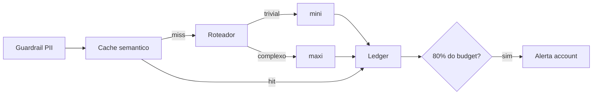
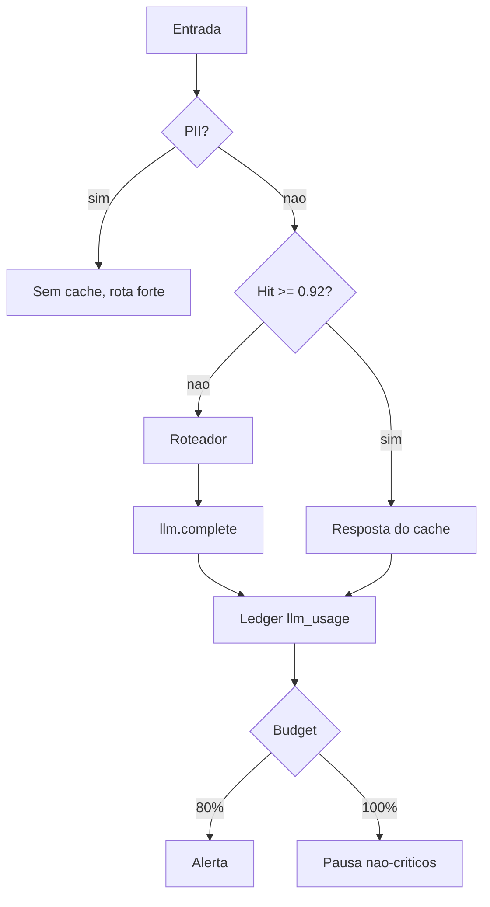
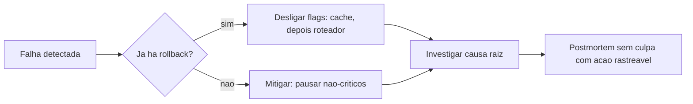

# Deck PDI: Engenharia de Custos de LLM (custo por tarefa, cache, roteamento)

Área: Engenharia de IA

## Slide 1: Resumo Executivo
Fala: Framework de custo de LLM: custo por tarefa, cache de prompt, roteamento por complexidade e budget. Entrego o padrão e um calculador.
Fala: Sem contabilidade de tokens, não se precifica o agente.
Evidência: três padrões em `1-standards/`, calculador em `2-code/cost_calc.py` e ledger em `3-supabase/usage_schema.sql`.
Mensagem-chave: custo é propriedade de arquitetura, não linha de fatura.

## Slide 2: Contexto de Produção
Fala: Modelo 'maxi' para tudo (10x custo).
Fala: Sem cache -> mesma pergunta paga 2x.
Fala: Impossível precificar ao cliente.
Evidência: nenhum campo de `agent` no dado de consumo, nenhuma tabela de preço versionada.

## Slide 3: Diagnóstico
| Hoje | Alvo |
| --- | --- |
| modelo único | roteamento |
| sem cache | cache |
| custo invisível | custo/tarefa |

Fala: os três sintomas são a mesma doença: não existe granularidade de cobrança por fluxo.
Evidência: fatura única de fim de mês, sem decomposição por `agent` nem por intenção.

## Slide 4: Decisão Arquitetural (ADR)
ADR-044: Estratégia de Custo
| Opção | Pro | Contra | Decisão |
| --- | --- | --- | --- |
| Roteamento + cache + budget | previsível | governança | ESCOLHIDA |

> Nota: Trivial -> leve; complexo -> forte; repetido -> cache.

Fala: cada peça cobre o vazamento que a outra deixa: roteamento ataca o mix, cache ataca a repetição, ledger ataca a opacidade, budget ataca o estouro.

## Slide 5: Entregas
LLM-COST.md: fórmula canônica, tabela de preço e tabela de decisão de roteamento.
cost_calc.py: cálculo com e sem cache em código revisável.
BUDGET.md: teto, faixas de 80% e 100%, responsável por faixa.
COST-MONITORING.md: o que emitir por execução, cardinalidade e alertas.
usage_schema.sql: tabela `llm_usage` com índice `(agent, created_at)`.

## Slide 6: Validação
Medir custo/tarefa com e sem roteamento.
Habilitar cache; medir hit rate.
Budget por cliente + alerta 80%.
Critério de aceite: mix do fluxo trivial 100% no modelo leve, 100% das execuções com linha no ledger e alerta disparando entre 79% e 81% do teto em teste.

## Slide 7: Métricas e SLO
| SLO | Alvo |
| --- | --- |
| Custo/tarefa | <= baseline*0.4 |
| Cache hit | >= 30% |
| Budget | alerta 80% |

Fala: os três SLI têm janela de medição declarada e ação definida para quando estouram.
Evidência: consulta SQL de uma linha para cada SLI, sem depender de planilha.

## Slide 8: Riscos
| Risco | Mitigação |
| --- | --- |
| Qualidade cai | eval + roteamento |
| Cache PII | não cachear |

Fala: qualidade é barra de entrada, não otimização: troca que derrube o score abaixo de 0.90 é revertida no mesmo dia.
Fala: PII em cache é zero tolerância: guardrail roda antes de qualquer escrita.

## Slide 9: Próximos Passos
Precificar por tarefa.
Dashboard de custo.
Fecho: fechar os SLI num cliente piloto, publicar o dashboard por fluxo e transformar o custo por tarefa em preço de tabela comercial.

## Slide 10: Modelo mental
Fala: cada execução é uma nota fiscal que ninguém estava emitindo: quem pediu, o que consumiu, quanto custou.
Fala: o guardrail decide se grava, o cache decide no lugar do gasto, o roteador decide antes do gasto, o ledger decide depois do gasto e o budget é o freio que lê a fatura acumulada.
Evidência: a ordem guardrail, cache, roteamento, chamada, contabilidade não é negociável.

## Slide 11: Arquitetura de referência
Fala: o desenho tem cinco decisões de borda e todas têm justificativa.
Evidência: cache antes do roteador porque uma resposta já existente dispensa a escolha de modelo; ledger depois da resposta porque grava o modelo efetivamente usado.

## Slide 12: Matemática da solução
Fórmula: `custo_tarefa = (in * $in + out * $out) * (1 - cache_hit)`.

**Exemplo numérico (parâmetros declarados: 500 tokens de entrada, 200 de saída, intenção triagem):**
- rota `mini`: `500 * 0.15/1M + 200 * 0.60/1M = 0.000195 USD`
- se fosse `maxi`: `500 * 3.00/1M + 200 * 15.00/1M = 0.004500 USD`
- razão: `0.004500 / 0.000195 = 23.1x` mais caro para a mesma tarefa

**Exemplo numérico (parâmetros declarados: 100.000 execuções no mês, 90% em triagem, 30% de hit):**
- baseline: `100.000 * 0.004500 = 450.00 USD`
- com roteamento e cache: `43.79 USD` (meta)
- redução: `90.3%` (meta), acima da meta de redução maior ou igual a 85%

## Slide 13: Matriz de tradeoffs
| Critério | Só cache | Só roteamento | Ledger e budget | Combinação |
| --- | --- | --- | --- | --- |
| Reduz mix caro | não | sim | não | sim |
| Corta repetição | sim | não | não | sim |
| Permite precificar | não | não | sim | sim |
| Evita estouro | não | não | sim | sim |
| Custo de operação | médio | baixo | médio | alto |
| Complexidade de teste | baixa | baixa | média | alta |

Fala: a combinação é a única linha que entrega as quatro frentes; o preço é a complexidade de teste, e é por isso que o padrão existe: para que a complexidade fique escrita e não viva na cabeça de uma pessoa.

## Slide 14: Custo do próprio controle
Fala: toda camada de medição também custa, e precisa ser medida.
| Item | Custo por 1.000 execuções | Postura |
| --- | --- | --- |
| Embedding para cache | só no caminho de miss | aceitável |
| Consulta vetorial | 1 por tentativa de hit | amortizada pelo índice |
| INSERT no ledger | 1 por execução | agregar com flush se crescer |
| Avaliação de roteamento | lote fora do pico | batch com desconto |

Regra: o controle precisa custar menos de 5% do que ele controla (meta).

## Slide 15: Modos de falha e recuperação
| Falha | Detecção | Mitigação | Recuperação |
| --- | --- | --- | --- |
| Hit rate cai abaixo de 30% | janela móvel de 7 dias | reverter limiar de similaridade | 1 dia |
| Tudo cai no modelo forte | mix por modelo no ledger | rollback do `route_model` | horas |
| Estouro de budget | alerta em 80% | pausar agentes não-críticos | minutos |
| PII em cache | varredura de amostra | invalidar cache do cliente | horas |
| Preço ausente | contador `unknown_price` | atualizar tabela versionada | minutos |
| Retry sincronizado | pico após erro | backoff exponencial com jitter | minutos |

Fala: rollback padrão é desligar as flags de cache e de roteamento, na ordem, sem migração de dado. É caro, mas sempre disponível.

## Slide 16: Operação e runbook
Fala: checagem diária é uma consulta de consumo por `agent`, o hit rate e o mix de modelo.
Fala: quem aciona: engenharia para roteamento, cache e ledger; account para o alerta de teto; coordenação para revisão mensal do teto.
Evidência: runbook com seis passos no README da atividade, cada um com comando ou critério.

## Slide 17: Esforço e custo da entrega
| Item | Esforço (meta) |
| --- | --- |
| Standard e ADR | 6 a 8 horas |
| Calculador e track de custo | 8 a 12 horas |
| Esquema e índices no Supabase | 4 a 6 horas |
| Validação em piloto | 1 semana de observação |
| Dashboard de custo | 12 a 16 horas |

Custo de rodar o framework durante a validação: **Exemplo numérico:** 5.000 execuções/mês em modo de teste, 500/200 tokens, tudo em mini, sem cache: `5.000 * 0.000195 = 0.98 USD/mês`.

## Slide 18: Impacto no negócio
Fala: com custo por tarefa auditável, a account passa de horas vendidas para preço por entrega, o financeiro fecha o mês com custo por cliente e a engenharia ganha preço conhecido antes de qualquer decisão de arquitetura.
Fecho: sem contabilidade de tokens, não se precifica o agente. Com ela, a margem deixa de ser surpresa.
