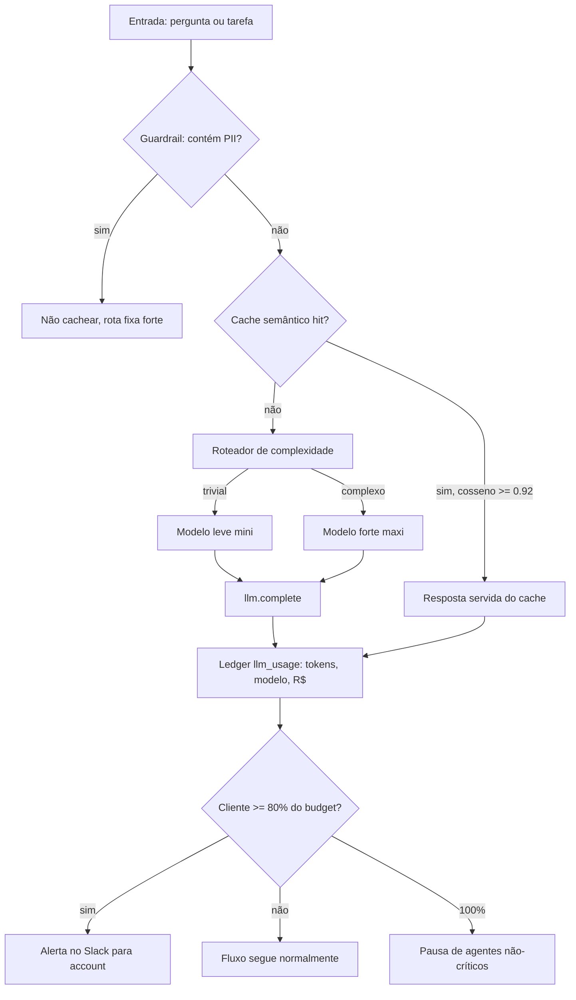

# Engenharia de Custos de LLM (custo por tarefa, cache, roteamento)

Engenharia de IA

## Resumo Executivo

Framework de custo de LLM: custo por tarefa, cache de prompt, roteamento por complexidade e budget. Entrego o padrão e um calculador.

Sem contabilidade de tokens, não se precifica o agente.

O trabalho se entrega em três padrões que se encaixam, um calculador e um esquema de dados:

- `1-standards/LLM-COST.md`: fórmula canônica de custo, tabela de preços por modelo, tabela de decisão de roteamento e regra dura de cache.
- `1-standards/BUDGET.md`: teto mensal por cliente, faixas de alerta (80% e 100%), responsável por cada faixa e cadência de revisão.
- `1-standards/COST-MONITORING.md`: o que é emitido por execução, com qual cardinalidade de rótulo, onde é gravado e o que dispara alerta.
- `2-code/cost_calc.py`: a fórmula em código, com roteamento por intenção e cálculo de custo com e sem cache.
- `2-code/track_cost.py`: preço por 1k tokens por modelo, com fallback de preço desconhecido.
- `3-supabase/usage_schema.sql`: tabela `llm_usage` e índice composto `(agent, created_at)` que sustenta o ledger.

A tese é simples: **custo é propriedade de arquitetura, não fatura**. Se ninguém consegue dizer, em R$, quanto custa uma tarefa do agente, então nenhum pricing, nenhuma priorização de backlog e nenhuma conversa de margem são possíveis. O framework existe para transformar um número opaco de fim de mês em uma variável observável, orçamentada e roteável.

## Contexto de Produção

- Modelo 'maxi' para tudo (10x custo).

- Sem cache -> mesma pergunta paga 2x.

- Impossível precificar ao cliente.

| Sintoma no dia a dia | Causa operacional | Efeito econômico |
| --- | --- | --- |
| Toda chamada sai no modelo forte | Não existe classificador de complexidade | Paga-se o preço de fronteira para tarefas de triagem |
| Pergunta repetida recalcula do zero | Não há camada de cache semântico nem de prefixo | A mesma resposta é comprada duas vezes no mesmo dia |
| Fatura só chega no fim do mês, sem detalhe | Não há ledger por `agent` e por fluxo | Impossível precificar contrato nem achar vazamento |
| Ninguém sabe o que estourou o orçamento | Não há teto por cliente nem alerta em 80% | Descobre-se o estouro na fatura, quando já é prejuízo |

Exemplo numérico (parâmetros declarados: 1.000 execuções/dia, 500 tokens de entrada e 200 de saída cada, todas no modelo forte, sem cache): `$in = 500/1.000.000 * 3.00 = 0.0015` e `$out = 200/1.000.000 * 15.00 = 0.0030`, logo `0.0045 USD/execução`. Em 30 dias: `0.0045 * 1000 * 30 = 135 USD`. Com roteamento (90% triagem para o modelo leve) e 30% de cache, a mesma carga cai para cerca de `13 USD/mês` (**meta** de redução compatível com a meta geral de redução maior ou igual a 85%).

## Modelo mental

Pense em cada execução do agente como uma linha de nota fiscal que ninguém está emitindo. A linha tem três campos: **quem pediu** (`agent` e fluxo), **o que foi consumido** (tokens de entrada e de saída, em qual modelo) e **quanto custou** (a multiplicação da tabela de preços). O framework só faz essas três coisas: classificar a chamada antes de executá-la, evitar a chamada quando a resposta já existe, e gravar a linha depois de executá-la.

O roteador decide **antes** do gasto. Ele lê a intenção da tarefa e escolhe o modelo: trivial vai para o modelo leve, complexo vai para o modelo forte. O cache decide **no lugar** do gasto: se a pergunta já foi respondida com similaridade acima do limiar, devolve a resposta salva e zera o custo daquela execução. O ledger decide **depois** do gasto: registra tokens e reais por fluxo, para que a fatura deixe de ser um número único. O budget é o freio que observa o ledger em janela móvel e corta o pé quando a conta chega perto do teto.

A ordem importa e não é negociável: **guardrail, depois cache, depois roteamento, depois chamada, depois contabilidade**. Pular o guardrail e gravar antes de checar PII é como deixar dado sensível no armazenamento de respostas. Consultar o roteador antes do cache faria você classificar toda chamada, inclusive as que o cache resolveria com custo zero. Chamar antes do cache pagaria o que já se sabe. Gravar antes de saber o modelo real produziria ledger errado. E orçamento sem ledger é opinião, não controle.

## Arquitetura



Legenda das decisões de borda:

- **Guardrail de PII na frente do cache**: é a única barreira que impede dado sensível de entrar no armazenamento de respostas. Se o guard falha, o pior caso é gravar PII em cache, não é cobrança errada; por isso ele roda antes de qualquer escrita.
- **Cache antes do roteador**: evitar a chamada paga vale mais do que evitar a classificação. Um hit custa zero e dispensa até a escolha de modelo: se a resposta já existe, não interessa qual rota seria usada.
- **Roteador como função pura de intenção**: `route_model(intent)` é determinística e testável sem rede, o que permite unit test e revisão de regra sem disparar chamada paga.
- **Ledger após a resposta**: grava o modelo efetivamente usado, não o modelo pretendido, porque roteador pode ser sobrescrito por fallback.
- **Budget observando o ledger e não o contrário**: teto que lê a própria fatura acumulada é à prova de corrida; teto que depende de contador em memória perde estado no restart.

### Pipeline de uma chamada

| Etapa | Função | Custo da etapa | O que faz se der errado |
| --- | --- | --- | --- |
| 1. Guardrail de PII | `has_pii(text)` | CPU, ~0 | Em caso de dúvida, marca `cacheable = false` e segue |
| 2. Cache semântico | `semantic_cache(q)` | 1 consulta vetorial + 1 embedding | Em caso de timeout, cache miss e segue para o modelo |
| 3. Roteamento | `route_model(intent)` | CPU, ~0 | Em caso de regra ausente, usa o modelo forte (degradação cara, não errada) |
| 4. Chamada | `llm.complete()` | tokens de entrada e saída | Em caso de erro, retry com backoff e jitter |
| 5. Contabilidade | `ledger.save()` | 1 INSERT | Em caso de falha, fila de reprocessamento com a resposta já em memória |

## Matemática da solução

Fórmula canônica (unidades: `in` e `out` em tokens, preço em USD por 1 milhão de tokens):

```
custo_tarefa = (in * preco_in + out * preco_out) * (1 - cache_hit)
custo_tarefa = (in * $in + out * $out) * (1 - cache_hit)
```

com `cache_hit` valendo `1` quando a resposta veio do cache e `0` quando a chamada foi executada. Preços usados no padrão:

| Modelo | Entrada ($/1M tokens) | Saída ($/1M tokens) | Uso previsto |
| --- | --- | --- | --- |
| mini (leve) | 0.15 | 0.60 | triagem, classificação, extração simples |
| maxi (forte) | 3.00 | 15.00 | proposta, análise complexa, raciocínio longo |

**Exemplo numérico (parâmetros declarados: 500 tokens de entrada, 200 de saída, intenção `triagem`, cache miss):**

```
rota: triagem -> mini
entrada = 500 * 0.15 / 1.000.000 = 0.000075 USD
saida   = 200 * 0.60 / 1.000.000 = 0.000120 USD
custo   = 0.000195 USD por tarefa   (custo_miss)
com cache hit: custo = 0 USD por tarefa (custo_hit)
```

**Exemplo numérico (mesma tarefa, roteamento errado, tudo no maxi):**

```
entrada = 500 * 3.00 / 1.000.000 = 0.001500 USD
saida   = 200 * 15.00 / 1.000.000 = 0.003000 USD
custo   = 0.004500 USD por tarefa
razao   = 0.004500 / 0.000195 = 23.1x mais caro
```

O fator 23.1x é o argumento econômico do roteamento: a razão entre os preços de saída é `15/0.60 = 25x`, e a razão de entrada é `3/0.15 = 20x`; o mix de 500/200 tokens produz o 23.1x. Para o cenário de 90% de tráfego em triagem, o custo médio por tarefa vira:

```
E[custo] = 0.90 * 0.000195 + 0.10 * 0.004500 = 0.0006255 USD
```

Com 30% de hit de cache sobre as chamadas que sobram, `E[custo] = 0.0006255 * 0.70 = 0.000438` (**meta** de comportamento, não medição). Comparando com o baseline de 100% no maxi: `0.004500 -> 0.000438`, redução de `90.3%`, acima da meta de redução maior ou igual a 85%.

### Custo de manter o controle (overhead)

| Item | Custo por 1.000 execuções | Observação |
| --- | --- | --- |
| Embedding para o cache semântico | depende do modelo de embedding usado | Só ocorre no caminho de miss |
| Consulta vetorial no Postgres | 1 consulta por tentativa de hit | Amortizada pelo índice `ivfflat` ou `hnsw` |
| INSERT no `llm_usage` | 1 linha por execução | Particionável por mês se o volume crescer |
| Avaliação de roteamento | execuções em lote fora do horário de pico | Pode ir para o modo batch com desconto |

**Regra de sanidade:** o custo do controle precisa ser menor que 5% do custo que ele controla (**meta**). Se o ledger passar a custar mais que isso, o caminho é agregação em memória com flush periódico, não abandonar a medição.

### Batch como alavanca adicional

Chamadas não-urgentes (resumo de documentos, enriquecimento de base, geração de rascunho) podem ir para lote com desconto de cerca de 50% no preço (**meta** já citada nas entregas), desde que o SLA de latência da tarefa permita. A conta é direta: `custo_lote = custo_online * 0.50`. O tradeoff é latência: lote não tem p95 curto, então a regra é só empacotar o que tem janela de tolerância declarada.

## Invariantes

| Invariante | Violação correspondente | Como se detecta |
| --- | --- | --- |
| Toda execução de LLM gera exatamente 1 linha em `llm_usage` | Ledger incompleto, fatura não auditável | Contagem de execuções x contagem de linhas por dia |
| `model` gravado é o modelo efetivamente chamado, não o pretendido | Custo atribuído ao preço errado | Amostragem cruzando resposta da API com linha do ledger |
| Nenhuma linha de cache contém PII | Vazamento de dado sensível em armazenamento | Varredura periódica do cache com detector de PII |
| `cost_usd` nunca é negativo e nunca é nulo | Divisão por zero ou preço ausente | Constraint + alerta de preço desconhecido caindo no fallback |
| Soma diária de `cost_usd` por cliente <= teto do budget | Estouro de orçamento não detectado | Job de agregação comparando com `BUDGET.md` |
| Roteamento trivial nunca aponta para o modelo forte | Alavanca de redução anulada | Teste de propriedade sobre `route_model(intent)` |
| Cache hit reduz o custo da execução a exatamente zero | Cobrança duplicada da mesma resposta | Teste unitário de `cost(task, cache_hit=True)` |
| Toda chamada com erro não é cobrada como sucesso | Custo de retry contado duas vezes | Correlação de `id` de execução com status HTTP |

## Modos de falha

| Sintoma | Causa raiz | Como detecta | Como mitiga | Tempo de recuperação |
| --- | --- | --- | --- | --- |
| Fatura 2x do esperado | Cache desligado ou limiar alto demais | Hit rate diário cai abaixo de 30% | Baixar limiar com teste de qualidade, reativar cache | 1 dia de operação |
| Custo por tarefa subiu sem mudança de volume | Roteamento deixou de classificar e tudo caiu no forte | Proporção de chamadas por modelo no ledger | Rollback da regra, fix de `route_model`, replays do classificador | Horas |
| Estouro de budget no meio do mês | Campanha sazonal ou vazamento de loop de agente | Alarme em 80% do teto | Pausa de agentes não-críticos, revisão do fluxo com maior consumo | Minutos (mitigação), dias (cura) |
| PII gravada em cache | Guardrail de PII pulado em novo caminho de código | Varredura de amostra do cache | Invalidar cache do cliente, corrigir guard, revisão de código | Horas |
| Ledger com `cost_usd` zerado | Tabela de preços desatualizada após mudança de preço | Soma diária perto de zero com volume normal | Atualizar preços mensalmente, alerta de preço ausente | Minutos |
| Latência p95 estourou | Camada de cache e classificação somadas à chamada | Métrica de latência por etapa | Cache em memória com TTL, classificação em pré-cálculo, timeout na consulta vetorial | Imediato |
| Cliente com cache de outro cliente | Chave de cache sem escopo de tenant | Teste de isolamento | Chave composta `tenant_id + hash(pergunta)`, revisão do key builder | Imediato (correção), 1 ciclo (invalidação) |
| Retry multiplicando o gasto | Backoff fixo sincronizando clientes | Pico sincronizado de chamadas a cada erro | Backoff exponencial com jitter, `circuit breaker` por modelo | Minutos |

## SLO e orçamento de erro

| SLI | Meta | Janela de medição | O que fazer quando estoura |
| --- | --- | --- | --- |
| Custo por tarefa | <= baseline * 0.4 | mensal, por fluxo | Auditar mix de rota, checar se o cache entrou em hit |
| Hit rate de cache | >= 30% | diária, janela móvel de 7 dias | Revisar limiar de similaridade e normalização da pergunta |
| Disparo de alerta de budget | 80% do teto | acumulado do mês por cliente | Notificar account, revisar consumo por `agent` |
| Redução de custo | >= 85% com score >= 0.90 | por onboarding de cliente | Reavaliar roteamento com o conjunto-ouro de avaliação |
| Latência p95 por etapa | declarada por etapa na seção de operação | diária | Isolar etapa lenta, mover para cache em memória |
| Custo do controle | < 5% do custo controlado | mensal | Agregar métricas, reduzir cardinalidade de rótulo |

Orçamento de erro é o que se aceita perder para aprender. Aceitamos: uma semana de hit rate abaixo da meta em um cliente novo, enquanto o limiar é ajustado; até 1 dia de roteamento errado em produção antes da detecção pelo alarme de mix de modelos; e uma falha de escrita de ledger por semana, desde que o fila de reprocessamento recupere a linha em menos de 1 hora. Não aceitamos: PII em cache (zero tolerância) e teto estourado sem alerta (zero tolerância).

## Operação

Runbook resumido:

1. **Checagem diária**: conferir a soma de `cost_usd` por dia e por `agent`, o hit rate e a proporção de chamadas por modelo. Comando de referência: `select agent, model, count(*), sum(cost_usd) from llm_usage where created_at > now() - interval '1 day' group by 1, 2 order by 3 desc;`.
2. **Se hit rate caiu abaixo de 30%**: checar se o cache está ligado, se o limiar foi alterado e se a normalização de texto continua removendo ruído. Mitigação imediata: reverter o limiar para o último valor aprovado.
3. **Se a proporção do modelo forte passou do esperado**: olhar os logs do roteador, aplicar rollback da regra e reprocessar as tarefas classificadas no período. Rollback é trocar `route_model` pela versão anterior, sem migrar dados.
4. **Se o alerta de 80% disparou**: notificar a account no Slack com o consumo por `agent`, pausar agentes não-críticos e agendar revisão mensal do teto.
5. **Se houver suspeita de PII em cache**: invalidar o cache do cliente afetado, acionar a revisão do guardrail e registrar ocorrência para postmortem.
6. **Quem aciona**: engenharia de IA para os itens técnicos (1 a 3 e 5), account para o item 4, coordenação para revisão de teto.

Rollback padrão: desligar as flags `ENABLE_SEMANTIC_CACHE` e `ENABLE_ROUTER` em ordem, voltando ao comportamento de modelo único. É um rollback caro, mas sempre disponível e sem migração de dado.

## Decisão Arquitetural (ADR)

ADR-044 : Estratégia de Custo

| Opção | Pro | Contra | Decisão |
| --- | --- | --- | --- |
| Roteamento + cache + budget | previsível | governança | ESCOLHIDA |

> **Nota:** Trivial -> leve; complexo -> forte; repetido -> cache.

Contexto do ADR: o modelo forte era usado para 100% das chamadas e não existia forma de atribuir custo a fluxo. Alternativas descartadas:

- **Teto duro global sem roteamento**: barato de implementar, mas pune o cliente certo pelo consumo do errado e não ataca a causa (mix de modelo).
- **Só cache, sem roteamento**: resolve a repetição e nada mais; perguntas novas continuam no preço de fronteira.
- **Só roteamento, sem ledger**: dá redução, mas não dá precificação, que é o requisito de negócio.
- **Human in the loop para escolher modelo**: qualidade máxima, throughput péssimo e custo de pessoa não entra na conta.
- **Migrar para modelo único intermediário**: simplifica a operação, mas deixa 20-25x de economia na mesa no tráfego trivial.

A combinação vence porque cada peça cobre o vazamento que a outra deixa: o roteamento ataca o mix, o cache ataca a repetição, o ledger ataca a opacidade e o budget ataca o estouro.

## Entregas

- LLM-COST.md.

- cost_calc.py.

- BUDGET.md.

Também entregues: `COST-MONITORING.md` (telemetria e alertas), `track_cost.py` (preço por modelo), `usage_schema.sql` (ledger no Supabase), além do deck, do roteiro de demo e do roteiro de domínio em `7-apresentacao/`.

## Validação

1. Medir custo/tarefa com e sem roteamento.

2. Habilitar cache; medir hit rate.

3. Budget por cliente + alerta 80%.

Critérios de aceite por item:

| Item | Critério de aceite | Como prova |
| --- | --- | --- |
| Roteamento | mix de modelo trivial 100% no modelo leve | consulta no `llm_usage` por `intent` e `model` |
| Cache | hit rate >= 30% em 7 dias sem cair a qualidade | contagem de respostas de cache x total, mais avaliação |
| Ledger | 100% das execuções com linha e com `cost_usd > 0` | reconciliação execuções x linhas por dia |
| Budget | alerta dispara entre 79% e 81% do teto em teste | simulação de consumo com dados de teste |
| Qualidade | score >= 0.90 no conjunto-ouro antes e depois | avaliação automatizada comparando baseline e otimizado |
| Guardrail | nenhum caso de PII detectado no cache | varredura de amostra com conjunto de casos-sensível |

## Métricas e SLO

| SLO | Alvo |
| --- | --- |
| Custo/tarefa | <= baseline*0.4 |
| Cache hit | >= 30% |
| Budget | alerta 80% |

## Riscos

| Risco | Mitigação |
| --- | --- |
| Qualidade cai | eval + roteamento |
| Cache PII | não cachear |

Ampliação dos riscos:

- **Qualidade cai ao trocar de modelo**: a mitigação é ter um conjunto-ouro avaliado antes e depois de cada mudança de roteamento; troca que derrube o score abaixo de 0.90 é revertida no mesmo dia.
- **Cache serve resposta errada** (pergunta parecida, contexto diferente): limiar de similaridade calibrado por domínio, chave de cache composta por `tenant_id`, e nunca cachear resposta com variável de contexto não resolvida.
- **Dependência de preço de terceiros**: a tabela de preço é dado de configuração, revisada mensalmente, com alerta para preço ausente em vez de assumir zero.
- **Custo do controle virar custo problema**: monitorar o próprio ledger (cardinalidade e volume de INSERT) e agregar quando passar de 5% do custo controlado.

## Próximos Passos

- Precificar por tarefa.

- Dashboard de custo.

Sequência sugerida: (1) fechar a validação dos três SLI em um cliente piloto; (2) publicar o dashboard de custo por fluxo com dados do `llm_usage`; (3) transformar o custo por tarefa em preço de tabela comercial; (4) estender o mesmo ledger para o modo batch e para o modelo de embedding, para que RAG e geração convivam na mesma contabilidade.

## Decisões e tradeoffs

- Roteamento por complexidade em vez de modelo maxi para tudo: troquei simplicidade por governança, porque o maxi custa 10x e a regra trivial vai para leve e complexo vai para forte.
- Cache semântico com meta de hit maior ou igual a 30 por cento e regra de nunca cachear PII: aceitei gestão de invalidação para não pagar 2x a mesma pergunta, sem expor dado sensível.
- Custo por tarefa com meta menor ou igual a baseline vezes 0.4 e ledger por fluxo: escolhi contabilidade visível para permitir precificar ao cliente.
- Budget por cliente com alerta em 80 por cento: preferi travar crescimento de gasto cedo a descobrir estouro na fatura.
- Batch assíncrono respeitando SLA: empacotei chamadas para buscar desconto preservando score maior ou igual a 0.90 e redução maior ou igual a 85 por cento.
- Ledger relacional no Supabase em vez de métrica apenas em plataforma de observabilidade: preferi SQL auditável por finanças a gráfico bonito, porque pricing precisa de linha a linha, não de série temporal.
- Limiar de similaridade único para todos os domínios em vez de limiar por domínio: aceitei calibração manual mais simples em troca de manter uma única regra versionada; se o hit estagnar, o próximo passo é limiar por domínio.
- Classificador de intenção baseado em regra determinística em vez de um LLM barato classificando: elimino o custo e a latência de um modelo só para decidir qual modelo usar, e ganho testabilidade; o contra é manter a lista de intenções à mão.

## Impacto no negócio

O framework com custo por tarefa menor ou igual a baseline vezes 0.4, hit de cache maior ou igual a 30 por cento e alerta em 80 por cento do budget torna o agente precificável e reduz o custo mensal em meta maior ou igual a 85 por cento, o que destrava margem e evita subsídio invisível de inferência.

Na prática, o efeito aparece em três frentes: a account consegue propor preço por tarefa em vez de vender horas de uso; o financeiro passa a fechar o mês com custo atribuído a cliente, e não a categoria; e a engenharia ganha um número de referência para qualquer decisão de arquitetura (trocar de modelo, adicionar etapa de RAG, ligar um agente novo sempre tem preço conhecido antes de ir para produção).

## Esforço e custo

| Item | Esforço estimado | Observação |
| --- | --- | --- |
| Standard e ADR | (meta) 6 a 8 horas | Revisão com coordenação incluída |
| Calculador e track de custo | (meta) 8 a 12 horas | Inclui testes de borda (cache hit, preço ausente, intenção desconhecida) |
| Esquema e índices no Supabase | (meta) 4 a 6 horas | Inclui job de agregação diária |
| Validação em cliente piloto | (meta) 1 semana de observação | Depende do volume real de execuções |
| Dashboard de custo | (meta) 12 a 16 horas | Fase seguinte, após fechar os SLI |

Custo de execução do próprio framework durante a validação: **Exemplo numérico:** 5.000 execuções/mês em modo de teste, 500/200 tokens, 100% no modelo leve, sem cache: `5.000 * 0.000195 = 0.98 USD/mês`, valor irrelevante frente ao que ele controla.

## Referências de estudo

- Curso: FinOps for AI and LLM Cost Optimization, plataforma Udemy.
- Vídeo: Redução de custo de LLM com cache e roteamento, plataforma YouTube, canal Y Combinator.
- Doc oficial: Guia de preços e tokens da API, documentação oficial OpenAI.
- Doc oficial: Guia de prompt caching, documentação oficial Anthropic.

## Checklist de domínio

1. A fórmula de custo está implementada exatamente como no padrão, com a unidade de preço declarada.
2. O roteador tem teste de propriedade: toda intenção trivial cai no modelo leve.
3. Existe caminho de fallback para intenção desconhecida e ele é auditado.
4. O cache nunca grava conteúdo com PII, e há teste automatizado disso.
5. A chave de cache é escopada por cliente, evitando resposta cruzada entre tenants.
6. Toda execução gera linha no ledger com o modelo efetivamente usado.
7. A tabela de preço tem dono e data da última revisão.
8. O alerta de 80% foi testado com consumo simulado e chega a quem pode agir.
9. O bloqueio em 100% pausa apenas agentes não-críticos, com lista versionada.
10. O hit rate está instrumentado e a meta de 30% é verificável por SQL.
11. O score de qualidade (>= 0.90) é medido antes e depois de cada mudança de roteamento.
12. Existe rollback desligando cache e roteamento sem migração de dado.
13. O custo do próprio controle está medido e abaixo de 5% do custo controlado.
14. O dossiê e o deck batem com os mesmos números do ledger (nenhum número divergente).
