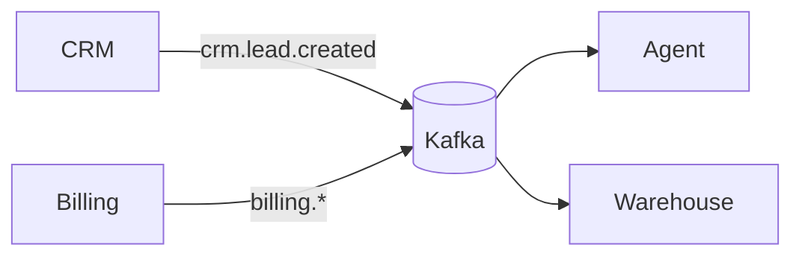

# Arquitetura de Barramento de Eventos

## Padrão: Kafka (event log distribuído)
- **Produtores:** CRM, Billing, Agentes publicam em tópicos.
- **Consumidores:** cada domínio assina os tópicos de seu interesse.
- **Tópicos:** `crm.lead.created`, `billing.invoice.paid`, `agent.run.done`.
- **Particionamento:** por `entity_id` (ordem por chave).
- **Alternativas:** RabbitMQ (filas de trabalho), GCP Pub/Sub (serverless).

## Contrato de evento
```json
{ "type":"crm.lead.created", "version":1, "ts":"ISO", "payload":{...} }
```

## Diagrama (Mermaid)

