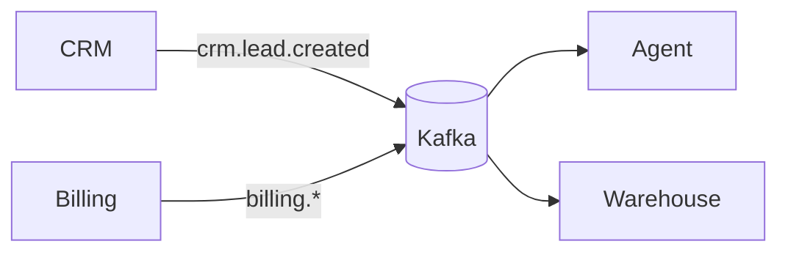

# Arquitetura de Barramento de Eventos

## Padrão: Kafka (event log distribuído)
- **Produtores:** CRM, Billing, Agentes publicam em tópicos.
- **Consumidores:** cada domínio assina os tópicos de seu interesse.
- **Tópicos:** `crm.lead.created`, `billing.invoice.paid`, `agent.run.done`.
- **Particionamento:** por `entity_id` (ordem por chave).
- **Alternativas:** RabbitMQ (filas de trabalho), GCP Pub/Sub (serverless).

## Contrato de evento
```json
{ "type":"crm.lead.created", "version":1, "ts":"ISO", "payload":{...} }
```

## Diagrama (Mermaid)

```mermaid
graph LR
  CRM -->|crm.lead.created| K[(Kafka)]
  Billing -->|billing.*| K
  K --> Agent
  K --> Warehouse
```

## 1. Escopo e não-escopo

**Escopo**: topologia do barramento, particionamento e ordem, grupos de consumidores e offsets,
retenção e replay, versionamento de contrato, entrega para múltiplos domínios e a fronteira
entre o barramento e as filas de trabalho.

**Não-escopo**: política de deduplicação (Atividade 2, `05-A2`), disjuntor de circuito em
chamada síncrona (Atividade 3, `05-A3`) e anonimização de payload (Atividade 4, `05-A4`).

## 2. Modelo mental: o log é a verdade, o offset é o seu ponto de vista

Um `topic` no Kafka não é uma fila: é um arquivo append-only, particionado, ordenado por
partição e com tempo de retenção. Consumir não remove nada do log; consumir apenas avança um
`offset` dentro de um grupo. Isso muda três consequências práticas:

1. **Vários domínios leem o mesmo evento sem competir.** Dois grupos distintos (`warehouse` e
   `billing`) possuem offsets independentes sobre a mesma partição. Em fila do RabbitMQ, dois
   consumidores no mesmo grupo disputam as mensagens; em Kafka, dois grupos não.
2. **Replay é um `seek`.** Voltar 24 h significa reposicionar o offset para trás e reler. É a
   base de correção de bug de consumidor sem reexecutar o produtor.
3. **Atraso é um número medido, não uma sensação.** `lag = offset_atual_do_log -
   offset_consumido` é a métrica canônica de backpressure do lado do consumidor.

Modelo mental do sistema completo: o barramento guarda o *que aconteceu*; as filas de trabalho
guardam o *que falta fazer*. Misturar os dois no mesmo canal é a origem da maioria dos projetos
de mensageria que não saem do papel.

## 3. Particionamento e garantia de ordem

A regra é dura: **ordem existe dentro da partição, nunca entre partições**.

```text
particao = hash(chave) % numero_de_particoes
```

Com `entity_id` como chave, todos os eventos de uma entidade caem na mesma partição e saem em
ordem. Com chave nula, o produtor faz *round-robin* e a ordem por entidade desaparece.

**Exemplo numérico:** tópico com 12 partições e 200 msg/s (alvo de SLO da atividade) resulta em
`200 / 12 = 16,7 msg/s` por partição em média. Se uma única entidade gerar 30 msg/s (por exemplo
uma campanha com repasse contínuo), ela concentrará 30 msg/s na sua partição e o resto do tópico
continua equilibrado. Conclusão: aumentar partições melhora a vazão global, mas não melhora a
vazão de uma entidade quente, porque ela nunca espalha.

Custo de mudar a contagem de partições: `hash % N` muda o mapa inteiro, e as chaves migram de
partição. Em produção isso é feito com um tópico novo, produção dupla e corte, nunca com
alteração in-place em tópico cheio.

**Head of line blocking:** como o consumidor de uma partição processa sequencialmente, uma
mensagem envenenada segura todas as daquela partição. As mitigações em camadas são:

| Camada | Mecanismo | Efeito |
| --- | --- | --- |
| 1 | Timeout de processamento por mensagem | Não deixa uma lenta segurar o grupo |
| 2 | Tentativas limitadas + DLQ | Envenenada sai do caminho |
| 3 | Reposicionamento de offset com log | Correção manual sem reprocessar tudo |
| 4 | Reparticionamento (só em nova versão do tópico) | Divide a entidade quente |

## 4. Grupos de consumidores, rebalanceio e backpressure

- Cada partição é atribuída a **um** membro do grupo. Dois membros nunca leem a mesma partição
  simultaneamente.
- Entrada ou saída de membro dispara **rebalanceio**: a entrega congela durante a troca. Sistemas
  bem desenhados aceitam essa pausa de segundos; sistemas com `max.poll.interval` curto matam o
  consumidor durante picos longos.
- `auto.offset.reset = earliest` para domínio novo (não perde o histórico); `latest` só para
  telemetria descartável.
- **Commit automático** é adequado para métrica e inaceitável para efeito com dinheiro envolvido:
  ele confirma o offset antes ou depois do efeito, sem os dois no mesmo passo.

Backpressure no barramento é observado, não aplicado: o produtor não é bloqueado, ele simplesmente
produz mais rápido e o `lag` sobe. Por isso o alarme de `lag` é o sensor de backpressure real do
lado do consumidor, enquanto o `queue.depth` é o equivalente no RabbitMQ.

## 5. Retenção, replay e RPO/RTO

| Conceito | Definição | Uso nesta atividade |
| --- | --- | --- |
| Retenção por tempo | Log apagado após N horas/dias | Janela máxima de replay |
| Retenção por tamanho | Log apagado ao ultrapassar bytes | Proteção de disco |
| RPO | Dado máximo aceitável de perda em desastre | Determina `acks=all` + réplicas |
| RTO | Tempo máximo de recuperação | Determina o runbook de religar consumidor |

**Exemplo numérico:** retenção de 7 dias em tópico que recebe 200 msg/s com mensagem média de
1 KB. Volume diário: `200 * 86400 * 1 KB = 17,3 GB/dia`; retenção de 7 dias: `121 GB` só de log
de dados (meta de dimensionamento, sem replicação). Com `replication.factor = 3` o consumo de
disco triplica. Essa conta é o argumento que decide entre retenção de 7 dias e de 24 h.

Replay operacional: reposicionar o consumidor do grupo `warehouse` para 24 h atrás e reler com o
código novo. Critério de aceite do replay: nenhum consumidor destrutivo roda sem `dry_run` (modo
que só loga) antes do replay real.

## 6. Versionamento de contrato e compatibilidade

O contrato do evento é o acoplamento que sobra depois do desacopamento de rede. Regras:

- `type` + `version` nunca mudam de significado. Mudança de semântica gera `version = 2` e os
  dois campos convivem enquanto houver consumidor antigo.
- **Compatibilidade para trás (backward)**: consumidor novo lê evento antigo. Obrigatória sempre.
- **Compatibilidade para frente (forward)**: consumidor antigo lê evento novo. Obrigatória sempre
  que houver deploy de produtor antes de consumidor, que é o caso normal.
- Campo novo só entra com valor default. Campo removido só sai depois de zero leitores (confirme
  com `consumer.lag` por tipo de evento e com log de parsing).

Checklist de contrato antes do deploy:

1. Schema validado no producer, não só no consumer.
2. Teste de compatibilidade automático na esteira (falha o build, não o deploy de sexta).
3. `trace_id` e `entity_id` presentes em todo evento.
4. Payload com ponteiro para o documento, não o documento inteiro.
5. Exemplo canônico versionado no repositório junto ao consumer.

## 7. Fila de trabalho x barramento de eventos: a fronteira

| Critério | Fila (RabbitMQ) | Barramento (Kafka) |
| --- | --- | --- |
| Cardinalidade de leitura | 1 consumidor por mensagem | 1 consumidor **grupo** por mensagem |
| Ordem | FIFÓ da fila | Por partição e chave |
| Releitura | Não (mensagem some no ACK) | Sim, por offset |
| Papel | "Falta fazer" | "Aconteceu" |
| Custo de erro | Mensagem pode ser perdida | Reprocessamento é barato |
| Exemplo na FV | Gerar boleto da cobrança | `venda.criada` para Marketing, Operação e Warehouse |

Decisão prática: um evento que precisa chegar a mais de um time vai ao barramento; uma tarefa que
só um worker executa vai à fila. Se o mesmo fluxo precisa dos dois, o padrão é barramento na
origem e fila derivada do evento (consumidor que traduz evento em tarefa), e não o contrário.

## 8. Atomicidade com o domínio: transactional outbox

Gravar no banco e publicar no barramento são duas operações não atômicas. O `outbox` resolve:

```text
BEGIN;
  UPDATE venda SET status='criada' WHERE id=:id;
  INSERT INTO outbox(tipo, payload) VALUES ('venda.criada', :json);
COMMIT;
-- CDC ou job publica e marca outbox.publicado=true
```

Se o publicador morrer entre `COMMIT` e o envio, o registro continua em `outbox` e o leitor
republica. O consumidor, por ser at-least-once, deduplica pela chave de idempotência.

**Critério de aceite**: nenhuma linha commitada permanece não publicada além da janela
`(meta) 5 s`, medida pelo atraso máximo `now - outbox.criado_em` em linhas com
`publicado = false`.

Alternativas descartadas: transação XA (frágil e pouco portável entre broker e banco) e
"publicar e rezar" (perda silenciosa, indetectável em teste de fumaça curto).

## 9. Sagas x transação distribuída

2PC (dois fases) bloqueia recursos durante a votação, tem coordenador como ponto único de
falha e não escala bem com broker e base de dados em tecnologias diferentes. Por isso a FV usa
**saga por eventos**: cada passo publica o resultado, e o passo seguinte reage.

| | Saga | 2PC |
| --- | --- | --- |
| Bloqueio | Nenhum | Recursos travados durante votação |
| Ponto único de falha | Sem, se orquestração for por eventos | Coordenador |
| Correção | Compensação explícita | Automática (abort) |
| Custo de implementação | Alto (escrever as compensações) | Baixo no código, alto na operação |
| Consistência | Eventual, com janela exposta | Forte, com custo de latência |

Regra de ouro: toda saga tem rota de compensação testada. `pagamento.cobrado` sem
`pagamento.estornado` correspondente é dívida, não projeto.

## 10. Garantias de persistência do produtor

| Configuração | Garantia | Custo |
| --- | --- | --- |
| `acks=0` | Nenhuma | Latência mínima, perda invisível |
| `acks=1` | Líder persistiu | Perde se o líder cair antes da réplica |
| `acks=all` + `min.insync.replicas=2` | Réplicas suficientes confirmaram | Alguma latência |
| Producer idempotente | Sem duplicata do próprio produtor | Despesa de sequência por partição |
| Transação produtor | At-least-once entre tópicos | Janela de latência maior |

Para fluxo de dinheiro a combinação é `acks=all` + `min.insync.replicas=2` + produtor
idempotente. Para métrica descartável, `acks=1` é honesto e mais barato.

## 11. Telemetria do barramento

| Métrica | Cardinalidade | Alerta |
| --- | --- | --- |
| `consumer.lag` | por partição (partição é um rótulo aceitável) | crescendo por > 10 min (meta) |
| `under.replicated.partitions` | por tópico | > 0 por > 1 min (meta), crítico |
| `offline.partitions` | por tópico | > 0, sempre crítico |
| `producer.request.latency.p95` | por tópico | p95 > 100 ms (meta) |
| `bytes.in.per.sec` / `bytes.out.per.sec` | por tópico | > 70% da capacidade (meta) |
| `dlq.depth` (fila derivada) | por fila | > 0 por 1 h (meta) |

Proibido: rótulo por `entity_id`, por `order_id` ou por `trace_id`. Esses vão para log e
tracing. Cardinalidade descontrolada em métrica é falha de operação, não detalhe de
configuração.

## 12. Modos de falha e recuperação

| Sintome | Causa raiz | Detecção | Mitigação | Recuperação |
| --- | --- | --- | --- | --- |
| `lag` subindo | Consumer lento ou morto | `consumer.lag` | Subir réplicas do consumer | Minutos ao religar |
| Repartição sem consumidor | Rebalanceio ou configuração errada | `offline.partitions` | Corrigir grupo e religar | Minutos |
| Réplica atrasada | Disco ou rede saturado | `under.replicated` | Trocar nó, reduzir carga | 10 a 30 min |
| Mensagem nunca consumida | Fila/topic sem assinante | `queue.depth` crescente | Criar consumidor, conferir binding | Minutos |
| Duplicata visível | Reentrega após crash | Dedup rejeitando | Conferir janela de dedup | Imediato |
| Erro de schema em produtor novo | Contrato quebrado | Falha no teste de compatibilidade | Rollback do produtor | Minutos |
| Partição quente | Chave de partição concentrada | Latência por partição | Reencaminhar por nova chave no tópico novo | Horas (projeto) |
| Broker sem disco | Retenção grande demais | Espaço livre | Reduzir retenção, aumentar disco | Horas |

## 13. Critérios de aceite do padrão

1. Dois grupos consomem o mesmo tópico sem competir entre si.
2. Replay de 1 h de histórico executado com sucesso em ambiente de homologação.
3. Teste de compatibilidade de contrato rodando na esteira e reprovaria um campo removido.
4. `lag` volta a zero em menos de `(meta) 5 min` após religar um consumer caído.
5. Nenhuma partição offline em condições normais, com alerta configurado.
6. Outbox sem linha commitada não publicada além da janela `(meta) 5 s`.
7. Toda tarefa exclusiva roda em fila dedicada, nunca no barramento.

## 14. Checklist de adesão

1. Todo tópico tem chave de partição declarada e justificada.
2. `replication.factor >= 3` e `min.insync.replicas = 2` em tópico de dinheiro.
3. `acks=all` em produtor de evento de negócio; `acks=1` só em telemetria.
4. Produtor idempotente ligado.
5. Retenção calculada por conta de volume, não por padrão da ferramenta.
6. Teste de compatibilidade de schema no pipeline de CI.
7. `trace_id` propagado do HTTP de entrada até o consumidor do evento.
8. `lag` com alerta por partição.
9. Consumer group com nome único por domínio; nunca grupos genéricos.
10. `max.poll.interval` maior que o pior lote de processamento.
11. Modo `dry_run` disponível antes de qualquer replay.
12. Saga com compensação escrita e testada.
13. Outbox onde domínio e publicação precisam ser atômicos.
14. DLQ (fila derivada) com dono e rotina de revisita < 24 h.
15. Runbook de religamento do consumer testado de verdade.

## 15. Referências de estudo

- Curso: "Apache Kafka Séries: Learn Apache Kafka for Beginners" (Udemy, Stephane Maarek).
- Vídeo: "RabbitMQ in 100 Seconds" (YouTube, Fireship).
- Documento oficial: RabbitMQ Documentation (rabbitmq.com).
- Documento oficial: Apache Kafka Documentation (kafka.apache.org).
