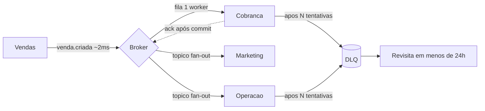

# Deck PDI: Sistemas Distribuídos com Mensageria (fila, tópico, DLQ)

Área: Sistemas Distribuídos

Narrativa: cada slide traz título, fala (o que se diz) e evidência (o que se mostra).

## Slide 1: Resumo Executivo
**Fala:** Fundamentos de mensageria para desacoplar serviços: fila, tópico, DLQ e ACK. Entrego o padrão e um consumidor com backpressure e DLQ.
**Evidência:** padrão `MESSAGING.md` + consumidor `consumer.py` + infra `broker.tf`.
O ecossistema de agentes já é distribuído; sem fila, falha de 1 serviço propaga.

## Slide 2: Contexto de Produção
**Fala:** O cenário atual é de acoplamento de tempo, não de acoplamento de código.
**Evidência:** três sintomas observáveis, listados abaixo.
Agentes chamam uns aos outros via HTTP síncrono.
Falha de downstream derruba a cadeia.
Sem DLQ: mensagem ruim some.

## Slide 3: Diagnóstico
**Fala:** O diagnóstico é uma tabela de duas colunas: o que temos hoje e o alvo da atividade.
**Evidência:** gap entre estado atual e estado desejado, item por item.
| Hoje | Alvo |
| --- | --- |
| HTTP síncrono | fila desacoplada |
| sem DLQ | DLQ + retry |
| sem backpressure | prefetch limitado |

## Slide 4: Modelo mental
**Fala:** Antes de qualquer ferramenta, o modelo: esteira em vez de entrega na mão. O operador joga a caixa na esteira e já parte para a próxima; cada área tira no próprio ritmo.
**Evidência:** sequência fixa produtor -> broker -> consumidor -> commit -> ACK.
Por dentro, o detalhe que separa sênior de pleno: **o ACK é a única coisa que remove trabalho da fila, e ele vem depois do commit**. Antes do commit o broker ainda considera a mensagem viva. Isso troca o erro "perdi a venda" pelo erro "apliquei duas vezes", e o segundo é detectável e remediável.

## Slide 5: Decisão Arquitetural (ADR)
**Fala:** ADR-051, transporte de eventos. Registrada com opções, consequências e data de decisão.
**Evidência:** matriz de opções abaixo, com a escolhida e a rejeitada explicitadas.
ADR-051: Transporte de Eventos
| Opção | Pro | Contra | Decisão |
| --- | --- | --- | --- |
| Fila + tópico + DLQ | desacopla | ops | ESCOLHIDA |
| HTTP síncrono | simples | cascata | rejeitada |
> Nota: ACK explícito; prefetch limitado; DLQ após N tentativas.

## Slide 6: Arquitetura (diagrama)
**Fala:** Um produtor, dois destinos com semânticas diferentes e um beco sem saída para o erro.
**Evidência:** diagrama Mermaid abaixo.


## Slide 7: Fila x Tópico (o coração da decisão)
**Fala:** Fila é para trabalho exclusivo; tópico é para evento que interessa a N times. Trocar um pelo outro é o erro mais comum do time.
**Evidência:** tabela de decisão.
| Se | Então |
| --- | --- |
| 1 worker por mensagem (cobrança) | Fila |
| N times reagem ao mesmo evento | Tópico pub/sub |
| Falha determinística de parse | Rota direta para DLQ |
| Ordem por entidade importa | Partição por `entity_id` |

## Slide 8: Matemática da solução
**Fala:** O `prefetch` não é chute, é Little's Law dividido pelo número de workers.
**Evidência:** conta fechada abaixo.
```text
L = lambda * W
```
**Exemplo numérico:** pico de campanha com `$\lambda = 600 msg/s$` e `$W = 0,25 s$` resulta em `$L = 600 * 0,25 = 150$` mensagens em voo. Com 5 workers: `prefetch = ceil(150 / 5) = 30`. O que sobrar fica na fila, que é o lugar certo para represar. Contra-exemplo: `prefetch = 1000` dá `5.000` mensagens em memória do processo, e aí o backpressure virou estouro de RAM.

## Slide 9: Capacidade
**Fala:** Capacidade é concorrência dividida por tempo de serviço. Isso responde "quantos workers eu preciso".
**Evidência:** `$capacidade = workers / W$`.
**Exemplo numérico:** `$W = 0,25 s$` e meta de `200 msg/s` exigem `$200 * 0,25 = 50$` slots. Ou seja, 10 workers, ou 5 workers com `prefetch = 10`. Um worker com `prefetch = 100` não processa mais rápido, só recebe mais.

## Slide 10: Garantias de entrega
**Fala:** Não se compra `exactly-once` de ponta a ponta. Produtor, broker e consumidor são três processos separados; a janela entre commit e ACK sempre existe.
**Evidência:** tabela de camadas.
| Camada | Promete | Não promete |
| --- | --- | --- |
| Produtor -> broker (`acks=all`) | persistência em N réplicas | que o consumidor processe |
| Broker -> consumidor | pelo menos uma entrega | ausência de duplicata |
| Banco + ACK | efeito durável | efeito único sem dedup |
| Ponta a ponta | at-least-once + dedup | exactly-once puro |

## Slide 11: Idempotência (ponte para 05-A2)
**Fala:** Como a duplicata vira problema resolvido: chave de idempotência registrada na mesma transação do efeito.
**Evidência:** código do consumidor.
```python
with transacao():               # efeito + dedup no MESMO commit
    aplicar_efeito(msg)
    registrar_deducao(chave)
ack(msg)
```
Se forem duas transações, o crash entre elas reabre a janela de duplicata.

## Slide 12: Backpressure
**Fala:** Backpressure saudável é fila crescendo e memória estável. Se a memória sobe junto com a fila, a pressão está no lugar errado.
**Evidência:** três sinais.
1. `queue.depth` subindo com RSS do consumer estável: saudável.
2. `unacked` parado no teto do `prefetch`: consumidor vivo, porém lento.
3. RSS subindo junto com a fila: falta de backpressure, risco de crash e de reentrega em massa.

## Slide 13: DLQ e retry
**Fala:** Retry com backoff exponencial, jitter e teto; DLQ depois de N, sempre com o motivo anexado.
**Evidência:** fórmula e sequência.
```text
espera(n) = min(base_ms * 2^n, teto_ms) + jitter(0..jitter_ms)
```
**Exemplo numérico:** `base = 500 ms`, `teto = 10 s`, `N = 6` dá `0,5 + 1 + 2 + 4 + 8 + 10 = 25,5 s` de re-tentativas antes da DLQ. Sem o teto seriam `31,5 s` martelando a mesma dependência caída; sem o jitter, todos os clientes re-tentariam no mesmo instante.

## Slide 14: Ordenação e poison pill
**Fala:** Ordem existe dentro da partição, nunca entre partições. E uma mensagem envenenada segura a partição inteira.
**Evidência:** mitigações em camadas.
| Camada | Mecanismo |
| --- | --- |
| 1 | Timeout de processamento por mensagem |
| 2 | Tentativas limitadas + DLQ |
| 3 | Reposicionamento de offset com log |
| 4 | Reparticionamento (só em tópico novo) |
`Nack(requeue=True)` em erro de parse é laço infinito: a mesma mensagem volta para a frente da fila indefinidamente.

## Slide 15: Atomicidade com o domínio (outbox)
**Fala:** Gravar no banco e publicar são duas operações. O meio-termo frágil perde eventos; o padrão é transactional outbox.
**Evidência:** sequência.
```text
BEGIN;
  UPDATE venda SET status='criada' WHERE id=:id;
  INSERT INTO outbox(tipo, payload) VALUES ('venda.criada', :json);
COMMIT;
-- leitor CDC publica e marca publicado=true
```
Se o publicador morrer entre `COMMIT` e envio, o registro segue em `outbox` e é republicado.

## Slide 16: Saga x transação distribuída
**Fala:** 2PC bloqueia recursos e cria coordenador como ponto único de falha. A FV usa saga por eventos, com compensação obrigatória.
**Evidência:** matriz comparativa (slide de tradeoff).
| Critério | Saga | 2PC |
| --- | --- | --- |
| Bloqueio | Nenhum | Durante votação |
| Ponto único de falha | Sem | Coordenador |
| Correção | Compensação manual | Automática |
| Consistência | Eventual | Forte |
| Custo | Alto em código | Alto em operação |

## Slide 17: Matriz de tradeoffs
**Fala:** Toda escolha desta atividade troca uma coisa por outra. Nenhuma é de graça.
**Evidência:** matriz com a perda assumida em cada linha.
| Decisão | Ganha | Perde | Dono do custo |
| --- | --- | --- | --- |
| Broker no meio | Desacoplamento de tempo | Operação e plantão | Infra |
| `acks=all` | Sem perda em queda de nó | Alguns ms de latência | Produtor |
| `prefetch` baixo | Memória estável | Vazão por worker | Consumer |
| DLQ | Nada some | Rotina de revisita | Time dono da fila |
| Kafka para eventos | Replay e N grupos | Curva de operação | Infra |
| HTTP síncrono (rejeitada) | Simplicidade | Cascata de falha | Todos |

## Slide 18: Modos de falha e recuperação
**Fala:** Este é o slide que o coordenador vai puxar. Cinco falhas, detecção e tempo de recuperação.
**Evidência:** tabela operacional.
| Falha | Detecta por | Mitiga | Recupera em |
| --- | --- | --- | --- |
| Consumer caído | `queue.depth` subindo | Religar o consumer | Minutos |
| ACK antes do commit | Publicadas difere de processadas | Corrigir ordem no código | Minutos + reentrega |
| `prefetch` alto | RSS subindo com a fila | `$\lambda W / workers$` | Minutos |
| DLQ esquecida | `dlq.depth > 0` por 1 h | Alerta + dono + 24 h | Mesmo dia |
| Partição quente | `lag` de uma partição só | Nova chave em tópico novo | Horas (projeto) |

## Slide 19: Validação
**Fala:** Três provas executáveis, não promessas.
**Evidência:** roteiro em `DEMO-SCRIPT.md`.
Publicar 1k msg; derrubar consumer; confirmar reprocessamento.
Msg inválida -> DLQ (não perde).
Backpressure: consumer lento não estoura.

## Slide 20: Métricas e SLO
**Fala:** O que medimos e o que fazemos quando estoura.
**Evidência:** SLI, meta e janela.
| SLO | Alvo |
| --- | --- |
| Throughput | >= 200 msg/s |
| Perdidas | 0 |
| DLQ revisitada | < 24h |
| Latência p95 ponta a ponta | < 5s (meta) |
| `redelivery.rate` | < 1% (meta) |

## Slide 21: Telemetria e cardinalidade
**Fala:** Métrica boa alerta; métrica com rótulo errado derruba o coletor.
**Evidência:** o que entra e o que não entra.
| Métrica | Alerta |
| --- | --- |
| `queue.depth` | > `$\lambda` sustentado 5 min (meta) |
| `consumer.unacked` | no teto do `prefetch` por 2 min (meta) |
| `consumer.lag` | crescendo por 10 min (meta) |
| `dlq.depth` | > 0 por 1 h (meta) |
Proibido como rótulo: `entity_id`, `order_id`, `trace_id`. Isso vai para log estruturado e tracing.

## Slide 22: Riscos
**Fala:** Risco conhecido é gerenciável; risco descoberto em produção é incidente.
**Evidência:** plano de mitigação com dono.
| Risco | Mitigação |
| --- | --- |
| Duplicata | idempotência (05-A2) |
| DLQ esquecida | alerta |
| `prefetch` mal calibrado | derivar de Little's Law |
| Contrato quebrado em deploy | teste de compatibilidade na esteira |
| Replay sem `dry_run` | `dry_run` obrigatório |

## Slide 23: Checklist de domínio
**Fala:** Os cinco itens que eu verificaria antes de dizer pronto.
**Evidência:** checklist completo no `README.md`.
1. ACK depois do commit, sempre?
2. `prefetch` derivado de `$\lambda W / workers$`?
3. Erro determinístico vai à DLQ sem `requeue`?
4. DLQ com dono e revisita em menos de 24 h?
5. Teste de perda executado nesta versão?

## Slide 24: Próximos Passos
**Fala:** Esta atividade abre a trilha; as próximas fecham as frentes que ficaram expostas.
**Evidência:** sequência da trilha.
Eventos de domínio do DDD (02-A3).
Tracing por trace_id.
Deduplicação e chave de idempotência (05-A2).
Disjuntor de circuito e retry/backoff em cascata (05-A3).
Anonimização de payload (05-A4).

## Slide 25: Fecho
**Fala:** O que muda de domingo para segunda.
**Evidência:** números da atividade.
- `>= 200 msg/s` sustentado, `0` mensagens perdidas, p95 `< 5 s` (meta).
- Mensagem inválida vai para a DLQ e volta pelo runbook em menos de 24 h.
- Consumer lento represa na fila, não na memória.
- Risco remanescente assumido e com dono: operação do broker e revisita da DLQ.
