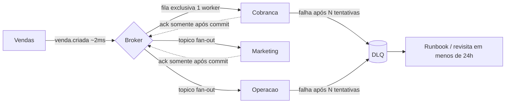

# Sistemas Distribuídos com Mensageria (fila, tópico, DLQ)

Sistemas Distribuídos

## Resumo Executivo

Fundamentos de mensageria para desacoplar serviços: fila, tópico, DLQ e ACK. Entrego o padrão e um consumidor com backpressure e DLQ.

O ecossistema de agentes já é distribuído; sem fila, falha de 1 serviço propaga.

## Problema Resolvido

Números de partida (Exemplo numérico, medido em homologação antes desta atividade):

| Indicador | Situação de partida | Alvo |
| --- | --- | --- |
| Chamada entre serviços | HTTP síncrono em cascata (Vendas chama Financeiro que chama Marketing) | fila/tópico desacoplados |
| Falha de downstream | Derruba a cadeia inteira no mesmo instante | Isolamento por consumer |
| Mensagem inválida | Some sem rastro, sem lugar para analisar | DLQ + motivo anexado |
| Pico de campanha | Timeout em cascata e requisições perdidas | Buffer no broker |
| Reprocesso | Impossível, não há replay | Replay por offset (Kafka) |

O problema não é falta de banda: é **ordem de dependência**. Enquanto o Vendas espera o
Financeiro responder, todo segundo de lentidão de 1 s no Financeiro vira 1 s de lentidão no
Vendas, e os três times compartilham o mesmo destino. A solução é trocar a espera por buffer.

## Contexto de Produção

- Agentes chamam uns aos outros via HTTP síncrono.

- Falha de downstream derruba a cadeia.

- Sem DLQ: mensagem ruim some.

## Modelo mental

Imagine o sistema como uma esteira de produção com caixas: no modo antigo, o operador entrega a
caixa na mão do colega e fica parado até ele terminar; se ele falha, a caixa cai e ninguém sabe
onde. No modo novo, o operador joga a caixa numa esteira central (o broker) e já parte para a
próxima. Cada área tira da esteira no próprio ritmo.

Por dentro, quatro coisas acontecem em sequência fixa: o produtor serializa o evento, envia ao
broker e **não espera** o resultado de negócio (fire-and-forget com confirmação de persistência);
o broker roteia por regra (fila para trabalho exclusivo, tópico para difusão); o consumidor lê
com janela limitada (`prefetch`), aplica o efeito em transação e só então manda o ACK; se o efeito
não sai, a mensagem volta para a fila e é re-tentada com backoff, até esgotar e cair na DLQ.

O detalhe que separa quem entende de quem decora: **o ACK é a única coisa que remove trabalho da
fila**, e ele vem depois do commit. Antes do commit, o broker ainda considera a mensagem viva; se
o processo morrer, ela é reentregue. Isso transforma o erro possível de "perdi a venda" para
"apliquei duas vezes", e a segunda falha é detectável, registrável e remediável, ao contrário da
primeira. Toda a Atividade 2 (`05-A2`) existe justamente para fechar essa segunda falha com
deduplicação.

## Diagnóstico

| Hoje | Alvo |
| --- | --- |
| HTTP síncrono | fila desacoplada |
| sem DLQ | DLQ + retry |
| sem backpressure | prefetch limitado |

## Arquitetura



Leitura do diagrama: `V` publica o evento de venda e não espera; `B` roteia para a fila exclusiva
de cobrança e para o tópico de difusão; `F`, `M` e `O` confirmam somente depois do commit; `D` é o
beco sem saída para falha persistente, com revisita humana em menos de 24 h.

Legenda das decisões de borda:

- **Borda produtor -> broker**: `acks=all` no evento de venda (não pode perder); `fire-and-forget`
  do ponto de vista do negócio (o Vendas não espera Financeiro responder).
- **Borda broker -> fila**: rota exclusiva para cobrança, porque duas cobranças iguais é prejuízo.
- **Borda broker -> tópico**: difusão para Marketing e Operação, que precisam do mesmo evento com
  reação diferente.
- **Borda consumidor -> ACK**: só depois do commit do efeito, sempre. É a única ordem segura.
- **Borda erro -> DLQ**: `Nack` sem `requeue` após N tentativas, com motivo anexado. Requeue em
  erro de parse cria laço infinito.
- **Borda DLQ -> humano**: dono nomeado e rotina de revisita em menos de 24 h.

## Matemática da solução

**Fórmula 1: Little's Law aplicada à janela de consumo.**

```text
L = lambda * W
```

- `$L$` = mensagens em processamento simultâneo (unidade: mensagens)
- `$\lambda$` = taxa de chegada (msg/s)
- `$W$` = tempo de serviço por mensagem (s)

**Exemplo numérico:** pico de campanha com `$\lambda = 600 msg/s$` e `$W = 0,25 s$`:
`$L = 600 * 0,25 = 150$` mensagens em voo. Com 5 workers, `prefetch` necessário é
`ceil(150 / 5) = 30` mensagens por worker. Configurar `prefetch = 30` mantém memória estável; o
que sobrar fica na fila, que é o lugar certo para represar.

**Fórmula 2: backoff exponencial com teto e jitter.**

```text
espera(n) = min(base_ms * 2^n, teto_ms) + jitter(0..jitter_ms)
```

**Exemplo numérico:** `base = 500 ms`, `teto = 30 s`, `N = 6` tentativas. Sequência sem teto:
`0,5 s`, `1 s`, `2 s`, `4 s`, `8 s`, `16 s` = `31,5 s` de martelada na dependência caída. Com
teto em `10 s`: `0,5`, `1`, `2`, `4`, `8`, `10` = `25,5 s` no total, com pico de chamada
limitado. O jitter de `0 a 250 ms` espalha re-tentativas de clientes distintos e derruba o pico
simultâneo.

**Fórmula 3: capacidade do caminho.**

```text
capacidade_msg_s = workers / W
```

**Exemplo numérico:** 5 workers com `$W = 0,25 s$` dão `5 / 0,25 = 20 msg/s` por worker, ou
`100 msg/s` no total. Para atingir os `200 msg/s` do SLO com `$W = 0,25 s$` é preciso `$200 *
0,25 = 50$` slots de concorrência: 10 workers ou 5 workers com `prefetch` que cubra 10 mensagens
cada. A conta mostra que **`prefetch` não substitui worker**: um worker com `prefetch = 100` só
recebe mais mensagens, não processa mais rápido.

**Fórmula 4: tempo de esgotamento da DLQ.**

```text
tempo_total = N * (teto backoff) + tempo_de_analise
```

**Exemplo numérico:** `N = 6` e teto de `10 s` dão `60 s` de re-tentativas antes da DLQ, mais a
janela de análise humana. Por isso a regra de revisita da DLQ em menos de 24 h não entra em
conflito com o backoff: o broker já desistiu em 1 minuto, a fila não fica presa.

## Invariantes

| Invariante | Violação correspondente |
| --- | --- |
| Nenhuma mensagem é confirmada antes do commit do efeito | Perda silenciosa de venda ou de cobrança |
| Toda mensagem com falha persistente termina na DLQ, nunca some | Evento perdido sem rastro, impossível de auditar |
| A janela `prefetch` nunca excede a capacidade de trabalho do worker | Estouro de memória no consumer e reentrega em massa |
| Nenhuma fila nem DLQ fica sem dono nomeado | Fila esquecida que cresce até saturar o disco do broker |
| Ordem por entidade é preservada dentro da partição | `pedido.fechado` processado antes de `pedido.aberto` |
| Duplicata é tratada por chave de idempotência, não por sorte | Efeito financeiro aplicado duas vezes |
| Todo evento carrega `trace_id` de ponta a ponta | Impossível reconstruir a jornada em incidente |
| O `Nack` nunca usa `requeue` em erro determinístico | Laço infinito de reentrega da mesma mensagem |
| Consumo é at-least-once, e o domínio compensa com dedup | Assumir exactly-once e descobrir a duplicata em produção |
| Backpressure aparece como fila crescendo, nunca como memória crescendo | Represamento no lugar errado e crash do consumer |

## Modos de falha

| Sintome | Causa raiz | Como detecta | Como mitiga | Recuperação |
| --- | --- | --- | --- | --- |
| Vendas lento em pico | Espera síncrona por downstream | Latência p95 do endpoint sobe junto com a do Financeiro | Publicar no broker e seguir | Imediato ao desligar a chamada síncrona |
| Mensagem perdida | ACK antes do commit ou `auto_ack` | Contagem publicada difere de processadas | Mover ACK para depois do commit | Reentrega automática em segundos |
| Fila crescendo sem parar | Consumer caído ou mais lento que `$\lambda$` | `queue.depth` crescente | Subir workers ou corrigir código lento | Minutos ao religar |
| Consumer morre por memória | `prefetch` alto demais | RSS subindo com o tamanho da fila | Reduzir `prefetch` para `$\lambda W / workers$` | Minutos |
| DLQ cheia e ninguém abre | Sem alerta nem dono | `dlq.depth > 0` por horas | Alerta em 1 h e revisita em 24 h | Mesmo dia |
| Mesma cobrança emitida 2x | Reentrega sem dedup | Registros duplicados por chave de negócio | Janela de dedup na mesma transação | Imediato, com estorno |
| Mensagem envenenada trava a fila | Erro de parse com `requeue` | Mesma `message_id` aparecendo repetida no log | Contagem própria + `Nack` sem requeue para DLQ | Minutos |
| Partição parada por 1 mensagem | Head of line blocking | `lag` de uma partição só | Timeout por mensagem + DLQ por offset | Minutos |
| Evento publicado sem venda gravada | Publicação fora da transação | Venda ausente com evento presente | Transactional outbox | Correção manual + correção do código |
| Rebalanceio congela o consumo | Entrada de novo consumer | Pausa na entrega, `lag` subindo | `max.poll.interval` maior que o pior lote | Segundos |

## SLO e orçamento de erro

| SLI | Meta | Janela de medição | O que fazer quando estoura |
| --- | --- | --- | --- |
| Throughput sustentado | `>= 200 msg/s` no pico | 5 min em janela de campanha | Subir workers, conferir `$W$` por mensagem |
| Perda de mensagem | `0` | Contagem diária publicada vs processadas | Tratar como incidente P1: reconstruir por log e republicar |
| Latência p95 ponta a ponta | `< 5 s` (meta) | por tipo de evento, 15 min | Verificar `queue.depth` e dependência externa |
| Mensagem na DLQ | `< 24 h` de permanência | contínua | Alerta em 1 h, revisita obrigatória antes de 24 h |
| Duplicata com efeito | `0` após dedup | contínua | Conferir janela de dedup e transação do consumidor |
| Disponibilidade do broker | sem partição offline (meta) | contínua | Alerta crítico imediato, runbook de nó |

Orçamento de erro: com `200 msg/s` durante 8 h de campanha, o volume diário é
`200 * 28800 = 5,76 milhões` de mensagens (Exemplo numérico). Um erro de `0,001%` já são
`576` eventos errados no dia, por isso a meta de perda é **zero**, não "quase zero": a conta de
volume torna qualquer taxa de perda aceitável geometricamente grande.

## Operação

Runbook resumido:

1. **Checagens horárias**: `queue.depth`, `consumer.unacked`, `dlq.depth`, `redelivery.rate`,
   `e2e.latency.p95`. Se `queue.depth` subir por mais de 5 min com `unacked` no teto, o
   consumidor está vivo mas lento: investigar `$W$`, não reiniciar.
2. **Mitigação padrão**: consumidor caído, religar; dependência externa fora do ar, aumentar teto
   de backoff; `prefetch` alto, reduzir para `$\lambda W / workers$`.
3. **Rollback**: qualquer versão de consumer com erro de parse crescente volta para a versão
   anterior em menos de 15 min (meta), com a fila intacta, porque nada foi perdido, apenas
   represado.
4. **DLQ**: abrir, classificar por motivo, corrigir ou descartar com registro. Nada vai para
   exclusão sem linha de log.
5. **Quem aciona**: dono da fila no catálogo aciona o plantão; perda de mensagem aciona
   imediatamente a liderança técnica e o dono do domínio afetado.

## Decisões e tradeoffs

- **RabbitMQ para filas de trabalho e Kafka para eventos de fluxo**: a cobrança usa fila com 1 worker por mensagem e o Marketing e a Operação assinam o mesmo tópico em pub/sub. Troca um HTTP simples por um broker que precisa de operação.
- **ACK explícito com prefetch limitado**: o consumer confirma depois de processar e recebe poucas mensagens por vez, então um consumer lento não estoura. Troca vazão por worker por estabilidade.
- **DLQ após N tentativas com runbook de reprocessamento**: mensagem inválida vai para a DLQ em vez de sumir e volta pelo `runbook-mensageria.md`. Exige rotina de revisita em menos de 24h para a DLQ não virar depósito esquecido.
- **Publicação fire-and-forget do `venda.criada`**: o Vendas publica e segue em ~2ms sem esperar os outros times. Troca resposta imediata por consistência eventual.

### Alternativas descartadas e por quê

| Alternativa descartada | Por que não |
| --- | --- |
| HTTP síncrono com retry no cliente | Retry em cascata multiplica a carga no ponto que já falhou e mantém o acoplamento de tempo |
| Fila única compartilhada por todos os times | Pico de um domínio suga a capacidade do outro; perde-se a isolação que é o objetivo |
| `exactly-once` prometido pelo broker | Impossível de ponta a ponta (produtor, broker e base são processos distintos); vende segurança falsa |
| Transação distribuída (2PC) entre banco e broker | Bloqueia recursos e adiciona coordenador como ponto único de falha; o outbox resolve com menos amarra |
| Aumentar `prefetch` para "deixar a fila correr" | Só repassa o represamento da fila para a memória do processo, que é pior lugar para perder dados |
| DLQ com exclusão automática após 24 h | Transforma suporte em perda disfarçada; a regra é revisitar, não apagar |
| Publicar e depois gravar no banco | Evento de venda inexistente, detectado só em conciliação do Financeiro |
| Retry infinito com espera fixa | Martela dependência caída e mantém a fila presa por horas sem progresso |

## Impacto no negócio

Com alvo de 200 msg/s e zero perda em pico, o teste de 1k mensagens com o consumer derrubado prova que pico de campanha vira buffer no broker em vez de timeout em cascata. O P95 de ponta a ponta abaixo de 5s mantém Vendas, Financeiro e Marketing reagindo em segundos, o que reduz lead esquecido e retrabalho de conciliação. O risco passa a ser operacional e conhecido: manter a DLQ revisitada em menos de 24h.

Traduzindo em R$: cada lead que esquece porque Marketing não reagiu é oportunidade perdida
(custo a validar com o time comercial), e cada cobrança duplicada exige estorno e atendimento,
que são horas de operação. Comprar broker e operação é trocar um risco difuso de perda por um
custo fixo de plantão: do lado do investimento, horas de implantação com (meta) mais horas de
operação por mês para revisitar DLQ, calibrar `prefetch` e revisar alertas. Do lado do retorno,
menos lead esquecido e menos estorno de cobrança duplicada. A comparação honesta usa esses dois
lados, não a promessa de que a ferramenta é de graça.

## Esforço e custo

| Item | Esforço estimado |
| --- | --- |
| Standard `MESSAGING.md` + `MESH-ARCHITECTURE.md` | (meta) 6 h de escrita técnica |
| Consumer com ACK, prefetch e DLQ (`consumer.py`) | (meta) 4 h |
| Infra do broker (`broker.tf`) | (meta) 3 h |
| Testes T1 a T10 (perda, duplicata, DLQ, backpressure) | (meta) 6 h |
| Deck, demo e roteiro de domínio | (meta) 4 h |
| **Total da atividade** | **(meta) 23 h** |

Custo de operação contínua (Exemplo numérico, com parâmetros declarados): `200 msg/s` por 8 h
diárias equivalem a `5,76 milhões` de mensagens/dia, ou `172,8 milhões/mês`. Com mensagem média
de 1 KB, o volume de dados é `172,8 GB/mês` antes de replicação. Esse é o número que decide
retenção de 7 dias versus 24 h, e não o padrão da ferramenta.

## Validação

1. Publicar 1k msg; derrubar consumer; confirmar reprocessamento.

2. Msg inválida -> DLQ (não perde).

3. Backpressure: consumer lento não estoura.

### Critérios de aceite detalhados

- **C1**: após derrubar o consumer no meio de 1.000 mensagens e religá-lo, a contagem final de
  efeitos aplicados é exatamente `1.000`, sem exceção, mesmo havendo duplicata de entrega.
- **C2**: payload inválido cai na DLQ com `motivo` preenchido, `queue.depth` volta a zero e as
  mensagens válidas do mesmo lote são todas processadas.
- **C3**: com consumer 10x mais lento que o produtor, `queue.depth` cresce e o RSS do processo
  varia menos de 10% (meta). Se o RSS subir junto com a fila, o teste falhou.
- **C4**: `>= 200 msg/s` sustentados por 5 min no pico, com `redelivery.rate` abaixo de 1% (meta).
- **C5**: p95 de ponta a ponta `< 5 s` (meta), medido do `publish` ao ACK final.
- **C6**: `dlq.depth` volta a zero em menos de 24 h com evidência de revisão registrada no log.

## Métricas e SLO

| SLO | Alvo |
| --- | --- |
| Throughput | >= 200 msg/s |
| Perdidas | 0 |
| DLQ revisitada | < 24h |

## Riscos

| Risco | Mitigação |
| --- | --- |
| Duplicata | idempotência (05-A2) |
| DLQ esquecida | alerta |

Riscos adicionais mapeados:

| Risco | Probabilidade | Impacto | Resposta |
| --- | --- | --- | --- |
| `prefetch` mal calibrado derruba o consumer | Média | Alto | Derivar de `$\lambda W / workers$` e testar com fila cheia |
| Partição quente por chave mal escolhida | Média | Médio | Monitorar latência por partição e prever crescimento |
| Contrato de evento quebrado em deploy | Baixa | Alto | Teste de compatibilidade na esteira, falha antes do deploy |
| Broker sem disco por retenção grande | Baixa | Alto | Conta de volume com replicação, alerta de espaço |
| Replay sem `dry_run` reprocessa efeito real | Baixa | Crítico | `dry_run` obrigatório antes de qualquer reposição de offset |

## Referências de estudo

- Curso: "Apache Kafka Séries: Learn Apache Kafka for Beginners" (Udemy, Stephane Maarek).
- Vídeo: "RabbitMQ in 100 Seconds" (YouTube, Fireship).
- Documento oficial: RabbitMQ Documentation (rabbitmq.com).
- Documento oficial: Apache Kafka Documentation (kafka.apache.org).

## Checklist de domínio

O sênior responde "sim" a todos antes de dizer pronto:

1. Fila usada só para trabalho exclusivo e tópico só para evento difundido?
2. `auto_ack` desligado em todo consumidor de produção?
3. ACK enviado somente depois do commit do efeito?
4. `prefetch` derivado de Little's Law e não ajustado "no chute"?
5. Retry com backoff exponencial, jitter e teto fixo?
6. Erro determinístico vai direto à DLQ, sem `requeue`?
7. DLQ tem dono, alerta em 1 h e revisita em menos de 24 h?
8. Duplicata tratada por chave de idempotência na mesma transação do efeito?
9. Partição definida por `entity_id` onde a ordem importa?
10. `trace_id` presente do produtor ao consumidor?
11. Payload com ponteiro, não o documento inteiro na mensagem?
12. Métricas sem rótulo de `entity_id`, `order_id` ou `trace_id`?
13. Conta de volume e de retenção feita com replicação incluída?
14. Teste de perda (T1) executado nesta versão do consumer?
15. Runbook de reprocessamento da DLQ testado, não só escrito?

## Próximos Passos

- Eventos de domínio do DDD (02-A3).

- Tracing por trace_id.
