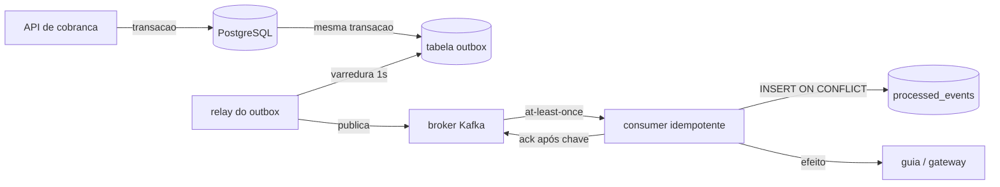
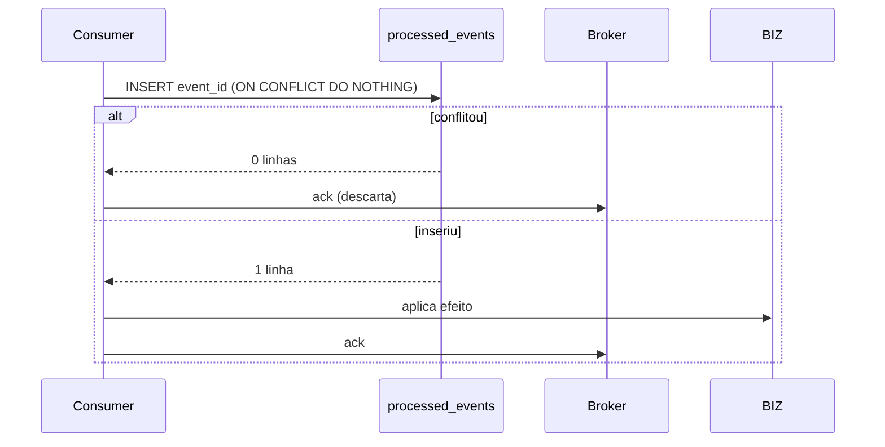
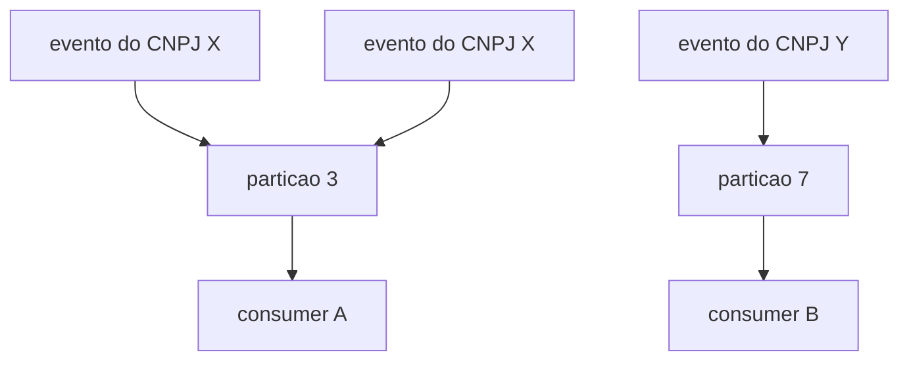

# Deck PDI: Idempotência e Entrega Exactly-Once (na prática: at-least-once + dedup)

Área: Sistemas Distribuídos

Narrativa: 9 slides de abertura (problema e decisão) mais 12 slides de defesa (mecanismo, matemática, falha e fecho). Cada slide traz título, fala sugerida e evidência.

## Slide 1: Resumo Executivo
Garantir idempotência de handlers: dedup por chave de evento + upsert, tornando 'at-least-once' equivalente a 'exactly-once' para o negócio. Entrego o padrão e um decorator.
Mensageria entrega no mínimo 1 vez; sem dedup, reenvio duplica lead/fatura.
Fala: "Não troquei de broker, não coloquei transação distribuída. Mudei onde a decisão acontece: o consumidor consulta a lista de já-antes de aplicar o efeito."
Evidência: padrão escrito em IDEMPOTENCY.md, decorator `idempotent.py`, schema em `processed_events`.

## Slide 2: Contexto de Produção
Reenvio duplicava leads (CNPJ repetido).
Fatura emitida 2x em retry.
Sem chave de evento.
Fala: "Os três sintomas têm a mesma causa: o handler não distinguia evento novo de evento reentregue. O retry, que existe para sobreviver a queda de rede, virou gerador de débito duplo."
Evidência: relato operacional de duplicatas por CNPJ e fatura emitida duas vezes em retry.

## Slide 3: Diagnóstico
| Hoje | Alvo |
| --- | --- |
| reatenvio duplica | dedup event_id |
| sem upsert | upsert |
| sem versão | etag |
Fala: "Cada coluna resolve um problema diferente. dedup pega duplicata de transporte, upsert pega duplicata de domínio, etag pega corrida de escrita entre dois consumidores concorrentes."
Evidência: mapeamento sintoma para mecanismo, registrado na ADR-052.

## Slide 4: Decisão Arquitetural (ADR)
ADR-052: Idempotência
| Opção | Pro | Contra | Decisão |
| --- | --- | --- | --- |
| dedup event_id + upsert | exactly-once p/ negócio | store | ESCOLHIDA |
> Nota: At-least-once do broker + dedup no consumidor = exactly-once observacional.
Fala: "Existe exatamente uma opção que cobre o risco financeiro com custo operacional conhecido. As outras falham por cobertura parcial ou por custo de infraestrutura."
Evidência: ADR-052 com alternativas descartadas e justificativa de cada uma.

## Slide 5: Entregas
IDEMPOTENCY.md.
idempotent.py.
schema_dedup.sql.
Fala: "O contrato vem antes do código. O revisor lê o padrão, depois confere se o decorator e o schema cumprem o que o contrato promete."
Evidência: 1-standards/, 2-code/ e 3-supabase/ preenchidos.

## Slide 6: Validação
Mesmo evento 3x -> 1 efeito.
Concorrência: 2 consumers, 1 aplicação.
DLQ não cria duplicata.
Fala: "A prova não é log bonito, é contagem. Para cada event_id, quantas vezes o efeito foi aplicado. Qualquer valor acima de 1 é incidente."
Evidência: suíte de reentrega e teste de concorrência rodando no CI.

## Slide 7: Métricas e SLO
| SLO | Alvo |
| --- | --- |
| Duplicatas | 0 |
| Idempotente | 100% handlers |
Fala: "São dois números apenas. Um mede consequência (duplicata), o outro mede cobertura (handler sem teste de reentrega)."
Evidência: dashboard com contagem de efeito por event_id e consulta de cobertura.

## Slide 8: Riscos
| Risco | Mitigação |
| --- | --- |
| Store cheio | TTL |
| Chave errada | event_id + negócio |
Fala: "O TTL é o risco que ninguém vê na revisão: se ele for menor que a janela de reentrega do broker, a duplicata volta semanas depois."
Evidência: invariante T_dedup > T_reentrega_max registrada no padrão.

## Slide 9: Próximos Passos
Aplicar em todos os consumers.
Teste de concorrência no CI.
Fala: "A ordem importa: primeiro os handlers que movem dinheiro, depois o gate de merge automático."
Evidência: plano de rollout em três frentes.

## Slide 10: Diagrama de arquitetura

Fala: "O evento nasce dentro da mesma transação do negócio, atravessa o relay, chega ao broker e só então encontra a barreira do dedup. Cada aresta tem um modo de falha próprio."
Evidência: seção Arquitetura do README, com legenda das decisões de borda.

## Slide 11: O mecanismo em 5 passos

Fala: "A chave entra antes do efeito. Se eu morrer no meio, a reentrega encontra a chave e não cobra de novo."
Evidência: consumer.py, que captura IntegrityError e retorna sem aplicar o efeito.

## Slide 12: Matemática da solução
$linhas = \lambda \times T$
Exemplo numérico: $\lambda = 120$ eventos/s, $T = 48$ h = 172.800 s.
$120 \times 172.800 = 20.736.000$ linhas, a 104 B por linha, cerca de 2,2 GB.
Lei de Little: $L = \lambda W = 500 \times 0{,}040 = 20$ execuções simultâneas.
Fala: "Esses dois números decidem o tamanho da tabela e quantos consumers eu preciso. Não são achismo, são contas fechadas."
Evidência: seção Matemática da solução do README.

## Slide 13: Custo da checagem
$latência_{com dedup} = latência_{base} + RTT_{store}$
Exemplo numérico: $18 + 2{,}4 = 20{,}4$ ms, acréscimo de 13,3%.
Fala: "Eu comprei 13% de latência para eliminar débito duplo. É a troca mais barata do projeto. Se o store ficar em outra região, o RTT salta e a troca deixa de valer."
Evidência: critério de aceite de manter dedup e domínio na mesma região.

## Slide 14: Ordenação e particionamento

Fala: "Chave de partição é o CNPJ, nunca o event_id. Assim tudo que pertence à mesma entidade vive na mesma partição e a ordem relativa é preservada pelo broker."
Evidência: invariante 4 do README, com 12 partições e 40 msg/s por partição no Exemplo numérico.

## Slide 15: Replay como teste barato
Exemplo numérico: 12 partições, 40 msg/s por partição, 1 h de histórico:
$12 \times 3.600 \times 40 = 1.728.000$ eventos reprocessados.
Sem dedup: 1.728.000 efeitos repetidos. Com dedup: 0 efeitos repetidos.
Fala: "Replay é o teste de aceite mais barato que existe. Você reprocessa um milhão e meio de eventos e nada muda de estado. É a prova viva do padrão."
Evidência: CA-5, replay de 1 h sobre histórico já processado sem alteração de estado.

## Slide 16: Matriz de tradeoff
| Escolha | Ganha | Paga | Quem sente |
| --- | --- | --- | --- |
| Dedup no consumer | efeito único | 1 round-trip | latência |
| Outbox transacional | nenhum evento perdido | relay + tabela | operação |
| Partição por CNPJ | ordem por entidade | rebalanceamento | engenharia |
| DLQ com replay | partição nunca trava | decisão manual | plantão |
| Retenção longa | cobre reentrega atrasada | 2,2 GB | custo |
Fala: "Nenhuma linha desta tabela é grátis. O que eu defendo é que cada pagamento é conhecido e o benefício é financeiro direto."
Evidência: seção Decisões e tradeoffs do README.

## Slide 17: Alternativas descartadas
| Alternativa | Motivo da exclusão |
| --- | --- |
| Exactly-once no broker | exige commit distribuído, custo de latência intolerável |
| Só outbox, sem dedup | não cobre entrega duplicada, que é o sintoma real |
| Dedup só em memória | cai no reinício, gatilho clássico de reentrega |
| Dedup no produtor | não conhece a chave de negócio, ponto errado |
| Event sourcing e CQRS | resolve outro problema, exige versionamento de schema |
Fala: "Registrei as descartadas para que a próxima pessoa não refaça a discussão. Recusar é parte da decisão."
Evidência: seção Event sourcing e CQRS do README.

## Slide 18: Modos de falha
| Sintome | Causa raiz | Mitigação | Recuperação |
| --- | --- | --- | --- |
| Cobrança duplicada | chave depois do efeito | inverter ordem | estorno por lista |
| Mensagem presa | retry sem DLQ | limite de tentativas | replay da DLQ |
| Duplicata tardia | TTL menor que reentrega | ampliar retenção | repovoar janela |
| Partição travada | poison pill | DLQ | corrigir payload |

Fala: "Toda linha tem detecção por contagem, não por log. Se a detecção depende de alguém ler texto, ela não detecta nada às três da manhã."
Evidência: tabela Modos de falha do README, com tempo de recuperação por cenário.

## Slide 19: Queda no meio do caminho (recuperação)
Exemplo numérico: consumidor aplica efeito em 12 ms, morre aos 6 ms, antes do `ack`.
O broker reentrega após 10 s.
Na reentrega, a chave já está em `processed_events`, então 0 efeitos adicionais são aplicados.
Fala: "Esse é o cenário que mata sistemas mal feitos. Aqui ele é trivial: o efeito aconteceu, o registro também, então a reentrega só encontra porta fechada."
Evidência: caso de teste CA-3 no plano de teste do padrão.

## Slide 20: Orçamento de erro
$orçamento = (1 - 0{,}9995) \times 30\ \text{dias} = 0{,}05\% \times 43.200\ \text{min} = 21{,}6\ \text{min}$
Fala: "Vinte e um minutos por mês. Se esse orçamento for consumido, o próximo evento duplicado vira incidente, não observação."
Evidência: seção SLO e orçamento de erro do README.

## Slide 21: Operação (runbook)
1. Checar lag por partição, contagem por event_id, idade mínima de processed_events, entrada em DLQ.
2. Alertar em severidade alta para qualquer event_id com contagem > 1.
3. Pausar o grupo afetado, rodar relatório, acionar estorno.
4. Rollback do consumer é seguro porque a chave já existe.
5. Reconciliar: venda sem evento, evento sem venda, par com contagem > 1.
Fala: "Rollback seguro é um requisito de projeto. Se reverter a versão pudesse duplicar, eu não teria concluído a atividade."
Evidência: seção Operação do README.

## Slide 22: Critérios de aceite
CA-1 evento 3x, 1 efeito.
CA-2 dois consumers paralelos, 1 aplicação.
CA-3 queda entre efeito e ack, 0 efeitos adicionais.
CA-4 DLQ não derruba throughput das partições saudáveis.
CA-5 replay de 1 h não altera estado.
CA-6 cobertura em 100% dos handlers antes do merge.
Fala: "Seis frases que o CI transforma em veredito. Merge bloqueado enquanto alguma falhar."
Evidência: seção Validação e critérios de aceite do README.

## Slide 23: Fecho com métricas e próximos passos
| SLO | Alvo |
| --- | --- |
| Duplicatas | 0 |
| Idempotente | 100% handlers |
| Orçamento de erro | 21,6 min/mês (meta) |

Próximos passos: aplicar em todos os consumers, teste de concorrência no CI, consulta de cobertura como gate de merge, replay validado uma vez por trimestre.
Fala: "Fecho com dois números que o Financeiro entende e três ações que o time executa na semana seguinte."
Evidência: README da atividade, seções Métricas e SLO, Próximos Passos e Checklist de domínio.
