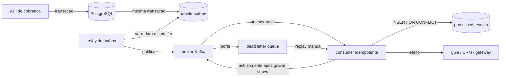

# Idempotência e Entrega Exactly-Once (na prática: at-least-once + dedup)

Sistemas Distribuídos

## Resumo Executivo

Garantir idempotência de handlers: dedup por chave de evento + upsert, tornando 'at-least-once' equivalente a 'exactly-once' para o negócio. Entrego o padrão e um decorator.

Mensageria entrega no mínimo 1 vez; sem dedup, reenvio duplica lead/fatura.

A tese desta atividade é curta de enunciar e cara de implementar: **exactly-once de ponta a ponta não existe**. Para que existisse, produtor, rede, broker e consumidor teriam de commitar atomicamente o envio e o efeito, e justamente isso um sistema sujeito a particionamento não consegue fazer sem travar tudo o que existe. O que existe de verdade, e o que se paga no mundo real, é **at-least-once no transporte** mais **idempotência no efeito**. Com essas duas peças o negócio passa a observar uma única aplicação de cada evento, e é por isso que o título fala "exactly-once na prática".

As entregas desta atividade são cinco arquivos mais o pacote de apresentação: o padrão escrito em `1-standards/IDEMPOTENCY.md`, o decorator `2-code/idempotent.py`, o consumer de referência `2-code/consumer.py`, os schemas `3-supabase/schema_dedup.sql` e `3-supabase/processed_events.sql`, e o material de defesa em `7-apresentacao/` (DECK-PDI.md, DEMO-SCRIPT.md, ROTEIRO-DOMINIO.md e o dossiê em HTML/PDF).

## Contexto de Produção

- Reenvio duplicava leads (CNPJ repetido).

- Fatura emitida 2x em retry.

- Sem chave de evento.

Os três sintomas têm a mesma causa raiz: o handler não conseguia distinguir "evento novo" de "evento reentregue". Sem `event_id` persistido, toda entrega era tratada como primeira entrega. O retry, que existe exatamente para sobreviver a queda de rede e a reinício de processo, virou gerador de débito duplo e de lead repetido no CRM.

Vale nomear o mecanismo por trás de cada sintoma. No primeiro, o produtor publica `lead.criado`, o consumidor grava o lead, o `ack` se perde no caminho de volta porque o broker reiniciou, e o broker reentrega a mesma mensagem: o consumidor, sem memória, grava o mesmo CNPJ de novo. No segundo, o handler de faturamento executa, a chamada ao gateway demora além do `max.poll.interval.ms`, o consumidor é expulso do grupo, outro consumidor assume a partição e reprocessa a mesma fatia. No terceiro, nem existia campo para comparar, então qualquer deduplicação manual era impossível por construção.

## Diagnóstico

| Hoje | Alvo |

| --- | --- |

| reatenvio duplica | dedup event_id |

| sem upsert | upsert |

| sem versão | etag |

A coluna "Alvo" não é cosmética, cada linha resolve um tipo distinto de problema. "dedup event_id" ataca a duplicata de transporte, àquela em que a mesma entrega chega duas vezes. "upsert" ataca a duplicata de domínio, em que dois eventos legítimos, e não uma repetição, descrevem a mesma entidade (o mesmo CNPJ chegando com cargas de origem diferente). "etag" ataca a corrida de escrita, em que dois consumidores concorrentes tentam gravar a mesma linha e o segundo, sem controle de versão, sobrescreve silenciosamente o que o primeiro acabou de escrever.

## Problema Resolvido

O problema de partida era financeiro e operacional ao mesmo tempo. Financeiro porque cada reentrega duplicada virava cobrança; operacional porque a correção era manual, feita por humano abrindo planilha. Os números de partida que sustentam a decisão estão registrados em "Impacto no negócio": cerca de 60 horas por mês de retrabalho e débitos duplicados que exigiam estorno.

A solução não muda o broker, não troca de tecnologia e não exige transação distribuída. Ela muda o ponto onde a decisão é tomada: o consumidor passa a consultar um registro de já-processados antes de aplicar o efeito, e passa a gravar esse registro dentro da mesma janela lógica em que aplica o efeito. É uma mudança de contrato, não de infraestrutura.

## Modelo mental

Pense no consumidor como um porteiro de teatro, não como uma esteira. A esteira aceita tudo que chega; o porteiro consulta a lista de já-entrou antes de deixar passar. O broker, nesse modelo, é o carro de som que anuncia o espetáculo várias vezes: ele pode repetir, e ninguém espera que ele pare. A lista do porteiro é a tabela `processed_events`, e a entrada nela é a `idempotency_key`.

Três consequências desse modelo mental. Primeira: a ordem das operações é parte do contrato, gravar a chave e só depois aplicar o efeito produz um resultado diferente de aplicar e depois gravar, e a primeira ordem é a única que sobrevive a uma queda no meio do caminho. Segunda: o armazenamento de dedup é estado, logo ele tem custo, tem retenção, tem dono e tem plano de descarte, não é um detalhe de implementação. Terceira: idempotência não é propriedade da fila, é propriedade do par (handler, chave); a mesma fila pode ter um handler idempotente e outro que drena estoque, e é o segundo que quebra a operação.

O sistema, por dentro, faz o seguinte ciclo: recebe mensagem, extrai a chave, tenta inserir a chave na tabela de processados, interpreta conflito como "já vi, descarta", aplica o efeito no domínio, e só então confirma o consumo ao broker. Se qualquer passo falhar antes da confirmação, o broker entrega de novo, e a segunda entrega encontra a chave e cai no descarte silencioso. Ninguém no negócio percebe a repetição.

## Arquitetura

Legenda das decisões de borda, ou seja, de onde o sistema escolheu não ir:

- **Borda 1, gravação transacional**: a venda e o evento saem da mesma transação do banco. Alternativa descartada: gravar no banco e publicar em seguida, porque a janela entre os dois passos é exatamente onde eventos se perdem.
- **Borda 2, relay com varredura em vez de trigger de banco**: o relay consulta pendentes a cada 1s. Alternativa descartada: trigger que publica direto, porque acopla o ciclo de vida do banco ao do broker e não sobrevive a manutenção do broker.
- **Borda 3, dedup no consumidor e não no broker**: o broker não tem o contexto de negócio para saber que duas cargas diferentes descrevem a mesma cobrança. Alternativa descartada: deduplicação no produtor, que só cobre uma das várias origens.
- **Borda 4, DLQ com replay manual**: mensagem que não pode ser processada não é reentregada para sempre, porque isso bloqueia a partição inteira. Alternativa descartada: retry infinito, que transforma uma mensagem ruim em parada total.

## Matemática da solução

Quatro contas sustentam a decisão. Todas abaixo com parâmetros declarados; nenhuma delas é medição de produção.

**1. Capacidade do store de dedup.** O número de linhas da tabela de processados é produto da taxa de eventos pela janela de retenção:

$$linhas = \lambda \times T$$

**Exemplo numérico:** pico de $\lambda = 120$ eventos/s, janela de retenção $T = 48$ h = 172.800 s. Logo $linhas = 120 \times 172.800 = 20.736.000$ linhas. Com 104 B por linha (36 B de UUID em texto, 8 B de timestamp, resto de heap e índice), o volume aproximado é $20.736.000 \times 104 \approx 2,2$ GB. Esse número define o partitionamento da tabela e a política de expurgo, não é folclore.

**2. Concorrência de consumidores pela Lei de Little.** Quantos handlers rodam ao mesmo tempo para não virar gargalo:

$$L = \lambda \times W$$

**Exemplo numérico:** $\lambda = 500$ mensagens/s, tempo médio de handler $W = 40$ ms = 0,040 s. Logo $L = 500 \times 0,040 = 20$ execuções simultâneas. Se a aplicação tem 8 workers, cada worker absorve 25 msg/s e o consumo real cai para 200 msg/s: nasce backpressure, e o lag da partição começa a subir.

**3. Custo de latência da checagem.** Cada dedup acrescenta um round-trip ao store antes do efeito:

$$latência_{com dedup} = latência_{base} + RTT_{store}$$

**Exemplo numérico:** base de 18 ms no handler, $RTT_{store} = 2,4$ ms no mesmo banco. Novo valor: 20,4 ms, ou seja, acréscimo de 13,3% no caminho crítico, a troca aceita por eliminar débito duplo. Se o store estiver em outra região, o $RTT$ salta e o acréscimo deixa de ser aceitável: é critério de aceite manter dedup e domínio na mesma região.

**4. Orçamento de erro do SLO.** Com meta de 99,95% das mensagens sem duplicata observada em 30 dias:

$$orçamento = (1 - 0,9995) \times 30 \text{ dias} = 0{,}05\% \times 43.200 \text{ min} = 21{,}6 \text{ min}$$

**Exemplo numérico:** 21,6 minutos por mês de janela em que duplicata observada pode existir sem que o SLO estoure. Consumido esse orçamento, o próximo evento duplicado vira incidente, não observação.

## Invariantes

| # | Invariante (nunca pode ser falsa) | Violação correspondente |
| --- | --- | --- |
| 1 | O efeito de um `event_id` é aplicado no máximo 1 vez | débito duplo, fatura 2x, lead repetido |
| 2 | A chave de dedup é gravada antes do `ack` ao broker | queda no meio deixa efeito sem registro e a reentrega cobra de novo |
| 3 | A chave combina `event_id` com identificador de negócio | colisão entre eventos legítimos de clientes diferentes |
| 4 | Eventos da mesma entidade saem da mesma partição | reordenação que faz um estado antigo sobrescrever um novo |
| 5 | Apenas handlers cobertos por teste de reentrega vão para produção | regressão silenciosa volta ao cenário de débito duplo |
| 6 | Toda mensagem não tratável vai para DLQ e nunca para retry infinito | head of line blocking que para a partição inteira |
| 7 | O registro de dedup tem retenção maior que a janela máxima de reentrega do broker | expurgo prematuro libera a chave e a reentrega atrasada duplica |

A invariante 7 costuma ser a que ninguém enxerga na revisão. Se o broker reentrega com até 24 h de atraso e a tabela expurga com 6 h, existe uma janela de 18 h em que a chave já sumiu e a mensagem velha ainda pode chegar. A regra prática é $T_{dedup} > T_{reentrega\_max} + margem$.

## Modos de falha

| Sintome | Causa raiz | Como detecta | Como mitiga | Recuperação |
| --- | --- | --- | --- | --- |
| Cobrança duplicada em lote | chave de dedup gravada depois do efeito | contagem de efeitos por `event_id` acima de 1 | inverter ordem: chave, depois efeito | estorno em lote a partir do relatório de `event_id` com contagem > 1 |
| Mensagem presa, lag subindo | handler lança erro repetido sem ir a DLQ | lag da partição e contagem de reentrega | encaminhar para DLQ após N tentativas | replay manual da DLQ após correção do código |
| Duplicata reaparece depois de semanas | TTL do dedup menor que a janela de reentrega | duplicatas correlacionadas a `ts` antigo | ampliar retenção conforme invariante 7 | reindexar e repovoar a janela a partir do outbox |
| Dois consumers gravam a mesma linha | falta de `etag` ou de `ON CONFLICT` | linhas com versão regredida | upsert com condição de versão | reconciliação por reprocessamento do outbox |
| Store de dedup fora do ar | indisponibilidade do banco | erro de conexão no passo de checagem | deixar o consumo pausar em vez de pular a checagem | ao voltar, reentrega do broker cai no dedup normalmente |
| Partição travada por evento ruim | poison pill sem caminho de descarte | consumo zerado com lag estável | DLQ após limite de tentativas | corrigir o payload e reenviar da DLQ |
| Evento perdido entre banco e broker | publicação fora da transação | venda sem evento correspondente | outbox transacional com relay | relay reprocessa pendentes, nenhum dado é reescrito |

Detectar não é olhar o log. O detector efetivo é uma contagem: para cada `event_id`, quantas vezes o efeito foi aplicado. Qualquer valor acima de 1 é incidente, e o valor deve ser exposto como métrica de produção, não só em teste.

## SLO e orçamento de erro

- **SLI 1, duplicata observada**: fração de `event_id` cujo efeito foi aplicado mais de uma vez. **Meta (meta): 0**. Janela de medição: 30 dias rolantes.
- **SLI 2, cobertura de idempotência**: fração de handlers registrados com teste de reentrega no CI. **Meta (meta): 100%**. Janela: por release.
- **SLI 3, atraso de entrega**: diferença entre timestamp de publicação e de aplicação do efeito, medido em p95. **Meta (meta): abaixo de 30 s**. Janela: 7 dias.
- **Orçamento de erro**: 21,6 min por mês pela conta da seção de matemática. Estourado, entra em vigência a regra abaixo.

**O que fazer quando estoura:** congelar deploy de consumers, porque a causa mais comum é código novo com ordem de operação trocada; rodar o relatório de `event_id` duplicado e acionar estorno pela lista; validar o TTL de dedup contra a janela de reentrega do broker; só liberar deploy depois de o relatório voltar a zero por 24 h consecutivas.

## Operação

Runbook resumido, do diagnóstico ao fechamento.

1. **Checagens de rotina**: lag por partição, contagem de efeitos por `event_id`, tamanho e idade mínima de `processed_events`, taxa de entrada em DLQ. As quatro juntas; isoladas, nenhuma detecta duplicata.
2. **Sinal de alerta**: qualquer `event_id` com contagem de efeito > 1 dispara alerta de severidade alta, porque é perda financeira direta, não é anomalia de performance.
3. **Mitigação imediata**: pausar o consumer do grupo afetado (o broker mantém a posição, nada se perde), rodar o relatório de duplicatas, acionar estorno pela lista.
4. **Rollback**: reverter o consumer para a versão anterior e deixar o broker reentregar; como a chave já existe, o rollback é seguro e não duplica nada.
5. **Reconciliação**: reprocessar o outbox pendente e conferir venda sem evento, evento sem venda, e par com contagem maior que 1. Três listas, nenhuma opcional.
6. **Quem aciona**: plantão de backend para o consumer, time de dados para o relatório, Financeiro para o estorno. O runbook termina quando as três assinam o relatório de zero.

## Ordenação, particionamento e replays

Idempotência sem ordem é metade da garantia. Se a chave de partição for o `event_id`, dois eventos do mesmo cliente podem cair em partições diferentes, serem consumidos em ordem trocada e o mais antigo sobrescrever o mais novo. A regra é: **chave de partição = identificador de negócio** (`cnpj` ou `lead_id`), de modo que tudo que pertence à mesma entidade vive na mesma partição e a ordem relativa é preservada pelo próprio broker.

**Exemplo numérico:** 12 partições com 480 msg/s no total, distribuição uniforme, dá 40 msg/s por partição. Um lote de 1.000 mensagens numa partição drena em $1.000 / 40 = 25$ s. Se o `max.poll.interval.ms` estiver em 300.000 ms (5 min), a margem é folgada; se o handler subir para 200 ms por mensagem, o tempo de lote sobe para 200 s e a margem encolhe para 2,5x, o ponto em que a janela de reposição de sessão vira risco real.

**Replays** são onde a idempotência paga o investimento. Reprocessar 1 h de histórico com 12 partições a 40 msg/s por partição move $12 \times 3.600 \times 40 = 1.728.000$ eventos. Sem dedup, isso seria 1.728.000 efeitos repetidos, um desastre. Com dedup, todas as chaves já existem, o efeito não se repete e o replay custa apenas I/O e CPU: é a prova operacional de que o padrão funciona, e por isso o replay é o teste de aceite mais barato que existe.

Duas regras de replay que a revisão deve cobrar: nunca fazer replay com o consumer de produção apontado para o mesmo tópico sem conferir a cobertura de dedup da janela reprocessada; e sempre rodar antes o relatório de contagem por `event_id`, para saber qual era o estado de partida.

## Event sourcing e CQRS

Muita gente chega nesta atividade perguntando "por que não event sourcing?". A resposta madura é: event sourcing resolve um problema diferente do que este resolve, e adotá-lo só para ganhar idempotência seria trocar de avião para andar de táxi.

Em event sourcing, o estado não é sobrescrito, é derivado de uma sequência imutável de eventos; a fonte de verdade é o log, e a projeção é descartável e reconstruível. Isso dá replay e auditoria de brinde, mas exige versionamento de schema de evento, migração de projeção e uma disciplina de compatibilidade que o time precisaria sustentar por anos. CQRS, por sua vez, separa o modelo de leitura do de escrita, o que aumenta a latência de leitura imediata e introduz a questão da projeção atrasada.

A escolha desta atividade é a mais barata que cobre o risco financeiro: manter o modelo transacional clássico, acrescentar `processed_events` e `outbox`. Custo: uma tabela a mais, um relay, uma checagem por evento. Ganho: exatamente o efeito único que o negócio cobra. Event sourcing entra na lista de alternativas descartadas, com a justificativa registrada, para que a próxima pessoa não precise refazer a discussão.

## Decisão Arquitetural (ADR)

ADR-052: Idempotência

| Opção | Pro | Contra | Decisão |

| --- | --- | --- | --- |

| dedup event_id + upsert | exactly-once p/ negócio | store | ESCOLHIDA |

> **Nota:** At-least-once do broker + dedup no consumidor = exactly-once observacional.

Alternativas descartadas e o motivo de cada uma ficar de fora:

- **Exactly-once no broker**: depende de commit distribuído entre broker e banco, não disponível no arranjo atual e não tolerável em latência. Rejeitada por custo operacional, não por gosto.
- **Transaction outbox só, sem dedup**: resolve evento perdido, mas não resolve evento entregue duas vezes, que é o sintoma real relatado. Rejeitada por cobertura parcial.
- **Dedup apenas em memória** (como faz o decorator de demonstração): cai com o reinício do processo, que é justamente um dos gatilhos de reentrega. Rejeitada por volatilidade; aceitável apenas em teste.
- **Dedup no produtor**: não cobre as demais origens de evento e não conhece a chave de negócio. Rejeitada por ponto de aplicação errado.

## Entregas

- IDEMPOTENCY.md.

- idempotent.py.

- schema_dedup.sql.

Cada entrega tem um papel definido: o `.md` é o contrato que o revisor lê antes de abrir código, o decorator é a forma reutilizável de aplicar a regra sem espalhar `if` pelo código, e o schema é a garantia de que a unicidade é imposta pelo banco, e não pela boa vontade da aplicação.

## Validação

1. Mesmo evento 3x -> 1 efeito.

2. Concorrência: 2 consumers, 1 aplicação.

3. DLQ não cria duplicata.

Critérios de aceite complementares, usados para dizer "pronto":

- **CA-1**: inserir o mesmo `event_id` três vezes em sequência resulta em exatamente 1 linha de efeito e 2 respostas de descarte.
- **CA-2**: rodar dois processos consumidores em paralelo sobre o mesmo lote resulta em 1 aplicação por `event_id`; a prova é a contagem, não o log.
- **CA-3**: matar o consumidor logo após aplicar o efeito e antes do `ack` resulta, após a reentrega, em 0 efeitos adicionais.
- **CA-4**: encher a DLQ com payload inválido não reduz o throughput das partições saudáveis.
- **CA-5**: rodar um replay de 1 h sobre histórico já processado não altera nenhum estado de negócio.
- **CA-6**: a consulta de cobertura reporta 100% dos handlers com teste de reentrega antes do merge.

## Métricas e SLO

| SLO | Alvo |

| --- | --- |

| Duplicatas | 0 |

| Idempotente | 100% handlers |

Métricas de apoio que sustentam esses dois números: contagem de efeitos por `event_id` (cardinalidade alta, usar agregação em janela e não etiqueta por evento), tamanho e idade mínima de `processed_events`, taxa de descarte por duplicata (é a métrica que prova que o retry está acontecendo e sendo absorvido), lag por partição, e contagem de entrada em DLQ.

## Riscos

| Risco | Mitigação |

| --- | --- |

| Store cheio | TTL |

| Chave errada | event_id + negócio |

Riscos adicionais reconhecidos na revisão: expurgo prematuro (mitigação: $T_{dedup} > T_{reentrega\_max}$), travamento de partição por poison pill (mitigação: DLQ após limite de tentativas), e divergência entre ordem de gravação e ordem de `ack` introduzida por refatoração apressada (mitigação: teste de falha no meio do caminho no CI).

## Próximos Passos

- Aplicar em todos os consumers.

- Teste de concorrência no CI.

Sequência sugerida: inventariar os handlers existentes e classificar por impacto financeiro, cobrir primeiro os que movem dinheiro, automatizar a consulta de cobertura como gate de merge, só então padronizar o TTL e a política de replay. A ordem importa, porque cobrir primeiro o handler de baixo risco dá confiança no padrão antes de mexer no que gera fatura.

## Decisões e tradeoffs

- **At-least-once do broker mais dedup no consumidor**: entrega exactly-once observacional para o negócio, porque exactly-once de ponta a ponta não existe em sistema distribuído.
- **Outbox transacional**: venda e evento gravados na mesma transação na tabela `outbox(event_id, payload, sent)`, então falha na publicação vira reprocessamento do outbox em vez de evento perdido. Custo: relay varrendo pendentes a cada 1s.
- **Dedupe por `idempotency_key` antes de agir**: o consumer consulta a tabela de processados antes de cobrar. Custo: store com TTL para não encher.
- **ACK só após gravar a chave**: a reentrega cai no dedupe, então o mesmo evento 5x gera 1 cobrança. A chave combina event_id com identificador do negócio para não colidir.

Matriz resumida do que foi trocado por o quê:

| Escolha | Ganha | Paga | Quem sente |
| --- | --- | --- | --- |
| Dedup no consumer | efeito único observável | 1 round-trip por evento | latência do handler |
| Outbox transacional | nenhum evento perdido | relay ativo + tabela | operação de banco |
| Partição por CNPJ | ordem por entidade | rebalanceamento mais frequente | engenharia de dados |
| DLQ com replay | partição nunca trava | decisão manual de replay | plantão |
| Retenção longa no dedup | cobre reentrega atrasada | 2,2 GB (Exemplo numérico acima) | custo de armazenamento |

## Impacto no negócio

Sem dedupe, reentregas geravam cobranças duplicadas e cerca de 60h por mês de correção manual. Com dedup a meta e zero duplicata e 100% dos handlers idempotentes, com correção próxima de 0h por mês. O teste que injeta o mesmo evento 5x e afirma 1 cobrança da ao Financeiro previsibilidade: retry deixa de ser risco de débito duplo.

O ganho secundário, e frequentemente mais valioso, é a confiança para aumentar a taxa de retry. Antes do padrão, reduzir o `max.poll.interval.ms` e ampliar as tentativas eram mudanças arriscadas, porque cada nova tentativa era um novo risco de débito. Depois do padrão, retry vira custo de I/O, e a equipe pode endurecer a resiliência sem conversar com o Financeiro a cada mudança.

## Esforço e custo

| Item | Esforço (meta) | Observação |
| --- | --- | --- |
| Padrão escrito + revisão | 4 h | leitura e revisão por um sênior |
| Decorator e consumer de referência | 6 h | inclui tratamento de conflito |
| Schema, índices e política de TTL | 3 h | depende do volume de retenção |
| Testes de reentrega e concorrência no CI | 6 h | CA-1 a CA-6 |
| Runbook e dashboard | 4 h | quatro checagens do bloco Operação |
| **Total** | **23 h (meta)** | equivalente a cerca de 3 dias úteis de 1 sênior |

Custo de infraestrutura incremental (meta): a tabela de dedup em 2,2 GB pelo Exemplo numérico da seção de matemática, mais um processo de relay com varredura a cada 1s, que consulta índice e não varre tabela inteira. Nenhum custo de licença nova e nenhuma troca de broker.

## Referências de estudo

- Curso: "Event-Driven Architecture: From Theory to Practice" (Udemy).
- Vídeo: "What is Idempotency?" (YouTube, Hussein Nasser).
- Documento oficial: Apache Kafka Documentation, Exactly-once Semantics (kafka.apache.org).
- Documento oficial: PostgreSQL Documentation, INSERT ON CONFLICT (postgresql.org).

## Checklist de domínio

Itens que um sênior verificaria antes de dizer "está pronto":

1. Todo handler de efeito financeiro tem `event_id` e identificador de negócio na chave.
2. A chave é gravada antes do `ack`, e existe teste que mata o processo nesse intervalo.
3. A unicidade é imposta por `PRIMARY KEY` ou `UNIQUE`, não por `SELECT` solto.
4. O upsert usa `ON CONFLICT`, para que concorrência não vire erro.
5. A chave de partição é o identificador de negócio, e não o `event_id`.
6. O TTL de dedup é maior que a janela máxima de reentrega do broker, com margem.
7. Existe DLQ e limite de tentativas; nenhum payload entra em retry infinito.
8. A métrica de contagem de efeito por `event_id` está no dashboard, com alerta.
9. Os seis critérios de aceite rodam no CI e bloqueiam merge.
10. O runbook tem dono, telefone e passo de rollback escrito.
11. O replay sobre histórico já processado foi executado uma vez e não mudou estado.
12. A ADR registra as alternativas descartadas, inclusive event sourcing e CQRS.
13. A consulta de cobertura reporta 100% dos handlers idempotentes.
14. A política de expurgo está documentada junto com o volume projetado em GB.
15. O estorno de duplicatas tem rota definida com o Financeiro, não improvisada no incidente.
