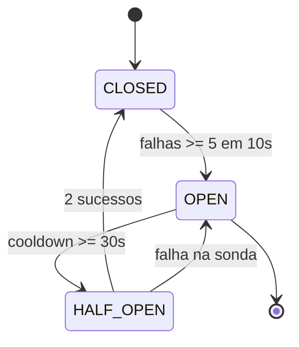
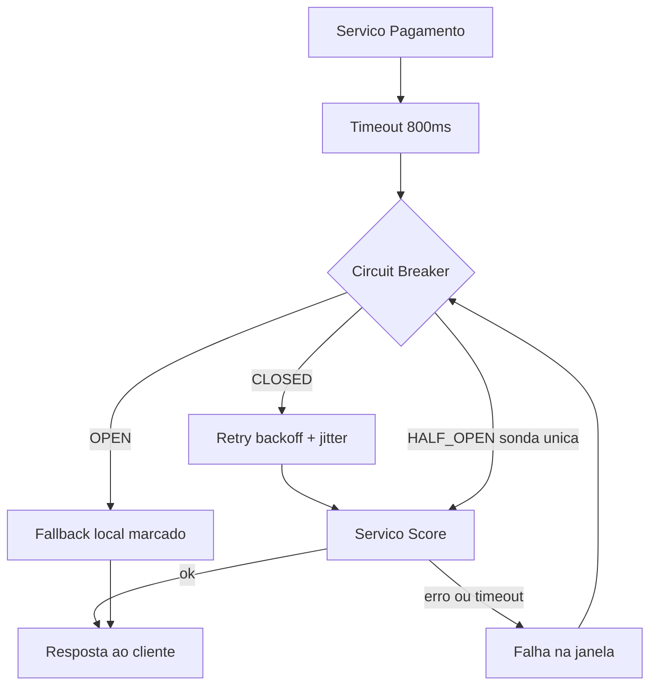
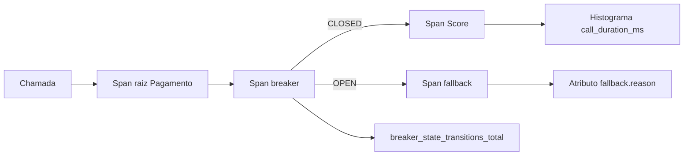

# Deck PDI: Resiliência com Circuit Breaker e Retry/Backoff

Área: Sistemas Distribuídos

## Slide 1: Resumo Executivo
Padrão de resiliência para chamadas a serviços externos (LLM, CRM): Circuit Breaker + retry com backoff e jitter, fallback. Entrego o padrão e uma implementação funcional.
Sem breaker, 1 API lenta vira fila que derruba o próprio serviço.
Fala: a tese é que chamada remota é aposta em processo alheio. A resposta engenharia é isolar tempo (timeout), isolar estado (breaker), isolar recuperação (retry com espera) e isolar percepção (fallback).
Evidência: implementação executável em `2-code/circuit_breaker.py` e `2-code/retry.py`, com teste de abertura, fallback e reabertura.

## Slide 2: Contexto de Produção
LLM/CRM lentos travavam o worker.
Retry sem backoff multiplicava a carga.
Sem fallback: erro virou 5xx.
Fala: três sintomas, uma doença: ausência de fronteira de resiliência. O worker não sabe que o Score está lento, só sabe que não recebeu resposta, e cada requisição pendente segura um thread.
Evidência: 200 req/s contra 100 threads esgota o pool em menos de 48 s quando a latência do alvo vai a 10 s.

## Slide 3: Diagnóstico
| Hoje | Alvo |
| --- | --- |
| retry imediato | backoff + jitter |
| sem proteção | breaker |
| 5xx seco | fallback |
Fala: hoje o sistema responde igual a qualquer severidade. No alvo, cada nível de falha ganha resposta própria: esperar, desistir por um tempo, entregar algo útil, testar a recuperação.
Evidência: tabela de delta presente no README e no ADR-053.

## Slide 4: Decisão Arquitetural (ADR)
ADR-053: Resiliência
| Opção | Pro | Contra | Decisão |
| --- | --- | --- | --- |
| CB + backoff + fallback | protege cascata | estado | ESCOLHIDA |
| retry infinito | simples | piora outage | rejeitada |
| Timeout longo de 30 s | não perde resposta | esgota thread | rejeitada |
| Breaker com estado em Redis | visão global | dependência nova | rejeitada |
| Sem retry, só breaker | minimalista | não cobre falha transiente | rejeitada |
> Nota: Closed -> Open após N falhas; Half-Open testa; fallback em Open.
Fala: a ordem escolhida protege o chamador antes de insistir no chamado. Alternativas descartadas por motivo explícito: retry infinito amplifica, timeout longo prende thread, Redis adiciona dependência exatamente onde queremos menos.
Evidência: ADR-053 com matriz de tradeoffs completa.

## Slide 5: Entregas
RESILIENCIA.md.
circuit_breaker.py.
retry.py.
Fala: padrão documentado como standard reutilizável, mais duas implementações mínimas e legíveis, mais o roteiro de demo e o deck.
Evidência: pastas `1-standards/` e `2-code/` da atividade.

## Slide 6: Validação
Simular API lenta; breaker abre após limite.
Fallback em Open (sem 5xx).
API volta -> Half-Open reabilita.
Fala: três critérios de aceite objetivos, todos executáveis sem rede externa, com rollback trivial: nova instância zera o estado.
Evidência: testes T1 a T3 do plano de teste do standard.

## Slide 7: Métricas e SLO
| SLO | Alvo |
| --- | --- |
| Breaker abre em | <= 5 falhas |
| Fallback em outage | 100% |
Fala: dois compromissos verificáveis: abertura em até 5 falhas em 10 s e cobertura total do fallback durante o outage. Os dois têm alerta associado.
Evidência: métricas `breaker_state_transitions_total` e `breaker_fallback_total`.

## Slide 8: Riscos
| Risco | Mitigação |
| --- | --- |
| Mal calibrado | tunar |
| Fallback mentiroso | explícito |
Fala: o risco de negócio mais sério é fallback mentiroso: se o cliente não distingue score calculado de score em cache, decisão de crédito errada vira problema jurídico. Mitigação é campo `origem` obrigatório.
Evidência: invariante de resposta com `origem=cache` documentada no README.

## Slide 9: Próximos Passos
Aplicar em todas as saídas.
Métricas de breaker.
Fala: sequência em quatro etapas: instrumentar, aplicar o decorator em todas as saídas de rede, externalizar parâmetros para tunagem sem deploy e introduzir bulkhead com pool dedicado.
Evidência: cada etapa tem reversão trivial, desligar o decorator volta ao comportamento anterior.

## Slide 10: Modelo mental
Fala: o breaker é um amortecedor com memória. Ele lembra das últimas falhas e usa essa memória para decidir se a próxima chamada vale a pena. Sem memória, cada decisão é tomada no escuro e a fila é reconstruída a cada ciclo. Com ela, o sistema escolhe deliberadamente não tentar, porque recusar trabalho é mais barato que processar trabalho que se sabe que vai falhar. O half-open impede a memória de virar ranço.

Evidência: máquina de três estados com uma única sonda por janela de resfriamento.

## Slide 11: Arquitetura da chamada resiliente

Fala: a ordem dos estágios é a decisão: timeout primeiro porque é ele que enxerga lentidão, breaker segundo porque decide se a chamada vale a pena, retry terceiro porque só faz sentido em CLOSED, fallback último porque cuida da percepção.
Evidência: legenda de decisões de borda no README da atividade.

## Slide 12: Matemática do backoff
Fórmula: $d_n = \min(cap, base \cdot 2^{n}) + U(0, j)$ com $n$ de 0 a 3, $base = 0.2$ s, $cap = 5.0$ s, $j = 0.1$ s.
**Exemplo numérico:** tentativa 0 espera de 0.2 a 0.3 s; tentativa 1, de 0.4 a 0.5 s; tentativa 2, de 0.8 a 0.9 s; tentativa 3, de 1.6 a 1.7 s. Soma entre 1.4 e 2.4 s para 4 tentativas.
Comparação: retry imediato com timeout de 800 ms gasta 3.2 s e dispara 4 chamadas simultâneas no alvo doente; com backoff nunca há duas retentativas em voo no mesmo instante entre workers que caíram juntos.
Fala: o jitter é o que impede a sincronização. Sem ruído, todos os workers que falharam juntos retentam juntos e recriam o pico que causou a falha.
Evidência: `2-code/retry.py`, função `backoff`.

## Slide 13: Matemática da abertura e do custo
Condição: falhas na janela $>= 5$, com janela de 10 s e 200 req/s, ou seja 2.000 chamadas por janela. Taxa de abertura: $5 / 2.000 = 0{,}25\%$.
**Exemplo numérico:** aberto por 30 s, o breaker evita $200 \times 30 = 6000$ chamadas. Com timeout de 800 ms, essas chamadas ocupariam 4.800 s de thread ($6000 \times 0{,}8$); sobre 100 threads, esgotariam o pool em 48 s.
Fala: abrir cedo não é covardia, é cálculo. O esgotamento de threads acontece muito antes de o alvo cair, e o breaker existe para agir nesse intervalo.
Evidência: seção Matemática da solução do README.

## Slide 14: Modos de falha e recuperação
| Sintoma | Causa | Detecção | Mitigação | Recuperação |
| --- | --- | --- | --- | --- |
| Latência alta sem erro | Rede degradada | Timeout de 800 ms estoura | Breaker + fallback | Sonda em 30 s |
| Erro 5xx pontual | Restart do alvo | Exceção tipada | Conta na janela | Automática |
| Retry storm | Retentativas sincronizadas | Pico de req/s pós-recuperação | Backoff + jitter | 1 ciclo |
| Breaker oscila | Threshold baixo | Alternância frequente | Aumentar janela | Reconfiguração |
| Falso positivo em deploy | Resíduo de contador | Abertura sem incidente | Zerar no boot | Duas janelas |
Fala: o modo de falha mais perigoso é o que não gera erro: lentidão sem timeout não marca nada e o breaker nunca abre. Por isso o timeout é pré-requisito do padrão, não opcional.
Evidência: tabela de modos de falha do README, com sintoma, causa raiz, detecção, mitigação e tempo de recuperação.

## Slide 15: Observabilidade

Fala: sem métrica de transição não existe pós-incidente, existe adivinhação. Cada transição é emitida com hora, alvo e paragem de estado. O span de fallback carrega o motivo, o que permite responder em uma consulta quantas requisições foram atendidas por fallback ontem.
Evidência: cardinalidade limitada a três labels por métrica, teto de 10 mil séries.

## Slide 16: Invariantes
| Invariante | Violação |
| --- | --- |
| Chamada não segura thread acima de 800 ms | Esgotamento de pool |
| Em OPEN nada atravessa a fronteira | Cascata continua |
| Fallback nunca faz chamada de rede | Falha junto com o alvo |
| Retry só em CLOSED, com espera positiva | Retry storm |
| Resposta de fallback traz `origem` | Dado degradado vira decisão real |
| Sonda única por janela | Sonda recria sobrecarga |
Fala: invariante é o que nunca pode ser falso, e cada uma tem a violação correspondente escrita, porque é assim que se revisa código em code review.
Evidência: seção Invariantes do README.

## Slide 17: SLO e orçamento de erro
| SLI | Meta | Janela |
| --- | --- | --- |
| Disponibilidade do Pagamento | 99,9% | 30 dias móveis |
| p95 da resposta ao cliente | <= 1.000 ms | 7 dias |
| Fallback em cobertura de outage | 100% | Por evento |
Fórmula: orçamento de erro $= 0{,}001 \times 30 \times 24 \times 3600 = 259{,}2$ s.
**Exemplo numérico:** outage de 10 minutos sem breaker consome 600 s de orçamento, mais que o mês inteiro. Com breaker, o erro contabilizado é o das falhas antes da abertura, na ordem de segundos.
Fala: orçamento de erro não é meta de bonificação, é limite de risco. Ao consumir 50%, congela-se tudo que não for correção de resiliência.
Evidência: seção SLO e orçamento de erro do README.

## Slide 18: Operação e runbook
Fala: o runbook tem sete passos: checar estado do breaker, checar falso positivo, mitigar abertura indevida subindo threshold sem reiniciar, mitigar cascata reduzindo entrada na origem em vez de aumentar pool, rollback por troca de configuração, registro das transições anormais no pós-incidente e definição de quem aciona.
Evidência: plantão do chamador mitiga, time do chamado ataca a causa raiz, coordenação entra quando o orçamento passa de 50%.

## Slide 19: Decisões e tradeoffs (matriz)
| Critério | CB + backoff + fallback | Retry infinito | Timeout longo | Estado em Redis |
| --- | --- | --- | --- | --- |
| Protege cascata | sim | não | não | sim |
| Complexidade | média | baixa | baixa | alta |
| Dependência nova | não | não | não | sim |
| Cobre falha transiente | sim | parcial | parcial | sim |
| Risco de falso positivo | médio | n/a | n/a | baixo |
| Custo de operação | baixo | alto (incidentes) | alto (threads) | médio |
Fala: a matriz mostra por que a opção escolhida vence: é a única que protege cascata sem introduzir dependência nova. O custo aceito é manter estado em memória por processo, aceito deliberadamente.
Evidência: ADR-053.

## Slide 20: Impacto no negócio
Com abertura em até 5 falhas e fallback em 100% do outage, o Pagamento sustenta 99,9% de disponibilidade mesmo com o Score fora do ar por minutos.
**Exemplo numérico:** 1.000 pagamentos por hora em pico e 2% de abandono adicional quando a página falha: 10 minutos de indisponibilidade representam aproximadamente 3 pagamentos perdidos ($1000 / 6 \times 10 \times 0{,}02$).
Fala: o número é pequeno por evento e relevante quando eventos semanais se acumulam no trimestre, além do custo reputacional que não aparece na conta.
Evidência: seção Impacto no negócio do README.

## Slide 21: Esforço e custo
| Item | Esforço |
| --- | --- |
| Implementação do breaker e do retry | 6 h (meta) |
| Testes de simulação de falha | 4 h (meta) |
| Instrumentação e alertas | 3 h (meta) |
| Revisão e documentação | 2 h (meta) |
| Total | 15 h (meta) |
Fala: custo de infraestrutura próximo de zero, o padrão roda no mesmo processo. O custo real é operacional: manter métricas e revisar parâmetros trimestralmente, 1 h por trimestre (meta).
Evidência: seção Esforço e custo do README.

## Slide 22: Checklist de domínio
Fala: o sênior só diz pronto depois de confirmar: timeout em toda saída, breaker cobrindo a chamada inteira, fallback sem rede e com `origem`, backoff com teto e jitter, janela deslizante, sonda única, métricas com cardinalidade baixa, alerta de OPEN prolongado, 10 casos de teste sem rede, parâmetros configuráveis sem deploy, runbook com responsável e orçamento de erro calculado.
Evidência: os 15 itens do Checklist de domínio do README.

## Slide 23: Métricas finais e próximos passos
| Métrica | Antes | Depois |
| --- | --- | --- |
| Tempo de thread preso por falha | 30 s (sem timeout) | <= 800 ms (meta) |
| Fallback em outage | 0% | 100% (meta) |
| Abertura do breaker | inexistente | <= 5 falhas em 10 s |
| Recuperação | manual | automática via half-open |
| Disponibilidade do Pagamento | abaixo de 99,9% em incidente | 99,9% (meta) |
Próximos passos: instrumentar, aplicar em todas as saídas, externalizar parâmetros, introduzir bulkhead.
Fala: fecho com o que muda de mensurável e com a sequência de evolução. A resiliência não é uma feature que se termina, é um hábito de operação com métrica e revisão periódica.
Evidência: README da atividade, standard RESILIENCIA.md e código em `2-code/`.
