# Resiliência com Circuit Breaker e Retry/Backoff

Sistemas Distribuídos

## Resumo Executivo

Padrão de resiliência para chamadas a serviços externos (LLM, CRM): Circuit Breaker + retry com backoff e jitter, fallback. Entrego o padrão e uma implementação funcional.

Sem breaker, 1 API lenta vira fila que derruba o próprio serviço.

A ideia central é simples de enunciar e difícil de executar bem: toda chamada remota é uma aposta num processo que você não controla, com latência que você não controla e com modos de falha que você não controla. Engenharia de resiliência é transformar essa aposta numa degradação previsível e observável. O padrão entregue fecha o ciclo em quatro camadas que se complementam sem se sobrepor: o **timeout** isola o tempo que uma thread pode ficar presa, o **`circuit breaker`** (disjuntor de circuito) isola o estado compartilhado que gera a fila de espera, o **retry com backoff e jitter** isola o tempo de recuperação sem sincronizar retentativas, e o **fallback** isola a experiência do cliente para que falha de infraestrutura nunca apareça como erro 5xx na tela de quem está pagando.

A ordem importa e é a decisão central desta atividade: primeiro protege-se o chamador (timeout e breaker), depois insiste-se no chamado (retry), e por último cuida-se da percepção (fallback). Inverter essa ordem produz os dois anti-padrões clássicos: retry antes do breaker, que amplifica a falha, e fallback antes do timeout, que máscara a lentidão e empurra o diagnóstico para a madrugada.

## Contexto de Produção

- LLM/CRM lentos travavam o worker.

- Retry sem backoff multiplicava a carga.

- Sem fallback: erro virou 5xx.

Esses três sintomas são sintomas da mesma doença: ausência de fronteira de resiliência entre o chamador e o chamado. Quando o Score fica lento, o Pagamento não sabe que está lento, só sabe que não recebeu resposta. Sem timeout explícito, cada requisição pendente segura um thread do pool; o pool esgota; as novas requisições entram em fila atrás das pendentes; a fila cresce; a latência percebida por quem chegou agora é a soma da latência do Score com o tempo de fila. É o `head of line blocking` descrito na literatura de sistemas distribuídos: o primeiro elemento parado impede o progresso de todos os que vêm atrás, mesmo que eles apontem para destinos saudáveis.

O retry sem backoff é o segundo agravante. Quando o Score começa a falhar, cada chamador decide retentar por conta própria, na hora. Multiplicando: 200 workers x 4 tentativas imediatas = 800 chamadas novas num intervalo em que havia 200. O serviço que já estava degradado recebe quatro vezes mais carga no pior momento possível. Isso é `retry storm`, e ele converte uma indisponibilidade parcial em indisponibilidade total.

A ausência de fallback completa o quadro: sem resposta degradada, todo erro vira erro HTTP 500 para o cliente final, o que transforma um problema interno de latência em problema externo de receita e de NPS.

## Diagnóstico

| Hoje | Alvo |

| --- | --- |

| retry imediato | backoff + jitter |

| sem proteção | breaker |

| 5xx seco | fallback |

A tabela acima é o resumo executivo do delta. O estado "Hoje" descreve um sistema que reage de forma idêntica a qualquer nível de severidade: lentidão leve, lentidão grave e indisponibilidade total produzem a mesma resposta (tentar de novo, imediatamente, e falhar alto). O estado "Alvo" diferencia quatro respostas: quando é hora de esperar (backoff), quando é hora de desistir por um tempo (breaker aberto), quando é hora de entregar algo útil mesmo assim (fallback) e quando é hora de testar a recuperação (half-open).

## Modelo mental

O sistema se comporta como um amortecedor com memória. Não existe "chamada remota" abstrata; existe um orçamento de tempo (timeout), um orçamento de falhas numa janela deslizante (breaker) e um orçamento de paciência (tentativas de retry), e os três são gastos antes que a falha chegue ao cliente. O breaker, em particular, introduz memória no caminho crítico: ele lembra das últimas falhas e usa essa memória para decidir se a próxima chamada vale a pena ser feita. Sem essa memória, cada decisão seria tomada no escuro e a fila de espera seria reconstruída a cada ciclo. Com ela, o sistema escolhe deliberadamente não tentar, o que é a única defesa eficaz contra cascata: recusar trabalho é mais barato do que processar trabalho que se sabe que vai falhar. O half-open é o que impede a memória de virar ranço: depois de um período de resfriamento, o sistema libera uma única sonda, de forma conservadora, para descobrir se o mundo mudou. O fallback é a camada que fala com o negócio: ele não recupera a chamada, entrega uma resposta de qualidade degradada, explicitamente marcada como tal, para que o cliente receba "score em cache" em vez de "erro 500". O modelo mental completo é, portanto: isolar tempo, isolar estado, isolar recuperação, isolar percepção.

## Arquitetura

```mermaid
flowchart TD
    C[Cliente / Fila de pagamentos] --> P[Servico Pagamento]
    P --> T[Timeout 800ms]
    T --> B{Circuit Breaker}
    B -->|CLOSED| R[Retry backoff + jitter]
    B -->|OPEN| F[Fallback score_cache]
    R --> S[Servico Score]
    S -->|resposta ok| OK[Retorna ao cliente]
    S -->|timeout ou erro| FL[Falha registrada na janela]
    FL --> B
    F --> D[Resposta degradada marcada]
    D --> OK
    B -->|HALF_OPEN sonda 1x| S
    B -->|proxima janela| B
```

Legenda das decisões de borda:

- **Timeout antes do breaker**: quem marca a falha é o timeout, porque é ele que enxerga a lentidão. Um erro 500 explícito também marca, mas lentidão sem timeout não marca nada e é justamente o modo de falha mais comum.
- **Breaker antes do retry**: o retry só roda em estado CLOSED. Em OPEN não há o que retentar, e retentar transformaria o fallback em ficção.
- **Fallback como caminho de saída do breaker, não como retry**: o fallback é barato, determinístico e local. Ele não fala com a rede, então não pode falhar por motivo de rede.
- **Half-open com uma única sonda**: liberar várias chamadas de teste ao mesmo tempo recria a sobrecarga que o breaker existia para evitar.

## Matemática da solução

**Fórmula de backoff exponencial com teto e jitter uniforme:**

$d_n = \min(cap, base \cdot 2^{n}) + U(0, j)$

com $n$ iniciando em 0, $base = 0.2$ s, $cap = 5.0$ s, $j = 0.1$ s e $n$ limitado a 4 tentativas.

**Exemplo numérico:** com $base = 0.2$ s e $j$ de até 0.1 s, as esperas são: tentativa 0, espera de 0.2 a 0.3 s; tentativa 1, de 0.4 a 0.5 s; tentativa 2, de 0.8 a 0.9 s; tentativa 3, de 1.6 a 1.7 s. Soma das esperas entre 1.4 e 2.4 s para 4 tentativas. Comparação: com retry imediato e timeout de 800 ms, quatro tentativas gastam 3.2 s e disparam 4 chamadas simultâneas no serviço doente; com backoff, gastam no máximo 2.4 s de espera mais o tempo das chamadas e nunca há duas retentativas em voo no mesmo instante entre workers que caíram juntos.

**Fórmula de abertura do breaker (janela deslizante por contagem):** o breaker abre quando $F \geq N$, com $F$ = falhas na janela corrente e $N$ = 5. A janela de 10 s delimita quais falhas contam; falhas anteriores à janela são descartadas, o que evita abrir o circuito por eventos históricos.

**Exemplo numérico:** 5 falhas em 10 s com 200 req/s de tráfego representam taxa de falha de 5 / 2.000 = 0,25% das chamadas. Threshold calibrado em 5 significa que o breaker abre apenas quando a falha é sistemática, não quando é ruído.

**Custo da fila sem breaker:** cada requisição pendente ocupa 1 thread por até o timeout do pool. Com 100 threads e timeout de 30 s, a capacidade mínima de throughput é $100 / 30 = 3.3$ req/s contra o Score. Se o Score responde em média em 2 s, a capacidade real é $100 / 2 = 50$ req/s. Com o Score a 10 s (modo de falha lento), a capacidade despenca para 10 req/s enquanto a demanda continua em 200 req/s: a fila cresce 190 req/s e não há estado estável. **Exemplo numérico:** em 60 s a fila acumula 11.400 requisições pendentes, cada uma consumindo memória de contexto e mantendo conexão aberta, e o serviço deixa de aceitar trabalho novo por esgotamento de threads antes mesmo de o Score cair.

**Orçamento de erro:** com SLO de 99.9% em 30 dias, o orçamento é $0{,}001 \times 30 \times 24 \times 3600 = 259{,}2$ s de erro. **Exemplo numérico:** um outage do Score de 10 minutos sem breaker consome 600 s de orçamento (mais de 2x o disponível no mês); com breaker e fallback, o erro contabilizado é apenas o das chamadas que falharam antes da abertura, na ordem de segundos.

## Invariantes

| Invariante | Violação correspondente |
| --- | --- |
| Nenhuma chamada ao Score pode segurar um thread por mais de 800 ms | Esgotamento de threads no Pagamento e fila infinita |
| Em estado OPEN nenhuma requisição sai da fronteira do serviço | O breaker vira decoração e a cascata continua |
| O fallback nunca faz chamada de rede | Fallback passa a depender do serviço caído e falha junto com ele |
| Retry só ocorre em CLOSED e com espera estritamente positiva | Retry storm e sincronização de retentativas |
| Toda resposta de fallback carrega origem explícita (`origem=cache`) | Cliente e relatório confundem dado degradado com dado real |
| A sonda half-open é única por janela de resfriamento | A sonda recria a sobrecarga que o breaker evita |
| Todo caminho de erro termina ou em fallback ou em erro tipado, nunca em 5xx seco | Falha interna vira problema de receita |
| O estado do breaker é resetado para zero falhas a cada transição para CLOSED | Abertura imediata por memória residual |
| A abertura conta apenas falhas dentro da janela de 10 s | Falso positivo por evento antigo |
| O tempo total de uma chamada resiliente é limitado por $tentativas \times timeout + esperas$ | Latência não previsível para quem chama |

## Modos de falha

| Sintoma | Causa raiz | Como detecta | Como mitiga | Recuperação |
| --- | --- | --- | --- | --- |
| Latência alta no Score sem erro | Rede degrada ou dependência lenta | Timeout de 800 ms estoura com frequência | Timeout curto + breaker abre + fallback de cache | Half-open testa após 30 s e fecha |
| Erro 5xx pontual do Score | Bug ou restart do processo | Exceção tipada na chamada | Conta na janela; ao atingir 5, breaker abre | Automática via sonda |
| Retry storm após outage | Retentativas sincronizadas | Pico de req/s no alvo logo após a recuperação | Backoff exponencial com teto e jitter | Estabiliza em 1 ciclo de backoff |
| Fallback também falha | Fallback consulta serviço externo | Erro dentro do caminho de fallback | Tornar fallback local e determinístico | Revisão de código, sem dependência de rede |
| Breaker nunca abre | Threshold alto demais ou janela grande | Métrica de falhas sem transição de estado | Tunar threshold para 5 em 10 s | Aplicação de nova configuração |
| Breaker oscila (flapping) | Threshold baixo demais para a taxa de tráfego | Alternância frequente CLOSED/OPEN | Aumentar janela ou exigir falhas absolutas mínimas | Reconfiguração com histórico de 1 semana |
| Half-open fecha cedo demais | Sonda única com sorte | Recaída imediata após fechamento | Exigir 2 sucessos consecutivos para fechar | Volta a OPEN e nova janela de 30 s |
| Estado do breaker diverge entre instâncias | Estado local por processo | Métricas divergentes entre réplicas | Aceitar divergência por réplica (padrão) ou extrair para store compartilhado | Convergência natural em minutos |

## SLO e orçamento de erro

| SLI | Meta | Janela | Ação ao estourar |
| --- | --- | --- | --- |
| Disponibilidade do Pagamento | >= 99,9% (meta) | 30 dias móveis | Congelar deploys, abrir incidente |
| Latência p95 da resposta ao cliente | <= 1.000 ms (meta) | 7 dias | Revisar timeout e tamanho do fallback |
| Fallback em cobertura de outage | 100% | Por evento | Tratar como incidente P1 |
| Abertura do breaker | <= 5 falhas em 10 s | Contínuo | Alerta se não abrir em incidente real |
| Falso positivo de abertura | 0 por semana (meta) | 7 dias | Tunar threshold |

Janela de medição: disponibilidade em 30 dias móveis, latência em 7 dias, eventos de breaker em tempo real por transição. Quando o orçamento de erro é consumido em mais de 50%, a resposta é congelar qualquer mudança que não seja correção de resiliência e revisar os parâmetros do breaker antes de voltar a publicar. Quando o orçamento zera, a operação entra em modo somente-mitigação: rollback automático, equipe acionada, nenhuma feature nova. O orçamento não é meta de bonificação, é limite de risco; consumi-lo rápido significa que a semana seguinte será gasta apagando incêndio em vez de entregando.

## Operação

Runbook resumido do padrão:

1. **Checagem de saúde do breaker**: confirmar nas métricas se o estado está CLOSED, OPEN ou HALF_OPEN e há quanto tempo. Estado OPEN há mais de 5 minutos com o Score saudável indica sonda bloqueada.
2. **Checagem de falso positivo**: se o breaker abriu sem incidente correspondente, olhar a janela de falhas e confirmar se 5 falhas em 10 s não estavam concentradas num deploy.
3. **Mitigação de abertura indevida**: subir o threshold temporariamente para 8 em 10 s via configuração, sem reiniciar o processo, e observar por 15 minutos.
4. **Mitigação de cascata em andamento**: confirmar que o fallback está respondendo abaixo de 1 s e que nenhum worker está com fila crescente; se estiver, reduzir a taxa de entrada na origem (backpressure) em vez de aumentar pool de threads.
5. **Rollback**: se a mudança de resiliência for a causa do incidente, reverter a configuração para os valores anteriores; o código deve tolerar troca de parâmetros sem reinício.
6. **Encerramento**: registrar transições anormais no pós-incidente com a métrica correspondente e a hora exata da abertura.
7. **Quem aciona**: plantão do serviço chamador para mitigação imediata; time do serviço chamado para a causa raiz; coordenação quando o orçamento de erro passar de 50%.

## Decisões e tradeoffs (ADR)

ADR-053: Resiliência

| Opção | Pro | Contra | Decisão |
| --- | --- | --- | --- |
| CB + backoff + fallback | protege cascata | estado | ESCOLHIDA |
| retry infinito | simples | piora outage | rejeitada |
| Timeout longo (30 s) | não perde resposta | esgota thread | rejeitada |
| Bulkhead com pool dedicado | isola por recurso | mais configuração | complementar, fase 2 |
| Breaker em store externo (Redis) | estado global consistente | latência no caminho crítico | rejeitada por ora |
| Sem retry, só breaker | minimalista | não cobre falha transiente | rejeitada |

> **Nota:** Closed -> Open após N falhas; Half-Open testa; fallback em Open.

Alternativas descartadas e por quê: o **retry infinito** foi rejeitado porque transforma uma falha transiente em carga permanente sobre um serviço doente, e o pior momento para insistir é exatamente quando a falha está acontecendo. O **timeout longo** foi rejeitado porque o custo não é só latência, é thread: tempo é recurso finito no caminho crítico e cada segundo extra de espera multiplica a fila. O **breaker com estado em Redis** foi rejeitado nesta fase porque introduce uma dependência nova exatamente onde se quer reduzir dependências; se o Redis cair, a camada de proteção cai junto com o alvo. O **bulkhead** (pool dedicado por dependência) é a evolução natural e está no roadmap, mas ele isola recursos enquanto o breaker isola decisão: um sem o outro cobre metade do problema. A decisão escolhida cobre o modo de falha mais frequente (lentidão) com o menor acoplamento possível (estado em memória do próprio processo).

## Validação

1. Simular API lenta; breaker abre após limite.

2. Fallback em Open (sem 5xx).

3. API volta -> Half-Open reabilita.

Critérios de aceite correspondentes:

- **CA-1**: com o Score artificialmente a 5 s, o breaker transita de CLOSED para OPEN em no máximo 5 falhas; a métrica de transição é emitida e o tempo até a abertura é menor que 10 s.
- **CA-2**: enquanto OPEN, 100% das chamadas recebem fallback em menos de 1 s e nenhuma requisição sai do processo; validar com contagem de chamadas ao Score igual a zero durante a janela.
- **CA-3**: ao restaurar o Score, a sonda half-open é liberada após 30 s, e o primeiro sucesso consecutivo (ou dois, conforme parâmetro) devolve o estado a CLOSED com contador zerado.
- **CA-4**: as esperas de retry observadas seguem a fórmula declarada com jitter, sem espera nula e sem duas retentativas simultâneas no mesmo worker.
- **CA-5**: nenhum caminho de erro termina em 5xx sem passar por fallback ou por erro tipado com código e mensagem.

## Métricas e SLO

| SLO | Alvo |

| --- | --- |

| Breaker abre em | <= 5 falhas |

| Fallback em outage | 100% |

Telemetria obrigatória do padrão (cardinalidade baixa: apenas serviço alvo e estado como labels):

| Métrica | Tipo | Cardinalidade | Alerta |
| --- | --- | --- | --- |
| `breaker_state_transitions_total` | contador | alvo, de, para | Transição para OPEN |
| `breaker_state` | gauge | alvo | OPEN por mais de 5 min |
| `breaker_fallback_total` | contador | alvo, motivo | Acima de 10/min (meta) |
| `retry_attempts_total` | contador | alvo, tentativa | Série crescente por 3 janelas |
| `call_duration_ms` | histograma | alvo | p95 acima de 800 ms |
| `timeout_total` | contador | alvo | Qualquer crescimento sustentado |

O cuidado de cardinalidade é deliberado: nunca incluir identificador de usuário, id de transação ou URL completa como label, sob pena de explodir a memória do coletor de métricas. Um histograma com 50 séries é operável; com 500 mil não é.

## Riscos

| Risco | Mitigação |
| --- | --- |
| Mal calibrado | tunar |
| Fallback mentiroso | explícito |

Riscos ampliados: **parâmetro mal calibrado** é o risco número um e se manifesta nos dois extremos, breaker que nunca abre (threshold alto demais) ou breaker que abre por causa de ruído (threshold baixo demais); a mitigação é calibrar com 7 dias de histórico de falhas reais e revisar trimestralmente. **Fallback mentiroso** é o risco de negócio mais sério: se o cliente não consegue distinguir score calculado de score em cache, a decisão de crédito errada vira problema jurídico; a mitigação é exigir campo `origem` explícito e bloquear no consumidor qualquer uso do fallback como dado real. Outros riscos: estado do breaker divergente entre instâncias (mitigação: aceitar divergência por réplica e alertar), falso positivo em deploy (mitigação: limpar contador no boot e observar por duas janelas), e dependência do fallback em rede (mitigação: fallback 100% local).

## Próximos Passos

- Aplicar em todas as saídas.

- Métricas de breaker.

Sequência proposta: primeiro instrumentar o padrão existente (métricas e transições), depois aplicar o decorator `@resilient` a todas as saídas de rede do Pagamento (LLM, CRM, antifraude), depois extrair os parâmetros para configuração externa permitindo tunagem sem deploy, e por fim introduzir bulkhead com pool dedicado por dependência. Cada etapa tem reversão trivial: desligar o decorator volta ao comportamento anterior sem perda de dado.

## Impacto no negócio

Com abertura em até 5 falhas e fallback em 100% do outage, o Pagamento sustenta 99,9% de disponibilidade mesmo com o Score fora do ar por minutos. Sem a proteção, a lentidão virava esgotamento de threads e erro para o cliente; com ela, a degradação é graciosa em milissegundos e o retorno é automático via half-open, sem intervenção manual.

Em termos de receita: cada minuto de indisponibilidade do fluxo de pagamento traduz em carrinhos abandonados e em chamados de suporte. **Exemplo numérico:** supondo 1.000 pagamentos por hora em horário de pico e taxa de abandono adicional de 2% quando a página de pagamento falha, 10 minutos de indisponibilidade representam aproximadamente 3 pagamentos perdidos (1.000 / 6 x 10 x 0,02 = 3,3). O número é pequeno por evento e relevante quando eventos semanais se acumulam ao longo do trimestre, além do custo reputacional que não aparece nessa conta.

## Esforço e custo

| Item | Esforço estimado |
| --- | --- |
| Implementação do breaker e do retry | 6 h (meta) |
| Testes de simulação de falha | 4 h (meta) |
| Instrumentação e alertas | 3 h (meta) |
| Revisão de código e documentação | 2 h (meta) |
| Total | 15 h (meta) |

Custo adicional de infraestrutura próximo de zero: o padrão roda no mesmo processo, não abre dependência externa. O custo real é operacional: manter a janela de métricas de transição (ordem de milhares de séries por mês, irrelevante para qualquer coletor) e a disciplina de revisão de parâmetros trimestral, estimada em 1 h por trimestre (meta).

## Referências de estudo

- Curso: "Microservices: Resilience Patterns with Resilience4j" (Udemy).
- Vídeo: "Circuit Breaker Pattern Explained" (YouTube, Fireship).
- Documento oficial: Microsoft Learn, "Circuit Breaker pattern" (learn.microsoft.com).
- Documento oficial: Resilience4j Documentation (resilience4j.readme.io).

## Checklist de domínio

O sênior diria "pronto" apenas depois de confirmar:

1. Todo caminho de chamada remota tem timeout explícito e o timeout é menor que o timeout do chamador.
2. O breaker cobre a chamada inteira, incluindo a fase de resposta, e não apenas a conexão.
3. O fallback não faz nenhuma chamada de rede e responde abaixo de 1 s.
4. A resposta de fallback traz `origem` explícito e o consumidor trata esse campo.
5. O retry usa backoff exponencial com teto e jitter, e só roda em CLOSED.
6. A janela de falhas é deslizante, não fixa, para não contar eventos históricos.
7. A sonda half-open é única por janela e há critério explícito para fechar o circuito.
8. Métricas de transição, fallback e timeout estão emitidas com cardinalidade baixa.
9. Existe alerta para breaker OPEN prolongado e para ausência de transição em incidente real.
10. Os casos de teste cobrem abertura, fallback, fechamento por sonda e falso positivo.
11. Os parâmetros são configuráveis sem deploy e estão documentados com a razão de cada valor.
12. O runbook indica quem aciona, qual a mitigação e qual o rollback.
13. O orçamento de erro está calculado e a ação ao consumir 50% está definida.
14. Nenhum teste depende de rede externa: as falhas são simuladas dentro do processo.
15. A revisão de código validou que nenhum erro vira 5xx sem tipagem.
