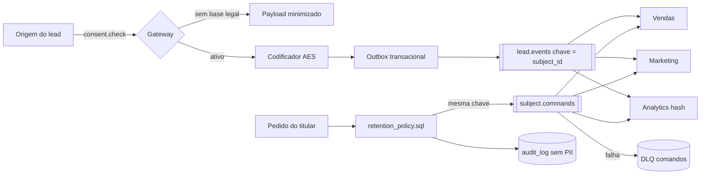
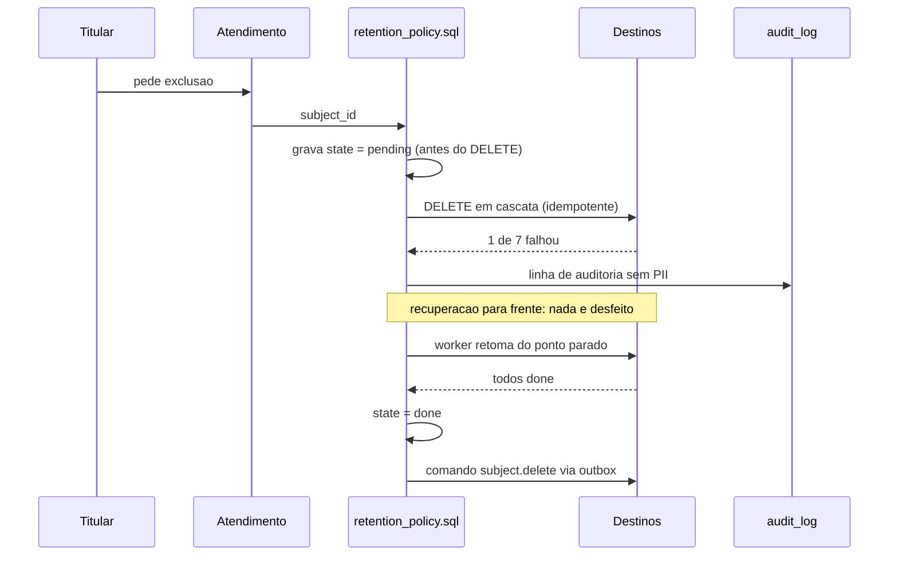
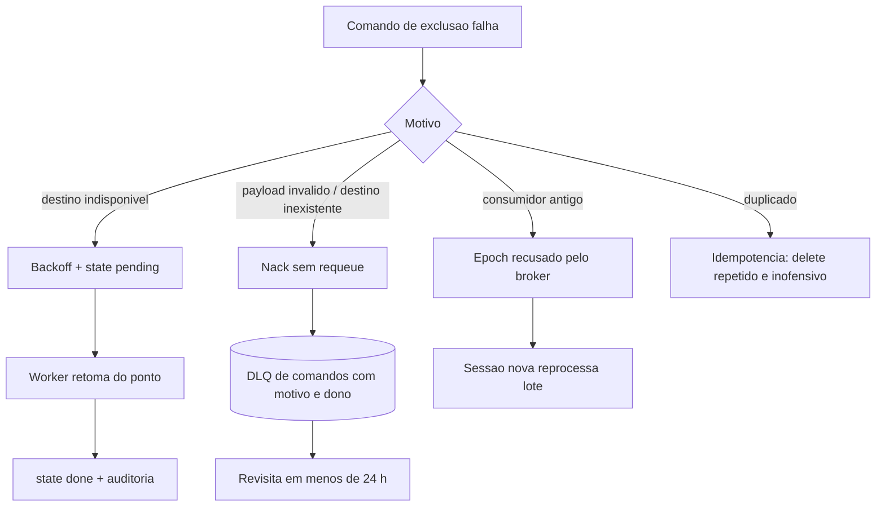

# Deck PDI: Conformidade LGPD em Eventos e Dados (anonimização, consentimento, esquecimento)

Área: Sistemas Distribuídos

Como usar: cada slide tem **Fala** (o que dizer em voz alta), **Evidência** (o artefato que
prova) e, quando houver, o diagrama. Tempo médio sugerido: 45 s por slide simples, 2 min nos
slides com diagrama ou conta.

## Slide 1: Resumo Executivo
Padrão LGPD para o ecossistema de dados/eventos: minimização, consentimento por fluxo, anonimização em logs/traces e direito ao esquecimento via delete em cascata. Entrego o padrão e um útil de anonimização.

Eventos e traces carregam PII (e-mail, CNPJ); sem controle, vazamento e processo administrativo.

**Fala:** "O problema não é criptografar um campo. Em arquitetura de eventos, cada consumidor
que assina o tópico cria uma cópia nova do dado pessoal, com ciclo de vida próprio. Entrego o
padrão que governa a cópia, não só a origem: consentir, cifrar, minimizar e apagar em cascata,
com prova."

**Evidência:** `LGPD-DATA.md`, `LGPD-COMPLIANCE.md`, `anon.py`, `retention_policy.sql`.

## Slide 2: Contexto de Produção
Logs de agente gravavam e-mail inteiro.
Sem consentimento por finalidade.
Pedido de exclusão não propagava.

**Fala:** "Três fatos observados antes da atividade. O log era o caminho mais preguiçoso:
ninguém escreve código pensando em log, ele simplesmente sai. Sem consentimento por finalidade,
quem autorizou campanha recebia, sem mais, o mesmo lead no score. E o pedido de exclusão não
propagava porque era um `DELETE` numa tabela, enquanto o dado também vivia no tópico, no cache
e no índice de busca."

**Evidência:** linha de log com `{"email":"joao@empresa.com"}`; ausência de `consent_id` no
payload; `DELETE` sem evento de propagação.

## Slide 3: Diagnóstico
| Hoje | Alvo |
| --- | --- |
| PII em log/trace | anonimizado |
| sem consentimento | consent por finalidade |
| delete parcial | cascata |

**Fala:** "A linha do meio é a mais grave: sem marcação de base legal, cada serviço que assina
o tópico vira controlador novo sem saber. A última é a que gera autuação: titular apagado no CRM
e vivo no Analytics."

**Evidência:** tabela de diagnóstico do README, seção Diagnóstico.

## Slide 4: Modelo mental
Envelope atravessando setores: antes com o CPF escrito na capa e uma xerox em cada gaveta; agora
com `subject_id` na capa e o CPF só dentro do setor que tem base legal.

**Fala:** "Quatro mecanismos em sequência fixa: gateway de consentimento decide por finalidade;
codificador aplica AES nos campos `pii:true` e troca identificador por token; roteador publica
no tópico particionado por `subject_id`; expurgo varre, apaga em cascata e grava a linha de
auditoria. E o detalhe que separa quem entende de quem decora: pedido de esquecimento é comando
assíncrono, pode falhar no terceiro destino dos sete, chegar duplicado ou chegar depois do
evento que o recriou."

**Evidência:** seção Modelo mental do README.

## Slide 5: Decisão Arquitetural (ADR)
ADR-054: Tratamento de PII

| Opção | Pro | Contra | Decisão |
| --- | --- | --- | --- |
| Anon + consent + delete cascata | conforme LGPD | governança | ESCOLHIDA |

> Nota: Minimização por padrão; PII só com consentimento e retenção definida.

**Matriz de tradeoff (slide de decisão):**

| Opção | Cobertura dos vetores | Custo | Risco residual | Veredito |
| --- | --- | --- | --- | --- |
| Anon + consent + cascata | origem, trânsito, cópias, tempo | médio (governança + job) | baixo e conhecido | **ESCOLHIDA** |
| Só cifra no tópico | origem e trânsito | baixo | alto: cache, índice e log cruas | descartada |
| Só ponteiro no evento | origem | baixo | médio-alto: chamada síncrona em cada consumidor | descartada |
| Serviço de tokenização com reversão | tudo, com revogação central | alto: novo serviço, novo SLO, novo plantão | baixo | descartada por escopo |
| Exclusão manual por planilha | nada | zero de código | crítico: erro descoberto só na auditoria | descartada |

**Fala:** "Escolhemos a opção que cobre os quatro vetores com uma só chave de correlação.
Descartamos as baratas por cobrirem 1 dos 4 destinos, e a cara por exceder o escopo desta
atividade. Registrado no ADR-054, com a alternativa descartada como evolução, não como pendência."

## Slide 6: Arquitetura (diagrama 1 de 3)



**Fala:** "Duas decisões de borda sustentam tudo: validação **antes** da publicação, porque
validar no consumidor já é tarde; e a **mesma chave de partição** nos dois tópicos, o que joga
evento e comando do mesmo titular na mesma partição e preserva a ordem 'criar, depois apagar'
sem coordenador global."

**Evidência:** ADR-054, seção Arquitetura do README.

## Slide 7: Garantias e compensação (diagrama 2 de 3)



**Fala:** "Garantias explícitas e limites declarados: `at-least-once` no comando de exclusão
(por isso o delete é idempotente), ordem por titular dentro da partição (não entre titulares),
exclusão completa eventual (o SLO é de até 15 dias, com meta interna de menos de 1 dia). E o
ponto de saga: em saga clássica, falha no passo 3 desfaz o passo 1. Aqui desapagar é impossível,
então usamos **recuperação para frente**: o estado `pending` é gravado antes do primeiro
`DELETE` e um worker retoma exatamente de onde parou. A única compensação para trás possível é
a revogação de consentimento, que manda os consumidores apagarem as cópias derivadas daquela
autorização."

**Evidência:** seção Garantias e compensação do README, bloco SQL com `BEGIN`/`COMMIT`.

## Slide 8: Particionamento e rebalanceamento

**Fala:** "Chave de partição = `subject_id` nos dois tópicos. Trocar por `lead_id`, que é
natural para quem pensa em vendas, quebraria a garantia: o comando iria para outra partição e
poderia ser processado antes do evento que ainda criava dado. Número de partições fixado na
criação, com margem, porque reduzir é destrutivo e aumentar depois não reescreve dados
antigos. No rebalanceamento, três proteções: `cooperative-sticky` para minimizar a pausa,
`max.poll.interval.ms` maior que o pior lote, e token de geração (epoch) para o broker recusar
lote de consumidor antigo, que é justamente o que impede um processo velho de regravar PII
depois da exclusão."

**Evidência:** seção Particionamento e rebalanceamento do README; teste T6.

## Slide 9: Matemática (conta fechada)

**Fórmula: duração da varredura de esquecimento.**

```text
T = total_de_linhas / vazao_do_delete
```

**Exemplo numérico:** 6 destinos com `4 + 3 + 2 + 1,5 + 1 + 0,5 = 12 milhões` de linhas e
vazão de `20.000 linhas/s`:

`12.000.000 / 20.000 = 600 s = 10 minutos por titular`

**Fala:** "Dez minutos por pedido, um por vez, é o que derruba a ideia de varrer tudo sob
demanda. A solução é inverter: expurgo por lote diário e exclusão individual prioritária
enfileirando o mesmo trabalho. Segunda conta, do hash: com `sha256[:12]` (48 bits) e um milhão
de titulares, `P(colisão) ≈ n² / (2 · 2^48) = 0,0018`, ou `0,18%`. Serve para correlação em
log, não serve como chave de identidade: por isso a chave de exclusão é o UUID `subject_id`."

**Evidência:** Fórmulas 1 e 2 da seção Matemática da solução.

## Slide 10: Invariantes (as 5 que não podem ser falsas)

| Inviante | Violação correspondente |
| --- | --- |
| Nenhum evento com PII sem `consent_id` ativo e vigente | publicação ilegal em cadeia |
| `subject_id` é a chave de partição de evento e de comando | `subject.delete` antes de `lead.criado` |
| Exclusão idempotente em todos os destinos | reprocessamento afetando titular errado |
| Falha em um destino não cancela a exclusão nos demais | apagado em 2 de 7 destinos, o pior estado |
| Nenhum log, trace, cache ou métrica com valor cru | vazamento por caminho fora do payload |

**Fala:** "Toda invariante tem uma violação nomeada. Se alguém na revisão perguntar 'e se
quebrar?', a resposta já está na segunda coluna."

## Slide 11: Modos de falha e recuperação (diagrama 3 de 3)



**Fala:** "Quatro modos de falha, quatro destinos distintos. Indisponibilidade é retomada
automática; payload inválido vai para DLQ com dono e revisita em menos de 24 h; consumidor
velho é barrado por epoch; duplicata é absorvida pela idempotência. O erro clássico seria
tratar os quatro com o mesmo retry, o que faria o comando inválido girar para sempre."

**Evidência:** tabela Modos de falha do README; testes T1, T2, T4, T6.

## Slide 12: Entregas
LGPD-DATA.md.
anon.py.
retention_policy.sql.

**Fala:** "Complementos da mesma entrega: `LGPD-COMPLIANCE.md` para trânsito e repouso,
`encrypt_pii.py` para campos sensíveis e o material de apresentação."

**Evidência:** árvore de entregas da atividade.

## Slide 13: Validação
Varrer logs: 0 e-mail/CNPJ cru.
Simular exclusão: delete em todas as tabelas.
Auditoria: consentimento por finalidade.

**Fala:** "Os três checáveis em 10 minutos. Os critérios formais são C1 a C7: varredura de log
com zero ocorrência, exclusão com contagem zero nas quatro tabelas e linha em `audit_log`,
queda no meio do script com retomada automática, gateway fora com payload minimizado, p95 do
gateway dentro da meta, teste de ordem com rebalanceamento forçado, e gate de schema que falha
o build diante de campo de PII sem marcação."

**Evidência:** seção Critérios de aceite detalhados do README.

## Slide 14: Testes de caos e carga

| ID | Teste | Critério de aceite |
| --- | --- | --- |
| T1 | `kill -9` no worker durante o lote | estado final `done`, contagem zero |
| T3 | gateway fora do ar, 1.000 eventos | `0` com PII cru |
| T5 | um titular com 200 mil linhas | lote em menos de 5 min (meta), demais partições estáveis |
| T6 | adicionar consumer sob carga de 500 eventos/s | sem perda e sem reordenação |
| T9 | 400 eventos/s por 15 min | `p95 <= 25 ms` (meta), zero timeout |

**Fala:** "Dez testes no total (T1 a T10). Os cinco acima são os que um coordenador costuma
pedir para ver rodando: perda, disponibilidade do gateway, partição quente, rebalanceamento e
carga."

**Evidência:** seção Testes de caos e carga do README.

## Slide 15: Métricas e SLO
| SLO | Alvo |
| --- | --- |
| PII em log | 0 |
| Exclusão | <= 15 dias |
| Consentimento | 100% fluxos |

**Orçamento de erro (Exemplo numérico):** com `500.000 eventos/dia`, tolerar `0,001%` de
eventos sem consentimento são `5` eventos ilegais por dia, `150` por mês. Por isso a meta é
zero, e não "baixa": em volume, toda taxa pequena vira volume grande.

**Fala:** "SLI, meta, janela e o que fazer quando estoura: eventos sem `consent_id` é P1 e
suspende a publicação do evento; exclusão passando de 6 h alerta o dono do destino pendente;
DLQ de comandos com mais de 24 h exige revisita; p95 do gateway acima da meta reduz o TTL do
cache ou sobe instância."

**Evidência:** seção Orçamento de erro do README.

## Slide 16: Riscos
| Risco | Mitigação |
| --- | --- |
| Delete esquece tabela | mapear subject |
| Cache PII | não cachear |

**Fala:** "A matriz completa tem sete linhas com probabilidade, impacto e resposta. As duas
mais caras: tabela nova fora do `mapa-dados.md` (mitigado por checklist de criação de tabela) e
chave de criptografia perdida (mitigado por cofre com duas cópias de acesso e teste de
`decrypt` periódico). Repare que 'exclusão não alcança backup' está marcada como Alta: comando
de `DELETE` não varre mídia de backup, então a janela de retenção é declarada e a mídia vai
criptografada com chave própria."

**Evidência:** seção Riscos do README.

## Slide 17: Operação (runbook resumido)

**Fala:** "Checagens horárias: `deletion.pending`, `dlq.comandos.depth`,
`eventos_sem_consentimento`, `pii_in_log.count`, `lag` por partição. Mitigação padrão: gateway
indisponível mantém a falha fechada e comunica o time de dados que eventos chegarão minimizados.
Rollback em menos de 15 min (meta), porque o gate é retrocompatível: versão antiga não entende
`pii:true` e o schema antigo aceita o payload tokenizado. Pedido urgente: roda
`retention_policy.sql`, confere quatro contagens em zero, confere `audit_log`, dispara o comando
para os consumidores e registra data, hora e destinos no ticket do titular."

**Evidência:** seção Operação do README.

## Slide 18: Impacto no negócio

**Fala:** "Zero PII em texto puro e 100% dos fluxos com consentimento reduzem o risco de
autuação e de dano de imagem porque o dado ganha rastro no `mapa-dados.md` e prazo definido.
A diferença prática está no atendimento: com `audit_log`, a resposta ao titular leva minutos e
é objetiva; sem ela, vira busca por serviço que dura dias e termina em 'achamos em 3 de 5
lugares'. E a mesma rotina de cascata que atende o titular cumpre o TTL de 365 dias: um único
mecanismo, duas obrigações."

**Evidência:** seção Impacto no negócio do README.

## Slide 19: Próximos Passos
Data map de PII.
Alerta de PII em logs.

**Fala:** "O terceiro passo está registrado no ADR como evolução, não como pendência:
serviço de tokenização com revogação central, quando o volume de consulta justificar. Custa
novo serviço, novo SLO e novo plantão, e hoje o token estático atende."

**Evidência:** seção Próximos Passos do README.

## Slide 20: Fecho (métricas e compromissos)

| Compromisso | Meta |
| --- | --- |
| PII em log | `0` |
| Fluxos com consentimento | `100%` |
| Exclusão individual | `< 1 dia` (teto de 15 dias) |
| P95 do gateway de consentimento | `<= 25 ms` (meta) |
| Campos de PII sem marcação no schema | `0` por build |
| DLQ de comandos | `0` com mais de 24 h |

**Fala de fecho:** "Entreguei o padrão (`LGPD-DATA.md` e `LGPD-COMPLIANCE.md`), o utilitário
de anonimização (`anon.py`), a cascata com auditoria (`retention_policy.sql`) e a evidência de
teste (T1 a T10, C1 a C7). Próximo checkpoint: data map de PII completo e alerta de PII em logs
rodando na esteira."

**Evidência:** total de esforço (meta) de 35 h, checklist de domínio com 15 itens todos em
"sim".
