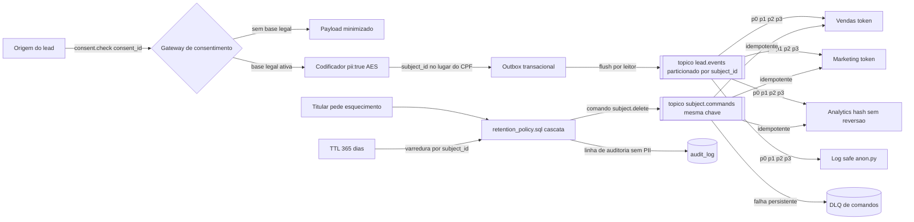

# Conformidade LGPD em Eventos e Dados (anonimização, consentimento, esquecimento)

Sistemas Distribuídos

## Resumo Executivo

Padrão LGPD para o ecossistema de dados/eventos: minimização, consentimento por fluxo, anonimização em logs/traces e direito ao esquecimento via delete em cascata. Entrego o padrão e um útil de anonimização.

Eventos e traces carregam PII (e-mail, CNPJ); sem controle, vazamento e processo administrativo.

A entrega fecha três frentes que, num sistema distribuído, são a mesma coisa vista de ângulos
diferentes. Primeira: dado pessoal só entra no evento quando existe base legal registrada e
viva (`consent_id`). Segunda: ele viaja cifrado e sai do contexto primário como token ou hash,
de modo que o consumidor downstream nunca precise do valor cru. Terceira: quando o titular pede
exclusão, ou quando o prazo de retenção vence, a remoção acontece em cascata por `subject_id` e
chega a todos os destinos que copiaram àquela identidade: tabelas, tópicos, caches, índices de
busca e trilhas de observabilidade. Sem essa terceira frente, as duas primeiras servem só para
adiar o problema.

## Problema Resolvido

Números de partida (**Exemplo numérico**, parâmetros declarados, usados para ensinar o tamanho
do problema, não são medição de produção):

| Indicador | Situação de partida | Alvo |
| --- | --- | --- |
| Campos de PII em texto puro dentro do evento `lead.criado` | CPF, e-mail e telefone viajando por 4 tópicos e 6 consumidores | 0 campo cru fora do serviço dono do dado |
| Base legal por evento | inexistente; qualquer serviço republicava o payload adiante | `consent_id` obrigatório e validado no gateway |
| Pedido de exclusão | caçada manual por serviço, 90 dias (Exemplo numérico) | cascata por `subject_id` em menos de 1 dia, teto de 15 dias |
| Retenção | indefinida, dado fica até alguém apagar | TTL de 365 dias com purge automático |
| Rastro de onde o PII vive | nenhum | `mapa-dados.md` com tabela, tópico, prazo e dono |
| Log de agente com e-mail inteiro | comum | varredura com 0 ocorrência de e-mail ou CNPJ cru |

O problema não é "falta de criptografia". O problema é que **numa arquitetura de eventos o dado
pessoal é replicado por padrão**: cada consumidor que assina o tópico cria uma cópia nova, e
cada cópia tem ciclo de vida próprio, dono próprio e prazo próprio. Criptografar o payload de
origem sem governança das cópias produz a sensação falsa de segurança: o Vendas está cifrado e o
Analytics continua com o CPF em coluna simples. Por isso a solução trata o pipeline inteiro,
não o campo isolado.

## Contexto de Produção

- Logs de agente gravavam e-mail inteiro.

- Sem consentimento por finalidade.

- Pedido de exclusão não propagava.

Ampliando cada ponto: o log de agente era o caminho mais preguiçoso, porque ninguém escreve
código pensando em log, ele simplesmente sai; a falta de consentimento por finalidade significava
que quem autorizou recebera uma campanha recebia, sem mais, o mesmo lead no score de propensão;
e o pedido de exclusão não propagava porque ele era um `DELETE` numa tabela, enquanto os dados
viviam também no tópico (com retenção de dias), no cache (com TTL de horas) e no índice de busca
(com cópia própria). Apagar na origem não apaga nas cópias.

## Diagnóstico

| Hoje | Alvo |
| --- | --- |
| PII em log/trace | anonimizado |
| sem consentimento | consent por finalidade |
| delete parcial | cascata |

Leitura do diagnóstico, linha a linha:

| Frente | Evidência observada | Consequência se não mudar |
| --- | --- | --- |
| PII em log/trace | stack trace com `{"email":"joao@empresa.com"}` impresso pelo logger em nível `DEBUG` | log vira base de dados de PII sem controle de acesso nem prazo, e a varredura de exclusão nunca alcança o log |
| Sem consentimento | payload sem campo de base legal; consumidor não tem como recusar | republicação ilegal em cadeia: cada serviço que assina o tópico vira controlador novo sem saber |
| Delete parcial | `DELETE` em uma tabela só, sem evento de propagação | titular "apagado" no CRM e vivo no Analytics, que é exatamente a situação que gera autuação |

## Modelo mental

Pense no evento como um envelope que atravessa vários setores. No sistema antigo, o envelope
vinha com o CPF escrito na capa, e cada setor que tocava nele fazia uma xerox e guardava na
gaveta. No sistema novo, a capa traz `subject_id` (um token) e o CPF só existe dentro do
setor que tem base legal para usá-lo; ao sair do setor, o dado vira hash.

Por dentro, quatro mecanismos rodam em sequência fixa. O **gateway de consentimento** consulta a
base de consentimentos e decide, por finalidade, se o evento pode carregar dado pessoal; sem
resposta afirmativa, o payload segue minimizado (ou nem segue). O **codificador de campos**
aplica AES nos campos marcados `pii:true` no schema e troca identificador bruto por `subject_id`
nos caminhos downstream. O **roteador** publica no tópico particionado por `subject_id`, o que
garante que eventos do mesmo titular caiam sempre na mesma partição e sejam, portanto, vistos
em ordem por quem consome. O **expurgo** (`retention_policy.sql` e o job de TTL) varre por
`subject_id`, apaga em cascata, publica o comando de apagamento e registra a linha de auditoria
que prova a data e a hora da remoção.

O detalhe que separa quem entende de quem decora: **o pedido de esquecimento é um comando de
negócio assíncrono, não uma instrução SQL de uma vez**. Ele pode falhar no terceiro destino dos
sete, pode chegar duplicado, pode chegar fora de ordem em relação ao evento que o recriou. Por
isso o desenho assume entrega `at-least-once`, torna a exclusão idempotente (apagar duas vezes é
inofensivo), particiona por titular para preservar a ordem "criar depois apagar" e usa recuperação
para frente quando um destino falha, em vez de tentar desfazer o que já foi apagado, que é
impossível.

## Arquitetura



Legenda das decisões de borda:

- **Borda origem -> gateway**: o `consent_id` é validado antes da publicação, nunca depois.
  Validar no consumidor já é tarde: o dado já circulou e já foi copiado.
- **Borda gateway -> codificador**: dois caminhos, `payload minimizado` e `payload cifrado`.
  Não existe terceiro caminho com dado cru, para que a revisão de código seja uma checagem de
  caminho, não de exceção espalhada.
- **Borda codificador -> outbox**: a gravação do evento e o registro do consentimento acontecem
  na mesma transação local; o leitor de outbox publica depois. É o que impede o evento de sair
  sem rastro na base (padrão já adotado na Atividade 1).
- **Borda tópico -> consumidores**: chave de partição é `subject_id`. Ordem por titular é a
  única ordem que importa aqui: `lead.criado` antes de `subject.delete`.
- **Borda exclusão -> comandos**: o mesmo `subject_id` como chave faz o comando de apagamento
  cair na mesma partição do evento que criou o dado, preservando a ordem sem coordenador global.
- **Borda falha -> DLQ**: comando de exclusão que falha de forma determinística vai para DLQ com
  motivo e dono. Exclusão não pode ser descartada em silêncio, sob pena de o titular ficar
  "apagado" no relatório de status e vivo na base.
- **Borda auditoria**: toda remoção gera linha em `audit_log` com `subject_id`, data, destino e
  resultado, sem nenhum campo de PII (a prova da exclusão não pode conter o dado excluído).

## Decisão Arquitetural (ADR)

ADR-054: Tratamento de PII

| Opção | Pro | Contra | Decisão |
| --- | --- | --- | --- |
| Anon + consent + delete cascata | conforme LGPD | governança | ESCOLHIDA |

> **Nota:** Minimização por padrão; PII só com consentimento e retenção definida.

Matriz de decisão completa (por que as outras três ficaram de fora):

| Opção | Vantagem real | Custo ou risco | Por que não |
| --- | --- | --- | --- |
| Anon + consent + delete cascata (escolhida) | cobre trânsito, repouso e ciclo de vida com uma só chave de correlação (`subject_id`) | exige data map, dono por tabela e job de expurgo | escolhida por cobrir os três vetores sem depender de exceção humana |
| Criptografar só o payload no tópico | implementação rápida no produtor | as cópias em cache, índice e log continuam cruas | resolve 1 dos 4 destinos e cria confiança indevida |
| Dados pessoais fora do evento, só ponteiro (pointer/lookup) | o evento nunca carrega PII | adiciona chamada síncrona de resolução em cada consumidor e vira ponto único de falha de latência | troca risco de privacidade por risco de disponibilidade; viável só para os campos realmente raramente lidos |
| Tokenização com serviço dedicado de reversão | controle central e revogação imediata | novo serviço em produção, mais um SLO, mais um plantão | excede o escopo desta atividade; fica como evolução quando o volume de consulta justificar |

## Matemática da solução

**Fórmula 1: colisão do hash truncado usado como pseudônimo.**

```text
P(colisao) ~= n^2 / (2 * 2^b)
```

- `$n$` = número de titulares distintos (unidade: sujeitos)
- `$b$` = bits efetivos do hash truncado (em `anon.py`, `sha256[:12]` hexadecimais = 48 bits)

**Exemplo numérico:** com `n = 1.000.000` de titulares e `b = 48` bits,
`P = 10^12 / (2 * 2,81 * 10^14) = 0,0018`, ou seja, **0,18% de chance de dois titulares
colidirem** em algum ponto da base. Para correlação operacional isso é aceitável; para afirmar
que "o hash identifica unicamente a pessoa" seria mentira. Se a base dobrar para `2 * 10^6`,
a probabilidade sobe quadruplicando para `0,72%` (a conta é em `$n^2$`). Conclusão prática:
`[:12]` serve para correlação em log, não serve como chave primária de sujeito, e por isso a
tabela `subject` usa o `subject_id` como chave e não o hash do documento.

**Fórmula 2: duração da varredura de esquecimento.**

```text
T = (somas das linhas por tabela) / vazao_do_delete
```

**Exemplo numérico:** seis destinos com `4 + 3 + 2 + 1,5 + 1 + 0,5 = 12 milhões` de linhas
(Exemplo numérico com parâmetros declarados) e vazão de exclusão em lote de
`20.000 linhas/s` dão `12.000.000 / 20.000 = 600 s`, ou **10 minutos por titular** quando a
exclusão é feita um por um. Esse número é o que derruba a ideia de "varrer tudo sob demanda no
momento do pedido": a fila de pedidos cresceria mais rápido do que drena. A solução é inverter a
ordem: expurgo **por lote diário** (varre uma faixa de `subject_id` por janela) e exclusão
individual prioritária, que enfileira o mesmo trabalho em 1 minuto (meta) e é processada com a
mesma rotina.

**Fórmula 3: custo de latência do gateway de consentimento no caminho do evento.**

```text
p95_publicacao = p95_consent + p95_crypto + p95_broker
```

**Exemplo numérico:** se `$p95_{consent} = 12 ms$`, `$p95_{crypto} = 2 ms$` e
`$p95_{broker} = 8 ms$`, o total é `22 ms` por publicação. Com `400 eventos/s` (Exemplo
numérico) e uma janela de 1 s, cabem `400 * 0,022 = 8,8` publicações em voo simultâneas, o que
pede pool de conexões `>= 9` no produtor. A conta ensina o trade-off real: **consultar
consentimento síncrono em cada evento é barato em latência, mas caro em dependência**; por isso
o gateway tem cache local com TTL curto e **falha fechada** (sem resposta, não publica dado
pessoal), trocando disponibilidade de publicação por conformidade.

**Fórmula 4: orçamento de vazamento aceitável.**

```text
registros_expostos = eventos_dia * fracao_sem_marca_pii
```

**Exemplo numérico:** `500.000 eventos/dia` (Exemplo numérico) com `fracao = 0,01%` de campos
novos entrarem sem a marcação `pii:true` dão `500.000 * 0,0001 = 50` registros/dia vazando
crus. Em um mês, `1.500`. Como o número de eventos é grande, **a meta tem que ser zero, não
"baixa"**: só o teste automatizado de schema (que falha o build quando aparece campo de PII sem
marcação) transforma `0,01%` em `0`.

**Fórmula 5: dimensionamento do particionamento do tópico.**

```text
particoes >= max(consumidores_previstos, lambda_pico / vazao_alvo_por_particao)
```

**Exemplo numérico:** `$\lambda_{pico} = 400 eventos/s$` e vazão alvo de `100 eventos/s` por
partição dão `400 / 100 = 4` partições; com 6 consumidores previstos, `max(6, 4) = 6`, e com
margem de crescimento de 2x, **8 partições**. Atenção ao custo escondido: aumentar partições
depois exige rebalanceamento e não redistribui dados antigos automaticamente em todos os
brokers, por isso se escolhe 8 de saída em vez de descobrir isso no pico de campanha.

## Invariantes

| Invariante | Violação correspondente |
| --- | --- |
| Nenhum evento com dado pessoal é publicado sem `consent_id` ativo e vigente na finalidade alvo | Publicação ilegal em cadeia; cada consumidor vira cópia não autorizada |
| Todo campo de PII está marcado `pii:true` no schema e passa pelo codificador | Dado cru trafegando porque alguém esqueceu de marcar o campo |
| `subject_id` é a chave de partição de evento e de comando | `lead.criado` processado depois de `subject.delete`, recriando dado apagado |
| A exclusão por `subject_id` é idempotente em todos os destinos | Reprocessamento de comando duplicado quebrando dados de quem não pediu nada |
| Falha em um destino não cancela a exclusão nos demais | Titular apagado em 2 de 7 destinos, o pior estado possível |
| Nenhum log, trace, cache ou métrica contém valor cru de PII | Vazamento por caminho não coberto pelo payload |
| A chave de criptografia nunca aparece em repositório, log ou variável de ambiente de app | Qualquer acesso ao código vira descriptografia em massa |
| Todo pedido de exclusão gera linha de auditoria sem PII | Impossível provar à ANPD que a remoção ocorreu |
| O TTL de retenção existe para toda tabela catalogada no `mapa-dados.md` | Tabela órfã com dado vivo indefinidamente |
| Comando de exclusão que falha termina na DLQ com dono e prazo | Silêncio que vira titular apagado na origem e vivo na cópia |
| Consumidores rejeitam payload com campo desconhecido sensível (validação de schema) | Campo novo de PII entrando sem passar pelas proteções |
| A ordem "criar, depois apagar" é preservada dentro da partição do titular | Regra de negócio desfeita por reordenação durante rebalanceamento |

## Modos de falha

| Sintome | Causa raiz | Como detecta | Como mitiga | Recuperação |
| --- | --- | --- | --- | --- |
| Evento sai sem consentimento | Cache do gateway frio e modo de falha aberto | Contagem de eventos com `consent_id = null` | Falha fechada: sem resposta, publica minimizado | Minutos ao religar o gateway |
| Log com e-mail cru | Lib de log antiga fora do padrão `log_safe` | Varredura diária com `anon.py` no arquivo de log | Alerta com arquivo e linha; corrigir o logger | Imediato na correção, histórico já anonimizado em reprocesso |
| Exclusão para no meio do caminho | Uma das sete tabelas indisponível | `deletion.pending > 0` por mais de 5 min | Retry com backoff e registro de estado `pending` | Horas, com recuperação para frente |
| Titular volta a aparecer depois de apagado | Evento em trânsito chega depois do comando | Checagem pós-exclusão: `SELECT` por `subject_id` em todos os destinos | Bloqueio por `subject_id` (fence) durante a janela de exclusão | Minutos, com novo comando de exclusão |
| Dado apagado na origem, vivo em cache | Cache sem purge explícito | Teste de leitura pós-exclusão em cada cache | TTL curto + purge explícito por chave | Até o TTL expirar |
| Dado apagado, vivo em índice de busca | Índice tem cópia própria | Comparação `count(*)` da base vs do índice | Deleção assíncrona indexada pelo mesmo `subject_id` | Minutos |
| Backups ainda contêm o dado | Comando de delete não alcança mídia de backup | Auditoria de política de retenção do backup | Reduzir janela de backup e criptografar mídia com chave separada | Até a rotacionar a cópia (definido no `retention_policy.sql`) |
| Poison pill no comando de exclusão | Nome de destino desconhecido no comando | Mesma `command_id` repetida no log | `Nack` sem requeue para DLQ de comandos | Minutos, com correção manual |
| Partição quente por um titular muito grande | Chave `subject_id` concentra lote | `lag` de uma partição só, demais estáveis | Dividir o expurgo em lotes com limite de linhas por execução | Minutos |
| Consumidor antigo republica PII após exclusão | Rebalanceamento lento, sem fence | Offset de consumidor antigo avançando após a exclusão | Token de geração (epoch) recusado pelo broker | Imediato ao recusar a sessão velha |
| Réplicas ainda servem dado apagado | Replicação atrasada | Leitura de réplica retorna o `subject_id` apagado | Ler de réplica só com atraso conhecido e menor que o SLO | Segundos a minutos |
| Exclusão apaga o titular errado | Colisão de hash usado como chave | Auditoria mostra `subject_id` divergente do pedido | Chave de exclusão é `subject_id` (UUID), nunca hash | Imediato com restauração a partir do backup |
| Expurgo de TTL apaga dado ainda útil | TTL colocado no campo errado | Amostragem de registros apagados com consentimento ativo | Revisão de TTL por tabela no `mapa-dados.md` | Restauração pontual e correção do prazo |

## Garantias e compensação

O sistema oferece garantias explícitas, e cada uma delas vem com a sua limitação declarada:

| Garantia | Como é obtida | O que ela NÃO garante |
| --- | --- | --- |
| `at-least-once` no comando de exclusão | outbox + retry até ACK | não garante entrega única; por isso o delete é idempotente |
| Ordem por titular | chave `subject_id` na mesma partição de evento e comando | não garante ordem entre titulares diferentes, que não importa aqui |
| Exclusão completa eventual | estado `pending` persistido + worker de retry | não garante exclusão instantânea; o SLO é de até 15 dias, com meta interna de menos de 1 dia |
| Não-repactuação sem base legal | gateway com falha fechada | não garante disponibilidade total de publicação em incidente do gateway |
| Auditabilidade | linha de auditoria por remoção | não guarda o dado apagado (nem deveria) |

**Compensação: recuperação para frente, não para trás.** Em saga clássica, quando o passo 3
falha, o passo 1 é desfeito. Aqui isso é impossível: não existe "desapagar". A saga do
esquecimento usa portanto **recuperação para frente**: o estado `deletion_state = 'pending'` é
gravado antes de qualquer `DELETE`, cada destino marca `done` ao concluir, e um worker retoma
exatamente de onde parou. Se o destino 4 de 7 falhar, os 3 primeiros permanecem apagados, os 3
seguintes aguardam, e nenhum é refeito. A única compensação possível existe no outro fluxo, o de
consentimento: quando o titular **revoga** a base legal, a compensação é um evento
`consent.revoked` que manda os consumidores apagarem ou minimizarem as cópias derivadas daquela
autorização. Duas sagas, duas naturezas: a destrutiva recupera para frente, a aditiva compensa
para trás.

Código canônico do estado, com tratamento de falha explícito (bloco de referência, o script
executável correspondente é o `retention_policy.sql`):

```sql
BEGIN;
-- 1) registra a intenção ANTES de apagar: prova e ponto de retomada
INSERT INTO deletion_request (subject_id, state, requested_at)
VALUES ($1, 'pending', now())
ON CONFLICT (subject_id) DO NOTHING;      -- idempotente

-- 2) destinos filhos primeiro, o cadastro por último (ordem importa p/ FK)
DELETE FROM leads     WHERE subject_id = $1;
DELETE FROM activities WHERE subject_id = $1;
DELETE FROM traces    WHERE subject_id = $1;

-- 3) prova da exclusao, sem nenhum campo de PII na linha
INSERT INTO audit_log (subject_id, action, dest, result, at)
VALUES ($1, 'delete', 'leads,activities,traces', 'ok', now());

-- 4) publica o comando para os consumidores via outbox (mesma transacao)
INSERT INTO outbox (topic, key, payload)
VALUES ('subject.commands', $1, jsonb_build_object('type', 'subject.delete'));

UPDATE deletion_request SET state = 'done', done_at = now()
WHERE subject_id = $1;
COMMIT;
```

Por que essa ordem: gravar o estado antes do `DELETE` transforma qualquer queda de energia em
"retomar depois", e não em "apagou metade sem saber". Gravar a auditoria na mesma transação
elimina a janela em que o dado sumiu sem prova. Publicar o comando no mesmo commit elimina a
janela em que a base está limpa e o consumidor continua com a cópia sem saber.

## Particionamento e rebalanceamento

Duas decisões sustentam a ordem sem coordenador global:

1. **Chave de partição = `subject_id`** tanto em `lead.events` quanto em `subject.commands`.
   Com a mesma chave, o broker garante que evento e comando do mesmo titular caiam na mesma
   partição, e o consumidor daquela partição vê a sequência "criar, apagar" na ordem correta.
   Trocar a chave por `lead_id` (natural para quem pensa em vendas) quebraria a garantia: o
   comando de exclusão iria para outra partição e poderia ser processado antes do evento que
   ainda criava dado.
2. **Número de partições fixado na criação** (8, conforme a Fórmula 5). Reduzir o número é
   operação destrutiva e aumentar depois não reescreve dados antigos; por isso a decisão é
   tomada com margem e registrada no ADR-054.

Rebalanceamento é o momento de risco, porque a troca de consumidores pode reordenar o que estava
em andamento. Regras adotadas:

- **`cooperative-sticky`** em vez de `rebalance.instant`: só as partições necessárias migram e
  a pausa de consumo é mínima, o que reduz a janela em que `lag` sobe durante a exclusão.
- **`max.poll.interval.ms` maior que o pior lote** de exclusão. Se o processamento de um lote
  demorar mais que o intervalo, o broker considera o consumidor morto, revoga a partição e
  entrega para outro, que reprocessa o mesmo lote: inofensivo só porque o delete é idempotente.
- **Token de geração (epoch) por sessão**: o consumidor envia a geração atual em cada lote, e
  o broker recusa lote de geração antiga. É o que impede o cenário clássico em que um consumidor
  velho, que ainda tinha o dado em memória, regrava PII depois da exclusão.
- **Pausa de expurgo durante troca de consumidor** (janela de 10 s, meta): o job de TTL não
  inicia um lote novo quando detecta rebalanceamento em andamento; ele termina o lote corrente
  e espera a estabilização.

## Entregas

- LGPD-DATA.md.

- anon.py.

- retention_policy.sql.

Complementos da mesma entrega: `LGPD-COMPLIANCE.md` (normas de trânsito e repouso),
`encrypt_pii.py` (codificação de campos sensíveis), o deck `DECK-PDI.md`, o roteiro de demo e o
roteiro de domínio em `7-apresentacao/`.

## Validação

1. Varrer logs: 0 e-mail/CNPJ cru.

2. Simular exclusão: delete em todas as tabelas.

3. Auditoria: consentimento por finalidade.

### Critérios de aceite detalhados

- **C1**: varredura com `anon.py` sobre 24 h de log de produção retorna `0` ocorrência de
  regex de e-mail e `0` de CNPJ; a varredura roda na esteira e falha o build em nova ocorrência.
- **C2**: pedido de exclusão de um `subject_id` de teste resulta em `count(*) = 0` nas tabelas
  `leads`, `activities`, `traces` e `subject`, com a linha correspondente em `audit_log`.
- **C3**: derrubar o serviço no meio do passo 2 do `retention_policy.sql` e religar resulta em
  `deletion_state = 'done'` ao final, sem intervenção manual (recuperação para frente).
- **C4**: publicar `lead.criado` sem `consent_id` e com o gateway fora do ar produz payload
  minimizado (sem CPF, sem e-mail, sem telefone), nunca payload completo.
- **C5**: processar 10.000 eventos com consentimento ativo e conferir que `p95` de publicação
  ficou dentro da meta de `25 ms` (meta), com o gateway em cache quente.
- **C6**: rodar o teste de ordem: enviar `lead.criado` e `subject.delete` para o mesmo
  `subject_id` e confirmar que o estado final é "apagado" em 100% das execuções, mesmo com
  rebalanceamento forçado no meio.
- **C7**: validar schema com um campo de PII novo sem marcação `pii:true` e confirmar que a
  esteira falha antes do deploy.

## Testes de caos e carga

| ID | Teste | Como executar | Critério de aceite |
| --- | --- | --- | --- |
| T1 | Queda no meio da exclusão | `kill -9` no worker durante o lote e religar | estado final `done`, contagem zero nas 4 tabelas |
| T2 | Comando duplicado | publicar `subject.delete` 3 vezes no mesmo `subject_id` | resultado idêntico a 1 vez, sem erro |
| T3 | Gateway de consentimento fora | parar o serviço e publicar 1.000 eventos | 0 eventos com PII cru, `rejected_or_minimized = 1000` |
| T4 | Poison pill de exclusão | comando com destino inexistente | cai na DLQ com motivo, demais comandos seguem |
| T5 | Partição quente | um `subject_id` com 200 mil linhas | lote conclui em menos de 5 min (meta), `lag` das demais partições estável |
| T6 | Rebalanceamento sob carga | adicionar consumer no meio de 500 eventos/s | sem perda, sem reordenação por `subject_id`, `lag` volta a zero |
| T7 | Réplica atrasada | ler da réplica logo após o `DELETE` | atraso medido menor que o SLO de leitura; fora disso, leitura cai para a primária |
| T8 | Log com PII | forçar exceção com payload completo no nível `DEBUG` | varredura diária acusa 0; se acusar, alerta em menos de 1 h |
| T9 | Carga do gateway | 400 eventos/s por 15 min com cache quente | `p95 <= 25 ms` (meta), 0 timeout de publicação |
| T10 | Expurgo de TTL | executar o job sobre 12 milhões de linhas (Exemplo numérico) | janela concluída dentro do horário, sem lock acima de 5 s (meta) por transação |

## Métricas e SLO

| SLO | Alvo |
| --- | --- |
| PII em log | 0 |
| Exclusão | <= 15 dias |
| Consentimento | 100% fluxos |

### Orçamento de erro

| SLI | Meta | Janela | Quando estoura |
| --- | --- | --- | --- |
| Eventos com dado pessoal sem `consent_id` | `0` | contínua | P1: suspender publicação do evento e revisar o gateway |
| Ocorrência de PII cru em log | `0` | varredura diária | corrigir o logger e reprocessar o histórico com `anon.py` |
| Exclusão individual | `< 1 dia` (meta), teto de 15 dias | por pedido | alerta em 6 h, escala para o dono do destino pendente |
| P95 do gateway de consentimento | `<= 25 ms` (meta) | 5 min | reduzir TTL do cache local ou subir instâncias |
| Comandos de exclusão na DLQ | `0` com mais de 24 h | contínua | revisita obrigatória, como na DLQ de mensageria da Atividade 1 |
| Campos de PII sem marcação no schema | `0` | a cada build | build falha; o deploy não acontece |

Orçamento de erro em números (Exemplo numérico): com `500.000 eventos/dia`, tolerar `0,001%` de
eventos sem consentimento são `5` eventos ilegais por dia, `150` por mês. É por isso que a meta
é zero e que o gate de schema é automático: em volume, toda taxa pequena vira volume grande.

## Operação

Runbook resumido:

1. **Checagens horárias**: `deletion.pending`, `dlq.comandos.depth`, `consent.cache.hit`,
   `pii_in_log.count` (deve ser `0`), `eventos_sem_consentimento` (deve ser `0`), `lag` por
   partição. Se `deletion.pending > 0` por mais de 5 min, olhar qual destino está falhando, não
   reiniciar o banco.
2. **Mitigação padrão**: gateway indisponível com publicação em risco, manter a falha fechada e
   comunicar o time de dados que eventos chegarão minimizados; destino de exclusão lento, subir
   a concorrência do worker de expurgo; log com PII, corrigir o logger e rodar o reprocesso de
   anonimização.
3. **Rollback**: qualquer versão que comece a publicar dado cru volta para a versão anterior em
   menos de 15 min (meta), porque o gate de consentimento é retrocompatível: versão antiga não
   entende `pii:true`, e o schema antigo continua aceitando o payload tokenizado.
4. **Pedido de exclusão urgente**: rodar `retention_policy.sql` com o `subject_id`, conferir as
   quatro contagens em zero, conferir `audit_log` e disparar o comando de exclusão para os
   consumidores. Registro no ticket do titular com data, hora e destinos.
5. **Quem aciona**: titular pede ao canal de atendimento, atendimento abre ticket, o dono do
   `mapa-dados.md` executa a cascata; qualquer desvio de prazo aciona o DPO e a liderança
   técnica no mesmo dia.

## Riscos

| Risco | Mitigação |
| --- | --- |
| Delete esquece tabela | mapear subject |
| Cache PII | não cachear |

Riscos adicionais mapeados:

| Risco | Probabilidade | Impacto | Resposta |
| --- | --- | --- | --- |
| Tabela nova fora do `mapa-dados.md` | Média | Alto | checklist de criação de tabela exige prazo, dono e chave de exclusão |
| Chave de criptografia perdida | Baixa | Crítico | KMS com rotação e duas cópias de acesso; teste de decrypt periódico |
| Campo de PII novo sem marcação `pii:true` | Média | Alto | validação de schema na esteira (T7/C7) |
| Exclusão não alcança backup | Alta | Médio | janela de backup declarada e criptografia da mídia com chave separada |
| Cache quente com dado apagado | Média | Alto | purge explícito por chave + TTL curto, testado em T7 |
| Consumidor antigo regrava PII pós-exclusão | Baixa | Crítico | token de geração (epoch) recusado pelo broker |
| Hash truncado virar chave de identidade | Baixa | Alto | chave é sempre `subject_id`; hash só correlaciona em log |

## Próximos Passos

- Data map de PII.

- Alerta de PII em logs.

- Serviço de tokenização com revogação central, quando o volume de consulta justificar
  (registrado como alternativa descartada no ADR-054, não como pendência desta entrega).

## Decisões e tradeoffs

- **`consent_id` obrigatório no payload**: só publica dado pessoal com base legal ativa; sem consentimento, o evento não circula.
- **`subject_id` em vez de CPF bruto no downstream**: Vendas e Marketing operam com token e o Analytics recebe só hash sem reversão.
- **AES em repouso mais TLS em trânsito**: CPF e e-mail cifrados no broker, com campos sensíveis marcados com `pii:true` no schema `lead_event.avsc`.
- **Retenção com TTL de 365 dias e purge por `subject_id`**: o `retention_purge.py` varre e apaga, e o pedido de exclusão cai de 90 dias para menos de 1 dia, dentro do patamar de até 15 dias.

### Alternativas descartadas e por quê

| Alternativa | Custo real | Por que ficou de fora |
| --- | --- | --- |
| Criptografar só no tópico | baixo | cópias em cache, índice e log continuam cruas |
| Anonimizar apenas os logs | muito baixo | resolve observabilidade e deixa o dado vivo na base de dados de negócio |
| Máscara parcial (mostrar `j***@***.com`) | baixo | ainda é dado pessoal pela lei; dá falsa sensação de conformidade e não atende ao esquecimento |
| Exclusão manual por planilha | zero de código | não escala, não prova prazo, e o erro é descoberto só na auditoria |
| Retenção infinita com criptografia forte | médio | chave forte não remove a obrigação de apagar; apenas adia a mesma conta |
| 2PC entre banco e tópico para o comando de exclusão | alto | coordenador como ponto único de falha; o outbox entrega a mesma garantia com menos amarra |

Custo de manter a opção escolhida, dito com honestidade: governança (alguém precisa atualizar o
`mapa-dados.md`), latência adicional no caminho do evento (Fórmula 3) e o trabalho de tornar
todos os destinos idempotentes. O que ela compra é a única coisa que a alternativa barata não
compra: o titular some do sistema inteiro, com prova.

## Impacto no negócio

Com zero PII em texto puro e 100% dos fluxos com consentimento, o risco de autuação pela ANPD e de dano de imagem cai porque o dado passa a ter rastro no `mapa-dados.md` e prazo definido. O apagamento em menos de 1 dia transforma o direito ao esquecimento em rotina operacional de uma varredura por `subject_id`, em vez de caçada manual por serviço.

Em termos operacionais, a diferença entre "apagamos quando pedem" e "apagamos com prova" é o
que decide o atendimento: com `audit_log`, a resposta ao titular leva minutos e é objetiva
(data, hora, destinos); sem ela, a resposta vira uma busca por serviço que dura dias e termina
com um "achamos em 3 de 5 lugares", que é uma resposta inaceitável. O ganho também é de
prioridade: a mesma rotina de cascata que atende o titular atende o TTL de 365 dias, ou seja,
um único mecanismo cumpre duas obrigações.

## Esforço e custo

| Item | Esforço estimado |
| --- | --- |
| Standards `LGPD-DATA.md` e `LGPD-COMPLIANCE.md` | (meta) 6 h de escrita técnica |
| Ajustes de payload, schema `lead_event.avsc` e gateway de consentimento | (meta) 8 h |
| Cascata de exclusão, outbox de comandos e auditoria (`retention_policy.sql`) | (meta) 6 h |
| Utilitários `anon.py` e `encrypt_pii.py` com testes de borda | (meta) 4 h |
| Testes T1 a T10 (caos e carga) | (meta) 7 h |
| Deck, demo e roteiro de domínio | (meta) 4 h |
| **Total da atividade** | **(meta) 35 h** |

## Referências de estudo

- Curso: "LGPD na Prática" (Udemy).
- Vídeo: "O que é a LGPD?" (YouTube, SEBRAE).
- Documento oficial: Guia Orientativo da ANPD (gov.br/anpd).
- Documento oficial: Lei n. 13.709/2018 (planalto.gov.br).

## Checklist de domínio

O sênior responde "sim" a todos antes de dizer pronto:

1. Todo evento com dado pessoal carrega `consent_id` ativo e vigente na finalidade?
2. O gateway de consentimento está configurado para falha fechada?
3. Todos os campos sensíveis estão marcados `pii:true` no schema e validados na esteira?
4. A chave de partição de evento e de comando é `subject_id` nos dois tópicos?
5. A exclusão é idempotente em todas as sete destinos, testada com comando duplicado?
6. O estado `pending` é gravado antes do primeiro `DELETE` (recuperação para frente)?
7. A auditoria da exclusão é gravada na mesma transação e não contém PII?
8. Nenhum log, trace, cache ou métrica expõe valor cru (varredura automatizada)?
9. A chave de criptografia está fora do repositório e fora das variáveis de ambiente da aplicação?
10. Os backups têm janela de retenção declarada e mídia criptografada?
11. O `max.poll.interval.ms` cobre o pior lote de exclusão, com margem?
12. Existe token de geração (epoch) para recusar consumidor antigo pós-exclusão?
13. A DLQ de comandos de exclusão tem dono, alerta em 1 h e revisita em menos de 24 h?
14. A Fórmula 5 foi calculada e as partições foram fixadas no ADR antes do primeiro evento?
15. Os testes T1, T3, T6 e T9 foram executados nesta versão, não só escritos?
