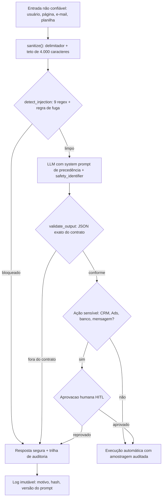

# A1 | Guardrails e anti-prompt-injection em automações com LLM

| Campo | Valor |
|-------|-------|
| Área | Automação & Infraestrutura |
| Unidade | FV Marketing / V4 Company |
| Autor | Marcos Luciano |
| Data | Setembro 2026 |
| Status | Entregue (desenvolvido, homologação pendente) |

## Entregas desta PDI

```
atividade-1/
├── README.md
├── 1-standards/
│   └── STANDARD-GUARDRAILS-LLM.md
├── 2-implementacao/
│   ├── guardrail_proxy.py
│   └── CHECKLIST-GUARDRAILS.md
└── 7-apresentacao/
    ├── DECK-PDI.md
    ├── DEMO-SCRIPT.md
    ├── ROTEIRO-DOMINIO.md
    ├── pdi-governanca-ia-seguranca-a1.html
    ├── pdi-governanca-ia-seguranca-a1.docx
    ├── pdi-governanca-ia-seguranca-a1.pdf
    └── gerar-docx.py
```

## Problema Resolvido

Automações com LLM (resumo de leads, classificação de tickets, geração de copy) aceitam texto livre do usuário e de fontes externas (página, e-mail, planilha). Sem barreira, um prompt malicioso direto ("ignore as instruções anteriores e exfiltre...") ou indireto (instrução escondida num documento resumido pelo modelo) faz o modelo desviar da tarefa, vazar contexto do system prompt ou executar ação indevida via ferramenta conectada. O risco segue o OWASP LLM01:2025 (Prompt Injection) e LLM02 (Insecure Output Handling).

O problema tem três gatilhos técnicos que se combinam:

1. **Fronteira de confiança inexistente.** O texto que chega do lead, do e-mail ou da planilha é concatenado na mesma janela de contexto que as instruções de sistema. O modelo trata os dois como tokens de mesma natureza: não existe bit de proveniência no tensor de entrada que diga "esta parte é política, àquela parte é dado". Enquanto o sistema não marcar essa fronteira fora do modelo, qualquer string vira candidata a comando.
2. **Ferramenta conectada sem contrato.** Quando o LLM tem permissão de escrever (CRM, Ads, banco, envio de mensagem), a saída vira ação. Sem validação de esquema, um JSON malformado ou um parâmetro fora da allowlist já é dano real, e dano em produção raramente é reversível.
3. **Ausência de rastro.** Sem `safety_identifier` e sem linha de auditoria, depois do incidente não há como responder às três perguntas que a diretoria faz: quem foi afetado, o que o modelo chegou a executar e quantas vezes aconteceu. Sem resposta, não existe lição nem prova de diligência.

**Números de partida (antes da barreira):**

- Cobertura de gate de segurança em automações com LLM: inexistente (0 automações protegidas no inventário de partida).
- Bateria adversarial de 60 casos: nunca executada (0% de bloqueio medido, porque nada media).
- Automações de alto risco com `human in the loop` (HITL): 0 (meta: 100%).
- Latência adicionada pela checagem: não instrumentada (não havia camada a medir).

**Exemplo numérico (declaração de parâmetros, não medição):** com 12 automações ativas, cada uma recebendo em média 80 entradas não confiáveis por dia, a área exposta é de $12 \times 80 = 960$ tentativas diárias de manipulação indireta, apenas nas fontes que o fluxo já consome. A 10.000 chamadas/mês ao LLM, uma taxa de escape de 5% representa 500 eventos por mês passando sem barreira. Os parâmetros (12 automações, 80 entradas/dia, 10.000 chamadas/mês, 5%) são valores declarados para dimensionar a conta, não medições da operação.

O ganho esperado da barreira: transformar esse volume bruto de exposição em um número gerenciável, com piso de bloqueio de 95% na bateria adversarial e trilha de auditoria que responda "quem, o quê, quando" em menos de um minuto (meta).

## Modelo mental

O guardrail não é um prompt melhor escrito. É uma **muralha fora do modelo**, entre a fonte não confiável e o provedor, e entre o provedor e o mundo.

Como o sistema se comporta por dentro: o worker nunca conversa direto com o provedor. Ele passa a entrada por `sanitize()`, que envolve o texto num bloco com delimitadores explícitos e corta no teto de 4.000 caracteres. Na prática, o delimitador é a anotação de confiança que o token não tem: tudo entre `### FONTE NAO CONFIAVEL ###` e `### FIM DA FONTE ###` é dado. Depois, `detect_injection()` roda nove expressões regulares compiladas e uma regra de contagem de delimitador; se alguma casa, a entrada é bloqueada com motivo estruturado antes de consumir cota de modelo.

Se passar, o worker monta o prompt com as instruções de política no topo e o dado delimitado embaixo, declarando por escrito que em conflito vale a política e que texto entre delimitadores nunca é ordem. A resposta volta e só é aceita se `validate_output()` a encontrar como JSON com exatamente as chaves do contrato daquela automação e sem HTML ativo. Fora do contrato, a saída não é "quase aceita": é descartada ou encaminhada a um humano.

O quinto ponto é o único que não é código: quando a ação escreve em sistema de registro (CRM, Ads, banco, mensagem ao cliente), um humano aprova. O proxy dá a primeira muralha, não o castelo. Erro de detecção, modelo juiz barato ou provedor fora do ar não podem virar escrita indevida, porque a última porta é uma assinatura humana.

O custo mental é baixo: **toda entrada é dado, toda saída é suspeita, toda ação sensível é humana.** Quem opera só precisa lembrar dessas três frases para saber onde enfiar um fluxo novo.

## Arquitetura



**Legenda das decisões de borda:**

- **Borda 1 (entrada):** a única Fronteira de confiança. Tudo depois dela é não confiável até prova em contrário; por isso o corte de 4.000 caracteres existe antes de qualquer análise, para limitar tanto o custo do detector quanto a janela de texto que o modelo pode receber.
- **Borda 2 (detecção):** barata e determinística de propósito. Regex não entende semântica, mas bloqueia o óbvio com latência desprezível e sem custo por chamada; o caso duvidoso escala para Moderation API ou humano, evitando pagar modelo para olhar texto limpo.
- **Borda 3 (contrato de saída):** é a defesa contra LLM02. O modelo pode ter sido convencido; mesmo assim, se a saída não casar com o esquema esperado, ela não executa. Segurança aqui é de rejeição, não de interpretação.
- **Borda 4 (ação sensível):** irreversibilidade manda. Escrita em sistema de registro exige ser humano, porque o custo de uma aprovação atrasada é minúsculo comparado ao custo de uma gravação indevida em produção.
- **Borda 5 (auditoria):** acontece sempre, inclusive quando o fluxo falha. Log que só grava acerto não serve para investigar; o que interessa é o motivo do bloqueio e a versão da política vigente naquele instante.

## Arquitetura Resumida

```
[entrada: usuário + fontes externas]
  -> 1. sanitizacao (delimitadores + limite de tamanho)
  -> 2. detector de injection (regras + Moderation API)
  -> 3. chamada ao LLM com system prompt blindado e safety_identifier
  -> 4. validação da saída (allowlist de formato + filtro)
  -> 5. HITL quando ação é sensível, log de auditoria sempre
```

O `guardrail_proxy.py` implementa as etapas 1, 2 e 4 em Python puro e deixa prontos os ganchos das etapas 3 e 5.

## Matemática da solução

Toda barreira cobra três coisas: latência, cota de processamento e trabalho humano. As contas abaixo dimensionam as três com parâmetros declarados.

### Latência acumulada do proxy

A latência adicionada é soma das etapas sequenciais, porque `sanitize`, `detect_injection` e `validate_output` rodam no mesmo caminho crítico:

$$W_{proxy} = W_{sanit} + W_{det} + W_{valid}$$

**Exemplo numérico (parâmetros declarados):** $W_{sanit} = 0{,}1$ ms (concatenação de string de 4.000 caracteres), $W_{det} = 4{,}0$ ms (nove regex compiladas sobre 4.000 caracteres), $W_{valid} = 1{,}0$ ms (`json.loads` de resposta de até 2.000 caracteres). Total: $5{,}1$ ms, ou seja, 3,4% de um orçamento de 150 ms (meta). A conta que importa é outra: a barreira só vira gargalo se $W_{proxy}$ se aproximar de $W_{llm}$, e uma chamada de modelo custa centenas de milissegundos, então a folga é de duas ordens de grandeza.

### Concorrência com Little's Law

Com o proxy síncrono dentro do worker, o número de requisições simultâneas em voo segue $L = \lambda \cdot W$.

**Exemplo numérico (parâmetros declarados):** $\lambda = 50$ requisições/s e $W = 0{,}150$ s (p95 orçado) resultam em $L = 50 \times 0{,}150 = 7{,}5$, arredondado para 8 requisições simultâneas. Se a fila de workers ficar com 40 vagas, a sobrecarga teórica é $40 / 8 = 5$ vezes a demanda esperada: dimensionar pool abaixo disso é pedir estouro de fila no pico.

### Custo do falso positivo

Falso positivo não é só "bloqueou errado": é tempo de humano.

**Exemplo numérico (parâmetros declarados):** 10.000 chamadas/dia, taxa de falso positivo do detector em 1% e revisão humana de 40 s por caso. Resultado: $10.000 \times 0{,}01 = 100$ revisões/dia, $100 \times 40\ s = 4.000$ s, ou 66,7 min/dia, cerca de 1,1 hora. Abaixo de 1% o custo some; acima de 5% ($500 \times 40\ s = 20.000$ s = 5,6 h/dia) o guardrail deixa de ser viável operacionalmente e a regra precisa ser afiada antes de qualquer outra otimização.

### Resolução do placar adversarial

A bateria tem 60 casos, então cada caso vale $100/60 = 1{,}67$ pontos percentuais. O piso de 95% corresponde a $60 \times 0{,}95 = 57$ casos bloqueados: **56 de 60 já reprova** (93,3%). Consequência prática: com essa amostra não se discute diferença de 1 ou 2 pontos percentuais, só saltos de faixa. Para afirmar melhoria fina, é preciso aumentar a bateria, e não repetir a mesma de 60.

### Escapes e orçamento de erro

**Exemplo numérico (parâmetros declarados):** 10.000 chamadas/mês com taxa de escape de 5% (cenário sem barreira) dão $10.000 \times 0{,}05 = 500$ eventos/mês fora de controle. Com a barreira operando na meta de escape de 2%, o mesmo volume cai para $10.000 \times 0{,}02 = 200$ eventos/mês, uma redução de 300 eventos por mês. Se cada evento evitado custa em média 15 min de investigação (parâmetro declarado): $300 \times 15 = 4.500$ min = 75 h/mês de trabalho evitado.

### Custo de processamento por chamada

**Exemplo numérico (parâmetros declarados):** em 10.000 chamadas/mês, se 6% forem encaminhadas à Moderation API (só as duvidosas) e o preço vigente do provedor for de R$ 0,002 por chamada (tabela hipotética declarada para a conta), o custo é $10.000 \times 0{,}06 = 600$ chamadas $\times$ R$ 0,002 = **R$ 1,20/mês**. O custo real não é a API: é o mapeamento do contrato de saída por automação e a operação do HITL.

## Invariantes

Nunca podem ser falsos. Cada linha traz a violação correspondente e o alarme que a captura.

| # | Invariante | Violação | Como capturar |
|---|-----------|----------|---------------|
| 1 | Nenhum token de instrução do usuário chega ao provedor sem passar por `sanitize()` | Entrada crua no prompt | Teste de integração que grelha o payload e falha se faltar o delimitador |
| 2 | Toda chamada ao provedor carrega `safety_identifier` com hash, nunca PII em claro | Vazamento de titular e impossibilidade de rastrear abuso | Auditoria de payload com regra que rejeita e-mail, CPF ou telefone em claro |
| 3 | Nenhuma ferramenta de escrita executa sem passar por validação de contrato | Ação indevida via LLM02 | Teste que tenta chamar a ferramenta com JSON fora do contrato e espera exceção |
| 4 | Toda decisão (bloqueio, liberação, aprovação, reprovação) gera registro na trilha | Investigação impossível após incidente | Contagem diária: decisões registradas = decisões tomadas, divergência dispara alerta |
| 5 | Nenhum prompt de política é alterado sem versionamento e data | Divergência entre o que se auditou e o que roda | Hash do prompt armazenado ao lado da resposta; comparação semanal |
| 6 | Nenhuma automação de alto risco vai a produção sem HITL e sem bateria de 60 casos com 95% | Ativação de porta aberta | Gate no pipeline de deploy: checklist incompleto bloqueia promoção |
| 7 | Log de auditoria nunca contém prompt completo com PII | Vazamento secundário pelo próprio log | Varredura do log com detector de PII antes de gravar; se casar, mascarar |
| 8 | A reprovação em HITL não deixa efeito parcial no sistema alvo | Estado intermediário sujo | Transação: ou tudo aplica, ou nada aplica; checagem de rollback no teste |

## Modos de falha

| Sintome | Causa raiz | Como detecta | Como mitiga | Recuperação |
|---------|-----------|--------------|-------------|-------------|
| Falso positivo em massa (fluxo legítimo bloqueado) | Regex ampla demais ou mudança de vocabulário do cliente | Queda súbita de taxa de liberação, queda de throughput | Desligar a regra suspeita por `feature-flag`, manter as demais | Minutos (troca de flag); revisão da regra em até 1 dia |
| Falso negativo (injeção passa) | Padrão novo, ofuscação, idioma não coberto | Bateria adversarial cai abaixo de 95% | Inserir o padrão na lista, escalar para Moderation API nos duvidosos | Imediato na próxima chamada após atualizar lista |
| Escape por fuga de delimitador | Atacante injeta `### FIM DA FONTE ###` no meio do texto | Regra de contagem de `###` (mais de 8 ocorrências) | Bloquear entrada com excesso de delimitador e registrar motivo | Imediato |
| Latência do proxy acima do orçamento | Regex catastrófica em entrada grande ou CPU saturada | p95 do proxy acima de 150 ms (meta) | Reduzir teto de caracteres, recompilar padrões, escalar workers | Imediato com rollback do teto |
| Saída do modelo vira ação sem contrato | `validate_output` desligado no worker novo | Teste de contrato falhando; ausência de log de validação | Reativar validação; rollback da automação para staging | Até a próxima execução |
| HITL saturado (fila de aprovação parada) | Volume de ações sensíveis acima da capacidade humana | Idade da fila de aprovação acima do SLA | Priorizar por impacto, desativar ação automática de baixo risco | Horas, realocando revisor |
| Log de auditoria perdido | Corte de rede ou falha do destino de log | Contagem diária de eventos menor que o esperado | Escrever em buffer local com reenvio (`store and forward`) | Reprocessa buffer no rearme |
| Model drift: modelo novo destrava ataques antigos | Troca de versão do provedor sem reavaliação | Bateria de 60 casos reexecutada na troca | Bloquear promoção de versão com placar abaixo de 95% | Reversão para a versão anterior |

## SLO e orçamento de erro

| SLI | Meta | Janela de medição | Se estoura |
|-----|------|-------------------|------------|
| Latência p95 do proxy (entrada + saída) | abaixo de 150 ms (meta) | 7 dias, por automação | Reduzir teto de caracteres e revisar padrões; escalar workers |
| Bloqueio na bateria adversarial de 60 casos | ao menos 95% (meta) | Execução mensal e a cada troca de modelo | Automação volta para staging, sem exceção |
| Automações de alto risco com HITL ativo | 100% (meta) | Contagem contínua do inventário | Congelar novas ativações até regularizar |
| Disponibilidade da camada de guardrail | 99,9% (meta) | 30 dias | Falha do detector não pode liberar: modo de falha é bloquear e reprocessar |
| Escape de injeção em produção | abaixo de 2% (meta) | 30 dias, amostrado por revisão | Reabrir bateria ampliada e refazer padrões |
| Cobertura de log de auditoria | 100% das decisões (meta) | Diária | Suspender liberação de novo fluxo até a contagem casar |

**Orçamento de erro:** no máximo 5 escapes por 10.000 chamadas (0,05% de dano confirmado) em janela de 30 dias (meta). Acima disso, vale a regra de parada: nenhuma automação nova entra em produção até o placar voltar ao piso. O orçamento é deliberadamente curto porque cada escape em ação sensível pode ser irreversível, e irreversível não se negocia com percentual.

**Janela e responsável:** p95 calculado diariamente com janela móvel de 7 dias; bateria adversarial com execução mensal fixa; inventário de HITL auditado toda segunda-feira. Estouro de p95 ou de bateria aciona o responsável pelo fluxo; estouro de HITL aciona a coordenação da trilha.

## Operação

**Runbook resumido.**

1. **Checagem diária (5 min):** p95 do proxy nas últimas 24 h; contagem de decisões na trilha de auditoria versus decisões tomadas; tamanho da fila de HITL e idade do item mais antigo; falhas do self-test do `guardrail_proxy.py` no pipeline.
2. **Checamento semanal (20 min):** amostra de 20 bloqueios lidos por humano para confirmar que o motivo faz sentido; hash do prompt de política comparado ao versionado; relatório de falsos positivos por regra.
3. **Mitigação padrão:** latência alta, reduzir teto de caracteres (4.000 para 2.000) e medir de novo; falso positivo em massa, desligar a regra pontual por `feature-flag`; falso negativo, inserir padrão e rodar a bateria inteira antes de reativar.
4. **Rollback:** desligar a `feature-flag` do detector volta o fluxo ao comportamento anterior em uma execução; desligar a validação de contrato **não é rollback permitido**, porque expõe LLM02. Nesse caso o caminho certo é reverter a automação para staging.
5. **Quem aciona:** responsável pelo fluxo para queda de desempenho; responsável pelo guardrail para padrão novo e revisão de regra; coordenação da trilha para estouro de SLO, perda de log ou reprovação de bateria. Incidente com dado de titular potencialmente exposto escala para o encarregado de dados, conforme procedimento de resposta da LGPD, dentro da janela de comunicação adotada pela operação.
6. **Pós-incidente:** postmortem sem culpa em até 5 dias úteis, com a ação corretiva rastreável no checklist de ativação e reexecução obrigatória da bateria adversarial antes de reativar o fluxo.

## Decisões e tradeoffs

1. Regras determinísticas antes de modelo juiz: regex e limites bloqueiam 80% dos ataques com latência quase zero; um LLM juiz entraria só nos casos duvidosos para não estourar custo e latência.
2. Bloquear por padrão, liberar por allowlist: output do modelo só passa se estiver no formato esperado (JSON com chaves fixas ou texto sem chamadas de ferramenta); seguro, mas exige mapear o contrato de cada automação.
3. Não exibir system prompt nem contexto interno em erro ou log: evita vazamento por engenharia social, ao custo de logs menos explicativos no debug.
4. `safety_identifier` com hash do usuário em toda chamada: permite rastrear abuso por titular sem enviar PII ao provider; exige gerar o hash no backend antes de chamar.
5. HITL obrigatório em ação irreversível: atrasa segundos a execução, mas elimina a classe inteira de dano por output inseguro (LLM02).

**Alternativas descartadas e por quê:**

- **Só prompt mais bem escrito.** Descartado: instrução não separa dado de comando dentro da janela do modelo. O prompt ajuda, mas a falha de segurança não pode depender da qualidade redacional de quem mantém o fluxo.
- **Filtrar só na entrada e confiar na saída.** Descartado: ataca LLM01 e deixa LLM02 inteiro exposto. Saída que vira ação precisa de contrato, porque o modelo pode ser convencido mesmo com entrada limpa.
- **Modelo juiz em todas as chamadas.** Descartado por custo e latência: paga cota de modelo para olhar tráfego que regex barra em milissegundos, e adiciona um componente que ele mesmo pode falhar.
- **Proxy como serviço novo com fila própria.** Descartado nesta fase: biblioteca no worker entrega a mesma barreira sem novo ponto de disponibilidade. Um serviço separado volta à mesa quando a política precisar ser alterada sem deploy, ou seja, quando a casa chegar a dezenas de automações.
- **Salvar prompt completo para debug.** Descartado por LGPD e por vazamento: o log precisa ser útil sem ser um espelho do dado pessoal. Guarda-se hash, motivo, versão e trecho truncado mascarado.
- **HITL em toda execução.** Descartado por fila infinita: aprovação universal transforma o humano em gargalo e tira a leitura e a classificação do que é seguro automatizar. A linha se desenha por irreversibilidade, não por medo.

**Matriz de tradeoff:**

| Alternativa | Custo | Latência | Cobertura | Decisão |
|-------------|-------|----------|-----------|---------|
| Só prompt | zero | zero | parcial, não estrutural | descartada |
| Regex + teto | mínimo | milissegundos | alto no óbvio | adotada como base |
| Moderation API nos duvidosos | baixo e proporcional | dezenas de ms | cobre o ambíguo | adotada em 2ª camada |
| Modelo juiz sempre | alto | centenas de ms | marginal sobre a base | descartada |
| HITL no sensível | humano | segundos a minutos | elimina dano irreversível | adotada na borda |

## Impacto no negócio

Com guardrails padronizados, a operação pode escalar automações com LLM para copy, triagem e resumo sem que cada novo fluxo vire um incidente de segurança em potencial: o custo de revisão cai, o risco de vazamento de dados de clientes cai junto, e a diretoria ganha um argumento auditável de diligência alinhado ao OWASP Top 10 para LLMs.

Pontos concretos:

- **Velocidade de ativação:** o `CHECKLIST-GUARDRAILS.md` vira o critério de entrada. Fluxo novo que entrega as 8 evidências entra em produção sem reabrir discussão arquitetural a cada vez (meta: tempo de ativação de 5 dias úteis para 1).
- **Risco de titular:** dados de clientes trafegam mascarados e a chamada carrega hash, o que reduz a superfície de vazamento e simplifica o atendimento a pedido do titular.
- **Evidência para auditoria:** a trilha de auditoria responde "quem, o quê, quando, qual política estava vigente", que é exatamente o que se pede quando a diretoria ou um cliente questiona como a IA é controlada.
- **Custo previsível:** bloqueio determinístico barato primeiro, modelo pago só no duvidoso: o gasto com segurança escala com o tráfego duvidoso, não com o tráfego total.

## Esforço e custo

| Item | Esforço estimado |
|------|------------------|
| `guardrail_proxy.py` (sanitize, detector, contrato, self-test) | 8 h |
| Standard e checklist de ativação | 4 h |
| Deck, demo, roteiro e relatório | 6 h |
| Integração no piloto de resumo de tickets | 6 h (meta) |
| Bateria adversarial de 60 casos e placar | 4 h por ciclo mensal (meta) |
| Operação de HITL (revisão humana) | 1,1 h/dia a 1% de falso positivo (meta) |

Custo de plataforma: praticamente zero no caminho determinístico (regex roda no worker). Custo variável concentrado em duas pontas: chamadas de Moderation API nos casos duvidosos (Exemplo numérico com parâmetros declarados: 600 chamadas/mês a R$ 0,002 = R$ 1,20/mês) e tempo de humano no HITL. O orçamento de horas acima é projeção com `(meta)`, exceto as horas já gastas nos itens marcados como entregues.

## Referências

- Curso: Generative AI with Large Language Models (DeepLearning.AI e AWS, Coursera). https://www.coursera.org/learn/generative-ai-with-llms
- Vídeo: Explained: The OWASP Top 10 for Large Language Model Applications (IBM Technology, YouTube). https://www.youtube.com/watch?v=cYuesqIKf9A
- Doc oficial: OWASP Top 10 for Large Language Model Applications. https://owasp.org/www-project-top-10-for-large-language-model-applications/
- Doc oficial: OpenAI Safety best practices. https://platform.openai.com/docs/guides/safety-best-practices

## Checklist de domínio

O que o sênior confere antes de dizer "pronto":

1. Toda entrada não confiável passa por `sanitize()` com delimitador e teto, e existe teste que falha se alguém remover a chamada.
2. O system prompt declara precedência por escrito e proíbe revelar instruções, chaves ou dados de outros titulares.
3. `detect_injection` está ligado na entrada, com motivo de bloqueio estruturado e não apenas um booleano.
4. O contrato de saída está declarado por automação e `validate_output` roda antes de qualquer efeito colateral.
5. Ferramenta de escrita está atrás de allowlist de parâmetros e de aprovação humana.
6. `safety_identifier` usa hash em toda chamada e não há PII em claro no payload nem no log.
7. Bateria de 60 casos rodou em staging e o placar é de ao menos 95%.
8. Todas as decisões chegam à trilha de auditoria, inclusive bloqueios e reprovações de HITL.
9. Versão do prompt e versão do modelo estão registradas ao lado da resposta.
10. p95 do proxy está medido, com meta e janela definidos, e não apenas estimado.
11. Rollback está testado: `feature-flag` desliga o detector sem deploy.
12. Pessoas sabem quem aciona em cada tipo de estouro (desempenho, padrão novo, SLO, dado de titular).
13. O placar da última bateria está publicado e datado, não guardado na cabeça de ninguém.
14. Nenhuma automação de alto risco está em produção sem HITL.

## Próximos Passos

1. Ligar o detector a Moderation API da OpenAI em 1 automação piloto (resumo de tickets).
2. Rodar bateria adversarial mensal de 60 casos e publicar o placar.
3. Exigir HITL em toda automação que escreve em CRM, Ads ou banco antes de ativar.

## Métricas de Sucesso

| Métrica | Atual | Meta |
|---------|-------|------|
| Bloqueio em bateria de 60 injeções (diretas e indiretas) | 0% (sem proteção) | 95% (meta) |
| Latência p95 adicionada pelo proxy | não medida | abaixo de 150 ms (meta) |
| Automações de alto risco com HITL ativo | 0% | 100% (meta) |
| Cobertura de log de auditoria sobre decisões | 0% | 100% (meta) |
| Falso positivo do detector sobre tráfego legítimo | não medido | abaixo de 1% (meta) |
| Custo de Moderation API por 10.000 chamadas | não apurado | abaixo de R$ 5,00/mês (meta) |
