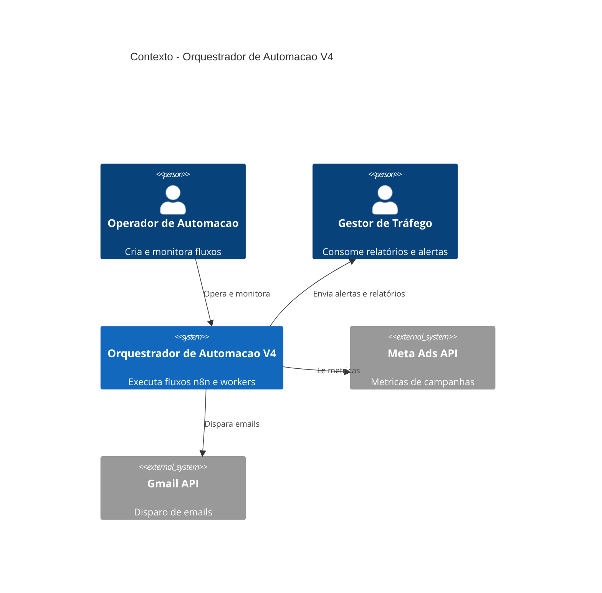
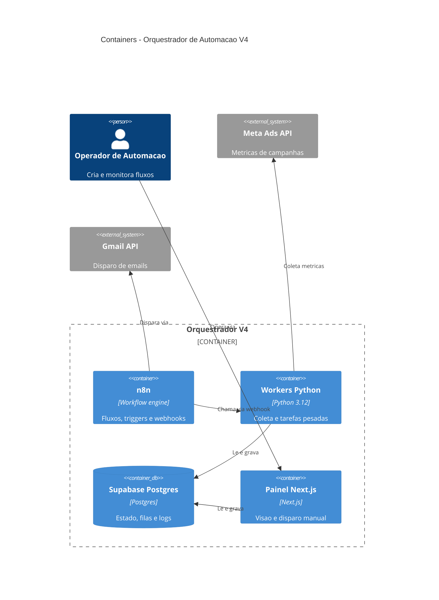

# Diagramas C4 do Sistema Real: Orquestrador de Automação V4

## Nível 1: Contexto

Pessoas: **Operador de automação** (equipe FV Marketing) e **Gestor de tráfego** (cliente interno).
Sistema: **Orquestrador de Automação V4**, executa fluxos de coleta, disparo e sincronização.
Externos: Meta Ads API (leitura de métricas), Gmail API (disparo), Supabase Auth (login do painel).



## Nível 2: Containers



Portas reais praticadas: n8n em `5678`, workers expostos em `8000`, Supabase via URL do projeto, painel em `3000`. Credenciais de Meta e Gmail ficam no cofre do n8n, nunca em `.env` solto.

## Nível 3: Componentes do n8n

| Componente | Papel | Fala com |
|------------|-------|----------|
| Triggers agendados | Disparam coleta a cada 30 min | Subworkflows |
| Subworkflow coleta-meta-ads | Orquestra coleta por conta | Workers Python via webhook |
| Subworkflow disparo-gmail | Monta e envia emails | Gmail API |
| Credenciais no cofre | Tokens Meta e Gmail | Todos os subworkflows |
| Fila de erros | Registra falha com payload | Supabase Postgres |

## Nível 4: Código do worker crítico

Apenas a função que decide retry da coleta Meta Ads, onde um bug gera lacuna de verba nos relatórios:

```python
def executar_com_retry(coleta_fn, conta_id, tentativas=3, base_seg=30):
    for n in range(1, tentativas + 1):
        try:
            return coleta_fn(conta_id)
        except ErroRateLimit:
            espera = base_seg * (2 ** (n - 1))
            registrar_log(conta_id, n, espera)
            dormir(espera)
    marcar_falha(conta_id)
    raise ColetaFalhou(conta_id)
```

Backoff exponencial (30s, 60s, 120s) porque a Meta Ads API pune rajada com bloqueio de 1 hora. Falha definitiva vira linha na fila de erros do Supabase, nunca exception silenciosa.
