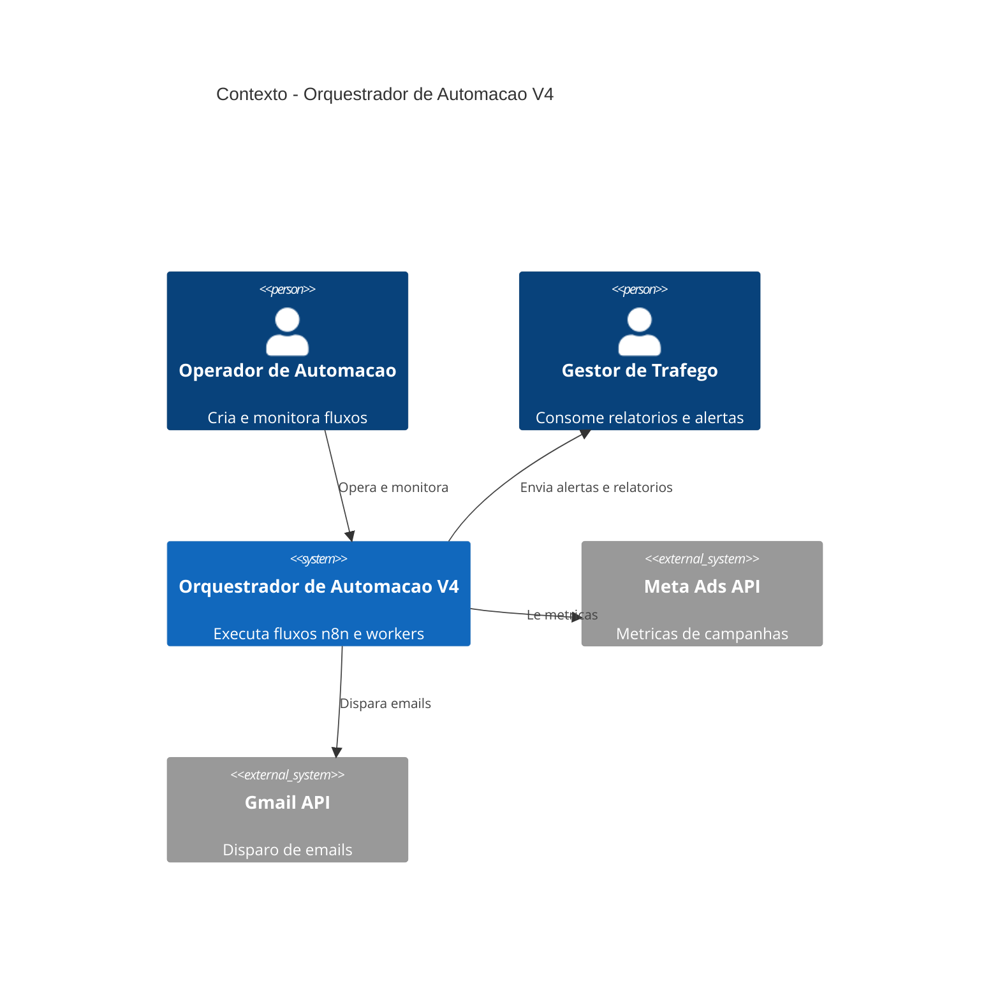
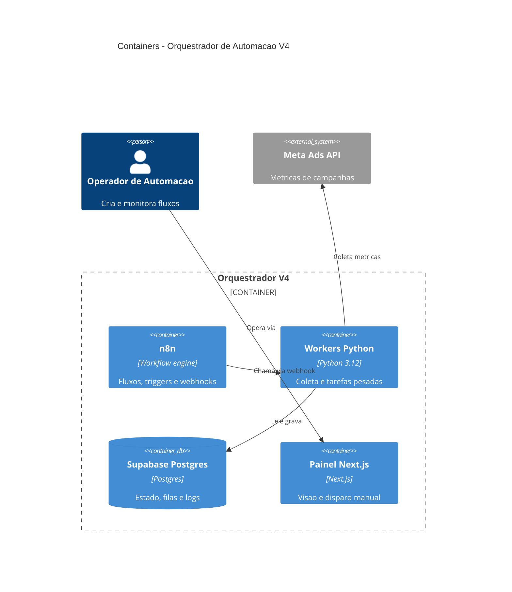

# Espelho Mermaid do C4 (cola direto no repo)

Copie cada bloco para arquivos `.md` do repositorio. Renderiza no GitHub e no GitLab sem plugin.

## Contexto

```mermaid
C4Context
  title Contexto - Orquestrador de Automacao V4
  Person(operador, "Operador de Automacao", "Cria e monitora fluxos")
  Person(gestor, "Gestor de Trafego", "Consome relatorios e alertas")
  System(orquestrador, "Orquestrador de Automacao V4", "Executa fluxos n8n e workers")
  System_Ext(meta, "Meta Ads API", "Metricas de campanhas")
  System_Ext(gmail, "Gmail API", "Disparo de emails")
  Rel(operador, orquestrador, "Opera e monitora")
  Rel(orquestrador, gestor, "Envia alertas e relatorios")
  Rel(orquestrador, meta, "Le metricas")
  Rel(orquestrador, gmail, "Dispara emails")
```

## Containers

```mermaid
C4Container
  title Containers - Orquestrador de Automacao V4
  Person(operador, "Operador de Automacao", "Cria e monitora fluxos")
  Container_Boundary(orq, "Orquestrador V4") {
    Container(n8n, "n8n", "Workflow engine", "Fluxos, triggers e webhooks")
    Container(workers, "Workers Python", "Python 3.12", "Coleta e tarefas pesadas")
    ContainerDb(db, "Supabase Postgres", "Postgres", "Estado, filas e logs")
    Container(painel, "Painel Next.js", "Next.js", "Visao e disparo manual")
  }
  System_Ext(meta, "Meta Ads API", "Metricas de campanhas")
  Rel(operador, painel, "Opera via")
  Rel(n8n, workers, "Chama via webhook")
  Rel(workers, db, "Le e grava")
  Rel(workers, meta, "Coleta metricas")
```
