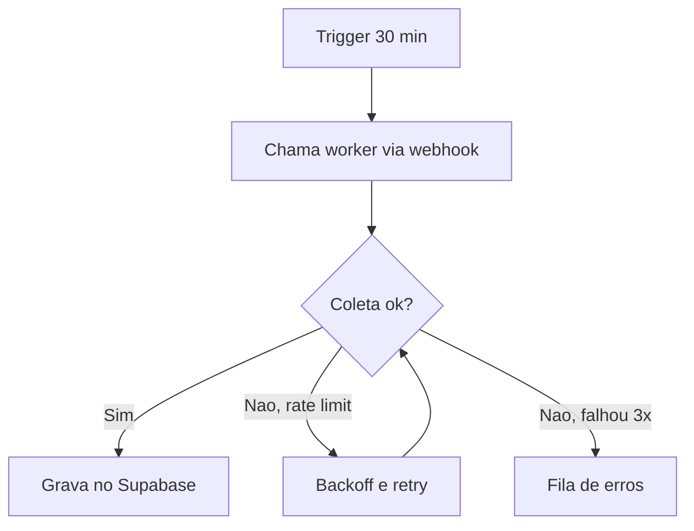
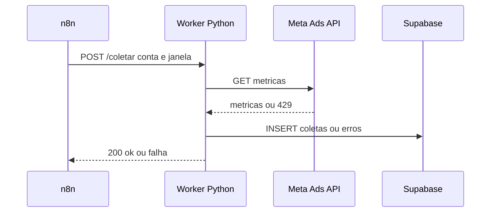

# Mermaid Guia Rapido (so o que usamos)

## Fluxo (flowchart)

## Sequencia (sequenceDiagram)

## Regras de sintaxe que quebram o CI

- Rotulos com caracteres especiais vao entre aspas: `A["Trigger 30 min"]`.
- Setas de resposta usam `-->>`, nao `->>`.
- Condicao usa chaves: `C{"Coleta ok?"}`.
- Nomes de participante sem espaco: `participant W as Worker Python`.
- Todo bloco abre com tripla crase + `mermaid` e fecha com tripla crase, sem indentacao estranha.
