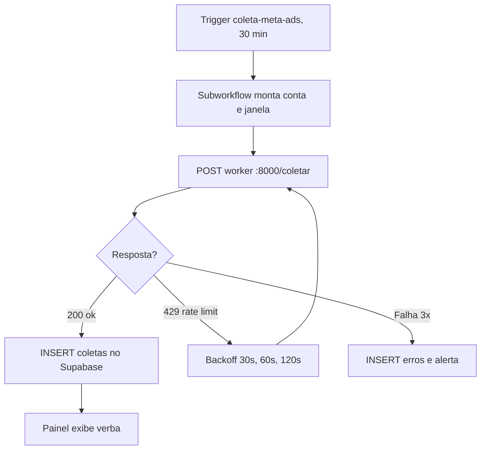

# Exemplo Real 1: Fluxo de Coleta Meta Ads

Fonte oficial do desenho abaixo. Qualquer mudança no worker de coleta exige atualizar este bloco no mesmo PR.

Donos: worker em `workers/coleta_meta.py` (exemplo), workflow `coleta-meta-ads` no n8n. Última revisão: Setembro 2026.
