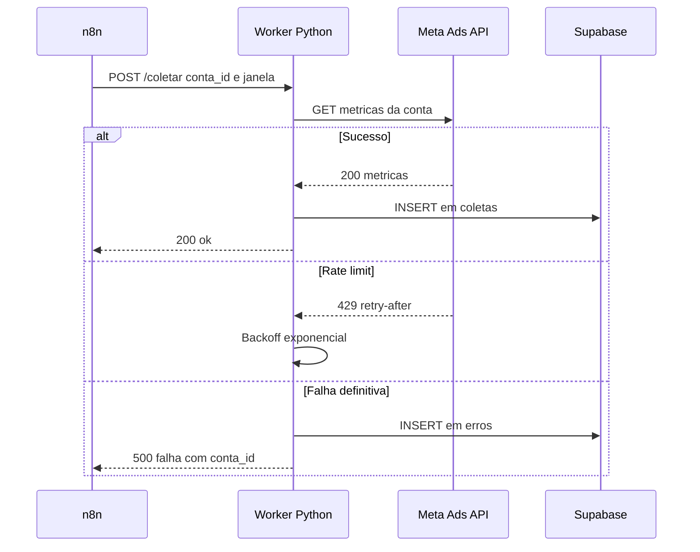

# Exemplo Real 2: Sequencia do Webhook n8n para Worker

Mostra o contrato real: o que o n8n manda, o que o worker devolve e onde cada erro cai.

Contrato: `conta_id` e `janela` obrigatorios na entrada; saida sempre `200 ok` ou `500 falha com conta_id`, nunca timeout silencioso.
